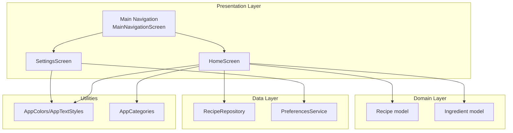
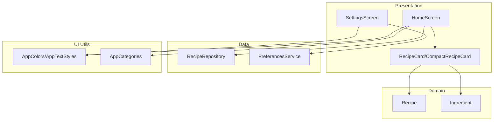
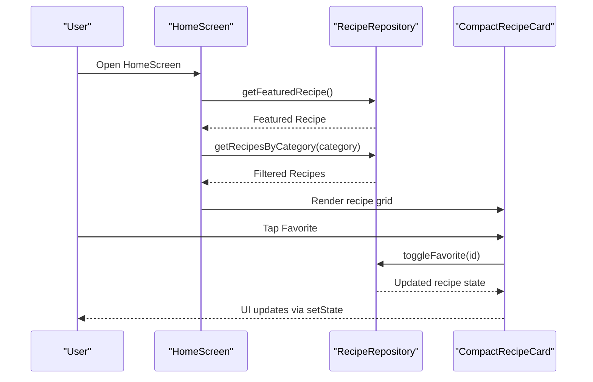
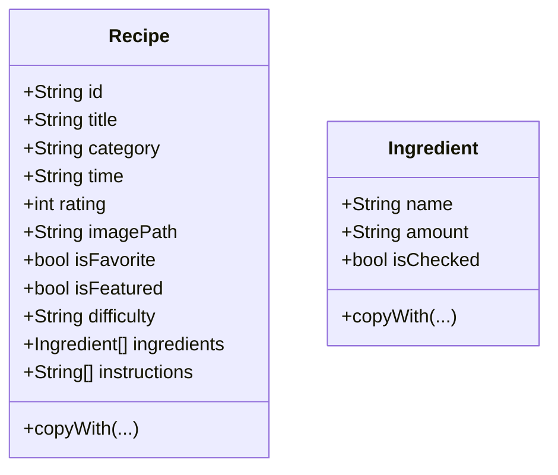
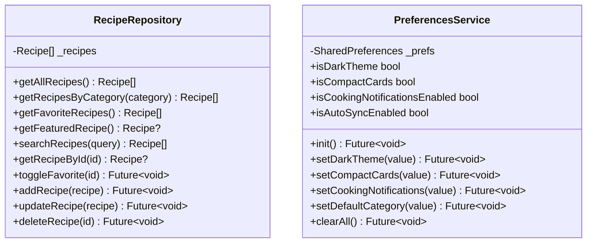
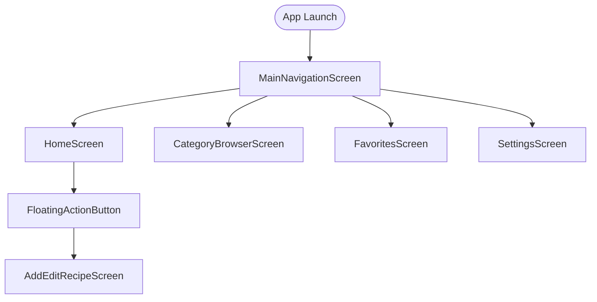
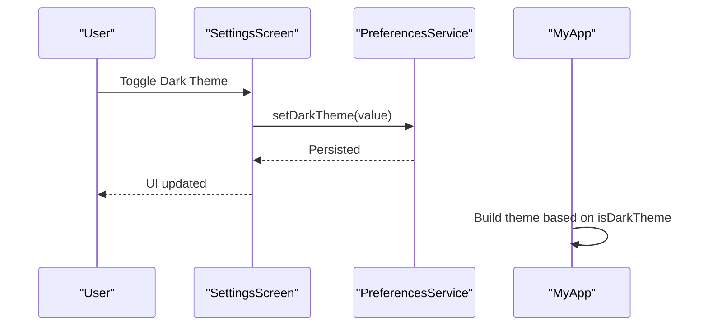
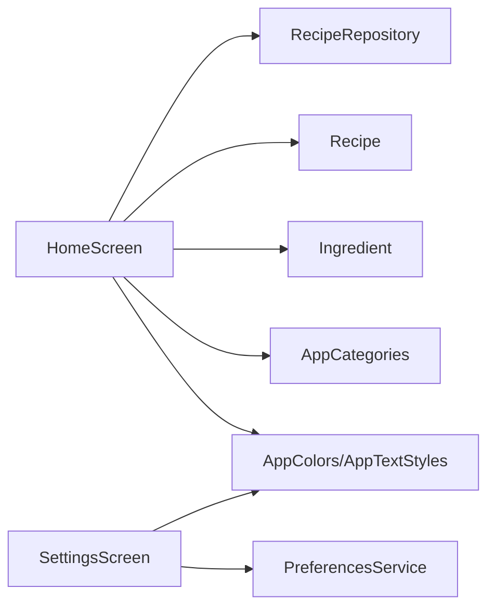

# Architecture Overview

<cite>
**Referenced Files in This Document**
- [main.dart](file://lib/main.dart)
- [pubspec.yaml](file://pubspec.yaml)
- [README.md](file://README.md)
- [recipe.dart](file://lib/models/recipe.dart)
- [api_service.dart](file://lib/services/api_service.dart)
- [preferences_service.dart](file://lib/services/preferences_service.dart)
- [constants.dart](file://lib/utils/constants.dart)
- [home_screen.dart](file://lib/screens/home_screen.dart)
- [setting_screen.dart](file://lib/screens/setting_screen.dart)
- [recipe_card.dart](file://lib/widgets/recipe_card.dart)
</cite>

## Table of Contents
1. [Introduction](#introduction)
2. [Project Structure](#project-structure)
3. [Core Components](#core-components)
4. [Architecture Overview](#architecture-overview)
5. [Detailed Component Analysis](#detailed-component-analysis)
6. [Dependency Analysis](#dependency-analysis)
7. [Performance Considerations](#performance-considerations)
8. [Troubleshooting Guide](#troubleshooting-guide)
9. [Conclusion](#conclusion)

## Introduction
This document describes the architectural design of the Cooking Book App, focusing on clean architecture principles with a repository pattern. The system is structured into three primary layers:
- Presentation layer: Flutter widgets and screens
- Domain layer: Models and business logic abstractions
- Data layer: Services and repositories implementing data access

It also documents component interactions, data flows, integration patterns, singleton-based services, state management, navigation architecture, system boundaries, cross-cutting concerns such as dependency injection, and how the dark theme implementation fits into the overall architecture.

## Project Structure
The project follows a conventional Flutter layout with feature-based grouping:
- lib/main.dart: Application entry point and global theme configuration
- lib/models/: Domain models (e.g., Recipe, Ingredient)
- lib/services/: Data services and repositories (e.g., RecipeRepository, PreferencesService)
- lib/utils/: Constants and shared utilities (e.g., AppColors, AppTextStyles, AppCategories)
- lib/screens/: Presentation layer screens (e.g., HomeScreen, SettingsScreen)
- lib/widgets/: Reusable UI components (e.g., RecipeCard, CompactRecipeCard)
- pubspec.yaml: Dependencies and assets configuration

**Diagram sources**
- [main.dart](file://lib/main.dart)
- [home_screen.dart](file://lib/screens/home_screen.dart)
- [setting_screen.dart](file://lib/screens/setting_screen.dart)
- [recipe.dart](file://lib/models/recipe.dart)
- [api_service.dart](file://lib/services/api_service.dart)
- [preferences_service.dart](file://lib/services/preferences_service.dart)
- [constants.dart](file://lib/utils/constants.dart)

**Section sources**
- [main.dart](file://lib/main.dart)
- [pubspec.yaml](file://pubspec.yaml)

## Core Components
- Models: Immutable data structures representing domain entities (Recipe, Ingredient) with copyWith support for immutability.
- Services: Singleton-style services for preferences and data access.
- Screens: Stateless and stateful widgets composing UI and orchestrating interactions.
- Widgets: Reusable UI components encapsulating rendering logic.
- Utilities: Centralized constants for colors, typography, and categories.

Key implementation patterns:
- Repository pattern: RecipeRepository centralizes recipe data operations and acts as a façade for data access.
- Singleton services: PreferencesService and RecipeRepository are implemented as singletons via factory constructors and internal constructors.
- State management: Screens manage local state using setState; navigation uses Flutter’s Navigator.
- Theming: Global dark theme configured in main.dart; theme-related preferences stored via PreferencesService.

**Section sources**
- [recipe.dart](file://lib/models/recipe.dart)
- [api_service.dart](file://lib/services/api_service.dart)
- [preferences_service.dart](file://lib/services/preferences_service.dart)
- [constants.dart](file://lib/utils/constants.dart)
- [home_screen.dart](file://lib/screens/home_screen.dart)
- [setting_screen.dart](file://lib/screens/setting_screen.dart)
- [recipe_card.dart](file://lib/widgets/recipe_card.dart)

## Architecture Overview
Clean architecture is applied with clear separation of concerns:
- Presentation layer depends on domain abstractions and invokes services.
- Domain layer remains independent of external frameworks and data sources.
- Data layer implements repository interfaces and provides concrete data access.

**Diagram sources**
- [home_screen.dart](file://lib/screens/home_screen.dart)
- [setting_screen.dart](file://lib/screens/setting_screen.dart)
- [recipe_card.dart](file://lib/widgets/recipe_card.dart)
- [recipe.dart](file://lib/models/recipe.dart)
- [api_service.dart](file://lib/services/api_service.dart)
- [preferences_service.dart](file://lib/services/preferences_service.dart)
- [constants.dart](file://lib/utils/constants.dart)

## Detailed Component Analysis

### Presentation Layer
- MainNavigationScreen: Hosts bottom navigation and routes to HomeScreen, CategoryBrowserScreen, FavoritesScreen, and SettingsScreen.
- HomeScreen: Displays featured and filtered recipes, supports category chips and search, and toggles favorites via repository.
- SettingsScreen: Manages appearance and preference toggles, persists settings via PreferencesService.

**Diagram sources**
- [main.dart](file://lib/main.dart)
- [home_screen.dart](file://lib/screens/home_screen.dart)
- [api_service.dart](file://lib/services/api_service.dart)
- [recipe_card.dart](file://lib/widgets/recipe_card.dart)

**Section sources**
- [main.dart](file://lib/main.dart)
- [home_screen.dart](file://lib/screens/home_screen.dart)
- [setting_screen.dart](file://lib/screens/setting_screen.dart)

### Domain Layer
- Recipe and Ingredient: Immutable models with copyWith enabling functional updates and predictable UI rebuilds.

**Diagram sources**
- [recipe.dart](file://lib/models/recipe.dart)

**Section sources**
- [recipe.dart](file://lib/models/recipe.dart)

### Data Layer
- RecipeRepository: Singleton façade providing CRUD-like operations over an in-memory dataset, including filtering, searching, and toggling favorites.
- PreferencesService: Singleton wrapper around SharedPreferences for persisting user preferences such as theme, compact cards, notifications, and default category.

**Diagram sources**
- [api_service.dart](file://lib/services/api_service.dart)
- [preferences_service.dart](file://lib/services/preferences_service.dart)

**Section sources**
- [api_service.dart](file://lib/services/api_service.dart)
- [preferences_service.dart](file://lib/services/preferences_service.dart)

### Navigation Architecture
- Bottom navigation routes to four primary screens: Home, Browse, Favorites, and Settings.
- Floating action button navigates to Add/Edit Recipe screen.
- Navigation is imperative using Navigator.push with MaterialPageRoute.

**Diagram sources**
- [main.dart](file://lib/main.dart)

**Section sources**
- [main.dart](file://lib/main.dart)

### Dark Theme Implementation
- Global dark theme configured in MyApp using ThemeData.dark with custom colors and AppBar theme.
- PreferencesService stores user preference for dark theme.
- SettingsScreen exposes a toggle to switch theme and persists the choice.

**Diagram sources**
- [setting_screen.dart](file://lib/screens/setting_screen.dart)
- [preferences_service.dart](file://lib/services/preferences_service.dart)
- [main.dart](file://lib/main.dart)

**Section sources**
- [main.dart](file://lib/main.dart)
- [setting_screen.dart](file://lib/screens/setting_screen.dart)
- [preferences_service.dart](file://lib/services/preferences_service.dart)

### State Management
- Local state: Managed via setState in stateful screens and widgets.
- UI state: Controlled by reactive rebuilds triggered by state changes.
- No external state management framework is used; the app relies on Flutter’s built-in mechanisms.

**Section sources**
- [home_screen.dart](file://lib/screens/home_screen.dart)
- [setting_screen.dart](file://lib/screens/setting_screen.dart)
- [recipe_card.dart](file://lib/widgets/recipe_card.dart)

### Cross-Cutting Concerns
- Dependency Injection: Services are instantiated locally within screens or widgets. A DI container is not present; services are accessed directly.
- Theming and Styles: Centralized in AppColors and AppTextStyles; used across widgets and screens.
- Categories and Constants: Centralized in AppCategories and AppConstants.

**Section sources**
- [constants.dart](file://lib/utils/constants.dart)
- [home_screen.dart](file://lib/screens/home_screen.dart)
- [setting_screen.dart](file://lib/screens/setting_screen.dart)

## Dependency Analysis
- Presentation depends on domain models and services.
- Services depend on SharedPreferences for persistence.
- Utilities are consumed by presentation and services.

**Diagram sources**
- [home_screen.dart](file://lib/screens/home_screen.dart)
- [setting_screen.dart](file://lib/screens/setting_screen.dart)
- [api_service.dart](file://lib/services/api_service.dart)
- [preferences_service.dart](file://lib/services/preferences_service.dart)
- [recipe.dart](file://lib/models/recipe.dart)
- [constants.dart](file://lib/utils/constants.dart)

**Section sources**
- [home_screen.dart](file://lib/screens/home_screen.dart)
- [setting_screen.dart](file://lib/screens/setting_screen.dart)
- [api_service.dart](file://lib/services/api_service.dart)
- [preferences_service.dart](file://lib/services/preferences_service.dart)
- [recipe.dart](file://lib/models/recipe.dart)
- [constants.dart](file://lib/utils/constants.dart)

## Performance Considerations
- In-memory repository: Suitable for small datasets; consider pagination or lazy loading for larger data volumes.
- Immutability: copyWith reduces accidental mutations but may increase memory churn; cache frequently used derived lists when appropriate.
- UI rendering: Grid rendering uses GridView.builder; ensure item count and delegates are efficient.
- Theme switching: Immediate rebuilds occur when toggling dark theme; minimize unnecessary widget rebuilds by scoping state changes.

## Troubleshooting Guide
- Missing assets: If images fail to load, verify asset paths and ensure assets are declared in pubspec.yaml.
- Preference initialization: Ensure PreferencesService.init is called before accessing preferences.
- Navigation errors: Confirm route builders and screen imports are correct in MainNavigationScreen.

**Section sources**
- [pubspec.yaml](file://pubspec.yaml)
- [preferences_service.dart](file://lib/services/preferences_service.dart)
- [main.dart](file://lib/main.dart)

## Conclusion
The Cooking Book App applies clean architecture with a repository pattern, separating presentation, domain, and data concerns. Singleton services encapsulate persistence and data access, while the presentation layer manages state locally. The dark theme is integrated at both the global and per-user preference levels. The current design is straightforward and effective for a mid-sized app; future enhancements could introduce a DI container and reactive state management for scalability.