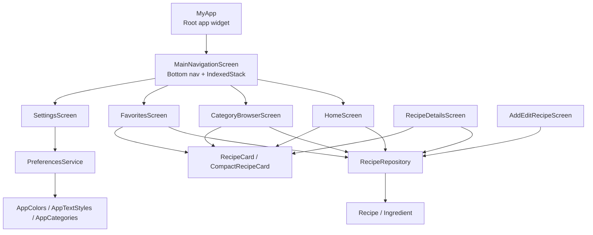
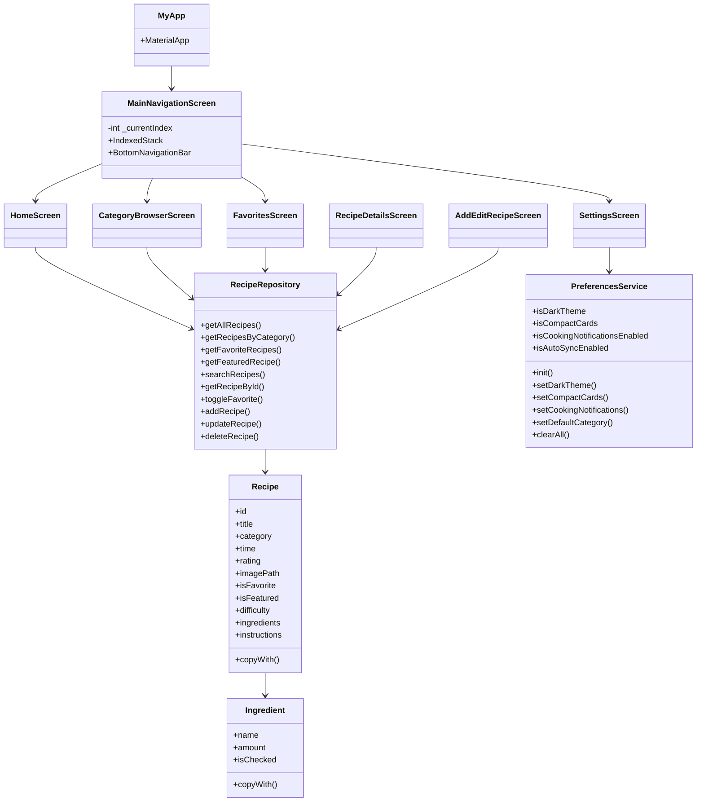
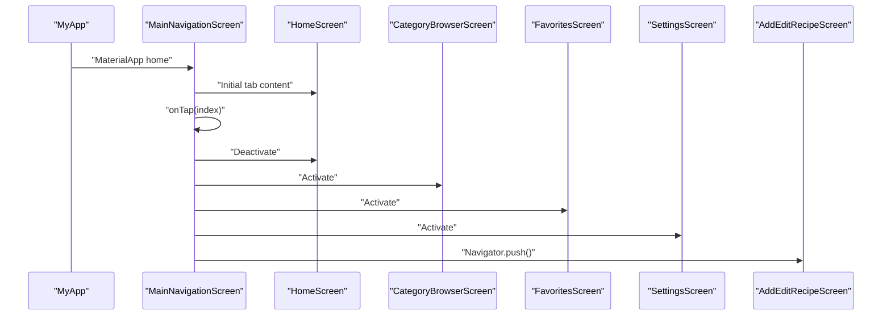
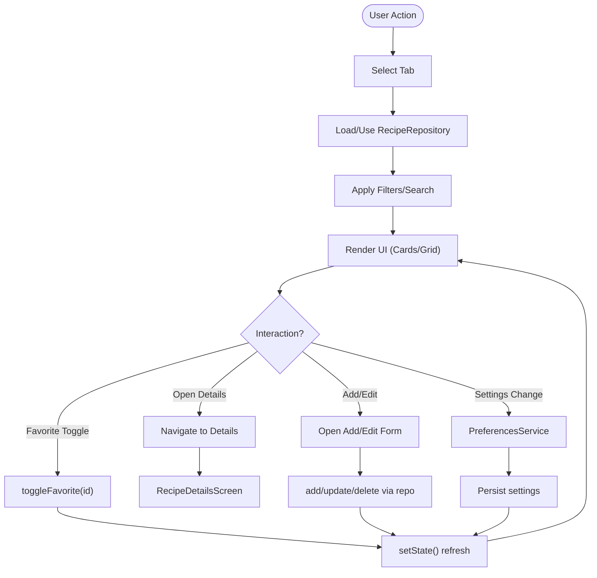
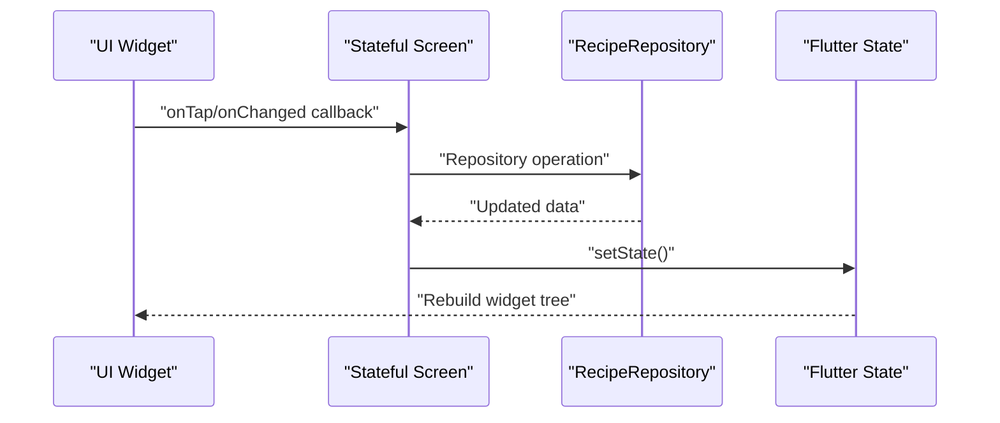
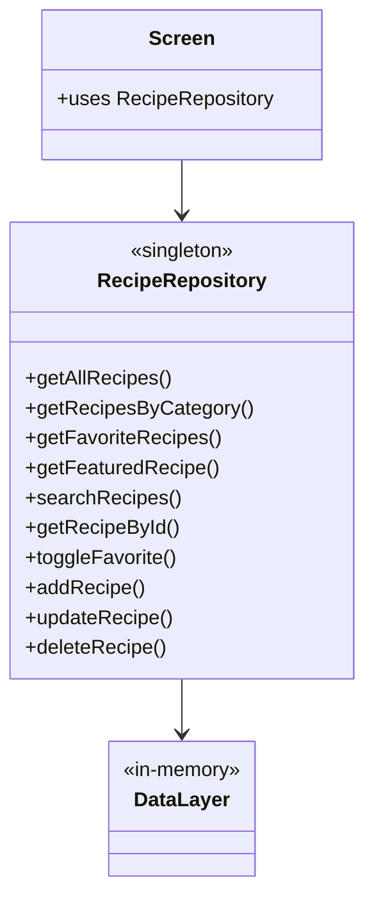
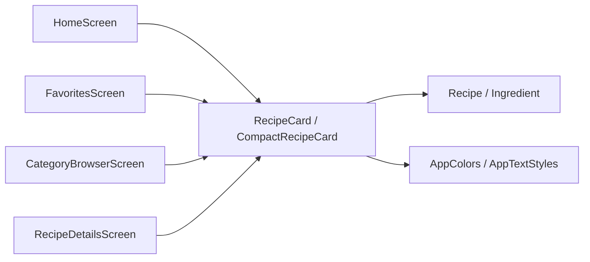
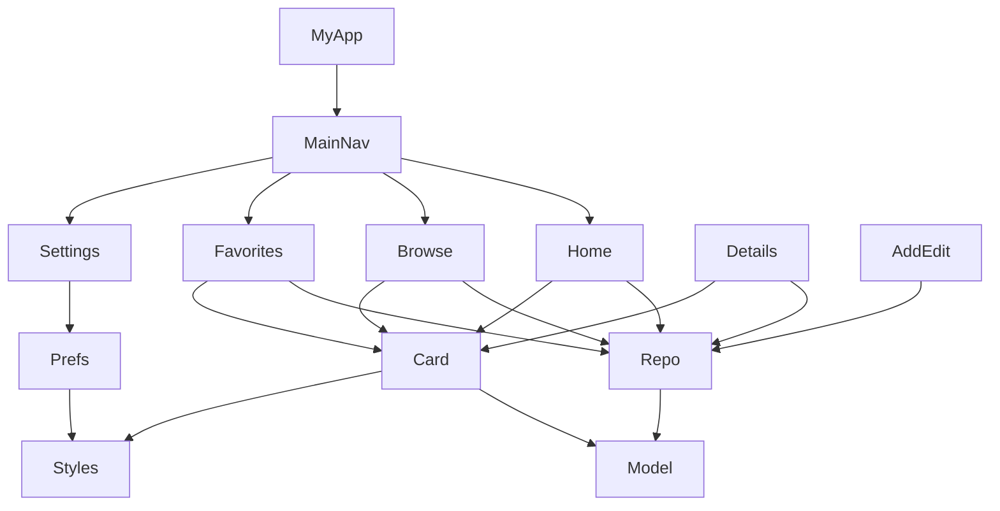

# Component Relationships

<cite>
**Referenced Files in This Document**
- [main.dart](file://lib/main.dart)
- [constants.dart](file://lib/utils/constants.dart)
- [api_service.dart](file://lib/services/api_service.dart)
- [preferences_service.dart](file://lib/services/preferences_service.dart)
- [recipe.dart](file://lib/models/recipe.dart)
- [home_screen.dart](file://lib/screens/home_screen.dart)
- [recipe_details_screen.dart](file://lib/screens/recipe_details_screen.dart)
- [add_edit_recipe_screen.dart](file://lib/screens/add_edit_recipe_screen.dart)
- [category_browser_screen.dart](file://lib/screens/category_browser_screen.dart)
- [favorites_screen.dart](file://lib/screens/favorites_screen.dart)
- [setting_screen.dart](file://lib/screens/setting_screen.dart)
- [recipe_card.dart](file://lib/widgets/recipe_card.dart)
- [badge.dart](file://lib/widgets/badge.dart)
</cite>

## Table of Contents
1. [Introduction](#introduction)
2. [Project Structure](#project-structure)
3. [Core Components](#core-components)
4. [Architecture Overview](#architecture-overview)
5. [Detailed Component Analysis](#detailed-component-analysis)
6. [Dependency Analysis](#dependency-analysis)
7. [Performance Considerations](#performance-considerations)
8. [Troubleshooting Guide](#troubleshooting-guide)
9. [Conclusion](#conclusion)

## Introduction
This document explains how the Cooking Book App coordinates its main application widget, navigation screens, stateful widgets, and data services. It details the dependency flow from the root application widget down to individual screens, and how models, services, and UI components integrate via the repository pattern. It also covers navigation flow patterns, data binding strategies, event propagation, and state synchronization across components.

## Project Structure
The application follows a layered structure:
- Entry point initializes the app and sets the main navigation container.
- Navigation is handled by a bottom navigation bar that hosts multiple screens.
- Screens are stateful or stateless widgets that render UI and orchestrate interactions.
- Services encapsulate data access and persistence.
- Models define the domain data structures.
- Widgets encapsulate reusable UI elements.

**Diagram sources**
- [main.dart:15-100](file://lib/main.dart#L15-L100)
- [home_screen.dart:10-241](file://lib/screens/home_screen.dart#L10-L241)
- [category_browser_screen.dart:8-262](file://lib/screens/category_browser_screen.dart#L8-L262)
- [favorites_screen.dart:8-114](file://lib/screens/favorites_screen.dart#L8-L114)
- [setting_screen.dart:6-298](file://lib/screens/setting_screen.dart#L6-L298)
- [recipe_details_screen.dart:8-285](file://lib/screens/recipe_details_screen.dart#L8-L285)
- [add_edit_recipe_screen.dart:6-363](file://lib/screens/add_edit_recipe_screen.dart#L6-L363)
- [api_service.dart:4-177](file://lib/services/api_service.dart#L4-L177)
- [preferences_service.dart:4-73](file://lib/services/preferences_service.dart#L4-L73)
- [recipe.dart:2-82](file://lib/models/recipe.dart#L2-L82)
- [recipe_card.dart:7-247](file://lib/widgets/recipe_card.dart#L7-L247)
- [constants.dart:4-124](file://lib/utils/constants.dart#L4-L124)

**Section sources**
- [main.dart:15-100](file://lib/main.dart#L15-L100)

## Core Components
- MyApp: Initializes the app, applies theme, and sets the home to MainNavigationScreen.
- MainNavigationScreen: Hosts four tabs (Home, Browse, Favorites, Settings) using IndexedStack and a BottomNavigationBar.
- Screens: HomeScreen, CategoryBrowserScreen, FavoritesScreen, SettingsScreen, RecipeDetailsScreen, AddEditRecipeScreen.
- Services: RecipeRepository (singleton-like repository pattern), PreferencesService (SharedPreferences wrapper).
- Models: Recipe and Ingredient with immutable copies and copyWith methods.
- Widgets: Reusable UI components like RecipeCard, CompactRecipeCard, TagBadge, DifficultyBadge.

Integration highlights:
- Screens depend on RecipeRepository for data queries and mutations.
- SettingsScreen depends on PreferencesService for persisted settings.
- UI widgets receive callbacks to trigger repository updates and navigate to details.

**Section sources**
- [main.dart:15-100](file://lib/main.dart#L15-L100)
- [api_service.dart:4-177](file://lib/services/api_service.dart#L4-L177)
- [preferences_service.dart:4-73](file://lib/services/preferences_service.dart#L4-L73)
- [recipe.dart:2-82](file://lib/models/recipe.dart#L2-L82)
- [recipe_card.dart:7-247](file://lib/widgets/recipe_card.dart#L7-L247)
- [badge.dart:4-70](file://lib/widgets/badge.dart#L4-L70)

## Architecture Overview
The app uses a repository pattern to decouple UI from data sources. Screens instantiate or access a repository instance to fetch and mutate data. Navigation is handled declaratively via a bottom navigation bar with IndexedStack to keep tab content stateful. PreferencesService centralizes persistent settings.

**Diagram sources**
- [main.dart:15-100](file://lib/main.dart#L15-L100)
- [home_screen.dart:10-241](file://lib/screens/home_screen.dart#L10-L241)
- [category_browser_screen.dart:8-262](file://lib/screens/category_browser_screen.dart#L8-L262)
- [favorites_screen.dart:8-114](file://lib/screens/favorites_screen.dart#L8-L114)
- [setting_screen.dart:6-298](file://lib/screens/setting_screen.dart#L6-L298)
- [recipe_details_screen.dart:8-285](file://lib/screens/recipe_details_screen.dart#L8-L285)
- [add_edit_recipe_screen.dart:6-363](file://lib/screens/add_edit_recipe_screen.dart#L6-L363)
- [api_service.dart:4-177](file://lib/services/api_service.dart#L4-L177)
- [preferences_service.dart:4-73](file://lib/services/preferences_service.dart#L4-L73)
- [recipe.dart:2-82](file://lib/models/recipe.dart#L2-L82)

## Detailed Component Analysis

### Navigation Flow: MyApp to MainNavigationScreen to Screens
- MyApp configures the app theme and sets MainNavigationScreen as the home.
- MainNavigationScreen maintains an IndexedStack of four screens and a BottomNavigationBar to switch tabs.
- A floating action button navigates to AddEditRecipeScreen.

**Diagram sources**
- [main.dart:15-100](file://lib/main.dart#L15-L100)

**Section sources**
- [main.dart:15-100](file://lib/main.dart#L15-L100)

### Stateful Screens and Repository Integration
- HomeScreen: Maintains selection state and search query, filters recipes via RecipeRepository, and toggles favorites.
- FavoritesScreen: Displays favorite recipes and supports toggling favorites.
- CategoryBrowserScreen: Groups recipes by category and previews cards.
- RecipeDetailsScreen: Shows detailed recipe info and supports toggling favorites.
- AddEditRecipeScreen: Manages form state and persists recipes via RecipeRepository.
- SettingsScreen: Loads and saves preferences via PreferencesService.

**Diagram sources**
- [home_screen.dart:17-149](file://lib/screens/home_screen.dart#L17-L149)
- [favorites_screen.dart:15-85](file://lib/screens/favorites_screen.dart#L15-L85)
- [category_browser_screen.dart:12-57](file://lib/screens/category_browser_screen.dart#L12-L57)
- [recipe_details_screen.dart:20-284](file://lib/screens/recipe_details_screen.dart#L20-L284)
- [add_edit_recipe_screen.dart:18-186](file://lib/screens/add_edit_recipe_screen.dart#L18-L186)
- [setting_screen.dart:13-35](file://lib/screens/setting_screen.dart#L13-L35)
- [api_service.dart:149-176](file://lib/services/api_service.dart#L149-L176)
- [preferences_service.dart:12-71](file://lib/services/preferences_service.dart#L12-L71)

**Section sources**
- [home_screen.dart:17-149](file://lib/screens/home_screen.dart#L17-L149)
- [favorites_screen.dart:15-85](file://lib/screens/favorites_screen.dart#L15-L85)
- [category_browser_screen.dart:12-57](file://lib/screens/category_browser_screen.dart#L12-L57)
- [recipe_details_screen.dart:20-284](file://lib/screens/recipe_details_screen.dart#L20-L284)
- [add_edit_recipe_screen.dart:18-186](file://lib/screens/add_edit_recipe_screen.dart#L18-L186)
- [setting_screen.dart:13-35](file://lib/screens/setting_screen.dart#L13-L35)

### Data Binding Strategies and Event Propagation
- Callbacks passed to widgets trigger repository operations and UI refresh.
- setState triggers rebuilds; repository changes propagate to dependent screens.
- Preferences changes update UI immediately and persist to disk.

**Diagram sources**
- [recipe_card.dart:8-19](file://lib/widgets/recipe_card.dart#L8-L19)
- [home_screen.dart:146-149](file://lib/screens/home_screen.dart#L146-L149)
- [favorites_screen.dart:82-85](file://lib/screens/favorites_screen.dart#L82-L85)
- [api_service.dart:149-176](file://lib/services/api_service.dart#L149-L176)

**Section sources**
- [recipe_card.dart:8-19](file://lib/widgets/recipe_card.dart#L8-L19)
- [home_screen.dart:146-149](file://lib/screens/home_screen.dart#L146-L149)
- [favorites_screen.dart:82-85](file://lib/screens/favorites_screen.dart#L82-L85)

### Repository Pattern and Loose Coupling
- RecipeRepository centralizes CRUD and filtering logic, hiding data storage details from screens.
- Screens depend on the repository interface, not on concrete storage implementations.
- This enables testing, mocking, and future persistence changes without UI modifications.

**Diagram sources**
- [api_service.dart:4-177](file://lib/services/api_service.dart#L4-L177)
- [home_screen.dart:20](file://lib/screens/home_screen.dart#L20)
- [favorites_screen.dart:16](file://lib/screens/favorites_screen.dart#L16)
- [category_browser_screen.dart:13](file://lib/screens/category_browser_screen.dart#L13)
- [recipe_details_screen.dart:21](file://lib/screens/recipe_details_screen.dart#L21)
- [add_edit_recipe_screen.dart:19](file://lib/screens/add_edit_recipe_screen.dart#L19)

**Section sources**
- [api_service.dart:4-177](file://lib/services/api_service.dart#L4-L177)

### UI Component Integration Patterns
- RecipeCard and CompactRecipeCard accept callbacks for taps and favorite toggles, enabling decoupled event handling.
- Badge widgets encapsulate presentation of tags and difficulty levels.
- Screens compose these widgets and pass data and callbacks.

**Diagram sources**
- [home_screen.dart:138-143](file://lib/screens/home_screen.dart#L138-L143)
- [favorites_screen.dart:66-71](file://lib/screens/favorites_screen.dart#L66-L71)
- [category_browser_screen.dart:159-260](file://lib/screens/category_browser_screen.dart#L159-L260)
- [recipe_details_screen.dart:163-199](file://lib/screens/recipe_details_screen.dart#L163-L199)
- [recipe_card.dart:7-247](file://lib/widgets/recipe_card.dart#L7-L247)
- [recipe.dart:2-82](file://lib/models/recipe.dart#L2-L82)
- [constants.dart:4-124](file://lib/utils/constants.dart#L4-L124)

**Section sources**
- [recipe_card.dart:7-247](file://lib/widgets/recipe_card.dart#L7-L247)
- [badge.dart:4-70](file://lib/widgets/badge.dart#L4-L70)

## Dependency Analysis
- MyApp depends on navigation and theme configuration.
- MainNavigationScreen depends on screen widgets and navigation APIs.
- Screens depend on:
  - RecipeRepository for data operations.
  - Constants for theming and categories.
  - Widgets for rendering.
- SettingsScreen depends on PreferencesService for persistence.
- Models are consumed by screens and widgets.

**Diagram sources**
- [main.dart:15-100](file://lib/main.dart#L15-L100)
- [home_screen.dart:10-241](file://lib/screens/home_screen.dart#L10-L241)
- [category_browser_screen.dart:8-262](file://lib/screens/category_browser_screen.dart#L8-L262)
- [favorites_screen.dart:8-114](file://lib/screens/favorites_screen.dart#L8-L114)
- [setting_screen.dart:6-298](file://lib/screens/setting_screen.dart#L6-L298)
- [recipe_details_screen.dart:8-285](file://lib/screens/recipe_details_screen.dart#L8-L285)
- [add_edit_recipe_screen.dart:6-363](file://lib/screens/add_edit_recipe_screen.dart#L6-L363)
- [api_service.dart:4-177](file://lib/services/api_service.dart#L4-L177)
- [preferences_service.dart:4-73](file://lib/services/preferences_service.dart#L4-L73)
- [recipe.dart:2-82](file://lib/models/recipe.dart#L2-L82)
- [recipe_card.dart:7-247](file://lib/widgets/recipe_card.dart#L7-L247)
- [constants.dart:4-124](file://lib/utils/constants.dart#L4-L124)

**Section sources**
- [main.dart:15-100](file://lib/main.dart#L15-L100)
- [api_service.dart:4-177](file://lib/services/api_service.dart#L4-L177)
- [preferences_service.dart:4-73](file://lib/services/preferences_service.dart#L4-L73)
- [recipe.dart:2-82](file://lib/models/recipe.dart#L2-L82)
- [recipe_card.dart:7-247](file://lib/widgets/recipe_card.dart#L7-L247)
- [constants.dart:4-124](file://lib/utils/constants.dart#L4-L124)

## Performance Considerations
- IndexedStack keeps inactive tab widgets mounted, preserving state but increasing memory usage. Consider lazy loading or route-based navigation for very large datasets.
- Filtering and searching are in-memory; for large datasets, consider pagination or server-side filtering.
- Frequent setState calls can cause unnecessary rebuilds; batch UI updates where possible.
- Image loading uses AssetImage; ensure assets are optimized and sized appropriately.

## Troubleshooting Guide
- No recipes found:
  - Verify repository initialization and data population.
  - Check search and category filters in HomeScreen.
- Favorite toggle not reflected:
  - Ensure toggleFavorite invokes repository and setState.
  - Confirm repository mutation updates the model copy.
- Settings not persisting:
  - Ensure PreferencesService.init is called during app startup.
  - Verify keys and defaults in PreferencesService.

**Section sources**
- [home_screen.dart:22-30](file://lib/screens/home_screen.dart#L22-L30)
- [favorites_screen.dart:82-85](file://lib/screens/favorites_screen.dart#L82-L85)
- [api_service.dart:149-176](file://lib/services/api_service.dart#L149-L176)
- [preferences_service.dart:12-71](file://lib/services/preferences_service.dart#L12-L71)

## Conclusion
The Cooking Book App employs a clean separation of concerns: MyApp bootstraps the app, MainNavigationScreen orchestrates navigation, screens manage UI state and interactions, and services encapsulate data and preferences. The repository pattern decouples UI from data access, enabling maintainability and testability. Callback-driven UI components and IndexedStack-based navigation provide responsive user experiences while keeping state synchronized across the app.