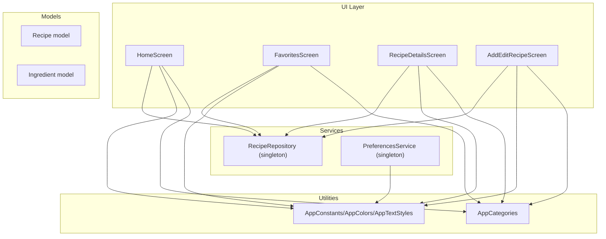
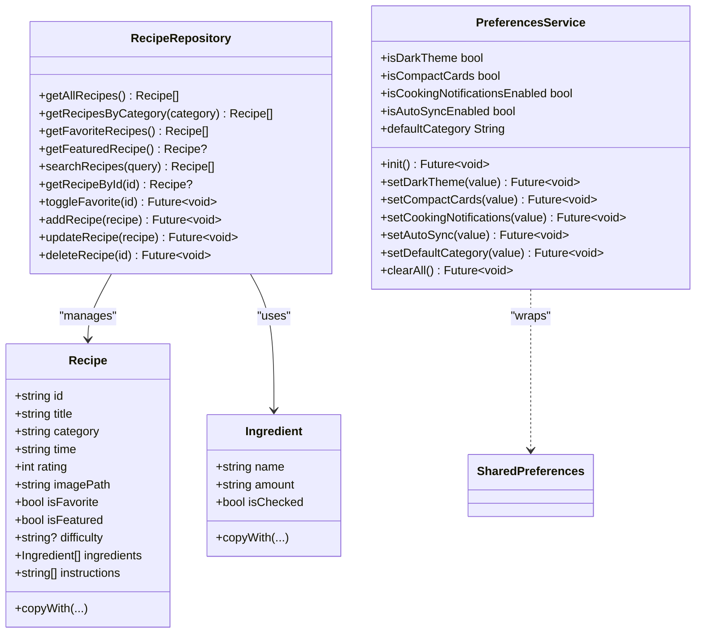
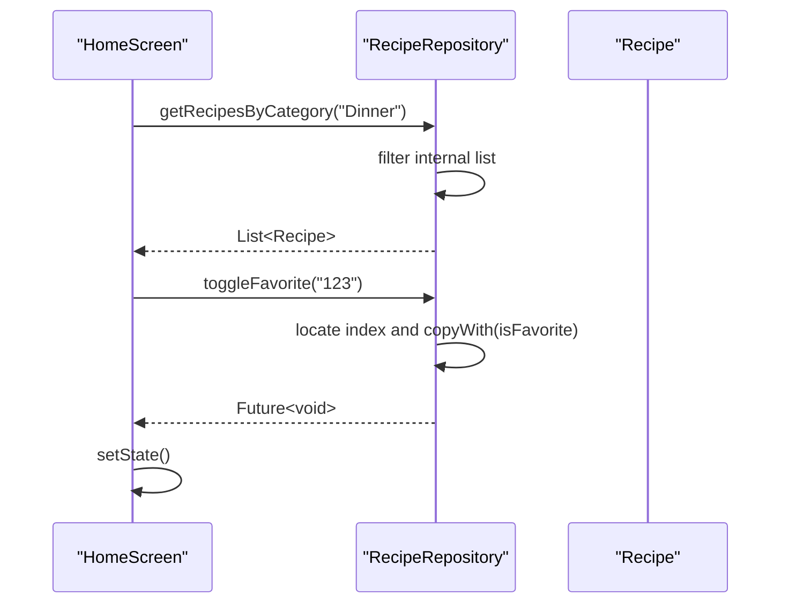
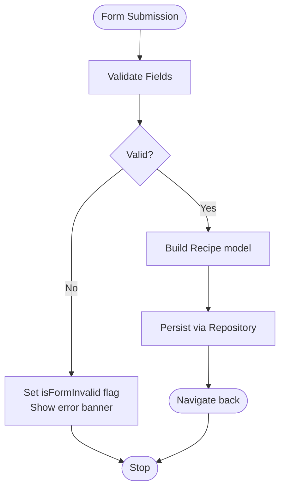
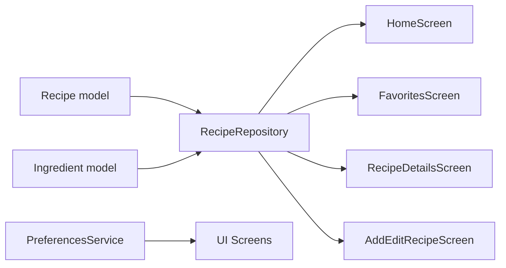
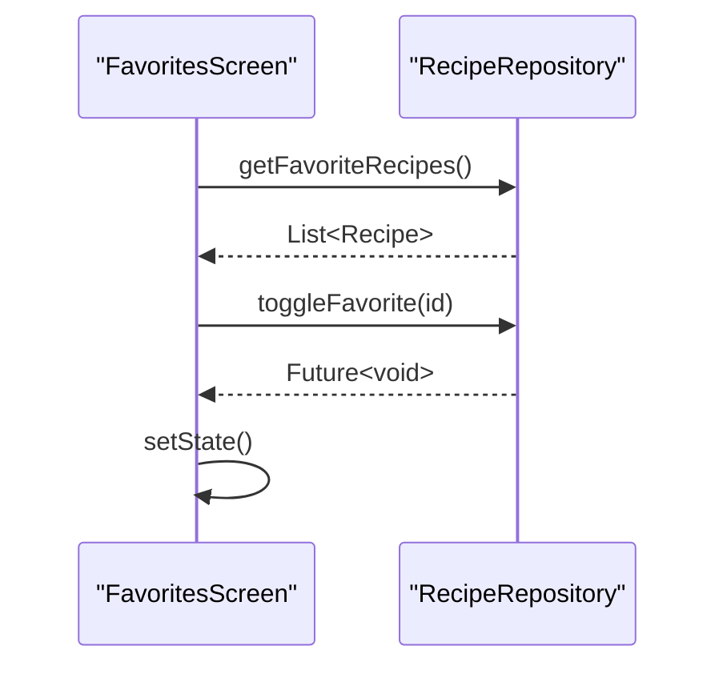
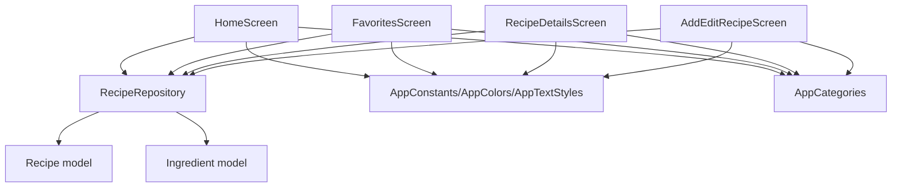

# Data Layer Architecture

<cite>
**Referenced Files in This Document**
- [main.dart](file://lib/main.dart)
- [recipe.dart](file://lib/models/recipe.dart)
- [api_service.dart](file://lib/services/api_service.dart)
- [preferences_service.dart](file://lib/services/preferences_service.dart)
- [constants.dart](file://lib/utils/constants.dart)
- [home_screen.dart](file://lib/screens/home_screen.dart)
- [favorites_screen.dart](file://lib/screens/favorites_screen.dart)
- [recipe_details_screen.dart](file://lib/screens/recipe_details_screen.dart)
- [add_edit_recipe_screen.dart](file://lib/screens/add_edit_recipe_screen.dart)
- [recipe_card.dart](file://lib/widgets/recipe_card.dart)
</cite>

## Table of Contents
1. [Introduction](#introduction)
2. [Project Structure](#project-structure)
3. [Core Components](#core-components)
4. [Architecture Overview](#architecture-overview)
5. [Detailed Component Analysis](#detailed-component-analysis)
6. [Dependency Analysis](#dependency-analysis)
7. [Performance Considerations](#performance-considerations)
8. [Troubleshooting Guide](#troubleshooting-guide)
9. [Conclusion](#conclusion)

## Introduction
This document describes the data layer architecture of the cookbook application with a focus on the repository pattern, API service design, and data persistence strategies. It explains how recipe data operations are handled, including CRUD operations, validation, and error handling. It also details the relationship between models and services, data flow patterns, and how the mock data service supports development and testing. Additional topics include data transformation patterns, caching strategies, and integration with local storage mechanisms.

## Project Structure
The data layer is organized around a small set of cohesive modules:
- Models define the domain entities and immutable value objects.
- Services encapsulate data access and persistence concerns.
- Screens consume services to render UI and orchestrate user interactions.
- Utilities centralize constants and shared configuration.

**Diagram sources**
- [home_screen.dart:10-20](file://lib/screens/home_screen.dart#L10-L20)
- [favorites_screen.dart:8-16](file://lib/screens/favorites_screen.dart#L8-L16)
- [recipe_details_screen.dart:8-21](file://lib/screens/recipe_details_screen.dart#L8-L21)
- [add_edit_recipe_screen.dart:6-19](file://lib/screens/add_edit_recipe_screen.dart#L6-L19)
- [recipe.dart:2-56](file://lib/models/recipe.dart#L2-L56)
- [api_service.dart:4-177](file://lib/services/api_service.dart#L4-L177)
- [preferences_service.dart:4-73](file://lib/services/preferences_service.dart#L4-L73)
- [constants.dart:101-124](file://lib/utils/constants.dart#L101-L124)

**Section sources**
- [main.dart:1-100](file://lib/main.dart#L1-L100)
- [constants.dart:101-124](file://lib/utils/constants.dart#L101-L124)

## Core Components
- Recipe model and Ingredient model define the data structures used across the app.
- RecipeRepository implements the repository pattern as a singleton, exposing methods for CRUD operations and queries against an in-memory dataset.
- PreferencesService manages user preferences via SharedPreferences, acting as a persistent store for app settings.
- Screens depend on RecipeRepository to fetch, filter, and mutate recipe data; they trigger UI updates after asynchronous operations complete.

Key responsibilities:
- Models: Immutable data carriers with copyWith helpers for safe transformations.
- RecipeRepository: Centralized data access with filtering, toggling favorites, and CRUD operations.
- PreferencesService: Encapsulates SharedPreferences initialization and typed getters/setters.
- Screens: Orchestrate UI rendering and user interactions; they call repository methods and refresh state.

**Section sources**
- [recipe.dart:2-56](file://lib/models/recipe.dart#L2-L56)
- [api_service.dart:4-177](file://lib/services/api_service.dart#L4-L177)
- [preferences_service.dart:4-73](file://lib/services/preferences_service.dart#L4-L73)
- [home_screen.dart:18-35](file://lib/screens/home_screen.dart#L18-L35)
- [favorites_screen.dart:16-20](file://lib/screens/favorites_screen.dart#L16-L20)
- [recipe_details_screen.dart:21-29](file://lib/screens/recipe_details_screen.dart#L21-L29)
- [add_edit_recipe_screen.dart:19-43](file://lib/screens/add_edit_recipe_screen.dart#L19-L43)

## Architecture Overview
The data layer follows a layered architecture:
- UI layer (screens) depends on services for data operations.
- Services encapsulate data access and persistence.
- Models remain stateless and immutable, enabling predictable transformations.
- Local storage is used for user preferences; recipe data is served from an in-memory repository.

**Diagram sources**
- [recipe.dart:2-56](file://lib/models/recipe.dart#L2-L56)
- [api_service.dart:4-177](file://lib/services/api_service.dart#L4-L177)
- [preferences_service.dart:4-73](file://lib/services/preferences_service.dart#L4-L73)

## Detailed Component Analysis

### RecipeRepository Singleton Pattern
RecipeRepository is implemented as a singleton using a private constructor and a factory returning a single shared instance. Internally, it maintains an in-memory list of Recipe objects initialized with sample data. Public methods expose:
- Queries: getAllRecipes, getRecipesByCategory, getFavoriteRecipes, getFeaturedRecipe, searchRecipes, getRecipeById.
- Mutations: toggleFavorite, addRecipe, updateRecipe, deleteRecipe.
- Error handling: Methods that search or retrieve by identity catch exceptions and return null or empty collections, preventing crashes and enabling graceful fallbacks.

Data flow:
- Screens call repository methods to fetch or modify data.
- Asynchronous mutations return Futures to keep UI responsive.
- Filtering and search operate on the in-memory collection; results are returned as unmodifiable lists to prevent external mutation.

**Diagram sources**
- [home_screen.dart:20-35](file://lib/screens/home_screen.dart#L20-L35)
- [api_service.dart:113-157](file://lib/services/api_service.dart#L113-L157)

**Section sources**
- [api_service.dart:4-177](file://lib/services/api_service.dart#L4-L177)
- [home_screen.dart:20-35](file://lib/screens/home_screen.dart#L20-L35)
- [favorites_screen.dart:16-20](file://lib/screens/favorites_screen.dart#L16-L20)
- [recipe_details_screen.dart:21-29](file://lib/screens/recipe_details_screen.dart#L21-L29)

### API Service Architecture for Mock Data Management
The current implementation uses an in-memory repository as a mock API service. It provides:
- Static sample data for demonstration and development.
- A unified interface for all recipe operations, enabling easy replacement with a real HTTP client later.
- Consistent method signatures for CRUD and query operations.

Mock data benefits:
- Rapid iteration during development.
- Deterministic behavior for testing.
- Isolation from network or server-side failures.

Future enhancements:
- Replace in-memory list with HTTP client calls while preserving the same interface.
- Introduce a protocol/interface for the repository to support swapping implementations.

**Section sources**
- [api_service.dart:9-107](file://lib/services/api_service.dart#L9-L107)
- [home_screen.dart:20-35](file://lib/screens/home_screen.dart#L20-L35)

### Data Persistence Strategies
- Recipe data: Stored in memory within RecipeRepository. No disk persistence is implemented for recipes in the current codebase.
- User preferences: Managed via PreferencesService using SharedPreferences for theme, compact cards, notifications, auto-sync, and default category.

Persistence decisions:
- In-memory storage for recipes prioritizes simplicity and speed during development.
- SharedPreferences ensures user preferences persist across app sessions.

**Section sources**
- [preferences_service.dart:4-73](file://lib/services/preferences_service.dart#L4-L73)

### Data Validation and Error Handling
Validation:
- Forms in AddEditRecipeScreen use Flutter’s Form and TextFormField validators to enforce required fields (title, cook time) and numeric input for cook time.
- Validation feedback is shown via a visible banner when the form is invalid.

Error handling:
- Repository methods that search or retrieve by ID catch exceptions and return null or empty results, preventing unhandled errors from propagating to the UI.
- Screens handle null results gracefully (e.g., showing a “not found” message in RecipeDetailsScreen).

**Diagram sources**
- [add_edit_recipe_screen.dart:179-186](file://lib/screens/add_edit_recipe_screen.dart#L179-L186)

**Section sources**
- [add_edit_recipe_screen.dart:118-133](file://lib/screens/add_edit_recipe_screen.dart#L118-L133)
- [add_edit_recipe_screen.dart:179-186](file://lib/screens/add_edit_recipe_screen.dart#L179-L186)
- [api_service.dart:141-147](file://lib/services/api_service.dart#L141-L147)
- [recipe_details_screen.dart:35-42](file://lib/screens/recipe_details_screen.dart#L35-L42)

### Relationship Between Models and Services
- Models (Recipe, Ingredient) are consumed by services and UI screens. They are immutable and provide copyWith for safe updates.
- Services (RecipeRepository, PreferencesService) own the data lifecycle and expose typed APIs for UI consumption.
- Screens depend on services for data retrieval and mutation, then rebuild UI with updated state.

**Diagram sources**
- [recipe.dart:2-56](file://lib/models/recipe.dart#L2-L56)
- [api_service.dart:4-177](file://lib/services/api_service.dart#L4-L177)
- [home_screen.dart:10-20](file://lib/screens/home_screen.dart#L10-L20)
- [favorites_screen.dart:8-16](file://lib/screens/favorites_screen.dart#L8-L16)
- [recipe_details_screen.dart:8-21](file://lib/screens/recipe_details_screen.dart#L8-L21)
- [add_edit_recipe_screen.dart:6-19](file://lib/screens/add_edit_recipe_screen.dart#L6-L19)
- [preferences_service.dart:4-73](file://lib/services/preferences_service.dart#L4-L73)

**Section sources**
- [recipe.dart:2-56](file://lib/models/recipe.dart#L2-L56)
- [api_service.dart:4-177](file://lib/services/api_service.dart#L4-L177)
- [preferences_service.dart:4-73](file://lib/services/preferences_service.dart#L4-L73)

### Data Flow Patterns
- Query flow: UI -> Repository -> Filter/Select -> Return immutable list/model.
- Mutation flow: UI -> Repository -> Copy with updated fields -> Replace in memory.
- Favorite toggle: UI triggers toggleFavorite -> Repository updates in place -> UI rebuilds with new state.

**Diagram sources**
- [favorites_screen.dart:16-20](file://lib/screens/favorites_screen.dart#L16-L20)
- [favorites_screen.dart:82-85](file://lib/screens/favorites_screen.dart#L82-L85)

**Section sources**
- [home_screen.dart:22-30](file://lib/screens/home_screen.dart#L22-L30)
- [favorites_screen.dart:16-20](file://lib/screens/favorites_screen.dart#L16-L20)
- [recipe_details_screen.dart:281-284](file://lib/screens/recipe_details_screen.dart#L281-L284)

### Data Transformation Patterns
- copyWith on Recipe and Ingredient enables immutable updates by replacing only changed fields.
- Screens transform raw inputs (e.g., removing “m” suffix from time) before constructing models.
- UI components receive transformed data (e.g., formatted time) and render accordingly.

**Section sources**
- [recipe.dart:29-55](file://lib/models/recipe.dart#L29-L55)
- [add_edit_recipe_screen.dart:45-54](file://lib/screens/add_edit_recipe_screen.dart#L45-L54)
- [recipe_card.dart:19-24](file://lib/widgets/recipe_card.dart#L19-L24)

### Caching Strategies
- In-memory caching: RecipeRepository caches all recipes in a local list, providing fast reads and writes.
- UI-level caching: Screens cache derived values (e.g., filtered lists) and rebuild efficiently using setState.
- No external caching layer is present; caching is limited to process memory.

**Section sources**
- [api_service.dart:10-107](file://lib/services/api_service.dart#L10-L107)
- [home_screen.dart:22-30](file://lib/screens/home_screen.dart#L22-L30)

### Integration with Local Storage Mechanisms
- PreferencesService integrates with SharedPreferences to persist user settings such as theme, compact cards, notifications, auto-sync, and default category.
- Initialization is performed via an init method to ensure SharedPreferences is ready before use.

**Section sources**
- [preferences_service.dart:12-14](file://lib/services/preferences_service.dart#L12-L14)
- [preferences_service.dart:27-66](file://lib/services/preferences_service.dart#L27-L66)

## Dependency Analysis
The following diagram shows how screens depend on the repository and utilities, and how the repository depends on models.

**Diagram sources**
- [home_screen.dart:10-20](file://lib/screens/home_screen.dart#L10-L20)
- [favorites_screen.dart:8-16](file://lib/screens/favorites_screen.dart#L8-L16)
- [recipe_details_screen.dart:8-21](file://lib/screens/recipe_details_screen.dart#L8-L21)
- [add_edit_recipe_screen.dart:6-19](file://lib/screens/add_edit_recipe_screen.dart#L6-L19)
- [api_service.dart:4-177](file://lib/services/api_service.dart#L4-L177)
- [recipe.dart:2-56](file://lib/models/recipe.dart#L2-L56)
- [constants.dart:101-124](file://lib/utils/constants.dart#L101-L124)

**Section sources**
- [home_screen.dart:10-20](file://lib/screens/home_screen.dart#L10-L20)
- [favorites_screen.dart:8-16](file://lib/screens/favorites_screen.dart#L8-L16)
- [recipe_details_screen.dart:8-21](file://lib/screens/recipe_details_screen.dart#L8-L21)
- [add_edit_recipe_screen.dart:6-19](file://lib/screens/add_edit_recipe_screen.dart#L6-L19)
- [api_service.dart:4-177](file://lib/services/api_service.dart#L4-L177)
- [recipe.dart:2-56](file://lib/models/recipe.dart#L2-L56)
- [constants.dart:101-124](file://lib/utils/constants.dart#L101-L124)

## Performance Considerations
- In-memory operations are fast but can become expensive with very large datasets. Consider pagination or virtualization for long lists.
- Frequent setState calls after repository mutations can cause unnecessary rebuilds; batch UI updates when possible.
- Copying models with copyWith is efficient for immutable updates; avoid deep cloning unless needed.
- For future HTTP-based repositories, implement request deduplication and background synchronization to reduce network overhead.

## Troubleshooting Guide
Common issues and resolutions:
- Null recipe returned: Ensure repository queries are called with valid IDs and that screens handle null gracefully.
- Favorite toggle not reflected: Verify that toggleFavorite is awaited and setState is invoked afterward.
- Form validation failing: Confirm TextFormField validators are correctly configured and that the form key is attached to the Form widget.
- Preferences not persisting: Ensure PreferencesService.init is called early in the app lifecycle.

**Section sources**
- [api_service.dart:141-147](file://lib/services/api_service.dart#L141-L147)
- [recipe_details_screen.dart:35-42](file://lib/screens/recipe_details_screen.dart#L35-L42)
- [home_screen.dart:146-149](file://lib/screens/home_screen.dart#L146-L149)
- [add_edit_recipe_screen.dart:179-186](file://lib/screens/add_edit_recipe_screen.dart#L179-L186)
- [preferences_service.dart:12-14](file://lib/services/preferences_service.dart#L12-L14)

## Conclusion
The data layer employs a clean separation of concerns with immutable models, a singleton repository pattern for data access, and SharedPreferences-backed preferences. The mock data service simplifies development and testing, while the repository interface allows straightforward migration to a real API. Current limitations include in-memory recipe storage and minimal caching; these can be addressed with future enhancements such as HTTP clients, disk persistence, and caching layers.