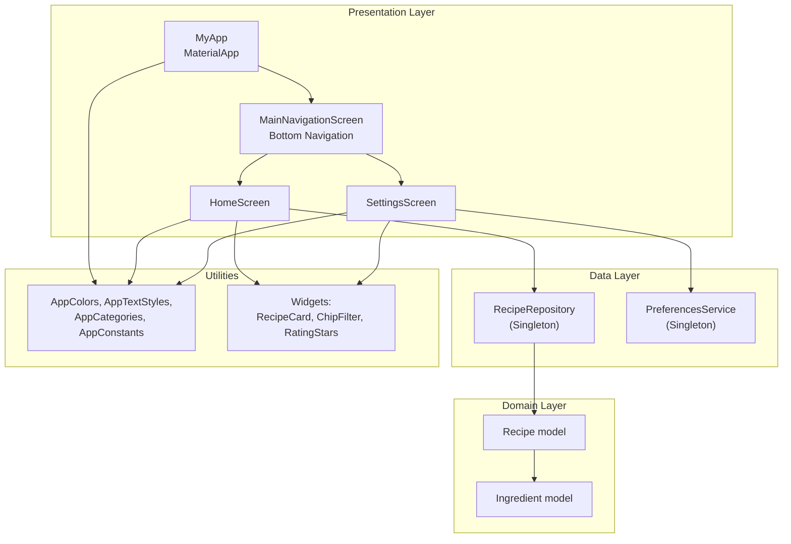
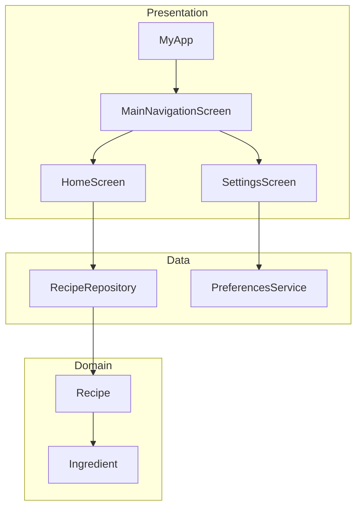
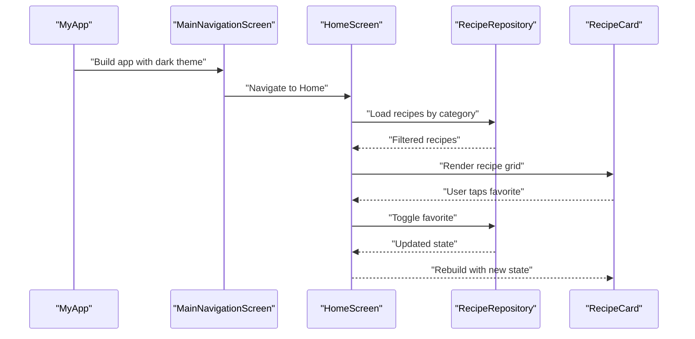
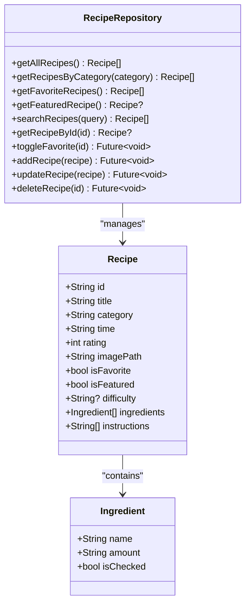
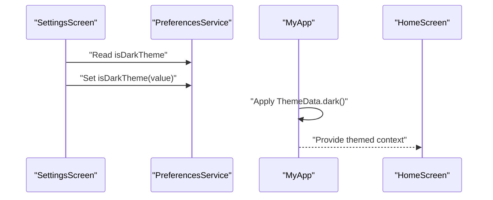
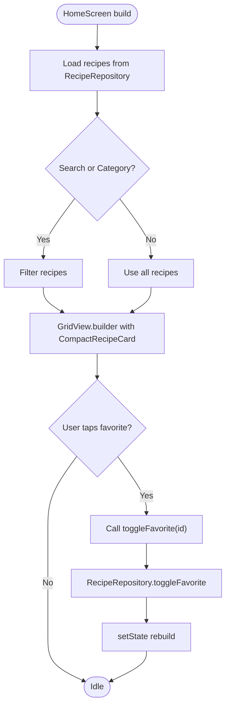
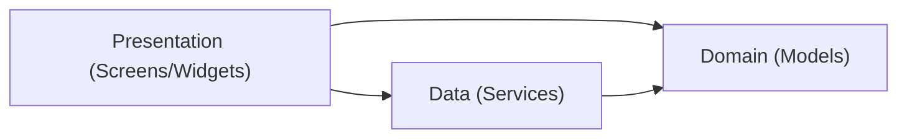
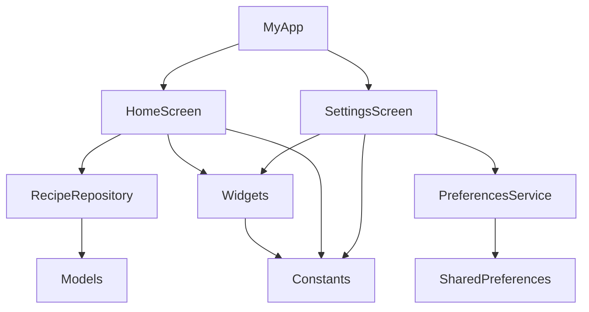

# Overall Architecture Design

<cite>
**Referenced Files in This Document**
- [main.dart](file://lib/main.dart)
- [home_screen.dart](file://lib/screens/home_screen.dart)
- [setting_screen.dart](file://lib/screens/setting_screen.dart)
- [api_service.dart](file://lib/services/api_service.dart)
- [preferences_service.dart](file://lib/services/preferences_service.dart)
- [recipe.dart](file://lib/models/recipe.dart)
- [constants.dart](file://lib/utils/constants.dart)
- [recipe_card.dart](file://lib/widgets/recipe_card.dart)
- [chip_filter.dart](file://lib/widgets/chip_filter.dart)
- [rating_stars.dart](file://lib/widgets/rating_stars.dart)
- [pubspec.yaml](file://pubspec.yaml)
</cite>

## Table of Contents
1. [Introduction](#introduction)
2. [Project Structure](#project-structure)
3. [Core Components](#core-components)
4. [Architecture Overview](#architecture-overview)
5. [Detailed Component Analysis](#detailed-component-analysis)
6. [Dependency Analysis](#dependency-analysis)
7. [Performance Considerations](#performance-considerations)
8. [Troubleshooting Guide](#troubleshooting-guide)
9. [Conclusion](#conclusion)

## Introduction
This document explains the overall architecture design of the Cooking Book App with a focus on Clean Architecture principles. The application separates concerns across presentation, domain, and data layers, and demonstrates practical patterns such as the repository pattern, singleton services, and widget composition. It also documents how the dark theme is integrated into the architecture and how the system maintains separation between UI logic and business logic.

## Project Structure
The project follows a feature-based organization with clear separation of concerns:
- Presentation layer: Screens and Widgets
- Domain layer: Models
- Data layer: Services (repository and preferences)
- Utilities: Constants and reusable UI helpers

**Diagram sources**
- [main.dart:10-100](file://lib/main.dart#L10-L100)
- [home_screen.dart:1-241](file://lib/screens/home_screen.dart#L1-L241)
- [setting_screen.dart:1-298](file://lib/screens/setting_screen.dart#L1-L298)
- [api_service.dart:1-177](file://lib/services/api_service.dart#L1-L177)
- [preferences_service.dart:1-73](file://lib/services/preferences_service.dart#L1-L73)
- [recipe.dart:1-82](file://lib/models/recipe.dart#L1-L82)
- [constants.dart:1-124](file://lib/utils/constants.dart#L1-L124)
- [recipe_card.dart:1-247](file://lib/widgets/recipe_card.dart#L1-L247)
- [chip_filter.dart:1-39](file://lib/widgets/chip_filter.dart#L1-L39)
- [rating_stars.dart:1-42](file://lib/widgets/rating_stars.dart#L1-L42)

**Section sources**
- [main.dart:10-100](file://lib/main.dart#L10-L100)
- [pubspec.yaml:1-92](file://pubspec.yaml#L1-L92)

## Core Components
- MyApp: Application entry point and theme provider. It configures the MaterialApp with a dark theme and sets MainNavigationScreen as the home.
- MainNavigationScreen: Central navigation hub with bottom navigation and a floating action button to add recipes.
- HomeScreen: Orchestrates recipe discovery via category filtering, search, and favorites toggling using the repository.
- SettingsScreen: Manages user preferences via PreferencesService and reflects appearance settings.
- RecipeRepository: Singleton repository implementing the repository pattern for recipe data operations.
- PreferencesService: Singleton service for persisting user preferences using SharedPreferences.
- Models: Immutable data structures (Recipe, Ingredient) supporting domain logic.
- Widgets: Reusable UI components (RecipeCard, ChipFilter, RatingStars) and helpers (constants).

**Section sources**
- [main.dart:14-100](file://lib/main.dart#L14-L100)
- [home_screen.dart:10-241](file://lib/screens/home_screen.dart#L10-L241)
- [setting_screen.dart:6-298](file://lib/screens/setting_screen.dart#L6-L298)
- [api_service.dart:4-177](file://lib/services/api_service.dart#L4-L177)
- [preferences_service.dart:4-73](file://lib/services/preferences_service.dart#L4-L73)
- [recipe.dart:1-82](file://lib/models/recipe.dart#L1-L82)
- [recipe_card.dart:6-247](file://lib/widgets/recipe_card.dart#L6-L247)
- [chip_filter.dart:4-39](file://lib/widgets/chip_filter.dart#L4-L39)
- [rating_stars.dart:4-42](file://lib/widgets/rating_stars.dart#L4-L42)
- [constants.dart:3-124](file://lib/utils/constants.dart#L3-L124)

## Architecture Overview
The app adheres to Clean Architecture by enforcing clear boundaries:
- Presentation layer depends on domain abstractions and uses services for data access.
- Domain layer is framework-agnostic and encapsulates business rules.
- Data layer implements repository and persistence concerns behind interfaces.

**Diagram sources**
- [main.dart:14-100](file://lib/main.dart#L14-L100)
- [home_screen.dart:17-35](file://lib/screens/home_screen.dart#L17-L35)
- [setting_screen.dart:13-35](file://lib/screens/setting_screen.dart#L13-L35)
- [api_service.dart:4-177](file://lib/services/api_service.dart#L4-L177)
- [preferences_service.dart:4-73](file://lib/services/preferences_service.dart#L4-L73)
- [recipe.dart:1-82](file://lib/models/recipe.dart#L1-L82)

## Detailed Component Analysis

### Presentation Layer Orchestration
- MyApp configures the global theme and sets the root navigator to MainNavigationScreen.
- MainNavigationScreen manages bottom navigation and routes to feature screens.
- HomeScreen composes UI widgets, applies filters, and delegates data operations to RecipeRepository.
- SettingsScreen loads and persists user preferences via PreferencesService.

**Diagram sources**
- [main.dart:14-100](file://lib/main.dart#L14-L100)
- [home_screen.dart:17-149](file://lib/screens/home_screen.dart#L17-L149)
- [api_service.dart:109-157](file://lib/services/api_service.dart#L109-L157)
- [recipe_card.dart:148-247](file://lib/widgets/recipe_card.dart#L148-L247)

**Section sources**
- [main.dart:14-100](file://lib/main.dart#L14-L100)
- [home_screen.dart:17-149](file://lib/screens/home_screen.dart#L17-L149)
- [recipe_card.dart:148-247](file://lib/widgets/recipe_card.dart#L148-L247)

### Repository Pattern Implementation
- RecipeRepository acts as a singleton providing CRUD and query operations for Recipe domain objects.
- It encapsulates in-memory data and exposes pure functions for filtering, searching, and mutating state.
- Business logic remains in presentation (HomeScreen) while data access is centralized in the repository.

**Diagram sources**
- [api_service.dart:4-177](file://lib/services/api_service.dart#L4-L177)
- [recipe.dart:1-82](file://lib/models/recipe.dart#L1-L82)

**Section sources**
- [api_service.dart:4-177](file://lib/services/api_service.dart#L4-L177)
- [recipe.dart:1-82](file://lib/models/recipe.dart#L1-L82)

### Singleton Services and Theme Integration
- PreferencesService is a singleton managing SharedPreferences keys for theme and other settings.
- SettingsScreen reads and writes preferences, enabling dark theme and compact card toggles.
- MyApp applies the dark theme globally and uses AppColors for consistent theming across screens.

**Diagram sources**
- [setting_screen.dart:13-35](file://lib/screens/setting_screen.dart#L13-L35)
- [preferences_service.dart:27-33](file://lib/services/preferences_service.dart#L27-L33)
- [main.dart:20-32](file://lib/main.dart#L20-L32)

**Section sources**
- [setting_screen.dart:13-35](file://lib/screens/setting_screen.dart#L13-L35)
- [preferences_service.dart:27-33](file://lib/services/preferences_service.dart#L27-L33)
- [main.dart:20-32](file://lib/main.dart#L20-L32)

### Widget Composition and Separation of Concerns
- HomeScreen composes chips, search field, featured recipe banner, and recipe grid.
- Widgets (RecipeCard, ChipFilter, RatingStars) are reusable and receive immutable data via props.
- Filtering and search logic remain in HomeScreen; data retrieval is delegated to RecipeRepository.

**Diagram sources**
- [home_screen.dart:22-149](file://lib/screens/home_screen.dart#L22-L149)
- [api_service.dart:149-157](file://lib/services/api_service.dart#L149-L157)
- [recipe_card.dart:148-247](file://lib/widgets/recipe_card.dart#L148-L247)

**Section sources**
- [home_screen.dart:22-149](file://lib/screens/home_screen.dart#L22-L149)
- [recipe_card.dart:148-247](file://lib/widgets/recipe_card.dart#L148-L247)

### System Boundaries and Responsibilities
- Presentation boundary: Screens and Widgets render UI and manage user interactions.
- Domain boundary: Models define immutable data contracts.
- Data boundary: Services implement repository and preference persistence.

[No sources needed since this diagram shows conceptual boundaries]

## Dependency Analysis
- MyApp depends on screens and constants for theming.
- Screens depend on services and widgets.
- Services depend on models and platform APIs (SharedPreferences).
- Widgets depend on constants and models.

**Diagram sources**
- [main.dart:14-100](file://lib/main.dart#L14-L100)
- [home_screen.dart:17-35](file://lib/screens/home_screen.dart#L17-L35)
- [setting_screen.dart:13-35](file://lib/screens/setting_screen.dart#L13-L35)
- [api_service.dart:4-177](file://lib/services/api_service.dart#L4-L177)
- [preferences_service.dart:4-73](file://lib/services/preferences_service.dart#L4-L73)
- [recipe.dart:1-82](file://lib/models/recipe.dart#L1-L82)
- [constants.dart:3-124](file://lib/utils/constants.dart#L3-L124)
- [recipe_card.dart:6-247](file://lib/widgets/recipe_card.dart#L6-L247)

**Section sources**
- [pubspec.yaml:30-38](file://pubspec.yaml#L30-L38)
- [main.dart:14-100](file://lib/main.dart#L14-L100)
- [home_screen.dart:17-35](file://lib/screens/home_screen.dart#L17-L35)
- [setting_screen.dart:13-35](file://lib/screens/setting_screen.dart#L13-L35)
- [api_service.dart:4-177](file://lib/services/api_service.dart#L4-L177)
- [preferences_service.dart:4-73](file://lib/services/preferences_service.dart#L4-L73)
- [recipe.dart:1-82](file://lib/models/recipe.dart#L1-L82)
- [constants.dart:3-124](file://lib/utils/constants.dart#L3-L124)
- [recipe_card.dart:6-247](file://lib/widgets/recipe_card.dart#L6-L247)

## Performance Considerations
- Stateless widgets (e.g., RatingStars, ChipFilter) minimize rebuild costs.
- GridView.builder with fixed aspect ratio optimizes rendering for recipe grids.
- Filtering and search are performed in memory; consider pagination or lazy loading for larger datasets.
- Avoid unnecessary setState calls by updating only when repository state changes.

[No sources needed since this section provides general guidance]

## Troubleshooting Guide
- Dark theme not applying: Verify PreferencesService initialization and that MyApp reads the persisted theme flag.
- No recipes displayed: Confirm RecipeRepository contains sample data and filtering logic does not exclude all results.
- Favorite toggle not reflected: Ensure toggleFavorite updates repository state and triggers setState in HomeScreen.

**Section sources**
- [preferences_service.dart:12-14](file://lib/services/preferences_service.dart#L12-L14)
- [main.dart:20-32](file://lib/main.dart#L20-L32)
- [api_service.dart:149-157](file://lib/services/api_service.dart#L149-L157)
- [home_screen.dart:146-149](file://lib/screens/home_screen.dart#L146-L149)

## Conclusion
The Cooking Book App implements Clean Architecture by separating presentation, domain, and data concerns. The repository pattern centralizes data access, singleton services encapsulate persistence, and widget composition keeps UI logic modular. The dark theme is integrated at the application level and synchronized with user preferences, maintaining a consistent and maintainable architecture.