# Presentation Layer Design

<cite>
**Referenced Files in This Document**
- [main.dart](file://lib/main.dart)
- [constants.dart](file://lib/utils/constants.dart)
- [recipe.dart](file://lib/models/recipe.dart)
- [recipe_card.dart](file://lib/widgets/recipe_card.dart)
- [chip_filter.dart](file://lib/widgets/chip_filter.dart)
- [rating_stars.dart](file://lib/widgets/rating_stars.dart)
- [badge.dart](file://lib/widgets/badge.dart)
- [section_header.dart](file://lib/widgets/section_header.dart)
</cite>

## Table of Contents
1. [Introduction](#introduction)
2. [Project Structure](#project-structure)
3. [Core Components](#core-components)
4. [Architecture Overview](#architecture-overview)
5. [Detailed Component Analysis](#detailed-component-analysis)
6. [Dependency Analysis](#dependency-analysis)
7. [Performance Considerations](#performance-considerations)
8. [Troubleshooting Guide](#troubleshooting-guide)
9. [Conclusion](#conclusion)

## Introduction
This document describes the presentation layer design of the application, focusing on the widget architecture, state management patterns, and UI component organization. It explains the MainNavigationScreen implementation using IndexedStack for efficient screen management, bottom navigation patterns, and floating action button integration. It also documents reusable UI components such as recipe cards and chip filters, how stateful widgets manage UI state, the dark theme implementation and color system integration, and responsive design patterns. Finally, it covers navigation state management, route handling, and user interaction patterns across the presentation layer.

## Project Structure
The presentation layer is organized around a central navigation shell with a dark theme and a set of reusable widgets. The main entry point configures the app theme and sets the initial screen to the main navigation shell. The navigation shell hosts multiple screens managed by IndexedStack to preserve state and improve performance. Reusable widgets encapsulate UI patterns for recipes, chips, ratings, badges, and section headers.

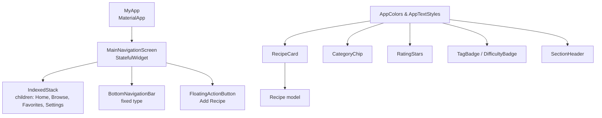

**Diagram sources**
- [main.dart:10-100](file://lib/main.dart#L10-L100)
- [constants.dart:4-124](file://lib/utils/constants.dart#L4-L124)
- [recipe_card.dart:1-247](file://lib/widgets/recipe_card.dart#L1-L247)
- [chip_filter.dart:1-39](file://lib/widgets/chip_filter.dart#L1-L39)
- [rating_stars.dart:1-42](file://lib/widgets/rating_stars.dart#L1-L42)
- [badge.dart:1-70](file://lib/widgets/badge.dart#L1-L70)
- [section_header.dart:1-26](file://lib/widgets/section_header.dart#L1-L26)
- [recipe.dart:1-82](file://lib/models/recipe.dart#L1-L82)

**Section sources**
- [main.dart:10-100](file://lib/main.dart#L10-L100)
- [constants.dart:4-124](file://lib/utils/constants.dart#L4-L124)

## Core Components
- Dark theme and global styling: The app initializes with a dark theme and applies consistent background and app bar colors via AppColors and AppTextStyles.
- Main navigation shell: MainNavigationScreen is a StatefulWidget that manages the current tab index and renders a body composed of IndexedStack with four screens.
- Bottom navigation: Fixed-style bottom navigation updates the selected index and triggers rebuilds.
- Floating action button: Opens the add/edit recipe screen via navigation.
- Reusable widgets: RecipeCard, CategoryChip, RatingStars, TagBadge/DifficultyBadge, and SectionHeader encapsulate common UI patterns and integrate with AppColors and AppTextStyles.

**Section sources**
- [main.dart:15-100](file://lib/main.dart#L15-L100)
- [constants.dart:4-124](file://lib/utils/constants.dart#L4-L124)
- [recipe_card.dart:6-146](file://lib/widgets/recipe_card.dart#L6-L146)
- [chip_filter.dart:4-39](file://lib/widgets/chip_filter.dart#L4-L39)
- [rating_stars.dart:4-42](file://lib/widgets/rating_stars.dart#L4-L42)
- [badge.dart:4-70](file://lib/widgets/badge.dart#L4-L70)
- [section_header.dart:4-26](file://lib/widgets/section_header.dart#L4-L26)

## Architecture Overview
The presentation layer follows a layered pattern:
- App shell: MyApp configures theme and routes to MainNavigationScreen.
- Navigation shell: MainNavigationScreen holds the bottom navigation and IndexedStack for persistent screen instances.
- Screen composition: Each screen is a Stateless widget that composes reusable widgets and interacts with models.
- Widget library: Reusable widgets depend on AppColors and AppTextStyles for consistent theming.

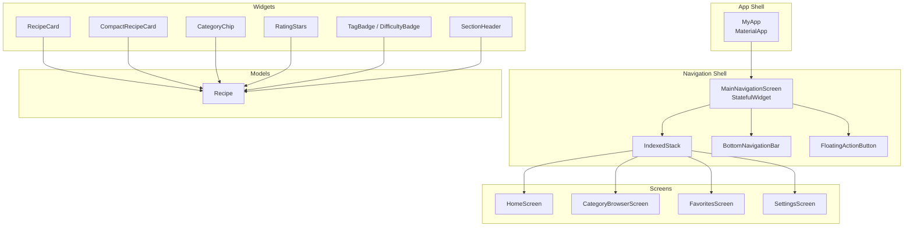

**Diagram sources**
- [main.dart:15-100](file://lib/main.dart#L15-L100)
- [recipe_card.dart:6-247](file://lib/widgets/recipe_card.dart#L6-L247)
- [chip_filter.dart:4-39](file://lib/widgets/chip_filter.dart#L4-L39)
- [rating_stars.dart:4-42](file://lib/widgets/rating_stars.dart#L4-L42)
- [badge.dart:4-70](file://lib/widgets/badge.dart#L4-L70)
- [section_header.dart:4-26](file://lib/widgets/section_header.dart#L4-L26)
- [recipe.dart:1-82](file://lib/models/recipe.dart#L1-L82)

## Detailed Component Analysis

### MainNavigationScreen Implementation
MainNavigationScreen is a StatefulWidget that:
- Maintains the current index for the bottom navigation.
- Defines a fixed list of screens to be rendered inside IndexedStack.
- Renders a bottom navigation bar with four items and a floating action button to open the add/edit recipe screen.
- Uses AppColors for consistent theming of the navigation bar and FAB.

Key behaviors:
- State change on bottom navigation tap updates the index and rebuilds the body.
- IndexedStack preserves the state of inactive screens, improving performance compared to replacing the entire body.
- The FAB navigates to the add/edit recipe screen using MaterialPageRoute.

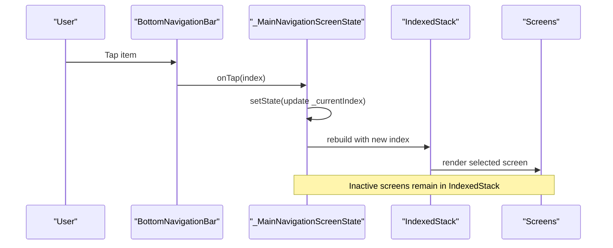

**Diagram sources**
- [main.dart:36-100](file://lib/main.dart#L36-L100)

**Section sources**
- [main.dart:36-100](file://lib/main.dart#L36-L100)

### Widget Composition Approach
The presentation layer emphasizes composition:
- Screens compose reusable widgets to assemble complex UIs efficiently.
- Widgets receive data via strongly typed constructors and callbacks for user interactions.
- Theming is centralized in AppColors and AppTextStyles, ensuring consistency across components.

Examples:
- RecipeCard and CompactRecipeCard display recipe metadata and handle favorite toggles.
- CategoryChip renders a selectable chip with selection-aware styling.
- RatingStars renders a visual rating with optional numeric value display.
- TagBadge and DifficultyBadge present categorical and difficulty indicators.
- SectionHeader provides consistent section titles.

**Section sources**
- [recipe_card.dart:6-247](file://lib/widgets/recipe_card.dart#L6-L247)
- [chip_filter.dart:4-39](file://lib/widgets/chip_filter.dart#L4-L39)
- [rating_stars.dart:4-42](file://lib/widgets/rating_stars.dart#L4-L42)
- [badge.dart:4-70](file://lib/widgets/badge.dart#L4-L70)
- [section_header.dart:4-26](file://lib/widgets/section_header.dart#L4-L26)

### Reusable UI Components

#### Recipe Cards
- RecipeCard: Full-width card with image, favorite toggle, title, category chip, and metadata.
- CompactRecipeCard: Grid-friendly variant with smaller typography and simplified layout.
- Both rely on the Recipe model and AppColors/AppTextStyles for styling.

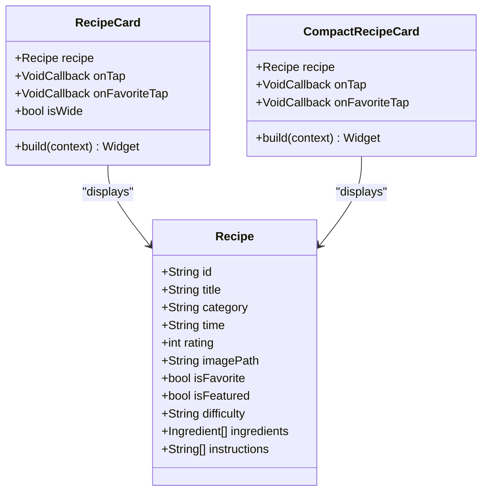

**Diagram sources**
- [recipe.dart:1-82](file://lib/models/recipe.dart#L1-L82)
- [recipe_card.dart:6-247](file://lib/widgets/recipe_card.dart#L6-L247)

**Section sources**
- [recipe_card.dart:6-247](file://lib/widgets/recipe_card.dart#L6-L247)
- [recipe.dart:1-82](file://lib/models/recipe.dart#L1-L82)

#### Chip Filters
- CategoryChip: Selectable chip with selection-aware background and text color.

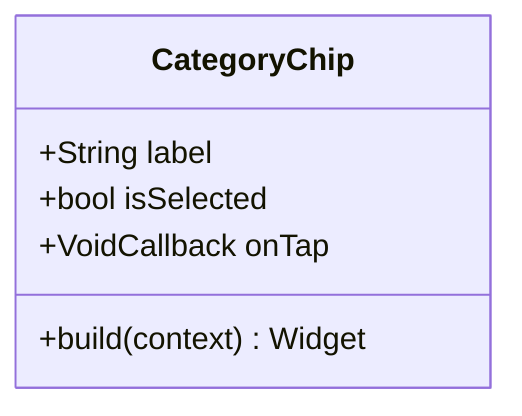

**Diagram sources**
- [chip_filter.dart:4-39](file://lib/widgets/chip_filter.dart#L4-L39)

**Section sources**
- [chip_filter.dart:4-39](file://lib/widgets/chip_filter.dart#L4-L39)

#### Ratings and Badges
- RatingStars: Renders filled/empty stars and optionally displays a numeric rating value.
- TagBadge: Generic tag badge with customizable colors.
- DifficultyBadge: Specialized badge for difficulty levels.

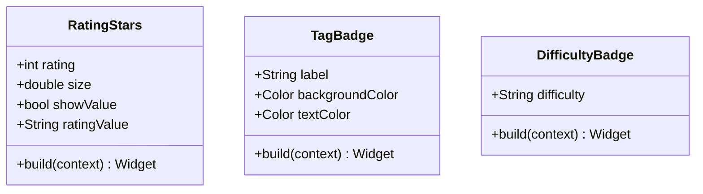

**Diagram sources**
- [rating_stars.dart:4-42](file://lib/widgets/rating_stars.dart#L4-L42)
- [badge.dart:4-70](file://lib/widgets/badge.dart#L4-L70)

**Section sources**
- [rating_stars.dart:4-42](file://lib/widgets/rating_stars.dart#L4-L42)
- [badge.dart:4-70](file://lib/widgets/badge.dart#L4-L70)

#### Section Header
- SectionHeader: Provides a consistent title style for grouping content.

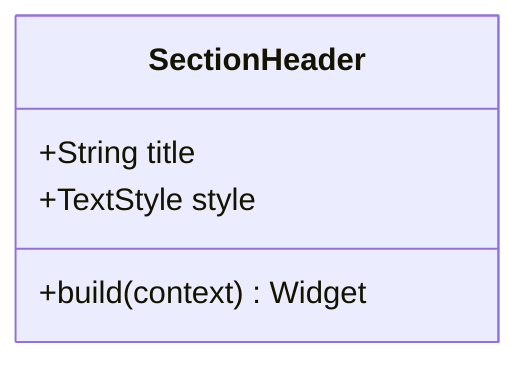

**Diagram sources**
- [section_header.dart:4-26](file://lib/widgets/section_header.dart#L4-L26)

**Section sources**
- [section_header.dart:4-26](file://lib/widgets/section_header.dart#L4-L26)

### State Management Patterns
- MainNavigationScreen: Uses StatefulWidget to manage the current index and trigger rebuilds when the user switches tabs.
- BottomNavigationBar: Responds to onTap events and updates state, which causes IndexedStack to switch the visible child.
- RecipeCard Favorite Toggle: Receives onFavoriteTap callback to propagate state changes to parent widgets or services.
- CategoryChip: Receives onTap to notify parents of selection changes.

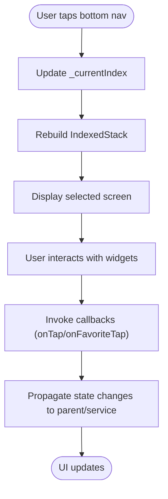

**Diagram sources**
- [main.dart:36-100](file://lib/main.dart#L36-L100)
- [recipe_card.dart:24-70](file://lib/widgets/recipe_card.dart#L24-L70)
- [chip_filter.dart:19-37](file://lib/widgets/chip_filter.dart#L19-L37)

**Section sources**
- [main.dart:36-100](file://lib/main.dart#L36-L100)
- [recipe_card.dart:24-70](file://lib/widgets/recipe_card.dart#L24-L70)
- [chip_filter.dart:19-37](file://lib/widgets/chip_filter.dart#L19-L37)

### Dark Theme and Color System Integration
- AppColors centralizes all theme colors, including backgrounds, accents, text, and status colors.
- AppTextStyles defines consistent typography scales applied across widgets.
- MainNavigationScreen and widgets consume AppColors for backgrounds, icons, and text to maintain a cohesive dark theme.

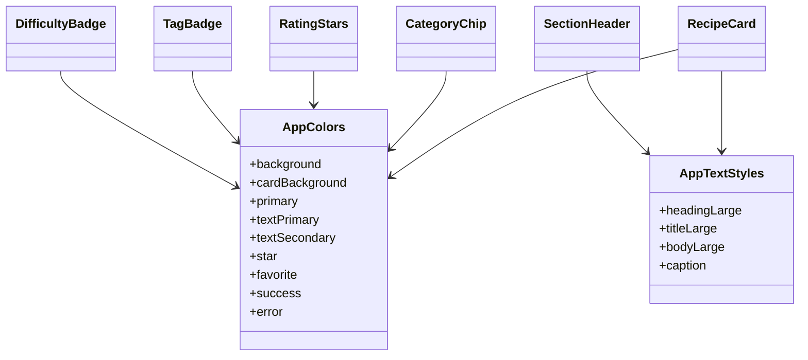

**Diagram sources**
- [constants.dart:4-124](file://lib/utils/constants.dart#L4-L124)
- [recipe_card.dart:6-146](file://lib/widgets/recipe_card.dart#L6-L146)
- [chip_filter.dart:4-39](file://lib/widgets/chip_filter.dart#L4-L39)
- [rating_stars.dart:4-42](file://lib/widgets/rating_stars.dart#L4-L42)
- [badge.dart:4-70](file://lib/widgets/badge.dart#L4-L70)
- [section_header.dart:4-26](file://lib/widgets/section_header.dart#L4-L26)

**Section sources**
- [constants.dart:4-124](file://lib/utils/constants.dart#L4-L124)
- [main.dart:20-32](file://lib/main.dart#L20-L32)

### Responsive Design Patterns
- IndexedStack preserves screen instances and their scroll positions, contributing to perceived responsiveness.
- Widgets use flexible layouts (Expanded, Stack, Positioned) and appropriate paddings/margins to adapt across screen sizes.
- Typography scales from AppTextStyles ensure readability across devices.

**Section sources**
- [main.dart:56-59](file://lib/main.dart#L56-L59)
- [recipe_card.dart:31-119](file://lib/widgets/recipe_card.dart#L31-L119)
- [constants.dart:41-99](file://lib/utils/constants.dart#L41-L99)

### Navigation State Management and Route Handling
- Initial route: MyApp sets MainNavigationScreen as the home screen.
- Tab switching: BottomNavigationBar updates the current index in MainNavigationScreen.
- Route transitions: The FAB opens the add/edit recipe screen using MaterialPageRoute.
- IndexedStack ensures that navigating away and returning to a tab retains its state.

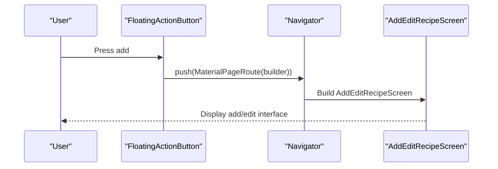

**Diagram sources**
- [main.dart:86-98](file://lib/main.dart#L86-L98)

**Section sources**
- [main.dart:86-98](file://lib/main.dart#L86-L98)

## Dependency Analysis
The presentation layer exhibits low coupling and high cohesion:
- Widgets depend on AppColors and AppTextStyles for styling, reducing duplication.
- Widgets depend on the Recipe model for data display.
- MainNavigationScreen depends on screen widgets but does not depend on internal screen logic, enabling separation of concerns.
- No circular dependencies were observed among the analyzed files.

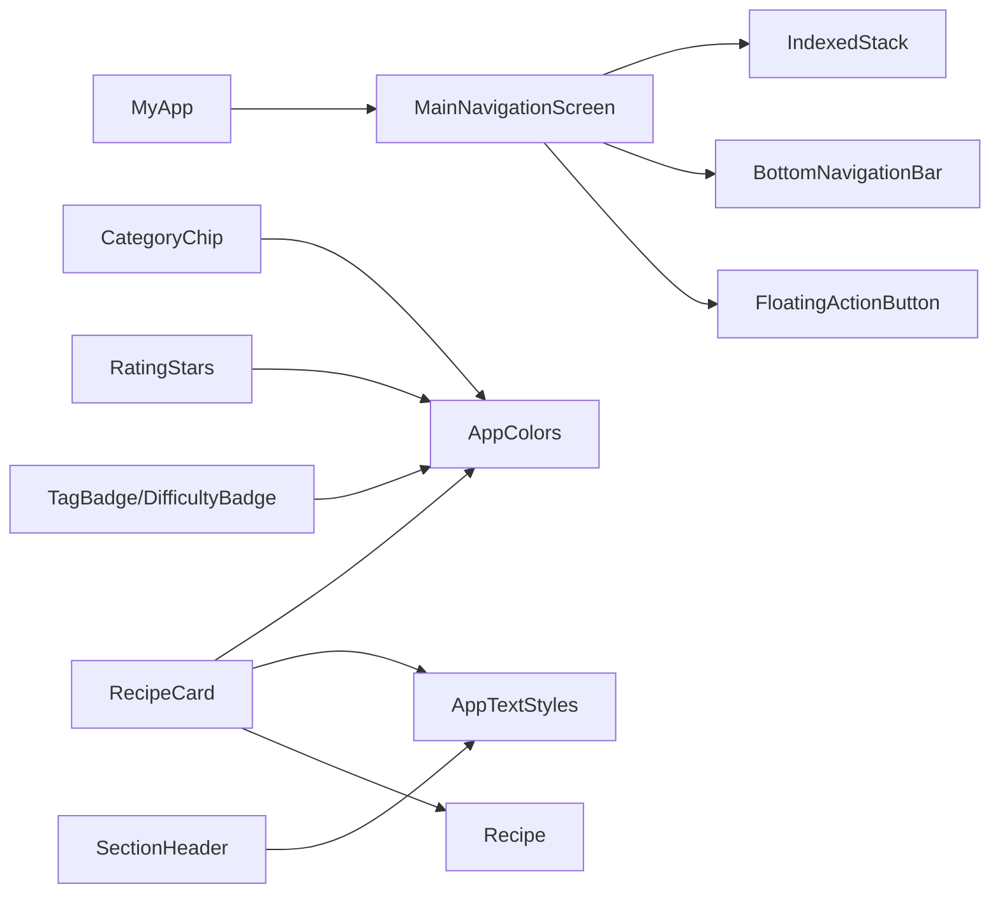

**Diagram sources**
- [main.dart:15-100](file://lib/main.dart#L15-L100)
- [constants.dart:4-124](file://lib/utils/constants.dart#L4-L124)
- [recipe_card.dart:6-247](file://lib/widgets/recipe_card.dart#L6-L247)
- [chip_filter.dart:4-39](file://lib/widgets/chip_filter.dart#L4-L39)
- [rating_stars.dart:4-42](file://lib/widgets/rating_stars.dart#L4-L42)
- [badge.dart:4-70](file://lib/widgets/badge.dart#L4-L70)
- [section_header.dart:4-26](file://lib/widgets/section_header.dart#L4-L26)
- [recipe.dart:1-82](file://lib/models/recipe.dart#L1-L82)

**Section sources**
- [main.dart:15-100](file://lib/main.dart#L15-L100)
- [constants.dart:4-124](file://lib/utils/constants.dart#L4-L124)
- [recipe_card.dart:6-247](file://lib/widgets/recipe_card.dart#L6-L247)
- [chip_filter.dart:4-39](file://lib/widgets/chip_filter.dart#L4-L39)
- [rating_stars.dart:4-42](file://lib/widgets/rating_stars.dart#L4-L42)
- [badge.dart:4-70](file://lib/widgets/badge.dart#L4-L70)
- [section_header.dart:4-26](file://lib/widgets/section_header.dart#L4-L26)
- [recipe.dart:1-82](file://lib/models/recipe.dart#L1-L82)

## Performance Considerations
- IndexedStack keeps inactive screens mounted, preserving state and avoiding expensive rebuilds when switching tabs.
- Anti-aliasing and clipping are used in cards to optimize rendering.
- Image loading includes error handling to prevent layout crashes and improve resilience.
- Using AppTextStyles ensures consistent font scaling and reduces repeated style definitions.

[No sources needed since this section provides general guidance]

## Troubleshooting Guide
Common issues and resolutions:
- Images not displaying: RecipeCard includes an errorBuilder to show a fallback when images fail to load.
- Navigation flicker: IndexedStack prevents rebuilds of inactive screens; ensure callbacks are passed correctly to avoid unnecessary rebuilds.
- Theme inconsistencies: Verify that all widgets use AppColors and AppTextStyles instead of hardcoded values.
- Bottom navigation not updating: Confirm that the onTap handler updates the state and that the UI rebuilds with the new index.

**Section sources**
- [recipe_card.dart:41-49](file://lib/widgets/recipe_card.dart#L41-L49)
- [main.dart:60-85](file://lib/main.dart#L60-L85)

## Conclusion
The presentation layer employs a clean, modular architecture centered on a dark-themed MainNavigationScreen with IndexedStack for efficient screen management. Reusable widgets encapsulate UI patterns and integrate tightly with a centralized color and typography system. State management is straightforward, leveraging StatefulWidget for navigation state and callbacks for user interactions. The design supports responsive behavior and provides a solid foundation for adding new screens and components while maintaining consistency and performance.