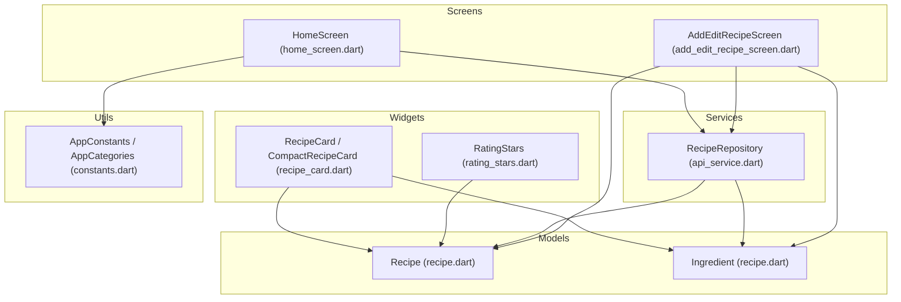
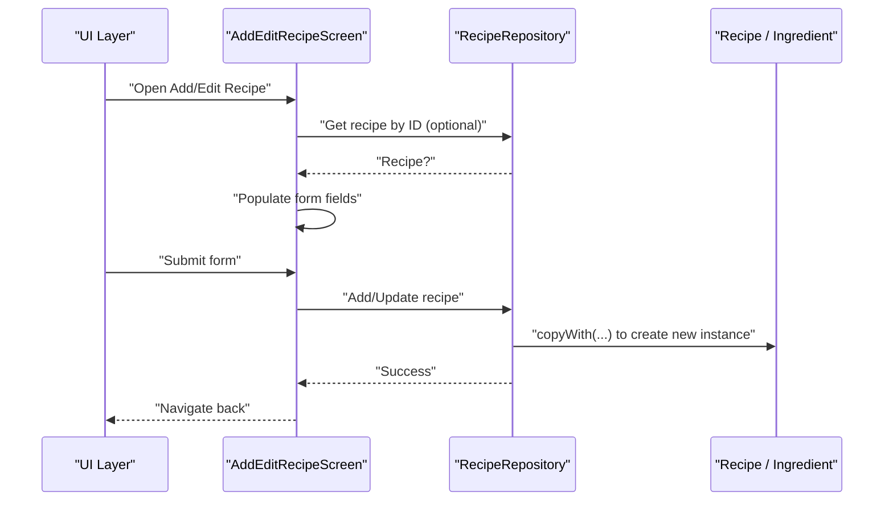
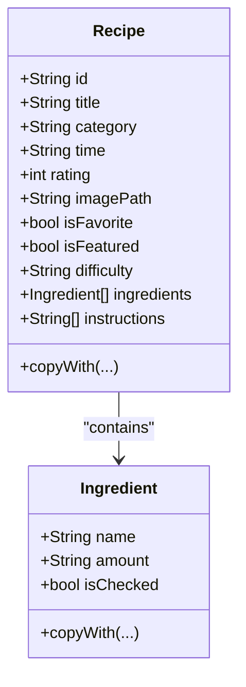
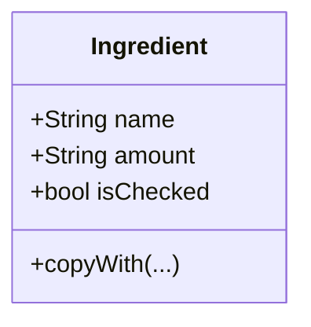
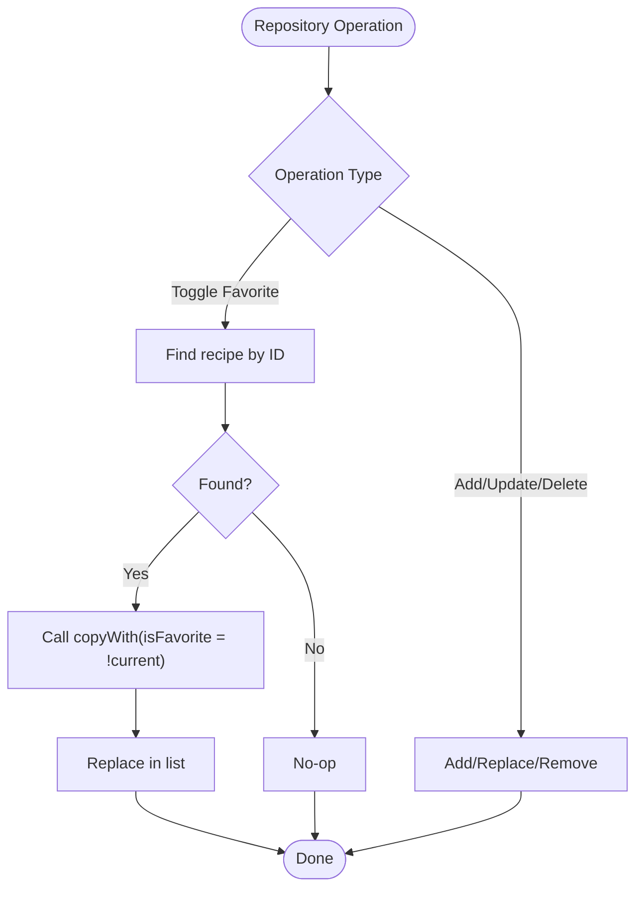
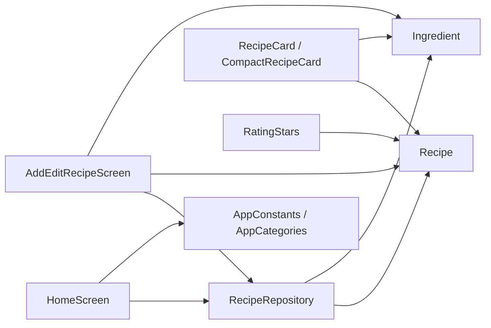

# Core Models

<cite>
**Referenced Files in This Document**
- [recipe.dart](file://lib/models/recipe.dart)
- [api_service.dart](file://lib/services/api_service.dart)
- [add_edit_recipe_screen.dart](file://lib/screens/add_edit_recipe_screen.dart)
- [home_screen.dart](file://lib/screens/home_screen.dart)
- [recipe_card.dart](file://lib/widgets/recipe_card.dart)
- [rating_stars.dart](file://lib/widgets/rating_stars.dart)
- [constants.dart](file://lib/utils/constants.dart)
</cite>

## Table of Contents
1. [Introduction](#introduction)
2. [Project Structure](#project-structure)
3. [Core Components](#core-components)
4. [Architecture Overview](#architecture-overview)
5. [Detailed Component Analysis](#detailed-component-analysis)
6. [Dependency Analysis](#dependency-analysis)
7. [Performance Considerations](#performance-considerations)
8. [Troubleshooting Guide](#troubleshooting-guide)
9. [Conclusion](#conclusion)

## Introduction
This document provides comprehensive data model documentation for the Cooking Book App’s core entities. It focuses on the Recipe and Ingredient models, detailing their properties, data types, validation rules, immutability implementation via copyWith methods, and their role within the repository pattern. It also explains serialization/deserialization processes, data validation strategies, field definitions, constraints, and business rules enforcement. Practical examples of model instantiation, property access, and modification patterns are included, along with an explanation of the immutable design philosophy and its benefits for state management and UI reactivity.

## Project Structure
The core models reside under the models directory and are consumed by screens and widgets across the application. The repository pattern is implemented via a RecipeRepository class that manages in-memory recipe data and exposes methods to query, update, and mutate recipes. Screens and widgets consume these models for rendering and user interactions.

**Diagram sources**
- [recipe.dart](file://lib/models/recipe.dart)
- [api_service.dart](file://lib/services/api_service.dart)
- [home_screen.dart](file://lib/screens/home_screen.dart)
- [add_edit_recipe_screen.dart](file://lib/screens/add_edit_recipe_screen.dart)
- [recipe_card.dart](file://lib/widgets/recipe_card.dart)
- [rating_stars.dart](file://lib/widgets/rating_stars.dart)
- [constants.dart](file://lib/utils/constants.dart)

**Section sources**
- [recipe.dart](file://lib/models/recipe.dart)
- [api_service.dart](file://lib/services/api_service.dart)
- [home_screen.dart](file://lib/screens/home_screen.dart)
- [add_edit_recipe_screen.dart](file://lib/screens/add_edit_recipe_screen.dart)
- [recipe_card.dart](file://lib/widgets/recipe_card.dart)
- [rating_stars.dart](file://lib/widgets/rating_stars.dart)
- [constants.dart](file://lib/utils/constants.dart)

## Core Components
This section documents the two primary data models used throughout the app: Recipe and Ingredient.

- Recipe
  - Purpose: Represents a complete recipe with metadata, ingredients, and instructions.
  - Properties:
    - id: String (final, required)
    - title: String (final, required)
    - category: String (final, required)
    - time: String (final, required)
    - rating: int (final, required)
    - imagePath: String (final, required)
    - isFavorite: bool (final, default false)
    - isFeatured: bool (final, default false)
    - difficulty: String? (final, nullable)
    - ingredients: List<Ingredient> (final, default empty list)
    - instructions: List<String> (final, default empty list)
  - Validation rules:
    - All required fields must be provided during construction.
    - rating is an integer; UI components currently support a numeric slider with a 0–5 range, indicating business rule alignment.
    - time is stored as a formatted string; UI parsing removes the trailing “m” for display.
    - difficulty is constrained to predefined values via AppCategories.difficulties.
  - Immutability and copyWith:
    - All properties are final, enforcing immutability at the Dart language level.
    - copyWith returns a new Recipe instance with selectively updated fields, preserving immutability while enabling controlled updates.
  - Business rules enforcement:
    - isFavorite toggled via repository mutation; repository uses copyWith to produce a new Recipe instance.
    - isFeatured identifies a single featured recipe; repository returns the first matching recipe.
    - Ingredients and instructions are lists; repository methods replace or update entries using copyWith.

- Ingredient
  - Purpose: Represents a single ingredient entry within a recipe.
  - Properties:
    - name: String (final, required)
    - amount: String (final, required)
    - isChecked: bool (final, default false)
  - Validation rules:
    - Both name and amount are required.
    - isChecked is a boolean flag used for UI checklist behavior.
  - Immutability and copyWith:
    - All properties are final.
    - copyWith returns a new Ingredient instance with selectively updated fields.

Examples of usage patterns:
- Model instantiation: Construct a Recipe with required fields and optional defaults.
- Property access: Access fields directly on Recipe and Ingredient instances.
- Modification patterns: Use copyWith to produce a new instance with updated fields; repository methods apply these changes to the managed collection.

Benefits of immutable design:
- Predictable state transitions and easier debugging.
- Simplified UI reactivity because widgets can rely on object identity changes to trigger rebuilds.
- Thread-safety and safer concurrent access patterns.

**Section sources**
- [recipe.dart](file://lib/models/recipe.dart)
- [api_service.dart](file://lib/services/api_service.dart)

## Architecture Overview
The app follows a repository pattern to encapsulate data access and mutations. The RecipeRepository manages an internal list of Recipe objects, exposing methods to query, toggle favorites, and update recipes. Screens and widgets depend on the repository for data and on models for structure and immutability.

**Diagram sources**
- [add_edit_recipe_screen.dart](file://lib/screens/add_edit_recipe_screen.dart)
- [api_service.dart](file://lib/services/api_service.dart)
- [recipe.dart](file://lib/models/recipe.dart)

## Detailed Component Analysis

### Recipe Model
The Recipe model defines the core recipe entity with strict immutability guarantees and a comprehensive copyWith method for controlled updates.

**Diagram sources**
- [recipe.dart](file://lib/models/recipe.dart)

Key characteristics:
- Final fields enforce immutability.
- copyWith enables selective updates while preserving immutability.
- Nested Ingredient list supports structured ingredient entries.
- Instructions list stores procedural steps.

Validation and constraints:
- Required fields enforced at construction time.
- Difficulty constrained to predefined values via AppCategories.difficulties.
- Rating is an integer; UI slider enforces a 0–5 range.

Serialization/deserialization:
- Current implementation uses in-memory storage; no explicit JSON serialization/deserialization is present in the repository.
- If external persistence is introduced, consider adding serialization helpers around Recipe and Ingredient to convert to/from JSON maps.

Business rule enforcement:
- Favorite toggling uses repository’s copyWith to produce a new Recipe instance.
- Featured recipe selection relies on isFeatured flag.

**Section sources**
- [recipe.dart](file://lib/models/recipe.dart)
- [api_service.dart](file://lib/services/api_service.dart)
- [constants.dart](file://lib/utils/constants.dart)

### Ingredient Model
Ingredient is a lightweight, immutable model representing a single ingredient entry within a recipe.

**Diagram sources**
- [recipe.dart](file://lib/models/recipe.dart)

Usage patterns:
- Ingredients are collected in lists within Recipe.
- UI components render ingredient rows and allow adding/removing entries.
- copyWith supports updating individual ingredient properties.

Constraints:
- name and amount are required.
- isChecked is optional with a default value.

**Section sources**
- [recipe.dart](file://lib/models/recipe.dart)
- [add_edit_recipe_screen.dart](file://lib/screens/add_edit_recipe_screen.dart)

### Repository Pattern and Data Management
The RecipeRepository encapsulates recipe data and operations, leveraging the immutable models to ensure predictable state transitions.

**Diagram sources**
- [api_service.dart](file://lib/services/api_service.dart)

Key behaviors:
- getAllRecipes returns an unmodifiable list to prevent external mutation.
- getRecipesByCategory filters by category.
- getFavoriteRecipes filters by isFavorite.
- getFeaturedRecipe returns the first recipe marked as isFeatured.
- searchRecipes performs case-insensitive substring matching on title.
- toggleFavorite uses copyWith to produce a new Recipe instance.
- addRecipe, updateRecipe, deleteRecipe manage the internal list.

**Section sources**
- [api_service.dart](file://lib/services/api_service.dart)

### UI Integration and Data Validation Strategies
Screens and widgets consume the models and repository to render and interact with data.

- HomeScreen:
  - Filters recipes by category and search query.
  - Displays featured recipe and popular recipes.
  - Toggles favorite via repository’s toggleFavorite and refreshes state.

- AddEditRecipeScreen:
  - Loads existing recipe data into form fields for editing.
  - Validates required fields (title, cook time).
  - Collects ingredients and instructions in local lists and saves via repository.

- Widgets:
  - RecipeCard and CompactRecipeCard display recipe metadata and handle favorite toggles.
  - RatingStars renders star icons based on rating.

Validation strategies:
- Form validators ensure required fields are not empty.
- Difficulty constrained to predefined values via AppCategories.difficulties.
- Rating slider enforces a 0–5 range.

**Section sources**
- [home_screen.dart](file://lib/screens/home_screen.dart)
- [add_edit_recipe_screen.dart](file://lib/screens/add_edit_recipe_screen.dart)
- [recipe_card.dart](file://lib/widgets/recipe_card.dart)
- [rating_stars.dart](file://lib/widgets/rating_stars.dart)
- [constants.dart](file://lib/utils/constants.dart)

## Dependency Analysis
The following diagram shows how screens, widgets, and the repository depend on the models.

**Diagram sources**
- [home_screen.dart](file://lib/screens/home_screen.dart)
- [add_edit_recipe_screen.dart](file://lib/screens/add_edit_recipe_screen.dart)
- [recipe_card.dart](file://lib/widgets/recipe_card.dart)
- [rating_stars.dart](file://lib/widgets/rating_stars.dart)
- [api_service.dart](file://lib/services/api_service.dart)
- [recipe.dart](file://lib/models/recipe.dart)
- [constants.dart](file://lib/utils/constants.dart)

**Section sources**
- [home_screen.dart](file://lib/screens/home_screen.dart)
- [add_edit_recipe_screen.dart](file://lib/screens/add_edit_recipe_screen.dart)
- [recipe_card.dart](file://lib/widgets/recipe_card.dart)
- [rating_stars.dart](file://lib/widgets/rating_stars.dart)
- [api_service.dart](file://lib/services/api_service.dart)
- [recipe.dart](file://lib/models/recipe.dart)
- [constants.dart](file://lib/utils/constants.dart)

## Performance Considerations
- Immutable models reduce accidental shared-state bugs and simplify change detection in UI frameworks.
- Using copyWith ensures minimal copying of data; only changed fields are replaced.
- Repository methods operate on in-memory lists; consider pagination or lazy loading for large datasets.
- Favor unmodifiable collections (as implemented) to prevent unintended mutations from outside the repository.

## Troubleshooting Guide
Common issues and resolutions:
- Missing required fields when constructing Recipe: Ensure all required parameters are provided during instantiation.
- Difficulty not matching predefined values: Use values from AppCategories.difficulties to avoid runtime errors.
- Favorite toggle not reflected: Verify repository’s toggleFavorite is invoked and the UI triggers a rebuild.
- Featured recipe not appearing: Confirm at least one recipe has isFeatured set to true.
- Image asset not loading: Verify imagePath correctness and asset availability.

**Section sources**
- [recipe.dart](file://lib/models/recipe.dart)
- [api_service.dart](file://lib/services/api_service.dart)
- [constants.dart](file://lib/utils/constants.dart)

## Conclusion
The Cooking Book App’s core models—Recipe and Ingredient—are designed with immutability and clarity in mind. The repository pattern centralizes data access and mutations, ensuring predictable state transitions and simplifying UI reactivity. The models’ copyWith methods enable controlled updates, while screens and widgets enforce validation and business rules. This architecture provides a solid foundation for extensibility, maintainability, and scalability.