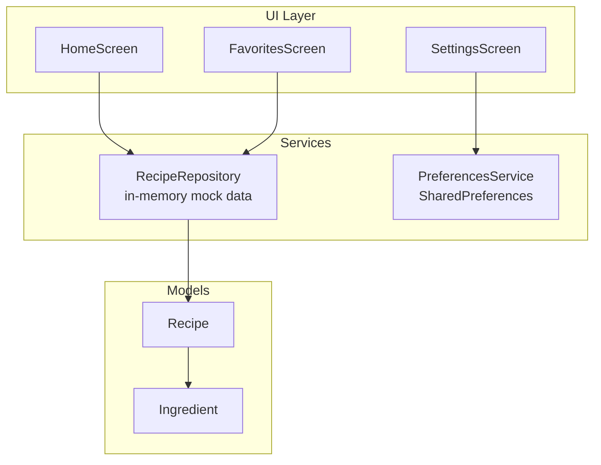
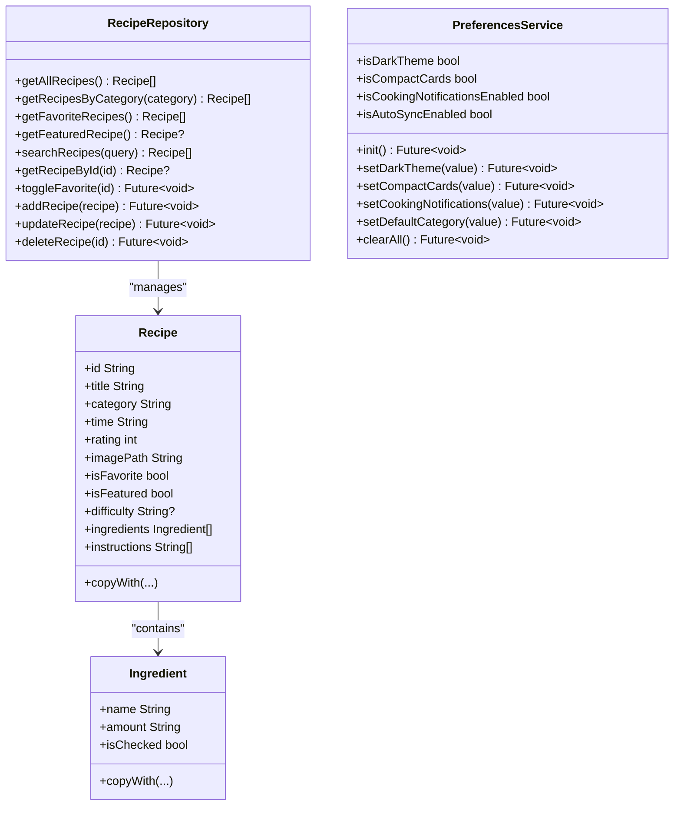
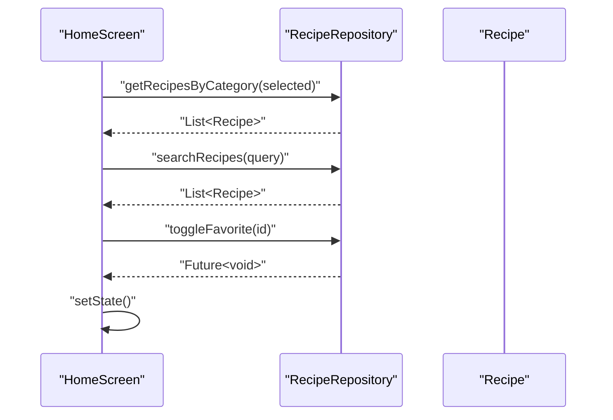
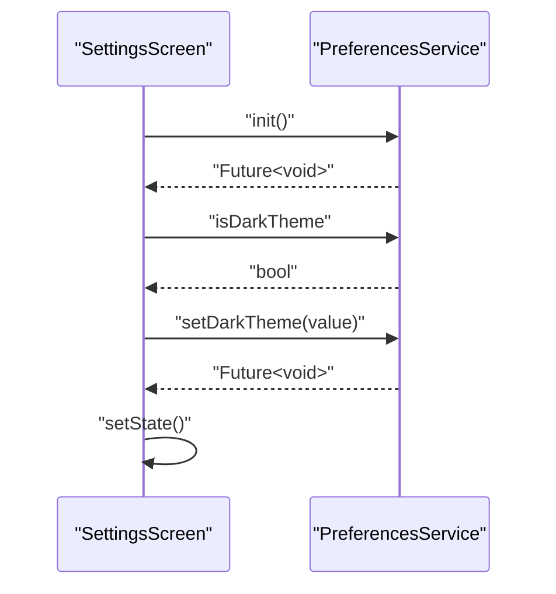
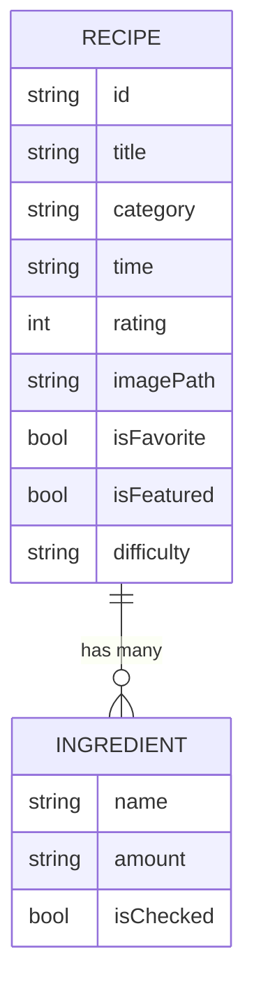
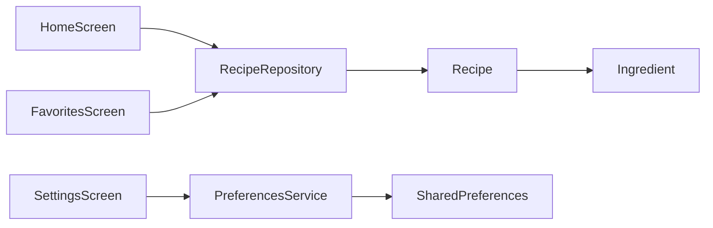

# Data Services

<cite>
**Referenced Files in This Document**
- [main.dart](file://lib/main.dart)
- [api_service.dart](file://lib/services/api_service.dart)
- [preferences_service.dart](file://lib/services/preferences_service.dart)
- [recipe.dart](file://lib/models/recipe.dart)
- [constants.dart](file://lib/utils/constants.dart)
- [home_screen.dart](file://lib/screens/home_screen.dart)
- [favorites_screen.dart](file://lib/screens/favorites_screen.dart)
- [setting_screen.dart](file://lib/screens/setting_screen.dart)
- [pubspec.yaml](file://pubspec.yaml)
</cite>

## Table of Contents
1. [Introduction](#introduction)
2. [Project Structure](#project-structure)
3. [Core Components](#core-components)
4. [Architecture Overview](#architecture-overview)
5. [Detailed Component Analysis](#detailed-component-analysis)
6. [Dependency Analysis](#dependency-analysis)
7. [Performance Considerations](#performance-considerations)
8. [Troubleshooting Guide](#troubleshooting-guide)
9. [Conclusion](#conclusion)
10. [Appendices](#appendices)

## Introduction
This document explains the data services layer of the Cooking Book App. It covers the API Service implementation (including mock data management and repository pattern), the Preferences Service for local storage integration, and how these services integrate with the UI layer. It also documents initialization patterns, error handling, performance considerations, offline capabilities, and practical usage examples.

## Project Structure
The data services layer is organized around two primary service modules:
- API Service: Provides a RecipeRepository singleton that manages an in-memory dataset of recipes, exposing CRUD and filtering operations.
- Preferences Service: Wraps shared_preferences to persist user settings such as theme, compact cards, notifications, auto-sync, and default category.

These services are consumed by UI screens to render lists, handle favorites, and apply user preferences.

**Diagram sources**
- [api_service.dart:1-178](file://lib/services/api_service.dart#L1-L178)
- [preferences_service.dart:1-73](file://lib/services/preferences_service.dart#L1-L73)
- [recipe.dart:1-82](file://lib/models/recipe.dart#L1-L82)
- [home_screen.dart:1-241](file://lib/screens/home_screen.dart#L1-L241)
- [favorites_screen.dart:1-114](file://lib/screens/favorites_screen.dart#L1-L114)
- [setting_screen.dart:1-298](file://lib/screens/setting_screen.dart#L1-L298)

**Section sources**
- [main.dart:1-100](file://lib/main.dart#L1-L100)
- [pubspec.yaml:30-40](file://pubspec.yaml#L30-L40)

## Core Components
- RecipeRepository: Singleton that holds a static list of Recipe objects and exposes methods to query, filter, and mutate recipes. It simulates a data source suitable for initial development and offline scenarios.
- PreferencesService: Singleton wrapper around SharedPreferences for persisting user preferences such as theme, compact cards, notifications, auto-sync, and default category.
- Models: Recipe and Ingredient define the data structures used across the app.

Key responsibilities:
- RecipeRepository: In-memory data management, filtering, toggling favorites, and mutating recipes.
- PreferencesService: Asynchronous preference persistence and retrieval with safe defaults.
- Models: Immutable data carriers with copyWith helpers for functional updates.

**Section sources**
- [api_service.dart:1-178](file://lib/services/api_service.dart#L1-L178)
- [preferences_service.dart:1-73](file://lib/services/preferences_service.dart#L1-L73)
- [recipe.dart:1-82](file://lib/models/recipe.dart#L1-L82)

## Architecture Overview
The data services layer follows a clean separation:
- UI screens depend on service abstractions (RecipeRepository and PreferencesService).
- RecipeRepository encapsulates data access and mutation logic.
- PreferencesService encapsulates persistent storage via SharedPreferences.
- Models remain stateless and immutable, enabling predictable updates.

**Diagram sources**
- [api_service.dart:1-178](file://lib/services/api_service.dart#L1-L178)
- [preferences_service.dart:1-73](file://lib/services/preferences_service.dart#L1-L73)
- [recipe.dart:1-82](file://lib/models/recipe.dart#L1-L82)

## Detailed Component Analysis

### RecipeRepository (API Service)
Responsibilities:
- Stores a static list of Recipe objects in memory.
- Provides filtering by category, favorites, featured, and free-text search.
- Supports CRUD-like operations (add, update, delete) and toggling favorites.
- Uses try/catch around lookups to gracefully return null when items are not found.

Data access patterns:
- Filtering: getRecipesByCategory, getFavoriteRecipes, searchRecipes.
- Retrieval: getFeaturedRecipe, getRecipeById.
- Mutation: toggleFavorite, addRecipe, updateRecipe, deleteRecipe.

Error handling:
- Methods that search for items catch exceptions and return null or empty collections, preventing crashes.

Offline capabilities:
- All operations are in-memory and do not require network connectivity.

Performance characteristics:
- Filtering and lookup are O(n) over the recipe list. For larger datasets, consider indexing or caching strategies.

Usage examples (paths):
- Home screen filters and favorites: [home_screen.dart:20-35](file://lib/screens/home_screen.dart#L20-L35)
- Favorites screen displays filtered favorites: [favorites_screen.dart:16-20](file://lib/screens/favorites_screen.dart#L16-L20)

**Diagram sources**
- [home_screen.dart:20-35](file://lib/screens/home_screen.dart#L20-L35)
- [api_service.dart:111-177](file://lib/services/api_service.dart#L111-L177)

**Section sources**
- [api_service.dart:1-178](file://lib/services/api_service.dart#L1-L178)
- [home_screen.dart:17-35](file://lib/screens/home_screen.dart#L17-L35)
- [favorites_screen.dart:16-20](file://lib/screens/favorites_screen.dart#L16-L20)

### PreferencesService (Local Storage)
Responsibilities:
- Initializes SharedPreferences once and exposes typed getters/setters for user preferences.
- Provides defaults for all keys to ensure robustness.
- Supports clearing all preferences.

Initialization pattern:
- init() asynchronously obtains a SharedPreferences instance and stores it internally for later use.

Usage examples (paths):
- Settings screen reads and writes preferences: [setting_screen.dart:14-35](file://lib/screens/setting_screen.dart#L14-L35), [setting_screen.dart:56-69](file://lib/screens/setting_screen.dart#L56-L69), [setting_screen.dart:97-110](file://lib/screens/setting_screen.dart#L97-L110)

**Diagram sources**
- [setting_screen.dart:14-35](file://lib/screens/setting_screen.dart#L14-L35)
- [setting_screen.dart:56-69](file://lib/screens/setting_screen.dart#L56-L69)
- [setting_screen.dart:97-110](file://lib/screens/setting_screen.dart#L97-L110)
- [preferences_service.dart:12-14](file://lib/services/preferences_service.dart#L12-L14)

**Section sources**
- [preferences_service.dart:1-73](file://lib/services/preferences_service.dart#L1-L73)
- [setting_screen.dart:14-35](file://lib/screens/setting_screen.dart#L14-L35)

### Models: Recipe and Ingredient
Responsibilities:
- Define immutable recipe and ingredient structures.
- Provide copyWith methods to produce updated instances without mutating originals.

Data structures:
- Recipe: identifiers, metadata, flags, and nested collections.
- Ingredient: name, amount, and checked state.

Usage examples (paths):
- RecipeRepository mutates recipes via copyWith: [api_service.dart:154-156](file://lib/services/api_service.dart#L154-L156)
- UI renders recipe details and ingredients: [home_screen.dart:151-221](file://lib/screens/home_screen.dart#L151-L221)

**Diagram sources**
- [recipe.dart:1-82](file://lib/models/recipe.dart#L1-L82)

**Section sources**
- [recipe.dart:1-82](file://lib/models/recipe.dart#L1-L82)
- [api_service.dart:154-156](file://lib/services/api_service.dart#L154-L156)

## Dependency Analysis
External dependencies:
- shared_preferences: Used by PreferencesService for persistent settings.

Internal dependencies:
- Screens depend on services for data and preferences.
- Services depend on models for data representation.

**Diagram sources**
- [home_screen.dart:1-241](file://lib/screens/home_screen.dart#L1-L241)
- [favorites_screen.dart:1-114](file://lib/screens/favorites_screen.dart#L1-L114)
- [setting_screen.dart:1-298](file://lib/screens/setting_screen.dart#L1-L298)
- [api_service.dart:1-178](file://lib/services/api_service.dart#L1-L178)
- [preferences_service.dart:1-73](file://lib/services/preferences_service.dart#L1-L73)
- [recipe.dart:1-82](file://lib/models/recipe.dart#L1-L82)

**Section sources**
- [pubspec.yaml:37](file://pubspec.yaml#L37)
- [preferences_service.dart:1-73](file://lib/services/preferences_service.dart#L1-L73)
- [api_service.dart:1-178](file://lib/services/api_service.dart#L1-L178)

## Performance Considerations
- In-memory filtering: Current implementation performs linear scans over the recipe list. For larger datasets, consider:
  - Indexing by category and difficulty.
  - Caching filtered views.
  - Debouncing search queries.
- UI updates: Frequent setState calls after mutations can cause rebuilds; batch updates where appropriate.
- Persistence: SharedPreferences operations are fast but asynchronous; avoid blocking UI threads.

[No sources needed since this section provides general guidance]

## Troubleshooting Guide
Common issues and resolutions:
- Null results from lookups: Methods like getFeaturedRecipe and getRecipeById return null when not found; always guard UI rendering against null.
- Preference initialization: Ensure PreferencesService.init is awaited before reading/writing preferences.
- State not updating: After calling toggleFavorite or other repository methods, trigger setState in the UI to refresh the view.

**Section sources**
- [api_service.dart:124-131](file://lib/services/api_service.dart#L124-L131)
- [api_service.dart:141-148](file://lib/services/api_service.dart#L141-L148)
- [preferences_service.dart:12-14](file://lib/services/preferences_service.dart#L12-L14)
- [home_screen.dart:146-149](file://lib/screens/home_screen.dart#L146-L149)

## Conclusion
The Cooking Book App’s data services layer uses a straightforward repository pattern with in-memory mock data and a lightweight preferences service backed by shared_preferences. This design enables rapid iteration, strong offline support, and clear separation of concerns. As the app evolves, consider introducing caching, pagination, and a real backend integration while preserving the current service interfaces.

[No sources needed since this section summarizes without analyzing specific files]

## Appendices

### Service Initialization and Dependency Patterns
- Services are singletons instantiated directly in screens for simplicity during development.
- For production, consider injecting services via a dependency injection container to enable testing and swapping implementations.

**Section sources**
- [home_screen.dart:20](file://lib/screens/home_screen.dart#L20)
- [favorites_screen.dart:16](file://lib/screens/favorites_screen.dart#L16)
- [setting_screen.dart:14](file://lib/screens/setting_screen.dart#L14)

### Data Retrieval Patterns
- Filtering: Combine category selection and search queries in the UI to narrow results.
- Favorites: Use getFavoriteRecipes to display saved items.
- Featured: Use getFeaturedRecipe to highlight a curated item.

**Section sources**
- [home_screen.dart:22-30](file://lib/screens/home_screen.dart#L22-L30)
- [favorites_screen.dart:18-20](file://lib/screens/favorites_screen.dart#L18-L20)
- [api_service.dart:114-131](file://lib/services/api_service.dart#L114-L131)

### Offline Capabilities
- All data operations are local; no network dependency.
- Favorites and preferences persist across sessions.

**Section sources**
- [api_service.dart:11-177](file://lib/services/api_service.dart#L11-L177)
- [preferences_service.dart:12-71](file://lib/services/preferences_service.dart#L12-L71)