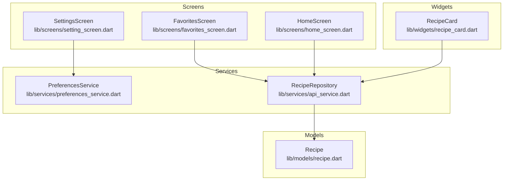
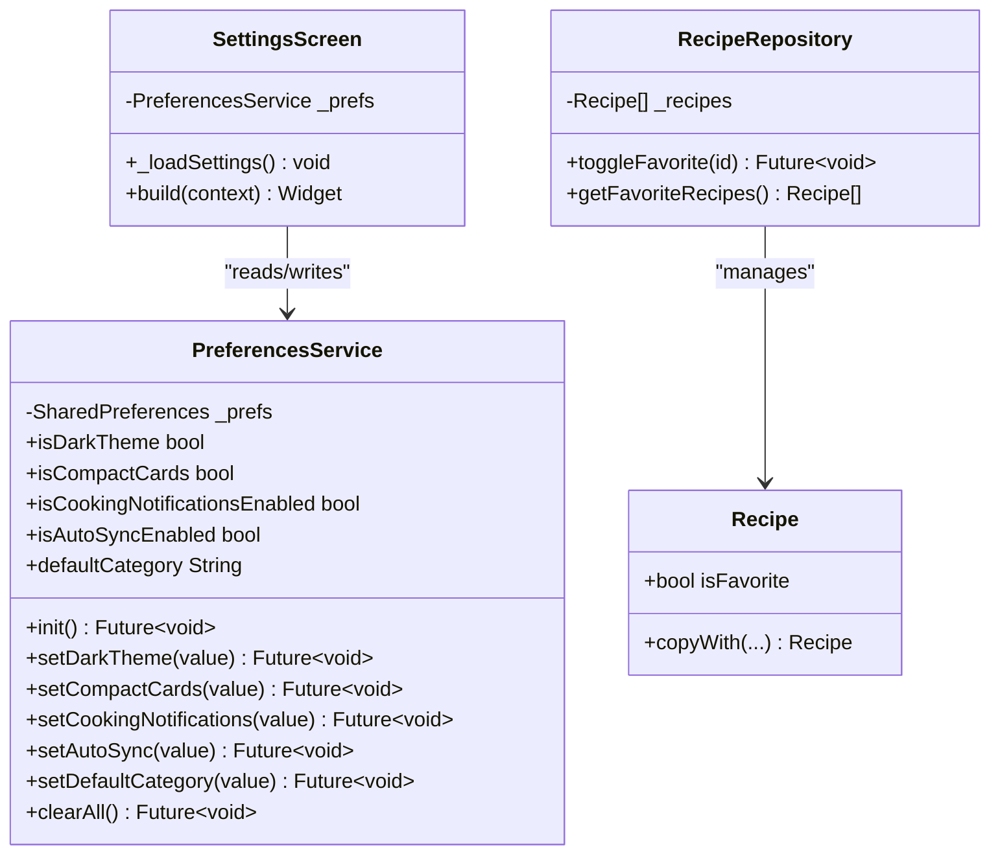
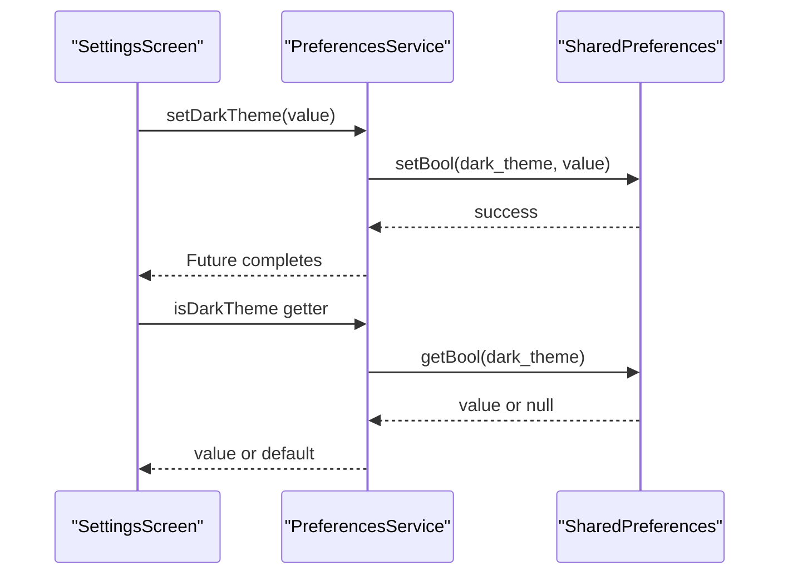
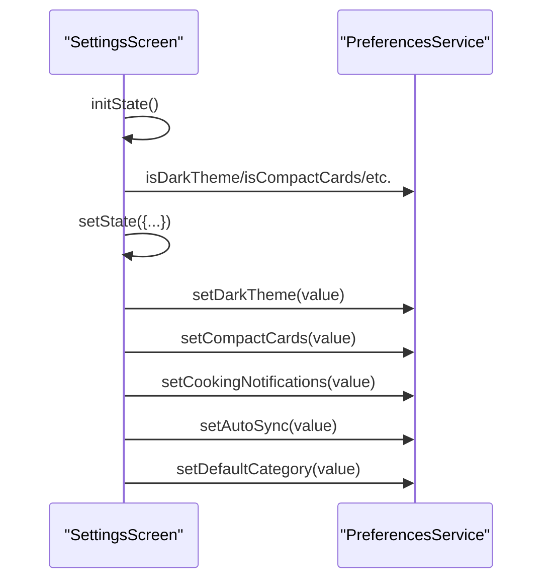
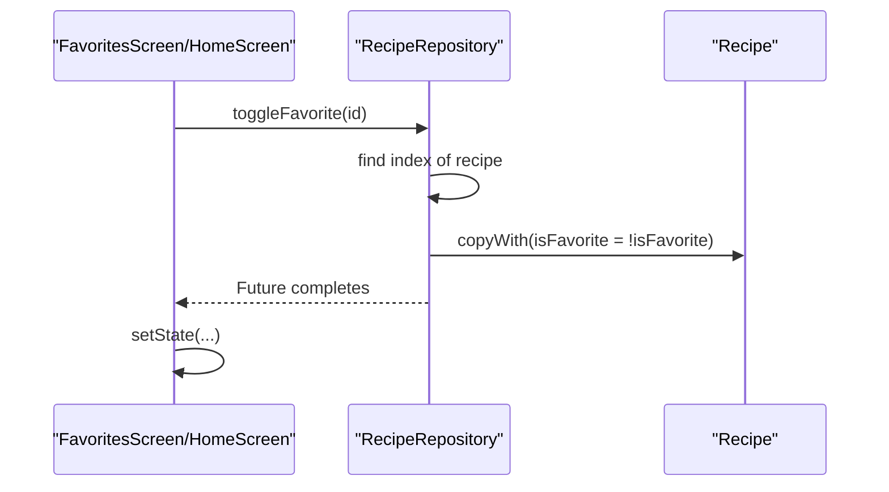
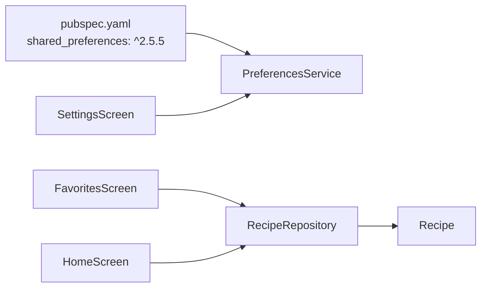

# Preferences Service

<cite>
**Referenced Files in This Document**
- [preferences_service.dart](file://lib/services/preferences_service.dart)
- [api_service.dart](file://lib/services/api_service.dart)
- [setting_screen.dart](file://lib/screens/setting_screen.dart)
- [favorites_screen.dart](file://lib/screens/favorites_screen.dart)
- [home_screen.dart](file://lib/screens/home_screen.dart)
- [recipe_card.dart](file://lib/widgets/recipe_card.dart)
- [recipe.dart](file://lib/models/recipe.dart)
- [constants.dart](file://lib/utils/constants.dart)
- [pubspec.yaml](file://pubspec.yaml)
</cite>

## Table of Contents
1. [Introduction](#introduction)
2. [Project Structure](#project-structure)
3. [Core Components](#core-components)
4. [Architecture Overview](#architecture-overview)
5. [Detailed Component Analysis](#detailed-component-analysis)
6. [Dependency Analysis](#dependency-analysis)
7. [Performance Considerations](#performance-considerations)
8. [Troubleshooting Guide](#troubleshooting-guide)
9. [Conclusion](#conclusion)

## Introduction
This document describes the Preferences Service implementation using shared_preferences. It explains initialization, preference key management, data persistence patterns, and integration with the RecipeRepository for favorite status persistence. It also covers preference operations, error handling, best practices for key naming, migration strategies, backup and restore mechanisms, and performance optimization for frequent reads/writes.

## Project Structure
The Preferences Service resides in the services layer and integrates with screens and widgets across the application. The repository pattern is implemented in the services layer for recipe data, while preferences are managed via a dedicated service.

**Diagram sources**
- [preferences_service.dart:1-73](file://lib/services/preferences_service.dart#L1-L73)
- [api_service.dart:1-177](file://lib/services/api_service.dart#L1-L177)
- [setting_screen.dart:1-298](file://lib/screens/setting_screen.dart#L1-L298)
- [favorites_screen.dart:1-114](file://lib/screens/favorites_screen.dart#L1-L114)
- [home_screen.dart:1-241](file://lib/screens/home_screen.dart#L1-L241)
- [recipe_card.dart:1-247](file://lib/widgets/recipe_card.dart#L1-L247)
- [recipe.dart:1-82](file://lib/models/recipe.dart#L1-L82)

**Section sources**
- [pubspec.yaml:37-37](file://pubspec.yaml#L37-L37)

## Core Components
- PreferencesService: Singleton wrapper around SharedPreferences providing typed getters/setters for theme, notification, and default category preferences. It exposes initialization and clearing capabilities.
- SettingsScreen: UI layer that loads current preferences into local state and updates them via PreferencesService.
- RecipeRepository: In-memory repository for recipes with toggleFavorite supporting favorite status persistence via the repository model.
- RecipeCard: UI component that renders favorite state based on the Recipe model; does not directly access preferences.

Key preference keys and defaults:
- Theme: dark_theme (bool, default true), compact_cards (bool, default false)
- Notifications: cooking_notifications (bool, default true), auto_sync (bool, default false)
- Defaults: default_category (string, default "Lunch")

**Section sources**
- [preferences_service.dart:1-73](file://lib/services/preferences_service.dart#L1-L73)
- [setting_screen.dart:14-35](file://lib/screens/setting_screen.dart#L14-L35)
- [api_service.dart:149-157](file://lib/services/api_service.dart#L149-L157)
- [recipe_card.dart:55-70](file://lib/widgets/recipe_card.dart#L55-L70)

## Architecture Overview
The Preferences Service follows a layered architecture:
- Presentation Layer: Screens and widgets consume preferences and trigger updates.
- Domain Layer: RecipeRepository manages recipe data and state transitions.
- Infrastructure Layer: PreferencesService encapsulates SharedPreferences.

**Diagram sources**
- [preferences_service.dart:1-73](file://lib/services/preferences_service.dart#L1-L73)
- [setting_screen.dart:14-35](file://lib/screens/setting_screen.dart#L14-L35)
- [api_service.dart:149-157](file://lib/services/api_service.dart#L149-L157)
- [recipe.dart:29-55](file://lib/models/recipe.dart#L29-L55)

## Detailed Component Analysis

### PreferencesService
Responsibilities:
- Initialize SharedPreferences instance.
- Provide strongly-typed getters and setters for supported preferences.
- Offer a method to clear all preferences.

Initialization pattern:
- init() asynchronously obtains a SharedPreferences instance and stores it internally for subsequent operations.

Preference key management:
- Private static constants define all preference keys.
- Getters fall back to sensible defaults if the key is missing.

Persistence patterns:
- Writes are asynchronous and occur immediately upon user action in the UI layer.

**Diagram sources**
- [preferences_service.dart:12-14](file://lib/services/preferences_service.dart#L12-L14)
- [preferences_service.dart:28-33](file://lib/services/preferences_service.dart#L28-L33)
- [preferences_service.dart:28-28](file://lib/services/preferences_service.dart#L28-L28)

**Section sources**
- [preferences_service.dart:11-14](file://lib/services/preferences_service.dart#L11-L14)
- [preferences_service.dart:17-25](file://lib/services/preferences_service.dart#L17-L25)
- [preferences_service.dart:28-66](file://lib/services/preferences_service.dart#L28-L66)
- [preferences_service.dart:69-71](file://lib/services/preferences_service.dart#L69-L71)

### SettingsScreen Integration
- On initialization, loads current preferences into local state.
- Updates preferences immediately when toggles change.
- Displays default category from preferences.

**Diagram sources**
- [setting_screen.dart:23-35](file://lib/screens/setting_screen.dart#L23-L35)
- [setting_screen.dart:56-69](file://lib/screens/setting_screen.dart#L56-L69)
- [setting_screen.dart:97-110](file://lib/screens/setting_screen.dart#L97-L110)
- [setting_screen.dart:60-60](file://lib/screens/setting_screen.dart#L60-L60)
- [setting_screen.dart:108-108](file://lib/screens/setting_screen.dart#L108-L108)

**Section sources**
- [setting_screen.dart:14-35](file://lib/screens/setting_screen.dart#L14-L35)
- [setting_screen.dart:56-69](file://lib/screens/setting_screen.dart#L56-L69)
- [setting_screen.dart:97-110](file://lib/screens/setting_screen.dart#L97-L110)

### Favorite Status Persistence via RecipeRepository
Favorite status is modeled in the Recipe entity and toggled via RecipeRepository. The UI triggers toggleFavorite, which updates the in-memory list. There is no direct integration with PreferencesService for favorites in the current implementation.

**Diagram sources**
- [favorites_screen.dart:82-85](file://lib/screens/favorites_screen.dart#L82-L85)
- [home_screen.dart:146-149](file://lib/screens/home_screen.dart#L146-L149)
- [api_service.dart:149-157](file://lib/services/api_service.dart#L149-L157)
- [recipe.dart:29-55](file://lib/models/recipe.dart#L29-L55)

**Section sources**
- [api_service.dart:149-157](file://lib/services/api_service.dart#L149-L157)
- [favorites_screen.dart:82-85](file://lib/screens/favorites_screen.dart#L82-L85)
- [home_screen.dart:146-149](file://lib/screens/home_screen.dart#L146-L149)
- [recipe_card.dart:61-67](file://lib/widgets/recipe_card.dart#L61-L67)

### Preference Operations Examples
- Initialize preferences: Call init() during app startup before accessing preferences.
- Read theme preference: Access isDarkTheme to determine UI theme.
- Write theme preference: Call setDarkTheme(newValue) to persist.
- Read default category: Access defaultCategory to configure UI defaults.
- Write default category: Call setDefaultCategory(newValue) to persist.
- Clear all preferences: Call clearAll() to reset to defaults.

Note: The current implementation does not persist favorite status to preferences; it persists in memory via RecipeRepository.

**Section sources**
- [preferences_service.dart:12-14](file://lib/services/preferences_service.dart#L12-L14)
- [preferences_service.dart:28-33](file://lib/services/preferences_service.dart#L28-L33)
- [preferences_service.dart:61-66](file://lib/services/preferences_service.dart#L61-L66)
- [preferences_service.dart:69-71](file://lib/services/preferences_service.dart#L69-L71)

### Error Handling for Storage Failures
- SharedPreferences operations are asynchronous and may fail silently. The service does not wrap writes in try/catch blocks.
- Getters fall back to defaults when keys are missing, preventing crashes but not surfacing write errors.
- Recommendations:
  - Wrap write operations in try/catch and surface user-visible errors.
  - Log failures for diagnostics.
  - Consider batching writes to reduce failure frequency.

**Section sources**
- [preferences_service.dart:28-66](file://lib/services/preferences_service.dart#L28-L66)

### Best Practices for Key Naming Conventions
- Use descriptive, hierarchical keys (e.g., "dark_theme", "compact_cards").
- Keep defaults explicit and documented.
- Avoid mixing unrelated preferences under the same key.
- Maintain backward compatibility when renaming keys.

**Section sources**
- [preferences_service.dart:17-25](file://lib/services/preferences_service.dart#L17-L25)

### Data Migration Strategies
- Versioned keys: Introduce new keys for migrated values and keep old keys readable for backward compatibility.
- One-time migration: Detect first-run or version changes and migrate data once.
- Fallback defaults: Ensure new keys have sensible defaults to avoid runtime errors.

[No sources needed since this section provides general guidance]

### Backup and Restore Mechanisms
- Export/Import: Expose APIs to serialize current preferences and store to disk or cloud.
- Restore: Provide a mechanism to load previously exported preference sets.
- Data protection: Consider encryption for sensitive preferences.

[No sources needed since this section provides general guidance]

### Performance Optimization for Frequent Reads/Writes
- Minimize writes: Batch UI changes and write once per user action.
- Debounce rapid toggles: Coalesce frequent updates to reduce IO overhead.
- Read caching: Store frequently accessed preferences in memory if acceptable.
- Avoid blocking UI: Perform writes on background threads if needed.

[No sources needed since this section provides general guidance]

## Dependency Analysis
External dependency:
- shared_preferences: Provides persistent key-value storage abstraction.

Internal dependencies:
- PreferencesService depends on SharedPreferences.
- SettingsScreen depends on PreferencesService.
- RecipeRepository depends on Recipe model.

**Diagram sources**
- [pubspec.yaml:37-37](file://pubspec.yaml#L37-L37)
- [preferences_service.dart:1-1](file://lib/services/preferences_service.dart#L1-L1)
- [setting_screen.dart:2-2](file://lib/screens/setting_screen.dart#L2-L2)
- [api_service.dart:1-1](file://lib/services/api_service.dart#L1-L1)

**Section sources**
- [pubspec.yaml:37-37](file://pubspec.yaml#L37-L37)
- [preferences_service.dart:1-1](file://lib/services/preferences_service.dart#L1-L1)
- [setting_screen.dart:2-2](file://lib/screens/setting_screen.dart#L2-L2)
- [api_service.dart:1-1](file://lib/services/api_service.dart#L1-L1)

## Performance Considerations
- Asynchronous writes: All preference writes are asynchronous; batch multiple writes per user action.
- Defaults: Getters return defaults when keys are absent, avoiding unnecessary IO.
- UI responsiveness: Avoid long-running preference operations on the UI thread.

[No sources needed since this section provides general guidance]

## Troubleshooting Guide
Common issues and resolutions:
- Preferences not persisting:
  - Ensure init() is called before any read/write operations.
  - Verify keys exist and are spelled correctly.
- Defaults not applied:
  - Confirm getter fallbacks and default values.
- Write failures:
  - Wrap writes in try/catch and log exceptions.
  - Retry on transient failures.

**Section sources**
- [preferences_service.dart:12-14](file://lib/services/preferences_service.dart#L12-L14)
- [preferences_service.dart:28-66](file://lib/services/preferences_service.dart#L28-L66)

## Conclusion
The Preferences Service provides a clean, typed interface to SharedPreferences with sensible defaults and straightforward initialization. While it currently focuses on UI and notification preferences, the architecture supports extension for additional preferences and backup/restore features. For favorite status persistence, the current implementation relies on in-memory state within RecipeRepository, separate from preferences. Extending the service to support favorites would require careful consideration of data locality, performance, and user expectations.