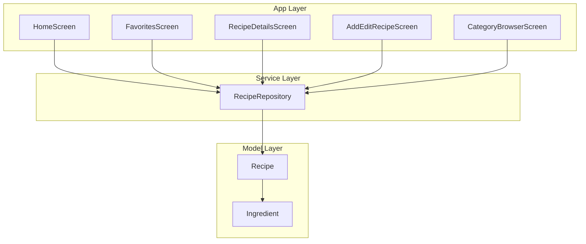
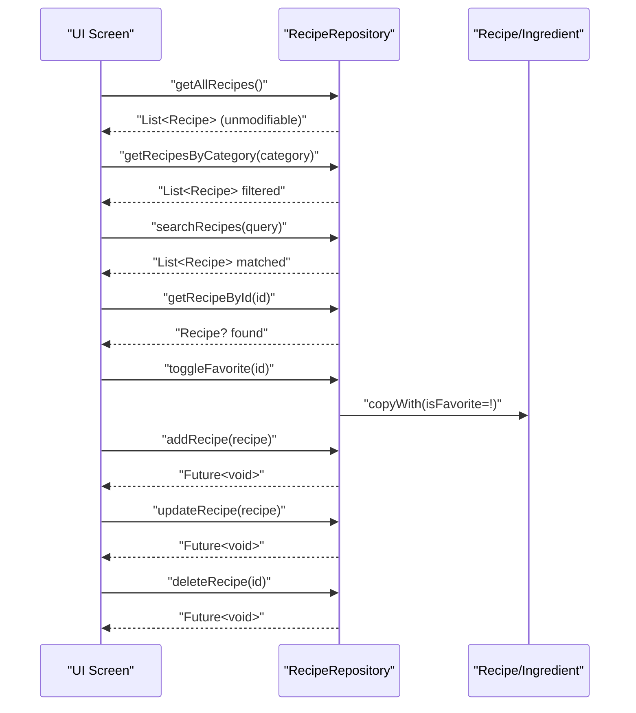
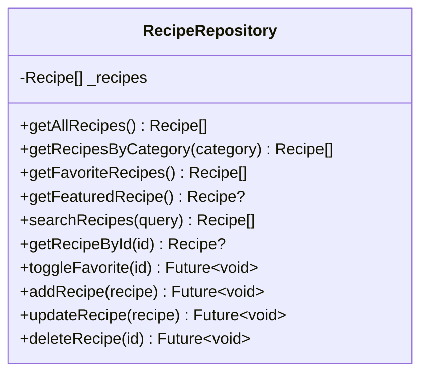
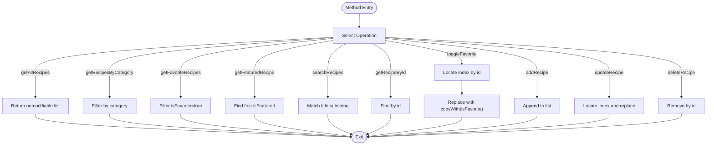
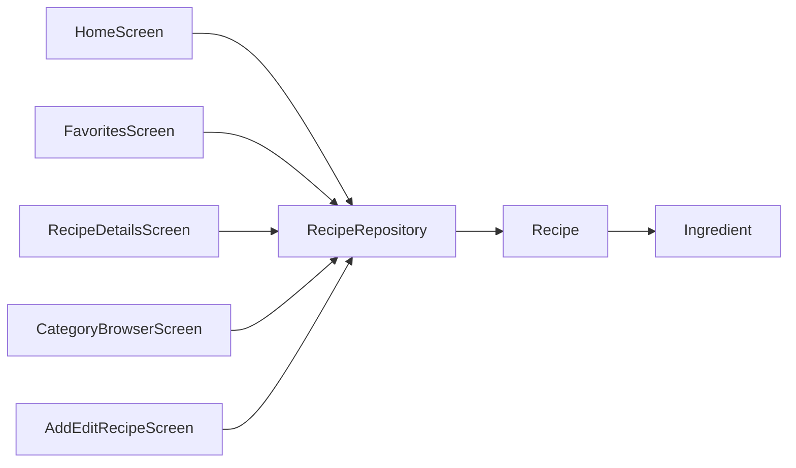

# Recipe Repository

<cite>
**Referenced Files in This Document**
- [api_service.dart](file://lib/services/api_service.dart)
- [recipe.dart](file://lib/models/recipe.dart)
- [main.dart](file://lib/main.dart)
- [home_screen.dart](file://lib/screens/home_screen.dart)
- [favorites_screen.dart](file://lib/screens/favorites_screen.dart)
- [add_edit_recipe_screen.dart](file://lib/screens/add_edit_recipe_screen.dart)
- [recipe_details_screen.dart](file://lib/screens/recipe_details_screen.dart)
- [category_browser_screen.dart](file://lib/screens/category_browser_screen.dart)
- [recipe_card.dart](file://lib/widgets/recipe_card.dart)
- [constants.dart](file://lib/utils/constants.dart)
</cite>

## Table of Contents
1. [Introduction](#introduction)
2. [Project Structure](#project-structure)
3. [Core Components](#core-components)
4. [Architecture Overview](#architecture-overview)
5. [Detailed Component Analysis](#detailed-component-analysis)
6. [Dependency Analysis](#dependency-analysis)
7. [Performance Considerations](#performance-considerations)
8. [Troubleshooting Guide](#troubleshooting-guide)
9. [Conclusion](#conclusion)

## Introduction
This document provides comprehensive documentation for the RecipeRepository service implementation used in the cookbook application. It explains the singleton pattern, internal data storage, and all public methods for recipe management. It also covers immutable updates via copyWith(), error handling patterns, initialization examples, usage patterns across the UI, and strategies for performance and state management.

## Project Structure
The application follows a layered structure:
- Services: Central business logic and data access (RecipeRepository)
- Models: Data structures (Recipe, Ingredient)
- Screens: UI pages consuming the service
- Widgets: Reusable UI components
- Utils: Constants and shared resources

**Diagram sources**
- [api_service.dart:4-177](file://lib/services/api_service.dart#L4-L177)
- [recipe.dart:1-82](file://lib/models/recipe.dart#L1-L82)
- [home_screen.dart:10-241](file://lib/screens/home_screen.dart#L10-L241)
- [favorites_screen.dart:7-114](file://lib/screens/favorites_screen.dart#L7-L114)
- [recipe_details_screen.dart:7-285](file://lib/screens/recipe_details_screen.dart#L7-L285)
- [add_edit_recipe_screen.dart:6-363](file://lib/screens/add_edit_recipe_screen.dart#L6-L363)
- [category_browser_screen.dart:7-262](file://lib/screens/category_browser_screen.dart#L7-L262)

**Section sources**
- [main.dart:1-100](file://lib/main.dart#L1-L100)
- [constants.dart:101-124](file://lib/utils/constants.dart#L101-L124)

## Core Components
- RecipeRepository: Singleton service managing an in-memory list of Recipe objects. Provides filtering, searching, favorites toggling, and CRUD operations.
- Recipe and Ingredient: Immutable data models with copyWith() support for safe updates.

Key characteristics:
- Singleton pattern ensures a single shared instance across the app.
- Internal storage is a mutable list; returned collections are unmodifiable to prevent external mutation.
- Copy-based updates maintain immutability guarantees for callers.

**Section sources**
- [api_service.dart:4-177](file://lib/services/api_service.dart#L4-L177)
- [recipe.dart:1-82](file://lib/models/recipe.dart#L1-L82)

## Architecture Overview
The service sits between UI screens and the data model. Screens instantiate the singleton and call methods to fetch, filter, and mutate recipes. The UI reacts to state changes triggered by asynchronous operations.

**Diagram sources**
- [api_service.dart:109-177](file://lib/services/api_service.dart#L109-L177)
- [recipe.dart:29-55](file://lib/models/recipe.dart#L29-L55)

## Detailed Component Analysis

### Singleton Pattern Implementation
- Private constructor and factory returning a single shared instance
- Ensures consistent state and avoids duplication of data across screens

**Diagram sources**
- [api_service.dart:4-177](file://lib/services/api_service.dart#L4-L177)

**Section sources**
- [api_service.dart:5-7](file://lib/services/api_service.dart#L5-L7)

### Data Storage Mechanisms
- Internal list stores Recipe instances
- getAllRecipes() returns an unmodifiable view to prevent external mutations
- Filtering and searching operate on the internal list; results are materialized as new lists

**Section sources**
- [api_service.dart:10-110](file://lib/services/api_service.dart#L10-L110)

### CRUD Operations

- getAllRecipes()
  - Returns an unmodifiable list of all recipes
  - Complexity: O(n) to return the collection; filtering/searching are O(n) per query

- getRecipesByCategory(category)
  - Filters by category; special-case for "All" returns all recipes
  - Complexity: O(n)

- getFavoriteRecipes()
  - Returns recipes where isFavorite is true
  - Complexity: O(n)

- getFeaturedRecipe()
  - Returns the first recipe marked as isFeatured
  - Complexity: O(n); returns null if none found

- searchRecipes(query)
  - Case-insensitive substring match on title
  - Complexity: O(n)

- getRecipeById(id)
  - Finds recipe by id
  - Complexity: O(n); returns null if not found

- toggleFavorite(id)
  - Locates recipe by id and replaces it with a copy that flips isFavorite
  - Complexity: O(n) for lookup plus O(1) copy; mutates internal list

- addRecipe(recipe)
  - Adds a new recipe to the internal list
  - Complexity: O(1) amortized

- updateRecipe(recipe)
  - Replaces existing recipe by id with the provided recipe
  - Complexity: O(n) for lookup, O(1) replacement

- deleteRecipe(id)
  - Removes recipe by id
  - Complexity: O(n)

**Diagram sources**
- [api_service.dart:109-177](file://lib/services/api_service.dart#L109-L177)

**Section sources**
- [api_service.dart:109-177](file://lib/services/api_service.dart#L109-L177)

### Immutable Recipe Handling Using copyWith()
- Both Recipe and Ingredient define copyWith() to produce new instances with updated fields
- toggleFavorite() uses copyWith() to flip isFavorite without mutating the original
- updateRecipe() replaces the existing recipe with the provided one (caller responsibility to use copyWith if needed)

Benefits:
- Predictable state transitions
- Thread-safety and immutability for consumers
- Clear ownership of mutations

**Section sources**
- [recipe.dart:29-55](file://lib/models/recipe.dart#L29-L55)
- [recipe.dart:70-81](file://lib/models/recipe.dart#L70-L81)
- [api_service.dart:150-157](file://lib/services/api_service.dart#L150-L157)
- [api_service.dart:165-170](file://lib/services/api_service.dart#L165-L170)

### Error Handling Patterns
- Methods that search by id or feature flag wrap lookups in try/catch and return null when not found
- UI screens handle null gracefully (e.g., showing a "not found" message)
- Asynchronous methods return Future<void>; callers should await to observe completion

Recommendations:
- Validate inputs before calling repository methods
- Use try/catch around UI-triggered async operations if needed
- Consider throwing domain-specific exceptions for centralized handling

**Section sources**
- [api_service.dart:124-130](file://lib/services/api_service.dart#L124-L130)
- [api_service.dart:141-147](file://lib/services/api_service.dart#L141-L147)
- [recipe_details_screen.dart:35-42](file://lib/screens/recipe_details_screen.dart#L35-L42)

### Service Initialization and Usage Examples
- Initialize the singleton in any screen or widget:
  - Example instantiation: [home_screen.dart:20](file://lib/screens/home_screen.dart#L20)
  - Example instantiation: [favorites_screen.dart:16](file://lib/screens/favorites_screen.dart#L16)
  - Example instantiation: [recipe_details_screen.dart:21](file://lib/screens/recipe_details_screen.dart#L21)
  - Example instantiation: [category_browser_screen.dart:13](file://lib/screens/category_browser_screen.dart#L13)
  - Example instantiation: [add_edit_recipe_screen.dart:19](file://lib/screens/add_edit_recipe_screen.dart#L19)

- Typical usage patterns:
  - Fetch featured recipe: [home_screen.dart:32-35](file://lib/screens/home_screen.dart#L32-L35)
  - Toggle favorite and refresh UI: [home_screen.dart:146-149](file://lib/screens/home_screen.dart#L146-L149)
  - Load favorites list: [favorites_screen.dart:18-20](file://lib/screens/favorites_screen.dart#L18-L20)
  - Retrieve recipe by id: [recipe_details_screen.dart:23-29](file://lib/screens/recipe_details_screen.dart#L23-L29)

**Section sources**
- [home_screen.dart:18-35](file://lib/screens/home_screen.dart#L18-L35)
- [home_screen.dart:146-149](file://lib/screens/home_screen.dart#L146-L149)
- [favorites_screen.dart:18-20](file://lib/screens/favorites_screen.dart#L18-L20)
- [recipe_details_screen.dart:23-29](file://lib/screens/recipe_details_screen.dart#L23-L29)

### Integration with the UI Layer
- HomeScreen:
  - Uses category chips and search field to filter recipes
  - Displays featured recipe and a grid of popular recipes
  - Toggles favorites and triggers setState to rebuild UI
  - References: [home_screen.dart:18-30](file://lib/screens/home_screen.dart#L18-L30), [home_screen.dart:126-144](file://lib/screens/home_screen.dart#L126-L144), [home_screen.dart:146-149](file://lib/screens/home_screen.dart#L146-L149)

- FavoritesScreen:
  - Shows favorite recipes in a grid layout
  - Supports toggling favorites and basic filtering affordances
  - References: [favorites_screen.dart:18-20](file://lib/screens/favorites_screen.dart#L18-L20), [favorites_screen.dart:82-85](file://lib/screens/favorites_screen.dart#L82-L85)

- RecipeDetailsScreen:
  - Displays detailed recipe info, ingredients, and steps
  - Supports toggling favorite and navigating back
  - References: [recipe_details_screen.dart:23-29](file://lib/screens/recipe_details_screen.dart#L23-L29), [recipe_details_screen.dart:281-284](file://lib/screens/recipe_details_screen.dart#L281-L284)

- CategoryBrowserScreen:
  - Groups recipes by category and renders cards
  - References: [category_browser_screen.dart:16-21](file://lib/screens/category_browser_screen.dart#L16-L21), [category_browser_screen.dart:89-157](file://lib/screens/category_browser_screen.dart#L89-L157)

- AddEditRecipeScreen:
  - Builds forms for adding/editing recipes
  - Uses constants for categories and difficulties
  - References: [add_edit_recipe_screen.dart:35-55](file://lib/screens/add_edit_recipe_screen.dart#L35-L55), [constants.dart:101-117](file://lib/utils/constants.dart#L101-L117)

- Widgets:
  - RecipeCard and CompactRecipeCard render recipe metadata and favorite icons
  - References: [recipe_card.dart:6-146](file://lib/widgets/recipe_card.dart#L6-L146), [recipe_card.dart:148-247](file://lib/widgets/recipe_card.dart#L148-L247)

**Section sources**
- [home_screen.dart:18-149](file://lib/screens/home_screen.dart#L18-L149)
- [favorites_screen.dart:18-85](file://lib/screens/favorites_screen.dart#L18-L85)
- [recipe_details_screen.dart:23-284](file://lib/screens/recipe_details_screen.dart#L23-L284)
- [category_browser_screen.dart:16-157](file://lib/screens/category_browser_screen.dart#L16-L157)
- [add_edit_recipe_screen.dart:35-55](file://lib/screens/add_edit_recipe_screen.dart#L35-L55)
- [recipe_card.dart:6-247](file://lib/widgets/recipe_card.dart#L6-L247)
- [constants.dart:101-117](file://lib/utils/constants.dart#L101-L117)

## Dependency Analysis
- UI screens depend on RecipeRepository for data access
- RecipeRepository depends on Recipe and Ingredient models
- UI components depend on constants for categories and styling

**Diagram sources**
- [home_screen.dart:20](file://lib/screens/home_screen.dart#L20)
- [favorites_screen.dart:16](file://lib/screens/favorites_screen.dart#L16)
- [recipe_details_screen.dart:21](file://lib/screens/recipe_details_screen.dart#L21)
- [category_browser_screen.dart:13](file://lib/screens/category_browser_screen.dart#L13)
- [add_edit_recipe_screen.dart:19](file://lib/screens/add_edit_recipe_screen.dart#L19)
- [api_service.dart:4](file://lib/services/api_service.dart#L4)
- [recipe.dart:1-82](file://lib/models/recipe.dart#L1-L82)

**Section sources**
- [api_service.dart:4-177](file://lib/services/api_service.dart#L4-L177)
- [recipe.dart:1-82](file://lib/models/recipe.dart#L1-L82)

## Performance Considerations
- Current implementation uses an in-memory List<Recipe> with linear scans for lookups and filters.
- For small to medium datasets, this is acceptable and keeps code simple.
- Recommendations for larger datasets:
  - Introduce indexing (e.g., Map<String, Recipe>) for O(1) lookups by id
  - Use precomputed category indices to avoid repeated filtering
  - Consider pagination or virtualization in UI grids/lists
  - Debounce search queries to reduce frequent recomputation
  - Persist to disk (e.g., Hive, SharedPreferences) for offline and faster startup

[No sources needed since this section provides general guidance]

## Troubleshooting Guide
Common issues and resolutions:
- Null returned by getFeaturedRecipe() or getRecipeById():
  - Ensure at least one recipe has isFeatured true or the id exists
  - UI should handle null and display appropriate messages
  - Reference: [recipe_details_screen.dart:35-42](file://lib/screens/recipe_details_screen.dart#L35-L42)

- Favorite toggle does not reflect:
  - Ensure setState() is called after await toggleFavorite()
  - Reference: [home_screen.dart:146-149](file://lib/screens/home_screen.dart#L146-L149), [favorites_screen.dart:82-85](file://lib/screens/favorites_screen.dart#L82-L85), [recipe_details_screen.dart:281-284](file://lib/screens/recipe_details_screen.dart#L281-L284)

- Search returns unexpected results:
  - Verify query casing and empty-string handling
  - Reference: [api_service.dart:133-138](file://lib/services/api_service.dart#L133-L138)

- Adding/updating recipes not visible:
  - Confirm addRecipe/updateRecipe are called and UI re-builds (setState)
  - Reference: [add_edit_recipe_screen.dart:179-186](file://lib/screens/add_edit_recipe_screen.dart#L179-L186)

**Section sources**
- [recipe_details_screen.dart:35-42](file://lib/screens/recipe_details_screen.dart#L35-L42)
- [home_screen.dart:146-149](file://lib/screens/home_screen.dart#L146-L149)
- [favorites_screen.dart:82-85](file://lib/screens/favorites_screen.dart#L82-L85)
- [recipe_details_screen.dart:281-284](file://lib/screens/recipe_details_screen.dart#L281-L284)
- [api_service.dart:133-138](file://lib/services/api_service.dart#L133-L138)
- [add_edit_recipe_screen.dart:179-186](file://lib/screens/add_edit_recipe_screen.dart#L179-L186)

## Conclusion
RecipeRepository provides a clean, singleton-backed service for recipe management with immutable updates via copyWith(). Its straightforward API supports common UI needs like browsing, filtering, searching, and toggling favorites. For production apps with larger datasets, consider indexing, persistence, and UI optimizations to improve responsiveness and scalability.