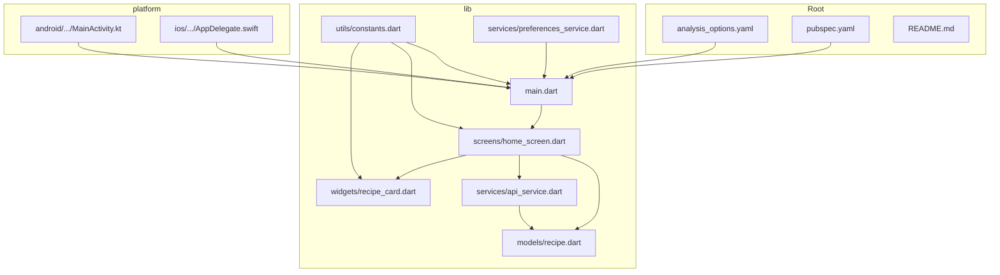
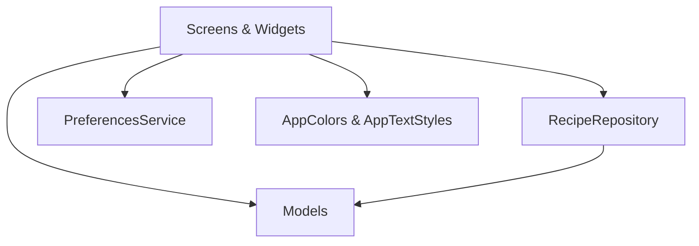
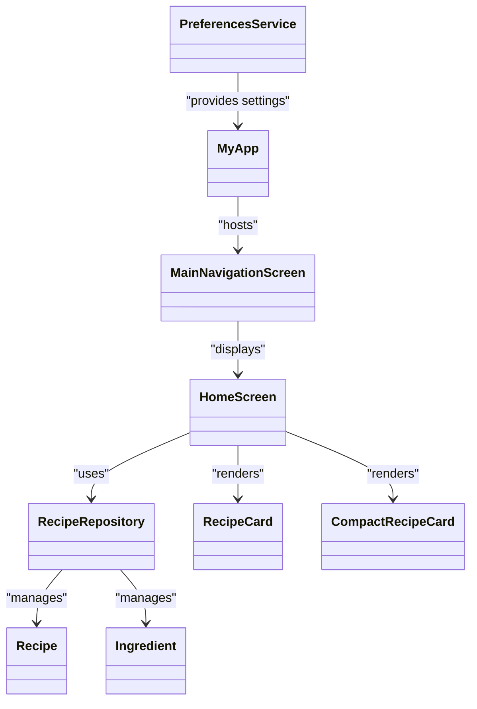
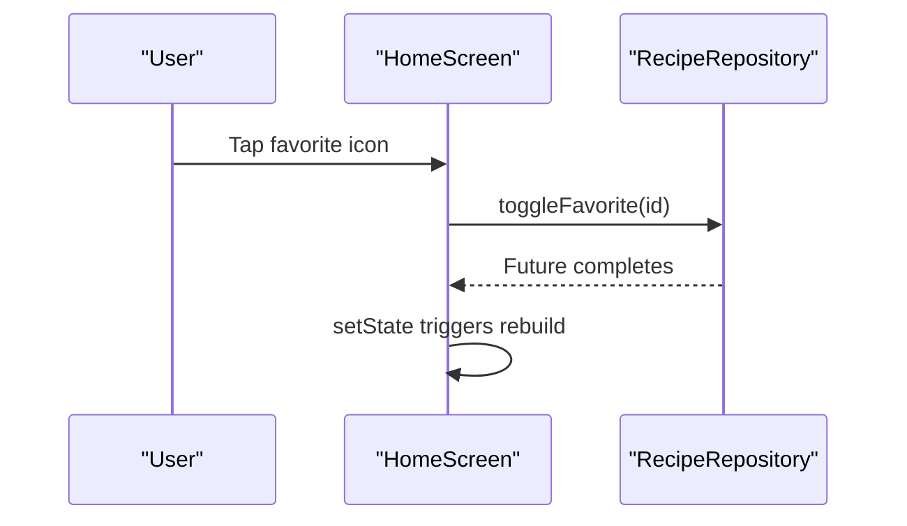
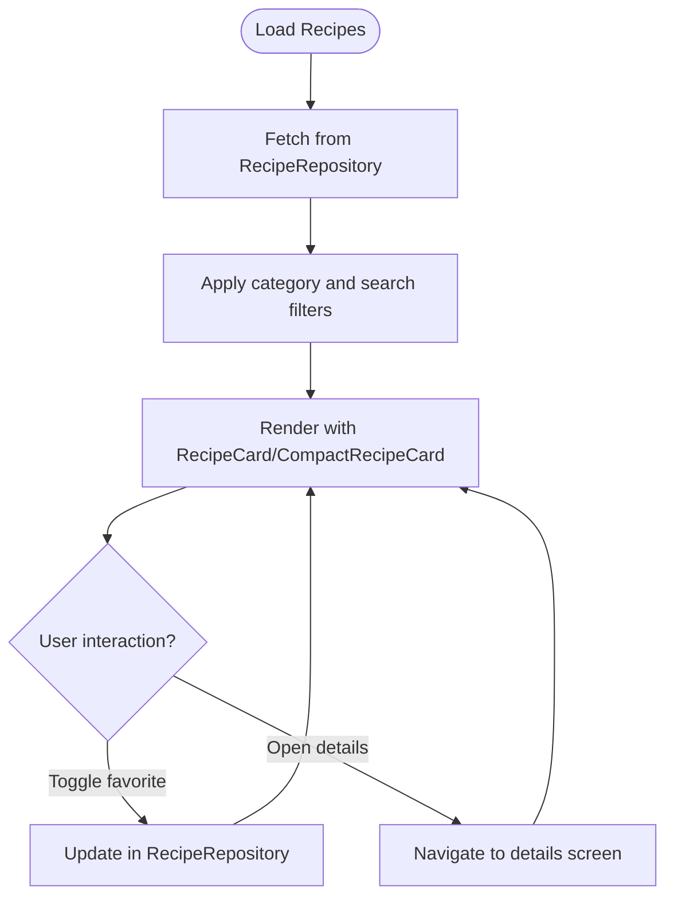

# Development Guidelines

<cite>
**Referenced Files in This Document**
- [analysis_options.yaml](file://analysis_options.yaml)
- [pubspec.yaml](file://pubspec.yaml)
- [README.md](file://README.md)
- [lib/main.dart](file://lib/main.dart)
- [lib/utils/constants.dart](file://lib/utils/constants.dart)
- [lib/models/recipe.dart](file://lib/models/recipe.dart)
- [lib/services/api_service.dart](file://lib/services/api_service.dart)
- [lib/services/preferences_service.dart](file://lib/services/preferences_service.dart)
- [lib/screens/home_screen.dart](file://lib/screens/home_screen.dart)
- [lib/widgets/recipe_card.dart](file://lib/widgets/recipe_card.dart)
- [android/app/src/main/kotlin/com/example/cook_book_app/MainActivity.kt](file://android/app/src/main/kotlin/com/example/cook_book_app/MainActivity.kt)
- [ios/Runner/AppDelegate.swift](file://ios/Runner/AppDelegate.swift)
</cite>

## Table of Contents
1. [Introduction](#introduction)
2. [Project Structure](#project-structure)
3. [Core Components](#core-components)
4. [Architecture Overview](#architecture-overview)
5. [Detailed Component Analysis](#detailed-component-analysis)
6. [Dependency Analysis](#dependency-analysis)
7. [Performance Considerations](#performance-considerations)
8. [Troubleshooting Guide](#troubleshooting-guide)
9. [Conclusion](#conclusion)
10. [Appendices](#appendices)

## Introduction
This document provides comprehensive development guidelines for the Cooking Book App project. It consolidates code style standards, naming conventions, architectural patterns, linting rules, formatting requirements, documentation standards, project structure conventions, dependency management, and best practices for feature development, code review, and contributions. It also outlines performance optimization, memory management, and accessibility requirements to maintain consistency and quality across the codebase.

## Project Structure
The project follows a conventional Flutter layout with platform-specific native entry points and a Dart application organized by feature-focused folders. The structure supports separation of concerns and scalability.

- Root-level configuration files define analysis and dependency policies.
- The lib folder organizes the Dart application into feature areas:
  - screens: UI pages and navigation containers
  - widgets: reusable UI components
  - models: domain data structures
  - services: business logic and persistence
  - utils: constants and shared utilities
- Platform integrations:
  - Android Kotlin entry point
  - iOS Swift entry point

**Diagram sources**
- [analysis_options.yaml](file://analysis_options.yaml)
- [pubspec.yaml](file://pubspec.yaml)
- [lib/main.dart](file://lib/main.dart)
- [lib/utils/constants.dart](file://lib/utils/constants.dart)
- [lib/models/recipe.dart](file://lib/models/recipe.dart)
- [lib/services/api_service.dart](file://lib/services/api_service.dart)
- [lib/services/preferences_service.dart](file://lib/services/preferences_service.dart)
- [lib/screens/home_screen.dart](file://lib/screens/home_screen.dart)
- [lib/widgets/recipe_card.dart](file://lib/widgets/recipe_card.dart)
- [android/app/src/main/kotlin/com/example/cook_book_app/MainActivity.kt](file://android/app/src/main/kotlin/com/example/cook_book_app/MainActivity.kt)
- [ios/Runner/AppDelegate.swift](file://ios/Runner/AppDelegate.swift)

**Section sources**
- [README.md](file://README.md)
- [lib/main.dart](file://lib/main.dart)

## Core Components
This section documents the foundational building blocks of the application and their roles in enforcing consistent patterns.

- Application entry and navigation
  - The app initializes in main.dart and sets up a dark-themed MaterialApp with a bottom navigation container that hosts feature screens.
  - The navigation container uses IndexedStack to preserve screen state and a floating action button to open the add/edit recipe screen.

- Constants and theming
  - Centralized color palettes, typography, categories, and app metadata live in constants.dart to ensure consistent theming across screens and widgets.

- Domain models
  - Recipe and Ingredient models encapsulate immutable data with copyWith helpers for functional updates, supporting predictable UI reactivity.

- Services
  - RecipeRepository provides in-memory CRUD operations for recipes and toggles favorites.
  - PreferencesService wraps SharedPreferences for persistent settings such as theme, layout, and defaults.

- Screens and widgets
  - HomeScreen orchestrates filtering, search, category chips, and recipe grids, delegating rendering to reusable widgets.
  - RecipeCard and CompactRecipeCard present recipe metadata with consistent styling and interactive favorite toggling.

**Section sources**
- [lib/main.dart](file://lib/main.dart)
- [lib/utils/constants.dart](file://lib/utils/constants.dart)
- [lib/models/recipe.dart](file://lib/models/recipe.dart)
- [lib/services/api_service.dart](file://lib/services/api_service.dart)
- [lib/services/preferences_service.dart](file://lib/services/preferences_service.dart)
- [lib/screens/home_screen.dart](file://lib/screens/home_screen.dart)
- [lib/widgets/recipe_card.dart](file://lib/widgets/recipe_card.dart)

## Architecture Overview
The app follows a layered architecture:
- Presentation layer: Screens and widgets
- Domain layer: Models and business logic
- Data layer: In-memory repository and preference storage

**Diagram sources**
- [lib/screens/home_screen.dart](file://lib/screens/home_screen.dart)
- [lib/widgets/recipe_card.dart](file://lib/widgets/recipe_card.dart)
- [lib/models/recipe.dart](file://lib/models/recipe.dart)
- [lib/services/api_service.dart](file://lib/services/api_service.dart)
- [lib/services/preferences_service.dart](file://lib/services/preferences_service.dart)
- [lib/utils/constants.dart](file://lib/utils/constants.dart)

## Detailed Component Analysis

### Linting and Code Style Standards
- Lint configuration
  - The project includes Flutter’s recommended lints via analysis_options.yaml, enabling consistent style and safety checks across the codebase.
  - Rules can be customized per-project; comments indicate how to enable or disable specific lints.

- Formatting and naming conventions
  - Prefer single quotes for strings unless multi-line contexts require triple quotes.
  - Use camelCase for identifiers and method names.
  - Keep class names capitalized (PascalCase) and file names snake_case for Dart files.
  - Group imports by standard library, packages, and internal libraries; separate groups with blank lines.
  - Favor immutable models and copyWith methods for safe updates.
  - Use descriptive variable names and concise, focused functions.

- Documentation standards
  - Add doc comments for public classes, methods, and significant logic.
  - Keep summaries concise and explain intent and behavior.

**Section sources**
- [analysis_options.yaml](file://analysis_options.yaml)

### Dependency Management and Version Pinning
- SDK and Flutter constraints
  - The SDK is pinned to a specific Flutter SDK version in pubspec.yaml to ensure reproducible builds across environments.

- Dependencies
  - Production dependencies include Flutter SDK, Material icons, and shared_preferences.
  - Development dependencies include flutter_test and flutter_lints.

- Version pinning strategies
  - Pin major versions for stability; use caret ranges (^) for compatible updates.
  - Periodically run dependency audits and keep dev_dependencies aligned with analysis_options.

- Security considerations
  - Regularly audit dependencies for known vulnerabilities.
  - Prefer official packages and reputable sources.
  - Avoid committing secrets or tokens to version control.

**Section sources**
- [pubspec.yaml](file://pubspec.yaml)

### Project Structure Conventions
- File organization principles
  - Feature-based grouping: screens, widgets, services, models, utils.
  - Naming patterns:
    - Files: snake_case.dart
    - Classes: PascalCase
    - Variables and methods: camelCase
    - Constants: UPPER_SNAKE_CASE
  - Keep related files close (e.g., constants, widgets, services).

- Directory conventions
  - lib/screens: UI pages and navigation containers
  - lib/widgets: reusable UI components
  - lib/services: business logic and persistence
  - lib/models: immutable domain data
  - lib/utils: shared constants and utilities

**Section sources**
- [lib/main.dart](file://lib/main.dart)
- [lib/utils/constants.dart](file://lib/utils/constants.dart)
- [lib/models/recipe.dart](file://lib/models/recipe.dart)
- [lib/services/api_service.dart](file://lib/services/api_service.dart)
- [lib/services/preferences_service.dart](file://lib/services/preferences_service.dart)
- [lib/screens/home_screen.dart](file://lib/screens/home_screen.dart)
- [lib/widgets/recipe_card.dart](file://lib/widgets/recipe_card.dart)

### Best Practices for Feature Development
- Use immutable models and copyWith to propagate updates predictably.
- Encapsulate business logic in services and repositories; keep screens stateless where possible.
- Centralize constants and theming in utils to avoid scattered magic values.
- Reuse widgets across screens to reduce duplication and improve consistency.
- Leverage IndexedStack in navigation containers to preserve state during tab switches.

**Section sources**
- [lib/models/recipe.dart](file://lib/models/recipe.dart)
- [lib/services/api_service.dart](file://lib/services/api_service.dart)
- [lib/utils/constants.dart](file://lib/utils/constants.dart)
- [lib/screens/home_screen.dart](file://lib/screens/home_screen.dart)
- [lib/widgets/recipe_card.dart](file://lib/widgets/recipe_card.dart)

### Code Review Processes and Contribution Guidelines
- Pull Request Checklist
  - All new features include unit or widget tests.
  - Lint passes without warnings; formatting is consistent.
  - Doc comments added for new APIs.
  - Changes scoped to a single feature or bug fix.
  - No commented-out code; minimal diffs preferred.
- Review Focus Areas
  - Correctness of business logic in services.
  - Consistency of UI theming and widget reuse.
  - Immutable model updates and error handling.
  - Accessibility and responsive layout.

[No sources needed since this section provides general guidance]

### Performance Optimization Standards
- Rendering and state
  - Use StatelessWidgets for static UI and avoid unnecessary rebuilds.
  - Use IndexedStack to preserve screen state and avoid recomputation on tab switches.
  - Prefer GridView.builder with shrinkWrap and appropriate physics for large lists.
- Memory management
  - Avoid retaining large lists or images unnecessarily.
  - Dispose of streams and timers in widgets when appropriate.
- Asset handling
  - Use AssetImage with fallbacks for robustness.
  - Keep image sizes optimized for target devices.

**Section sources**
- [lib/screens/home_screen.dart](file://lib/screens/home_screen.dart)
- [lib/widgets/recipe_card.dart](file://lib/widgets/recipe_card.dart)

### Accessibility Requirements
- Contrast and readability
  - Ensure sufficient contrast between foreground and background colors for text and icons.
- Touch targets
  - Make interactive elements at least 48x48 logical pixels.
- Content labeling
  - Provide meaningful labels for icons and buttons; use semantic descriptions where applicable.
- Dark mode support
  - Verify readability and contrast in dark themes.

[No sources needed since this section provides general guidance]

## Dependency Analysis
This section maps the relationships among core components and highlights coupling and cohesion.

**Diagram sources**
- [lib/main.dart](file://lib/main.dart)
- [lib/screens/home_screen.dart](file://lib/screens/home_screen.dart)
- [lib/services/api_service.dart](file://lib/services/api_service.dart)
- [lib/services/preferences_service.dart](file://lib/services/preferences_service.dart)
- [lib/models/recipe.dart](file://lib/models/recipe.dart)
- [lib/widgets/recipe_card.dart](file://lib/widgets/recipe_card.dart)

**Section sources**
- [lib/main.dart](file://lib/main.dart)
- [lib/screens/home_screen.dart](file://lib/screens/home_screen.dart)
- [lib/services/api_service.dart](file://lib/services/api_service.dart)
- [lib/services/preferences_service.dart](file://lib/services/preferences_service.dart)
- [lib/models/recipe.dart](file://lib/models/recipe.dart)
- [lib/widgets/recipe_card.dart](file://lib/widgets/recipe_card.dart)

## Performance Considerations
- UI responsiveness
  - Use ListView.builder or GridView.builder for large datasets.
  - Avoid heavy computations in build methods; cache derived values when appropriate.
- State management
  - Keep setState scopes minimal; avoid rebuilding unrelated subtrees.
- Images and assets
  - Provide appropriately sized images; handle loading and error states gracefully.
- Navigation
  - Preserve state with IndexedStack to prevent redundant work on tab switches.

[No sources needed since this section provides general guidance]

## Troubleshooting Guide
- Lint failures
  - Run flutter analyze and address rule violations; customize analysis_options.yaml as needed.
- Dependency conflicts
  - Resolve by aligning versions in pubspec.yaml and running flutter pub get.
- Build issues
  - Verify platform entry points and Gradle/Xcode configurations.
- Runtime errors
  - Check widget tree structure and ensure proper initialization of services (e.g., SharedPreferences).

**Section sources**
- [analysis_options.yaml](file://analysis_options.yaml)
- [pubspec.yaml](file://pubspec.yaml)
- [android/app/src/main/kotlin/com/example/cook_book_app/MainActivity.kt](file://android/app/src/main/kotlin/com/example/cook_book_app/MainActivity.kt)
- [ios/Runner/AppDelegate.swift](file://ios/Runner/AppDelegate.swift)

## Conclusion
These guidelines establish a consistent foundation for developing the Cooking Book App. By adhering to the documented style, structure, and practices—enforced through analysis_options.yaml, pubspec.yaml, and architectural patterns—you can ensure maintainability, performance, and a high-quality user experience across platforms.

[No sources needed since this section summarizes without analyzing specific files]

## Appendices

### Appendix A: Example Workflows

#### Workflow: Favorite Toggle

**Diagram sources**
- [lib/screens/home_screen.dart](file://lib/screens/home_screen.dart)
- [lib/services/api_service.dart](file://lib/services/api_service.dart)

### Appendix B: Data Model Flow

**Diagram sources**
- [lib/services/api_service.dart](file://lib/services/api_service.dart)
- [lib/screens/home_screen.dart](file://lib/screens/home_screen.dart)
- [lib/widgets/recipe_card.dart](file://lib/widgets/recipe_card.dart)