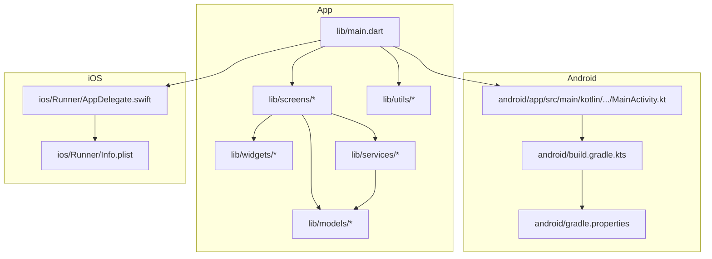

# Getting Started

<cite>
**Referenced Files in This Document**
- [README.md](file://README.md)
- [pubspec.yaml](file://pubspec.yaml)
- [analysis_options.yaml](file://analysis_options.yaml)
- [lib/main.dart](file://lib/main.dart)
- [lib/utils/constants.dart](file://lib/utils/constants.dart)
- [lib/models/recipe.dart](file://lib/models/recipe.dart)
- [lib/services/preferences_service.dart](file://lib/services/preferences_service.dart)
- [android/app/src/main/kotlin/com/example/cook_book_app/MainActivity.kt](file://android/app/src/main/kotlin/com/example/cook_book_app/MainActivity.kt)
- [ios/Runner/AppDelegate.swift](file://ios/Runner/AppDelegate.swift)
- [ios/Runner/Info.plist](file://ios/Runner/Info.plist)
- [android/build.gradle.kts](file://android/build.gradle.kts)
- [android/gradle.properties](file://android/gradle.properties)
</cite>

## Table of Contents
1. [Introduction](#introduction)
2. [Prerequisites](#prerequisites)
3. [Installation](#installation)
4. [Running the Application](#running-the-application)
5. [Development Workflow](#development-workflow)
6. [Project Structure](#project-structure)
7. [Troubleshooting](#troubleshooting)
8. [First-Time Contributor Guide](#first-time-contributor-guide)
9. [Conclusion](#conclusion)

## Introduction
This guide helps you install, run, and develop the Cooking Book App locally. It covers prerequisites, environment setup, cloning and building the project, running on Android and iOS, development tips, and troubleshooting.

## Prerequisites
Before you begin, ensure your machine meets the following requirements:

- Operating system
  - Windows, macOS, or Linux
- Flutter SDK
  - Install the Flutter SDK and ensure the flutter command is available in your terminal.
  - Verify installation with flutter doctor.
- Android development
  - Android Studio with Android SDK and Android Virtual Device (AVD) configured.
  - Enable USB debugging on a physical Android device if testing on hardware.
- iOS development
  - macOS with Xcode installed.
  - An iOS simulator or a physical iOS device registered in Xcode.
- Editor
  - VS Code or Android Studio with Flutter/Dart plugins enabled.

Environment verification steps:
- Run flutter doctor to check SDK, connected devices, and IDE integration.
- On Android, ensure ANDROID_HOME or ANDROID_SDK_ROOT is set and emulator/device is available.
- On iOS, ensure Xcode command-line tools are installed and a simulator is available.

**Section sources**
- [README.md:5-17](file://README.md#L5-L17)
- [pubspec.yaml:21-22](file://pubspec.yaml#L21-L22)

## Installation
Follow these steps to clone and prepare the project:

1. Clone the repository
   - Use git to clone the repository to your local machine.
2. Open a terminal in the project root
3. Install dependencies
   - Run flutter pub get to fetch dependencies defined in pubspec.yaml.
4. Prepare platform-specific configurations
   - Android: Ensure Gradle wrapper and local.properties are present; Android Studio can manage these automatically.
   - iOS: Ensure Runner.xcworkspace exists; open it in Xcode if needed.
5. Verify analysis configuration
   - The project includes analysis_options.yaml to enforce Flutter lints.

Notes:
- The project targets a specific Flutter SDK version declared in pubspec.yaml.
- Assets are configured under the flutter section of pubspec.yaml.

**Section sources**
- [pubspec.yaml:30-48](file://pubspec.yaml#L30-L48)
- [pubspec.yaml:54-92](file://pubspec.yaml#L54-L92)
- [analysis_options.yaml:8-10](file://analysis_options.yaml#L8-L10)

## Running the Application
Choose a target platform and run the app:

- Android
  - Connect an Android device or start an AVD.
  - From the project root, run flutter run.
  - The Android MainActivity is a standard FlutterActivity subclass.
- iOS
  - Connect an iOS device or start an iOS simulator.
  - From the project root, run flutter run.
  - The iOS AppDelegate integrates with Flutter’s implicit engine.

Optional: Build and run from IDEs
- Android Studio: Select the Android device/simulator and run the app.
- Xcode: Open ios/Runner.xcworkspace and run the Runner scheme.

Verification
- The app initializes in dark theme with a bottom navigation interface and several screens.
- The main entry point is lib/main.dart.

**Section sources**
- [lib/main.dart:10-33](file://lib/main.dart#L10-L33)
- [android/app/src/main/kotlin/com/example/cook_book_app/MainActivity.kt:1-6](file://android/app/src/main/kotlin/com/example/cook_book_app/MainActivity.kt#L1-L6)
- [ios/Runner/AppDelegate.swift:1-17](file://ios/Runner/AppDelegate.swift#L1-L17)

## Development Workflow
Recommended development practices for iterative development:

- Hot reload
  - Use flutter run with an attached device/emulator to enable hot reload.
  - Changes to Dart code trigger hot reload automatically.
- Debugging
  - Use breakpoints in your IDE (VS Code or Android Studio).
  - Inspect widget tree and performance using DevTools.
- Common commands
  - flutter pub get: Fetch dependencies.
  - flutter analyze: Run static analysis with configured lints.
  - flutter test: Run unit and widget tests.
  - flutter pub outdated and flutter pub upgrade: Keep dependencies up to date.
- Linting
  - The project enforces Flutter lints via analysis_options.yaml.

**Section sources**
- [analysis_options.yaml:8-29](file://analysis_options.yaml#L8-L29)

## Project Structure
High-level overview of the project layout and responsibilities:

- Root
  - pubspec.yaml: Defines dependencies, assets, and Flutter SDK requirement.
  - analysis_options.yaml: Configures lint rules.
  - README.md: Basic project description and links to Flutter resources.
- lib/
  - main.dart: Entry point and top-level navigation.
  - models/: Data models (e.g., Recipe).
  - services/: Business logic and persistence helpers (e.g., PreferencesService).
  - utils/: Shared constants and styles (e.g., AppConstants, AppColors, AppTextStyles).
  - screens/: Feature screens (Home, Category Browser, Favorites, Settings, Add/Edit Recipe, Recipe Details).
  - widgets/: Reusable UI components (e.g., RecipeCard, ChipFilter, RatingStars).
- android/
  - Kotlin MainActivity and Gradle configuration.
- ios/
  - Swift AppDelegate and Info.plist configuration.

**Diagram sources**
- [lib/main.dart:1-12](file://lib/main.dart#L1-L12)
- [android/app/src/main/kotlin/com/example/cook_book_app/MainActivity.kt:1-6](file://android/app/src/main/kotlin/com/example/cook_book_app/MainActivity.kt#L1-L6)
- [ios/Runner/AppDelegate.swift:1-17](file://ios/Runner/AppDelegate.swift#L1-L17)
- [android/build.gradle.kts:1-25](file://android/build.gradle.kts#L1-L25)
- [android/gradle.properties:1-3](file://android/gradle.properties#L1-L3)
- [ios/Runner/Info.plist:1-71](file://ios/Runner/Info.plist#L1-L71)

**Section sources**
- [lib/main.dart:10-33](file://lib/main.dart#L10-L33)
- [lib/utils/constants.dart:120-124](file://lib/utils/constants.dart#L120-L124)
- [lib/models/recipe.dart:1-82](file://lib/models/recipe.dart#L1-L82)
- [lib/services/preferences_service.dart:1-73](file://lib/services/preferences_service.dart#L1-L73)
- [pubspec.yaml:54-92](file://pubspec.yaml#L54-L92)

## Troubleshooting
Common setup and runtime issues:

- Flutter doctor reports missing dependencies
  - Install Android Studio/Xcode and required SDKs.
  - Ensure flutter and dart plugins are installed in your editor.
- Android build fails
  - Verify ANDROID_HOME or ANDROID_SDK_ROOT is set.
  - Accept Android licenses and update SDK tools.
  - Clean builds if needed: flutter clean followed by flutter pub get.
- iOS build fails
  - Open ios/Runner.xcworkspace in Xcode and resolve signing or provisioning profile issues.
  - Ensure Xcode command-line tools are installed.
  - Run flutter pub get inside ios/ if required.
- Device not detected
  - For Android: Unlock device, enable USB debugging, connect via USB.
  - For iOS: Trust the computer on the device and unlock it.
- Lint or analysis errors
  - Run flutter analyze and fix reported issues.
  - Review analysis_options.yaml for enforced rules.

**Section sources**
- [README.md:5-17](file://README.md#L5-L17)
- [analysis_options.yaml:8-29](file://analysis_options.yaml#L8-L29)

## First-Time Contributor Guide
Getting started as a contributor:

- Fork and clone the repository
- Install dependencies with flutter pub get
- Explore the codebase
  - Entry point: lib/main.dart
  - Theming and constants: lib/utils/constants.dart
  - Data model: lib/models/recipe.dart
  - Preferences: lib/services/preferences_service.dart
- Run the app on Android and iOS to verify your setup
- Follow the lint rules enforced by analysis_options.yaml
- Submit pull requests with clear descriptions and references to related issues

**Section sources**
- [lib/main.dart:10-33](file://lib/main.dart#L10-L33)
- [lib/utils/constants.dart:120-124](file://lib/utils/constants.dart#L120-L124)
- [lib/models/recipe.dart:1-82](file://lib/models/recipe.dart#L1-L82)
- [lib/services/preferences_service.dart:1-73](file://lib/services/preferences_service.dart#L1-L73)
- [analysis_options.yaml:8-29](file://analysis_options.yaml#L8-L29)

## Conclusion
You now have the essentials to install, run, and develop the Cooking Book App. Use the provided commands, follow the project structure, and leverage the troubleshooting tips to resolve common issues quickly.