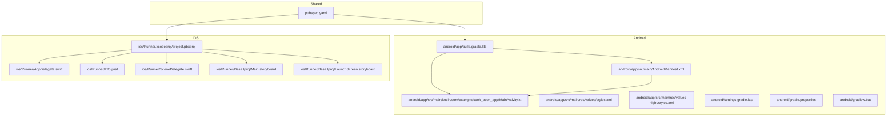
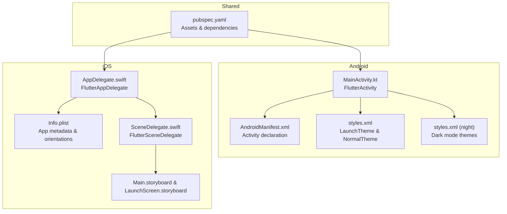
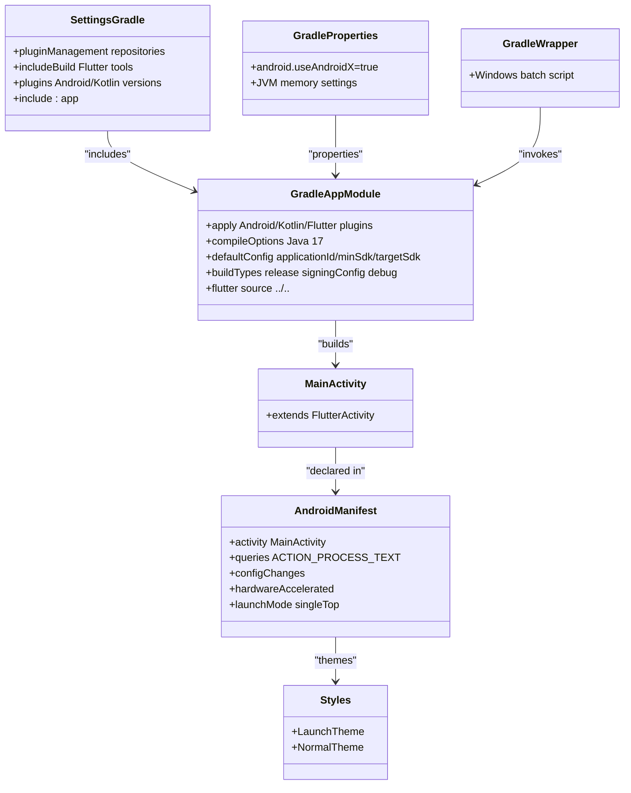
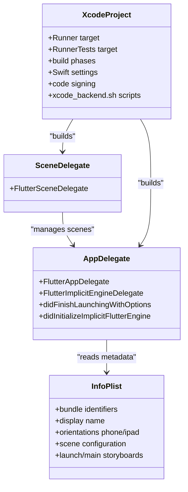
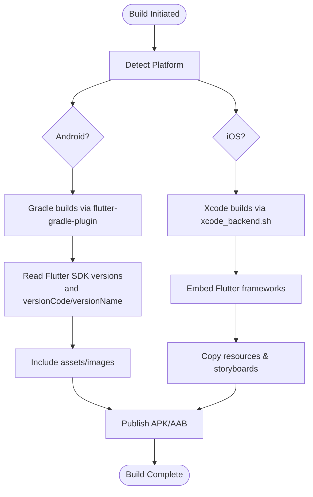
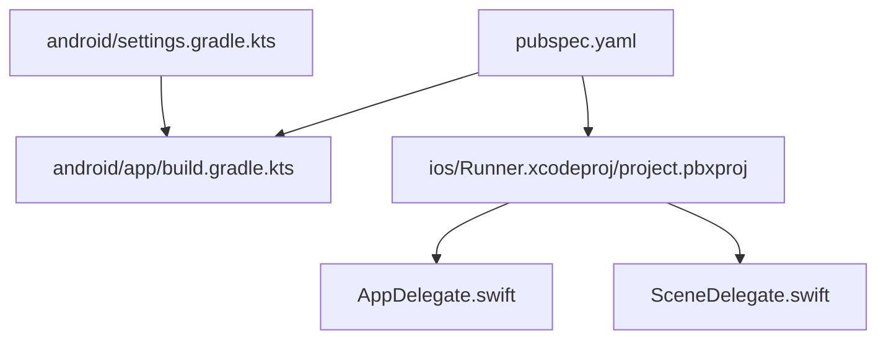

# Platform Integration

<cite>
**Referenced Files in This Document**
- [MainActivity.kt](file://android/app/src/main/kotlin/com/example/cook_book_app/MainActivity.kt)
- [AndroidManifest.xml](file://android/app/src/main/AndroidManifest.xml)
- [build.gradle.kts](file://android/app/build.gradle.kts)
- [styles.xml](file://android/app/src/main/res/values/styles.xml)
- [styles.xml (night)](file://android/app/src/main/res/values-night/styles.xml)
- [gradle.properties](file://android/gradle.properties)
- [settings.gradle.kts](file://android/settings.gradle.kts)
- [gradlew.bat](file://android/gradlew.bat)
- [AppDelegate.swift](file://ios/Runner/AppDelegate.swift)
- [Info.plist](file://ios/Runner/Info.plist)
- [SceneDelegate.swift](file://ios/Runner/SceneDelegate.swift)
- [project.pbxproj](file://ios/Runner.xcodeproj/project.pbxproj)
- [Main.storyboard](file://ios/Runner/Base.lproj/Main.storyboard)
- [LaunchScreen.storyboard](file://ios/Runner/Base.lproj/LaunchScreen.storyboard)
- [pubspec.yaml](file://pubspec.yaml)
</cite>

## Table of Contents
1. [Introduction](#introduction)
2. [Project Structure](#project-structure)
3. [Core Components](#core-components)
4. [Architecture Overview](#architecture-overview)
5. [Detailed Component Analysis](#detailed-component-analysis)
6. [Dependency Analysis](#dependency-analysis)
7. [Performance Considerations](#performance-considerations)
8. [Troubleshooting Guide](#troubleshooting-guide)
9. [Conclusion](#conclusion)

## Introduction
This document details the platform-specific integrations for the Cooking Book App, focusing on Android and iOS configurations. It explains how the app is structured to support both platforms, including the Android MainActivity implementation, Android manifest and resource configurations, iOS AppDelegate setup and Info.plist settings, cross-platform build processes, asset management, and platform-specific optimizations. It also covers deployment configurations, signing requirements, testing approaches, and platform differences in UI rendering, performance characteristics, and user experience considerations.

## Project Structure
The project follows a Flutter monorepo layout with platform-specific folders under android and ios. The Android module is configured as a standard Flutter Android application, while the iOS module is a standard Flutter iOS Runner app. Shared Flutter assets and dependencies are managed via pubspec.yaml.

**Diagram sources**
- [build.gradle.kts:1-45](file://android/app/build.gradle.kts#L1-L45)
- [AndroidManifest.xml:1-46](file://android/app/src/main/AndroidManifest.xml#L1-L46)
- [MainActivity.kt:1-6](file://android/app/src/main/kotlin/com/example/cook_book_app/MainActivity.kt#L1-L6)
- [styles.xml:1-19](file://android/app/src/main/res/values/styles.xml#L1-L19)
- [styles.xml (night):1-19](file://android/app/src/main/res/values-night/styles.xml#L1-L19)
- [settings.gradle.kts:1-27](file://android/settings.gradle.kts#L1-L27)
- [gradle.properties:1-3](file://android/gradle.properties#L1-L3)
- [gradlew.bat:1-91](file://android/gradlew.bat#L1-L91)
- [AppDelegate.swift:1-17](file://ios/Runner/AppDelegate.swift#L1-L17)
- [Info.plist:1-71](file://ios/Runner/Info.plist#L1-L71)
- [SceneDelegate.swift:1-7](file://ios/Runner/SceneDelegate.swift#L1-L7)
- [project.pbxproj:1-621](file://ios/Runner.xcodeproj/project.pbxproj#L1-L621)
- [Main.storyboard:1-27](file://ios/Runner/Base.lproj/Main.storyboard#L1-L27)
- [LaunchScreen.storyboard:1-38](file://ios/Runner/Base.lproj/LaunchScreen.storyboard#L1-L38)
- [pubspec.yaml:1-92](file://pubspec.yaml#L1-L92)

**Section sources**
- [build.gradle.kts:1-45](file://android/app/build.gradle.kts#L1-L45)
- [AndroidManifest.xml:1-46](file://android/app/src/main/AndroidManifest.xml#L1-L46)
- [MainActivity.kt:1-6](file://android/app/src/main/kotlin/com/example/cook_book_app/MainActivity.kt#L1-L6)
- [styles.xml:1-19](file://android/app/src/main/res/values/styles.xml#L1-L19)
- [styles.xml (night):1-19](file://android/app/src/main/res/values-night/styles.xml#L1-L19)
- [settings.gradle.kts:1-27](file://android/settings.gradle.kts#L1-L27)
- [gradle.properties:1-3](file://android/gradle.properties#L1-L3)
- [gradlew.bat:1-91](file://android/gradlew.bat#L1-L91)
- [AppDelegate.swift:1-17](file://ios/Runner/AppDelegate.swift#L1-L17)
- [Info.plist:1-71](file://ios/Runner/Info.plist#L1-L71)
- [SceneDelegate.swift:1-7](file://ios/Runner/SceneDelegate.swift#L1-L7)
- [project.pbxproj:1-621](file://ios/Runner.xcodeproj/project.pbxproj#L1-L621)
- [Main.storyboard:1-27](file://ios/Runner/Base.lproj/Main.storyboard#L1-L27)
- [LaunchScreen.storyboard:1-38](file://ios/Runner/Base.lproj/LaunchScreen.storyboard#L1-L38)
- [pubspec.yaml:1-92](file://pubspec.yaml#L1-L92)

## Core Components
- Android application module configured with the Flutter Gradle Plugin and Kotlin Android plugin.
- Android MainActivity extends FlutterActivity with minimal overrides.
- Android manifest declares the main activity, hardware acceleration, configuration changes, and intent queries for text processing.
- iOS Runner app configured with FlutterAppDelegate and SceneDelegate, Info.plist containing app metadata and supported orientations.
- Cross-platform asset management defined in pubspec.yaml with an assets/images directory.

**Section sources**
- [build.gradle.kts:1-45](file://android/app/build.gradle.kts#L1-L45)
- [MainActivity.kt:1-6](file://android/app/src/main/kotlin/com/example/cook_book_app/MainActivity.kt#L1-L6)
- [AndroidManifest.xml:1-46](file://android/app/src/main/AndroidManifest.xml#L1-L46)
- [AppDelegate.swift:1-17](file://ios/Runner/AppDelegate.swift#L1-L17)
- [Info.plist:1-71](file://ios/Runner/Info.plist#L1-L71)
- [SceneDelegate.swift:1-7](file://ios/Runner/SceneDelegate.swift#L1-L7)
- [pubspec.yaml:61-66](file://pubspec.yaml#L61-L66)

## Architecture Overview
The platform integration architecture centers on Flutter’s platform embedding model. On Android, the MainActivity hosts the Flutter engine and handles lifecycle events. On iOS, AppDelegate initializes the Flutter engine and registers plugins, while SceneDelegate manages the app’s window scene lifecycle. Both platforms rely on shared Flutter assets and dependencies declared in pubspec.yaml.

**Diagram sources**
- [MainActivity.kt:1-6](file://android/app/src/main/kotlin/com/example/cook_book_app/MainActivity.kt#L1-L6)
- [AndroidManifest.xml:1-46](file://android/app/src/main/AndroidManifest.xml#L1-L46)
- [styles.xml:1-19](file://android/app/src/main/res/values/styles.xml#L1-L19)
- [styles.xml (night):1-19](file://android/app/src/main/res/values-night/styles.xml#L1-L19)
- [AppDelegate.swift:1-17](file://ios/Runner/AppDelegate.swift#L1-L17)
- [Info.plist:1-71](file://ios/Runner/Info.plist#L1-L71)
- [SceneDelegate.swift:1-7](file://ios/Runner/SceneDelegate.swift#L1-L7)
- [Main.storyboard:1-27](file://ios/Runner/Base.lproj/Main.storyboard#L1-L27)
- [LaunchScreen.storyboard:1-38](file://ios/Runner/Base.lproj/LaunchScreen.storyboard#L1-L38)
- [pubspec.yaml:61-66](file://pubspec.yaml#L61-L66)

## Detailed Component Analysis

### Android Configuration
- MainActivity: Minimal implementation extending FlutterActivity, delegating all Flutter engine hosting to the framework.
- Manifest: Declares the main activity, exported flag, singleTop launch mode, hardware acceleration, orientation and UI mode config changes, and intent queries for text processing.
- Styles: Separate light and dark theme resources for launch and normal UI themes.
- Gradle: Applies Android, Kotlin, and Flutter Gradle plugins; sets compile/target SDK versions via Flutter tooling; configures Java 17 compatibility; defines applicationId, minSdk, targetSdk, versionCode, and versionName from Flutter; release signing defaults to debug keys.
- Settings: Configures plugin management, includes Flutter tooling build, and applies Android/Kotlin plugins with version pins.
- Gradle Properties: Enables AndroidX and sets JVM memory parameters.
- Gradle Wrapper: Windows batch script for Gradle invocation.

**Diagram sources**
- [MainActivity.kt:1-6](file://android/app/src/main/kotlin/com/example/cook_book_app/MainActivity.kt#L1-L6)
- [AndroidManifest.xml:1-46](file://android/app/src/main/AndroidManifest.xml#L1-L46)
- [styles.xml:1-19](file://android/app/src/main/res/values/styles.xml#L1-L19)
- [styles.xml (night):1-19](file://android/app/src/main/res/values-night/styles.xml#L1-L19)
- [build.gradle.kts:1-45](file://android/app/build.gradle.kts#L1-L45)
- [settings.gradle.kts:1-27](file://android/settings.gradle.kts#L1-L27)
- [gradle.properties:1-3](file://android/gradle.properties#L1-L3)
- [gradlew.bat:1-91](file://android/gradlew.bat#L1-L91)

**Section sources**
- [MainActivity.kt:1-6](file://android/app/src/main/kotlin/com/example/cook_book_app/MainActivity.kt#L1-L6)
- [AndroidManifest.xml:1-46](file://android/app/src/main/AndroidManifest.xml#L1-L46)
- [styles.xml:1-19](file://android/app/src/main/res/values/styles.xml#L1-L19)
- [styles.xml (night):1-19](file://android/app/src/main/res/values-night/styles.xml#L1-L19)
- [build.gradle.kts:1-45](file://android/app/build.gradle.kts#L1-L45)
- [settings.gradle.kts:1-27](file://android/settings.gradle.kts#L1-L27)
- [gradle.properties:1-3](file://android/gradle.properties#L1-L3)
- [gradlew.bat:1-91](file://android/gradlew.bat#L1-L91)

### iOS Configuration
- AppDelegate: Subclasses FlutterAppDelegate and implements FlutterImplicitEngineDelegate to register plugins with the implicit Flutter engine during initialization.
- SceneDelegate: Subclasses FlutterSceneDelegate, aligning with Flutter’s scene-based lifecycle management.
- Info.plist: Contains bundle identifiers, display name, supported orientations (phone and iPad), minimum iOS deployment target, scene configuration, and launch storyboard references.
- Xcode Project: Defines targets, build phases, Swift compiler settings, code signing identity, and resource embedding via Flutter’s xcode_backend.sh scripts.

**Diagram sources**
- [AppDelegate.swift:1-17](file://ios/Runner/AppDelegate.swift#L1-L17)
- [SceneDelegate.swift:1-7](file://ios/Runner/SceneDelegate.swift#L1-L7)
- [Info.plist:1-71](file://ios/Runner/Info.plist#L1-L71)
- [project.pbxproj:1-621](file://ios/Runner.xcodeproj/project.pbxproj#L1-L621)

**Section sources**
- [AppDelegate.swift:1-17](file://ios/Runner/AppDelegate.swift#L1-L17)
- [SceneDelegate.swift:1-7](file://ios/Runner/SceneDelegate.swift#L1-L7)
- [Info.plist:1-71](file://ios/Runner/Info.plist#L1-L71)
- [project.pbxproj:1-621](file://ios/Runner.xcodeproj/project.pbxproj#L1-L621)

### Cross-Platform Build Process and Asset Management
- pubspec.yaml defines shared assets and dependencies. The assets/images directory is declared for inclusion in the app bundle.
- Android build integrates with Flutter via dev.flutter.flutter-gradle-plugin and reads Flutter SDK versions and version codes/names from Flutter tooling.
- iOS build integrates with Flutter via xcode_backend.sh scripts embedded in build phases, ensuring proper framework embedding and thinning.

**Diagram sources**
- [pubspec.yaml:61-66](file://pubspec.yaml#L61-L66)
- [build.gradle.kts:42-44](file://android/app/build.gradle.kts#L42-L44)
- [project.pbxproj:242-258](file://ios/Runner.xcodeproj/project.pbxproj#L242-L258)

**Section sources**
- [pubspec.yaml:61-66](file://pubspec.yaml#L61-L66)
- [build.gradle.kts:42-44](file://android/app/build.gradle.kts#L42-L44)
- [project.pbxproj:242-258](file://ios/Runner.xcodeproj/project.pbxproj#L242-L258)

### Permissions Handling
- Android: The manifest includes a queries block for ACTION_PROCESS_TEXT, enabling text processing actions. No additional runtime permissions are declared in the manifest.
- iOS: No explicit permission requests are defined in Info.plist. Platform permissions are typically requested at runtime via Flutter plugins.

**Section sources**
- [AndroidManifest.xml:34-44](file://android/app/src/main/AndroidManifest.xml#L34-L44)
- [Info.plist:1-71](file://ios/Runner/Info.plist#L1-L71)

### Native Code Integration Patterns and Plugin Usage
- Android: MainActivity extends FlutterActivity, and GeneratedPluginRegistrant.java is generated by Flutter to register plugins.
- iOS: AppDelegate registers plugins via GeneratedPluginRegistrant in the didInitializeImplicitFlutterEngine callback.
- Flutter plugins are declared in pubspec.yaml and integrated automatically by the platform build systems.

**Section sources**
- [MainActivity.kt:1-6](file://android/app/src/main/kotlin/com/example/cook_book_app/MainActivity.kt#L1-L6)
- [AppDelegate.swift:13-15](file://ios/Runner/AppDelegate.swift#L13-L15)
- [pubspec.yaml:30-38](file://pubspec.yaml#L30-L38)

### Platform-Specific Optimizations
- Android: Hardware acceleration is enabled, and the activity supports a wide range of configuration changes to maintain responsiveness across devices and orientations.
- iOS: Scene-based lifecycle management via SceneDelegate aligns with modern iOS app lifecycle expectations.

**Section sources**
- [AndroidManifest.xml:13-14](file://android/app/src/main/AndroidManifest.xml#L13-L14)
- [SceneDelegate.swift:1-7](file://ios/Runner/SceneDelegate.swift#L1-L7)

### Deployment Configurations and Signing Requirements
- Android: The release build currently uses the debug signing config, allowing flutter run --release to succeed without a release keystore. Production deployments should configure a proper release signingConfig.
- iOS: Build configurations include automatic code signing identities. Ensure valid Apple Developer credentials and provisioning profiles are configured in Xcode for distribution builds.

**Section sources**
- [build.gradle.kts:33-39](file://android/app/build.gradle.kts#L33-L39)
- [project.pbxproj:339-340](file://ios/Runner.xcodeproj/project.pbxproj#L339-L340)

### Platform-Specific Testing Approaches
- Android: Use Android Studio or Gradle commands to run tests and instrumentation tests. The Gradle wrapper supports Windows environments.
- iOS: Use Xcode to run unit and UI tests. The project includes a RunnerTests target and test host configuration.

**Section sources**
- [gradlew.bat:1-91](file://android/gradlew.bat#L1-L91)
- [project.pbxproj:130-146](file://ios/Runner.xcodeproj/project.pbxproj#L130-L146)

### UI Rendering, Performance, and UX Considerations
- Android: LaunchTheme and NormalTheme resources provide distinct light/dark mode experiences. Hardware acceleration is enabled for smoother rendering.
- iOS: Storyboards define the initial view controller and launch screen, ensuring a consistent first-screen experience. SceneDelegate manages scene transitions.

**Section sources**
- [styles.xml:1-19](file://android/app/src/main/res/values/styles.xml#L1-L19)
- [styles.xml (night):1-19](file://android/app/src/main/res/values-night/styles.xml#L1-L19)
- [LaunchScreen.storyboard:1-38](file://ios/Runner/Base.lproj/LaunchScreen.storyboard#L1-L38)
- [Main.storyboard:1-27](file://ios/Runner/Base.lproj/Main.storyboard#L1-L27)

## Dependency Analysis
The platform modules depend on Flutter tooling and shared dependencies declared in pubspec.yaml. Android depends on the Flutter Gradle Plugin and Kotlin Android plugin, while iOS depends on Flutter’s xcode_backend.sh scripts for framework embedding and resource handling.

**Diagram sources**
- [pubspec.yaml:1-92](file://pubspec.yaml#L1-L92)
- [build.gradle.kts:1-6](file://android/app/build.gradle.kts#L1-L6)
- [settings.gradle.kts:1-27](file://android/settings.gradle.kts#L1-L27)
- [project.pbxproj:1-621](file://ios/Runner.xcodeproj/project.pbxproj#L1-L621)

**Section sources**
- [pubspec.yaml:1-92](file://pubspec.yaml#L1-L92)
- [build.gradle.kts:1-6](file://android/app/build.gradle.kts#L1-L6)
- [settings.gradle.kts:1-27](file://android/settings.gradle.kts#L1-L27)
- [project.pbxproj:1-621](file://ios/Runner.xcodeproj/project.pbxproj#L1-L621)

## Performance Considerations
- Android: Hardware acceleration is enabled in the manifest. Using Java 17 compatibility and modern SDK versions helps leverage performance improvements. Consider optimizing asset sizes and leveraging vector drawables for scalability.
- iOS: Scene-based lifecycle management and modern Swift compilation settings improve responsiveness. Ensure frameworks are properly embedded and thinned to reduce binary size.

## Troubleshooting Guide
- Android build failures: Verify Gradle JDK settings and AndroidX compatibility in gradle.properties. Ensure Flutter SDK path is correctly resolved in settings.gradle.kts.
- iOS build failures: Confirm xcode_backend.sh scripts are executed during build phases and that code signing identities are set. Validate Info.plist keys and scene configuration.
- Asset loading issues: Confirm asset paths in pubspec.yaml match actual file locations and that assets are included in both platforms’ build outputs.

**Section sources**
- [gradle.properties:1-3](file://android/gradle.properties#L1-L3)
- [settings.gradle.kts:1-27](file://android/settings.gradle.kts#L1-L27)
- [project.pbxproj:242-258](file://ios/Runner.xcodeproj/project.pbxproj#L242-L258)
- [pubspec.yaml:61-66](file://pubspec.yaml#L61-L66)

## Conclusion
The Cooking Book App integrates seamlessly with both Android and iOS through Flutter’s platform embedding. Android relies on a minimal MainActivity and comprehensive manifest and resource configuration, while iOS leverages AppDelegate and SceneDelegate for lifecycle management and Info.plist for metadata. Cross-platform asset management and build integration are handled via pubspec.yaml and platform-specific build scripts. Proper attention to signing, testing, and platform-specific optimizations ensures robust deployment and a consistent user experience across devices.