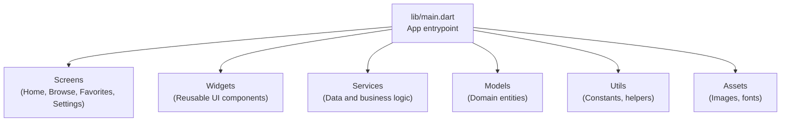
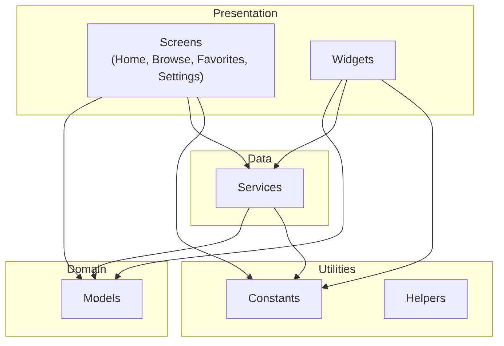
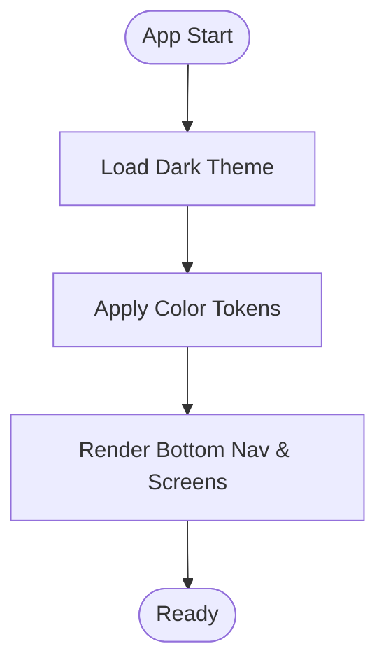
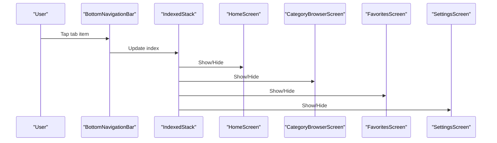
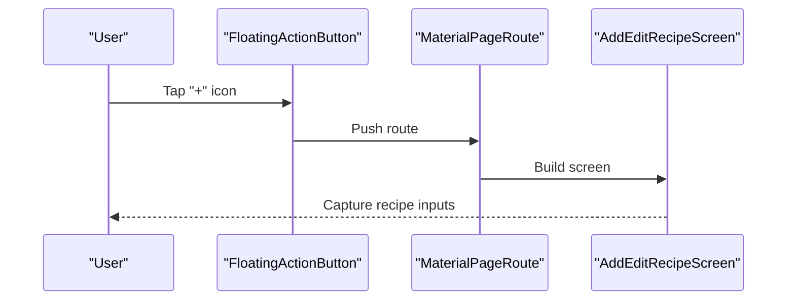
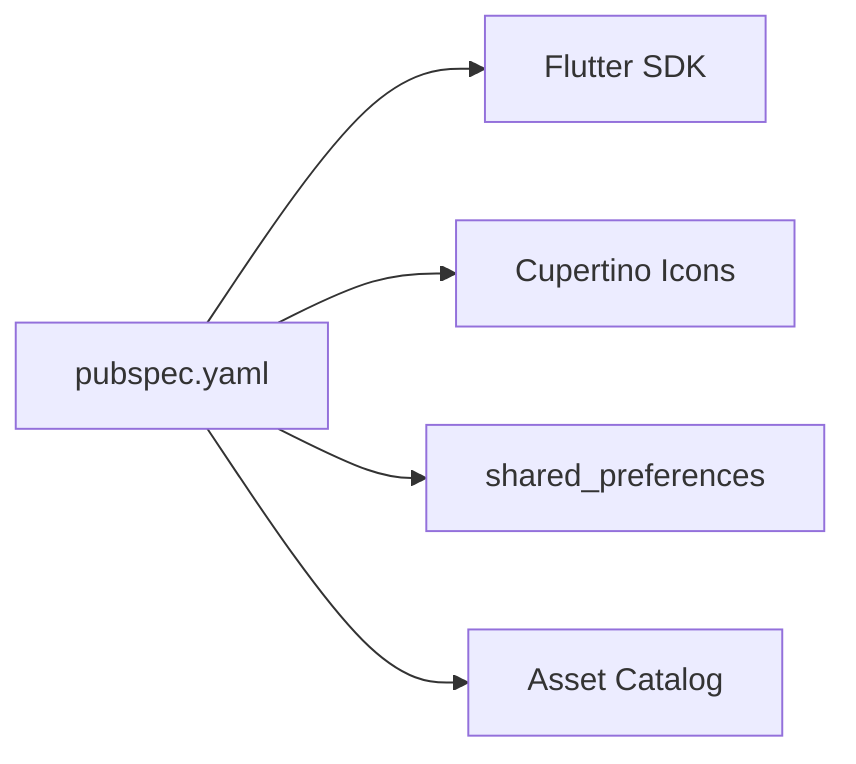

# Project Overview

<cite>
**Referenced Files in This Document**
- [README.md](file://README.md)
- [pubspec.yaml](file://pubspec.yaml)
- [main.dart](file://lib/main.dart)
</cite>

## Table of Contents
1. [Introduction](#introduction)
2. [Project Structure](#project-structure)
3. [Core Components](#core-components)
4. [Architecture Overview](#architecture-overview)
5. [Detailed Component Analysis](#detailed-component-analysis)
6. [Dependency Analysis](#dependency-analysis)
7. [Performance Considerations](#performance-considerations)
8. [Troubleshooting Guide](#troubleshooting-guide)
9. [Conclusion](#conclusion)

## Introduction
Cooking Book App is a Flutter-based recipe management and discovery application designed for mobile-first experiences. The app enables users to browse recipes, manage favorites, filter by categories, and submit new recipes. It targets home cooks and culinary enthusiasts who want a streamlined, dark-themed interface for discovering and organizing recipes across platforms.

Core value proposition:
- Unified recipe discovery and personalization
- Intuitive mobile navigation with a dark theme optimized for extended use
- Cross-platform availability via Flutter for Android and iOS

Technology stack highlights:
- Flutter framework with Dart language
- Material Design with a dark theme
- Cross-platform deployment to Android and iOS
- Local preferences for lightweight persistence

## Project Structure
The project follows a conventional Flutter layout with modular directories for models, screens, services, utilities, and widgets. The application bootstraps from the main entry point and orchestrates navigation among feature screens.

**Diagram sources**
- [main.dart:10-33](file://lib/main.dart#L10-L33)

**Section sources**
- [main.dart:10-33](file://lib/main.dart#L10-L33)
- [pubspec.yaml:54-92](file://pubspec.yaml#L54-L92)

## Core Components
- Application shell and theme: The app initializes with a dark theme and global color scheme applied to the scaffold and app bar.
- Navigation: A bottom navigation bar routes users across Home, Browse, Favorites, and Settings screens.
- Floating action button: A primary affordance to add new recipes.
- Screen composition: Screens are composed using a stack-based navigation model to preserve state across tabs.

Key implementation references:
- App initialization and theme configuration
- Bottom navigation and tabbed screen routing
- Floating action button for recipe submission

**Section sources**
- [main.dart:10-33](file://lib/main.dart#L10-L33)
- [main.dart:36-100](file://lib/main.dart#L36-L100)

## Architecture Overview
The app adopts a clean architecture philosophy with a repository-like separation of concerns:
- Presentation layer: Screens and widgets handle UI rendering and user interactions.
- Domain layer: Models represent recipe entities and related data structures.
- Data layer: Services encapsulate data access and persistence logic.
- Utilities: Constants and helpers centralize configuration and shared logic.

[No sources needed since this diagram shows conceptual architecture, not actual code structure]

## Detailed Component Analysis

### Dark Theme and Mobile-First Design
- The app applies a dark theme globally, customizing scaffold background and app bar styling.
- Color tokens are centralized for consistent theming across screens and widgets.
- Bottom navigation and floating action button align with mobile UX patterns.

**Section sources**
- [main.dart:20-31](file://lib/main.dart#L20-L31)
- [main.dart:60-98](file://lib/main.dart#L60-L98)

### Navigation and Routing
- Bottom navigation manages four primary tabs: Home, Browse, Favorites, and Settings.
- IndexedStack preserves screen state when switching tabs.
- Floating action button opens the recipe submission screen.

**Section sources**
- [main.dart:43-100](file://lib/main.dart#L43-L100)

### Recipe Submission Flow
- The floating action button navigates to the add/edit recipe screen.
- Submission integrates with the app’s form and data services.

**Section sources**
- [main.dart:86-97](file://lib/main.dart#L86-L97)

### Feature Coverage
- Recipe browsing: Accessible via the Browse tab for exploring categorized recipes.
- Favorites management: Dedicated screen for curated recipes.
- Category filtering: Integrated within the Browse screen for refined discovery.
- Recipe submission: One-tap access through the floating action button.

**Section sources**
- [main.dart:46-51](file://lib/main.dart#L46-L51)
- [main.dart:86-97](file://lib/main.dart#L86-L97)

## Dependency Analysis
External dependencies and assets are declared in the project configuration:
- Flutter SDK and Material icons
- Shared preferences for lightweight persistence
- Asset catalog for images

**Diagram sources**
- [pubspec.yaml:30-48](file://pubspec.yaml#L30-L48)
- [pubspec.yaml:61-65](file://pubspec.yaml#L61-L65)

**Section sources**
- [pubspec.yaml:30-48](file://pubspec.yaml#L30-L48)
- [pubspec.yaml:61-65](file://pubspec.yaml#L61-L65)

## Performance Considerations
- Use IndexedStack to maintain screen state and avoid unnecessary rebuilds when navigating tabs.
- Keep asset sizes optimized for mobile delivery.
- Prefer lightweight persistence for favorites to minimize IO overhead.

[No sources needed since this section provides general guidance]

## Troubleshooting Guide
- Verify theme application: Ensure color tokens are defined and applied consistently across the app bar and scaffold.
- Navigation issues: Confirm bottom navigation indices and IndexedStack usage to prevent overlapping or hidden screens.
- Route navigation: Validate route push logic for the floating action button leading to the add/edit screen.

**Section sources**
- [main.dart:20-31](file://lib/main.dart#L20-L31)
- [main.dart:43-100](file://lib/main.dart#L43-L100)
- [main.dart:86-97](file://lib/main.dart#L86-L97)

## Conclusion
Cooking Book App delivers a focused recipe management experience with a dark-themed, mobile-first interface. Its clean architecture separates presentation, domain, and data concerns, while Flutter enables efficient cross-platform delivery. The app’s core features—browsing, filtering, favorites, and submission—are integrated through intuitive navigation and a streamlined submission flow.

[No sources needed since this section summarizes without analyzing specific files]