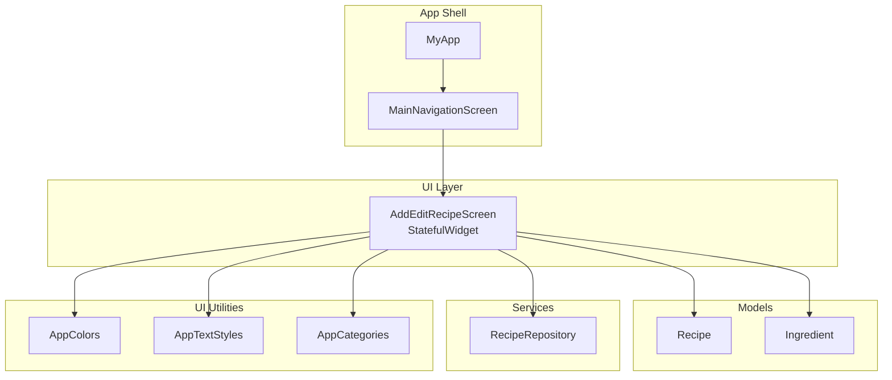
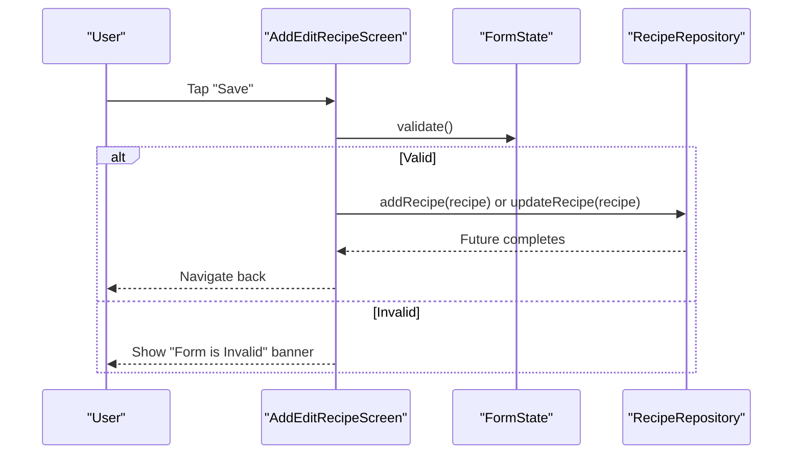
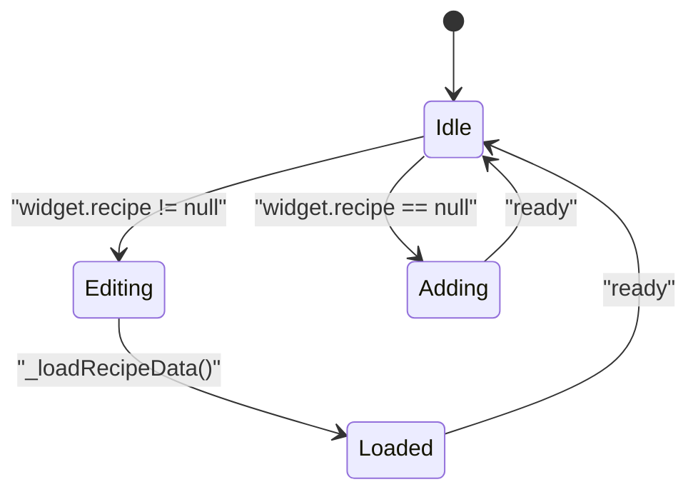
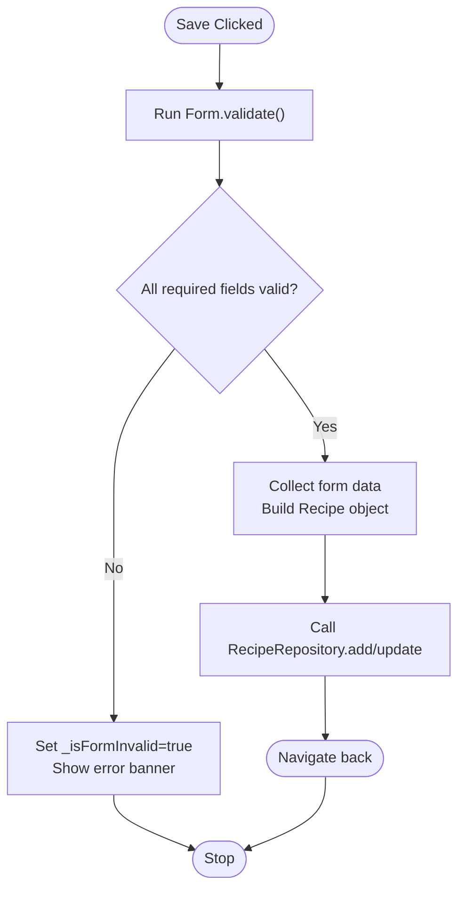
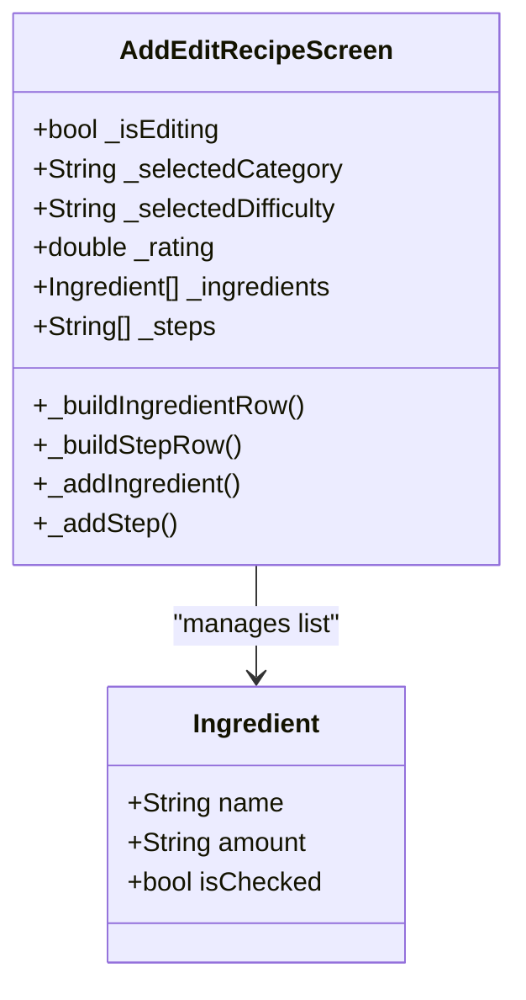
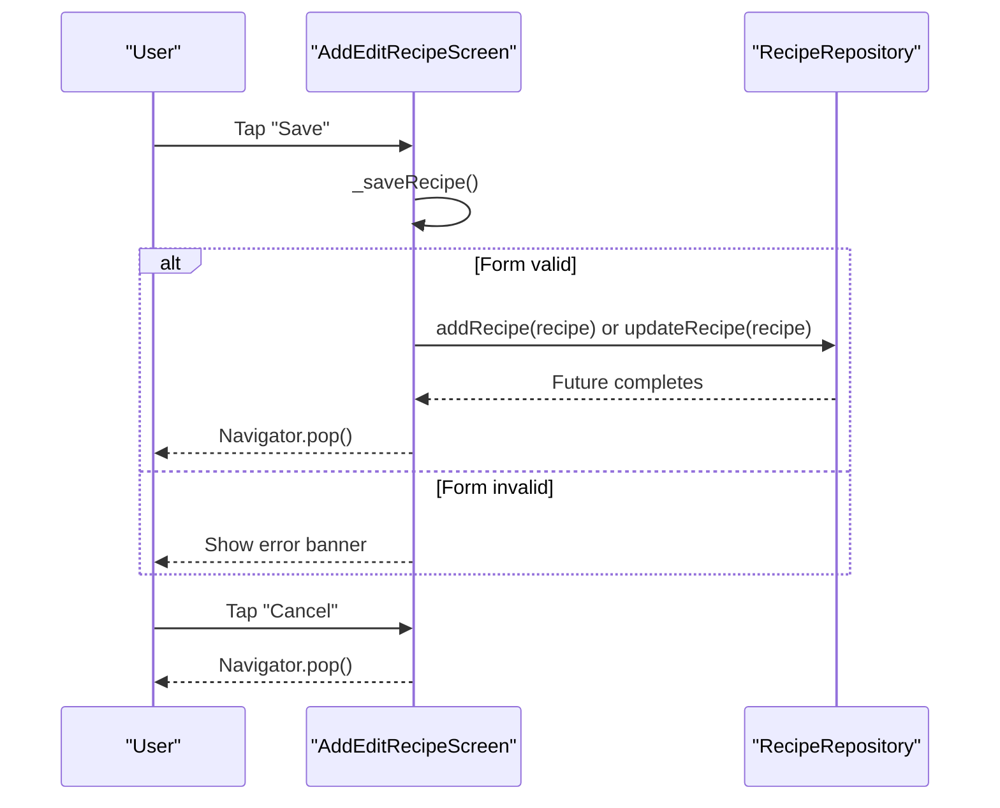
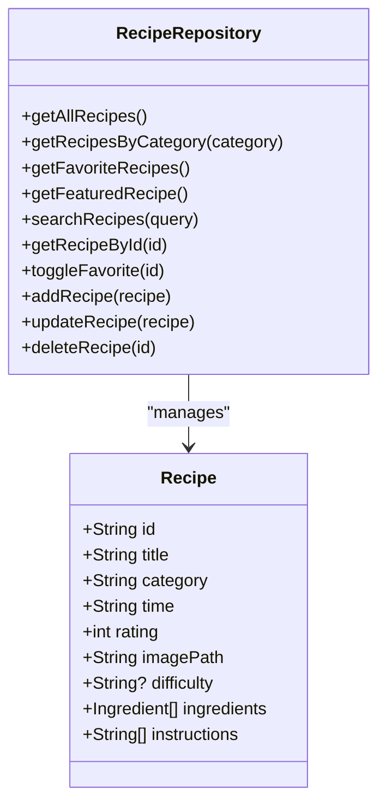
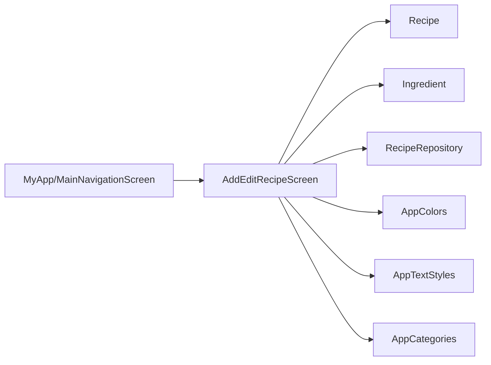

# Add/Edit Recipe Screen

<cite>
**Referenced Files in This Document**
- [add_edit_recipe_screen.dart](file://lib/screens/add_edit_recipe_screen.dart)
- [recipe.dart](file://lib/models/recipe.dart)
- [api_service.dart](file://lib/services/api_service.dart)
- [constants.dart](file://lib/utils/constants.dart)
- [main.dart](file://lib/main.dart)
</cite>

## Table of Contents
1. [Introduction](#introduction)
2. [Project Structure](#project-structure)
3. [Core Components](#core-components)
4. [Architecture Overview](#architecture-overview)
5. [Detailed Component Analysis](#detailed-component-analysis)
6. [Dependency Analysis](#dependency-analysis)
7. [Performance Considerations](#performance-considerations)
8. [Troubleshooting Guide](#troubleshooting-guide)
9. [Conclusion](#conclusion)

## Introduction
This document explains the Add/Edit Recipe Screen implementation for creating and modifying recipes. It covers the screen architecture, form validation, input handling, data persistence, image URL handling, ingredient and instruction management, and the integration with the RecipeRepository. It also documents the save and cancel workflows, error handling, and user experience patterns for recipe creation and editing.

## Project Structure
The Add/Edit Recipe Screen is implemented as a Flutter StatefulWidget. It integrates with:
- Models for Recipe and Ingredient data structures
- A service/repository layer for data operations
- Shared UI constants and styles
- Navigation from the main app entry point

**Diagram sources**
- [add_edit_recipe_screen.dart:6-16](file://lib/screens/add_edit_recipe_screen.dart#L6-L16)
- [recipe.dart:2-27](file://lib/models/recipe.dart#L2-L27)
- [api_service.dart:4-176](file://lib/services/api_service.dart#L4-L176)
- [constants.dart:4-117](file://lib/utils/constants.dart#L4-L117)
- [main.dart:15-33](file://lib/main.dart#L15-L33)

**Section sources**
- [add_edit_recipe_screen.dart:6-16](file://lib/screens/add_edit_recipe_screen.dart#L6-L16)
- [recipe.dart:2-27](file://lib/models/recipe.dart#L2-L27)
- [api_service.dart:4-176](file://lib/services/api_service.dart#L4-L176)
- [constants.dart:4-117](file://lib/utils/constants.dart#L4-L117)
- [main.dart:15-33](file://lib/main.dart#L15-L33)

## Core Components
- AddEditRecipeScreen: The main screen widget that manages form state, validation, and persistence.
- Recipe model: Immutable data holder for recipe attributes and collections.
- Ingredient model: Data holder for ingredient entries.
- RecipeRepository: In-memory service for CRUD operations on recipes.
- UI constants: Theming and typography used across the screen.

Key responsibilities:
- Form rendering and validation for required fields
- Dynamic ingredient and instruction rows
- Category selection and difficulty toggles
- Rating slider and optional image URL field
- Save/cancel navigation and feedback

**Section sources**
- [add_edit_recipe_screen.dart:6-16](file://lib/screens/add_edit_recipe_screen.dart#L6-L16)
- [recipe.dart:2-27](file://lib/models/recipe.dart#L2-L27)
- [api_service.dart:4-176](file://lib/services/api_service.dart#L4-L176)
- [constants.dart:4-117](file://lib/utils/constants.dart#L4-L117)

## Architecture Overview
The screen follows a unidirectional data flow:
- UI collects user input via controllers and state variables
- Validation runs on save
- On success, the screen prepares a Recipe object and delegates persistence to RecipeRepository
- Navigation returns to the previous screen after save

**Diagram sources**
- [add_edit_recipe_screen.dart:179-186](file://lib/screens/add_edit_recipe_screen.dart#L179-L186)
- [api_service.dart:159-170](file://lib/services/api_service.dart#L159-L170)

## Detailed Component Analysis

### Screen State and Lifecycle
- Maintains separate TextEditingController instances for title, cook time, and image URL
- Tracks category, difficulty, rating, ingredients, and steps
- Loads existing recipe data when editing
- Disposes controllers on dispose

**Diagram sources**
- [add_edit_recipe_screen.dart:35-55](file://lib/screens/add_edit_recipe_screen.dart#L35-L55)

**Section sources**
- [add_edit_recipe_screen.dart:18-63](file://lib/screens/add_edit_recipe_screen.dart#L18-L63)

### Form Fields and Validation
Required fields validated on save:
- Recipe Title: Non-empty
- Cook Time (minutes): Required numeric value
- Ingredients: At least one ingredient row
- Instructions: At least one step

Optional fields:
- Image URL: Free-text input
- Difficulty: One of Easy/Medium/Hard
- Category: One of predefined categories excluding "All"
- Rating: Slider from 0 to 5

Validation feedback:
- A red banner appears when the form fails validation
- Individual TextFormField validators provide inline feedback

**Diagram sources**
- [add_edit_recipe_screen.dart:117-133](file://lib/screens/add_edit_recipe_screen.dart#L117-L133)
- [add_edit_recipe_screen.dart:179-186](file://lib/screens/add_edit_recipe_screen.dart#L179-L186)

**Section sources**
- [add_edit_recipe_screen.dart:117-133](file://lib/screens/add_edit_recipe_screen.dart#L117-L133)
- [add_edit_recipe_screen.dart:92-111](file://lib/screens/add_edit_recipe_screen.dart#L92-L111)

### Input Handling and Dynamic Rows
- Ingredients: Two-column rows with name and amount; supports adding/removing
- Instructions: Numbered rows with multi-line text; supports adding/removing
- Category dropdown: Excludes "All" from choices
- Difficulty toggle: Three-choice segmented control
- Rating slider: Continuous adjustment with discrete steps

**Diagram sources**
- [add_edit_recipe_screen.dart:292-340](file://lib/screens/add_edit_recipe_screen.dart#L292-L340)
- [recipe.dart:59-81](file://lib/models/recipe.dart#L59-L81)

**Section sources**
- [add_edit_recipe_screen.dart:167-177](file://lib/screens/add_edit_recipe_screen.dart#L167-L177)
- [add_edit_recipe_screen.dart:292-340](file://lib/screens/add_edit_recipe_screen.dart#L292-L340)

### Image Upload and Preview
- Image URL is captured via a text field
- No built-in image picker or preview widget is present in the current implementation
- The repository stores the provided image URL as-is

Recommendation:
- Integrate an image picker and preview widget for improved UX
- Validate URLs and handle network failures gracefully

**Section sources**
- [add_edit_recipe_screen.dart:136-140](file://lib/screens/add_edit_recipe_screen.dart#L136-L140)
- [recipe.dart:8-8](file://lib/models/recipe.dart#L8-L8)

### Save and Cancel Workflows
- Save:
  - Validates the form
  - On success, persists via RecipeRepository
  - Navigates back to the previous screen
- Cancel:
  - Dismisses the screen without saving

**Diagram sources**
- [add_edit_recipe_screen.dart:179-186](file://lib/screens/add_edit_recipe_screen.dart#L179-L186)
- [api_service.dart:159-170](file://lib/services/api_service.dart#L159-L170)

**Section sources**
- [add_edit_recipe_screen.dart:72-85](file://lib/screens/add_edit_recipe_screen.dart#L72-L85)
- [add_edit_recipe_screen.dart:179-186](file://lib/screens/add_edit_recipe_screen.dart#L179-L186)

### Data Persistence and Repository Integration
- RecipeRepository provides:
  - Add new recipe
  - Update existing recipe
  - Delete recipe
  - Retrieve lists by category, favorites, featured, and search
- Current screen uses the repository but does not implement the full save logic in the provided code

**Diagram sources**
- [api_service.dart:4-176](file://lib/services/api_service.dart#L4-L176)
- [recipe.dart:2-27](file://lib/models/recipe.dart#L2-L27)

**Section sources**
- [api_service.dart:159-170](file://lib/services/api_service.dart#L159-L170)
- [recipe.dart:2-27](file://lib/models/recipe.dart#L2-L27)

### UI Theming and Categories
- Uses AppColors and AppTextStyles for consistent theming
- Categories and difficulty levels are defined centrally

**Section sources**
- [constants.dart:4-117](file://lib/utils/constants.dart#L4-L117)
- [add_edit_recipe_screen.dart:232-260](file://lib/screens/add_edit_recipe_screen.dart#L232-L260)

## Dependency Analysis
- AddEditRecipeScreen depends on:
  - Recipe model for data representation
  - RecipeRepository for persistence
  - AppColors/AppTextStyles/AppCategories for UI
- Navigation is handled by the app shell; the screen triggers Navigator.pop on success

**Diagram sources**
- [add_edit_recipe_screen.dart:1-5](file://lib/screens/add_edit_recipe_screen.dart#L1-L5)
- [recipe.dart:2-81](file://lib/models/recipe.dart#L2-L81)
- [api_service.dart:4-176](file://lib/services/api_service.dart#L4-L176)
- [constants.dart:4-117](file://lib/utils/constants.dart#L4-L117)
- [main.dart:15-33](file://lib/main.dart#L15-L33)

**Section sources**
- [add_edit_recipe_screen.dart:1-5](file://lib/screens/add_edit_recipe_screen.dart#L1-L5)
- [main.dart:86-98](file://lib/main.dart#L86-L98)

## Performance Considerations
- Using a single Form with GlobalKey improves validation performance
- Stateless helper widgets reduce rebuild scope
- Consider lazy loading or pagination for large recipe lists if extended beyond current scope
- Avoid unnecessary setState calls; batch updates when adding/removing rows

## Troubleshooting Guide
Common issues and resolutions:
- Form remains invalid:
  - Ensure required fields are populated
  - Verify at least one ingredient and one instruction row exists
- Save does nothing:
  - Confirm the repository method is called and awaited
  - Check that the screen navigates back after persistence
- Image URL not displayed:
  - No preview widget is implemented; integrate an image widget to render the URL
- Navigation problems:
  - Ensure Navigator.pop is invoked after successful save

**Section sources**
- [add_edit_recipe_screen.dart:92-111](file://lib/screens/add_edit_recipe_screen.dart#L92-L111)
- [add_edit_recipe_screen.dart:179-186](file://lib/screens/add_edit_recipe_screen.dart#L179-L186)

## Conclusion
The Add/Edit Recipe Screen provides a robust foundation for recipe creation and editing with clear validation, dynamic ingredient/instruction management, and repository integration. Enhancements such as image preview, richer validation, and explicit success/error feedback would further improve the user experience and data integrity.