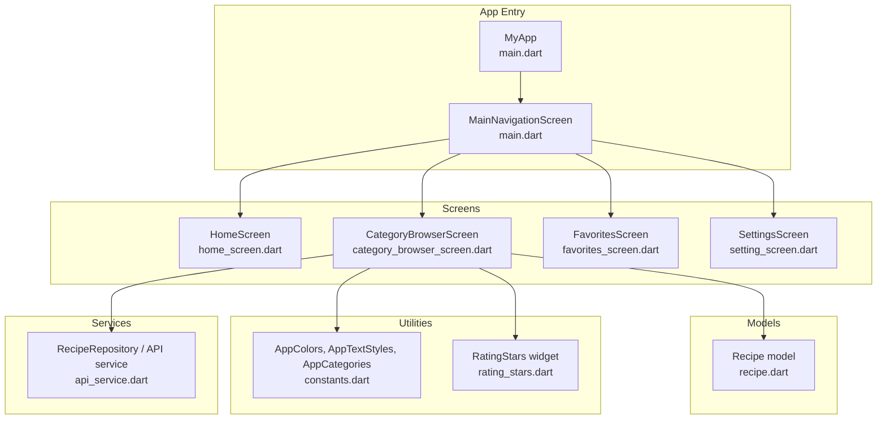
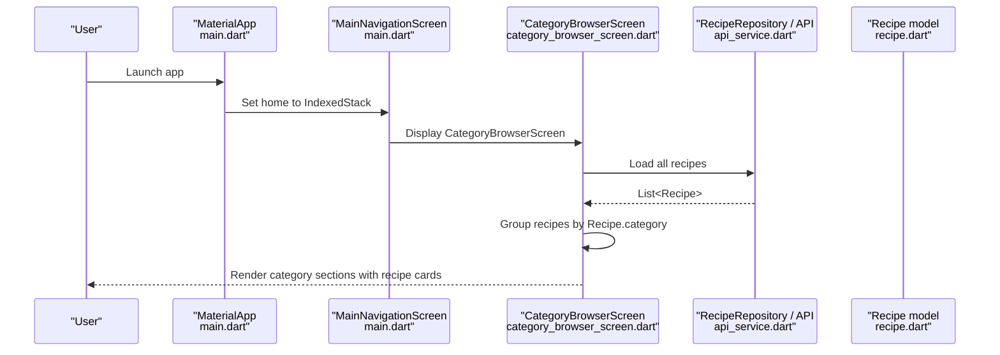
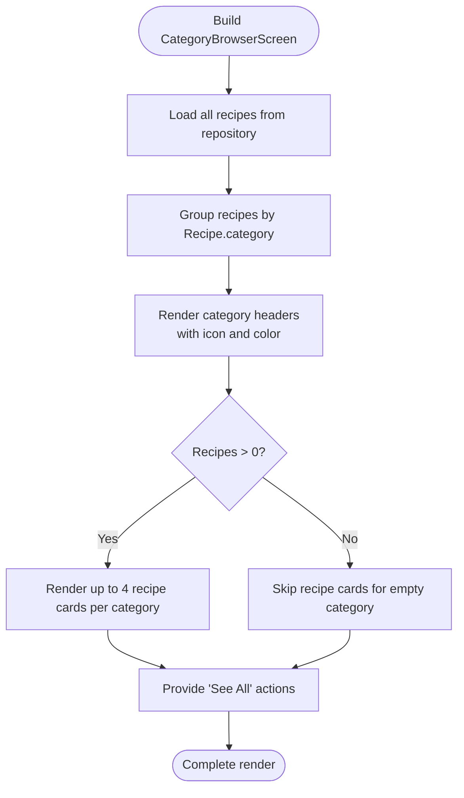
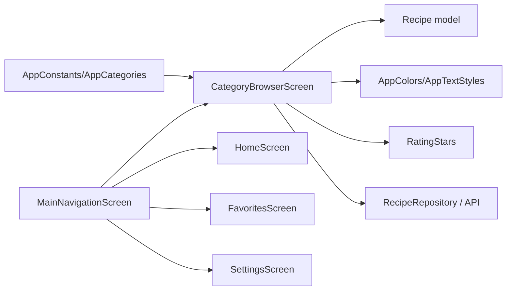

# Category Browser Screen

<cite>
**Referenced Files in This Document**
- [category_browser_screen.dart](file://lib/screens/category_browser_screen.dart)
- [main.dart](file://lib/main.dart)
- [recipe.dart](file://lib/models/recipe.dart)
- [constants.dart](file://lib/utils/constants.dart)
- [rating_stars.dart](file://lib/widgets/rating_stars.dart)
- [api_service.dart](file://lib/services/api_service.dart)
</cite>

## Table of Contents
1. [Introduction](#introduction)
2. [Project Structure](#project-structure)
3. [Core Components](#core-components)
4. [Architecture Overview](#architecture-overview)
5. [Detailed Component Analysis](#detailed-component-analysis)
6. [Dependency Analysis](#dependency-analysis)
7. [Performance Considerations](#performance-considerations)
8. [Troubleshooting Guide](#troubleshooting-guide)
9. [Conclusion](#conclusion)

## Introduction
This document provides comprehensive documentation for the CategoryBrowserScreen implementation. It explains the screen design for browsing recipes by categories, including category selection interface, recipe filtering mechanisms, category display logic, recipe count indicators, and category-specific recipe loading. It also covers integration with the category system, filtering algorithms, recipe display within category context, navigation patterns between categories and recipe details, performance optimizations for category-based filtering, and user experience considerations for category exploration. Finally, it addresses the relationship with the main home screen category system and consistency in category handling across the application.

## Project Structure
The CategoryBrowserScreen resides in the screens layer and integrates with models, utilities, and widgets to render categorized recipes. The main application entry point defines the bottom navigation that includes CategoryBrowserScreen alongside HomeScreen, FavoritesScreen, and SettingsScreen.

**Diagram sources**
- [main.dart:36-100](file://lib/main.dart#L36-L100)
- [category_browser_screen.dart:1-262](file://lib/screens/category_browser_screen.dart#L1-L262)
- [recipe.dart:1-82](file://lib/models/recipe.dart#L1-L82)
- [constants.dart:1-124](file://lib/utils/constants.dart#L1-L124)
- [rating_stars.dart:1-42](file://lib/widgets/rating_stars.dart#L1-L42)
- [api_service.dart](file://lib/services/api_service.dart)

**Section sources**
- [main.dart:1-100](file://lib/main.dart#L1-L100)
- [category_browser_screen.dart:1-262](file://lib/screens/category_browser_screen.dart#L1-L262)

## Core Components
- CategoryBrowserScreen: Stateless widget responsible for grouping recipes by category, rendering category headers with icons and colors, displaying recipe cards per category, and providing navigation affordances.
- Recipe model: Defines recipe attributes including category, used for grouping and filtering.
- AppColors and AppTextStyles: Provide consistent theming for category headers and recipe cards.
- RatingStars widget: Renders star ratings for recipes within cards.
- RecipeRepository/API service: Supplies recipe data used for grouping and display.

Key responsibilities:
- Group recipes by category using the category field from the Recipe model.
- Render category headers with icons and colors mapped to predefined categories.
- Display up to four recipe cards per category row, with responsive layout.
- Provide "See All" action per category (placeholder for future navigation).
- Integrate with global theme and typography constants.

**Section sources**
- [category_browser_screen.dart:8-262](file://lib/screens/category_browser_screen.dart#L8-L262)
- [recipe.dart:1-82](file://lib/models/recipe.dart#L1-L82)
- [constants.dart:4-124](file://lib/utils/constants.dart#L4-L124)
- [rating_stars.dart:1-42](file://lib/widgets/rating_stars.dart#L1-L42)

## Architecture Overview
The CategoryBrowserScreen follows a presentation-focused architecture:
- Data source: RecipeRepository (via API service) supplies Recipe objects.
- Presentation logic: Groups recipes by category and renders category sections.
- Styling: Uses AppColors and AppTextStyles for consistent visuals.
- Interaction: Back navigation via AppBar, placeholder "See All" actions.

**Diagram sources**
- [main.dart:15-100](file://lib/main.dart#L15-L100)
- [category_browser_screen.dart:12-57](file://lib/screens/category_browser_screen.dart#L12-L57)
- [api_service.dart](file://lib/services/api_service.dart)
- [recipe.dart:1-82](file://lib/models/recipe.dart#L1-L82)

## Detailed Component Analysis

### CategoryBrowserScreen Implementation
Responsibilities:
- Build the screen scaffold with AppBar and body.
- Retrieve all recipes from the repository.
- Group recipes by category using a map keyed by category names.
- Render category headers with icons and colors.
- Display recipe cards per category with image, favorite indicator, rating, difficulty badge, and timing.
- Provide navigation affordances (back button, "See All" buttons).

Category display logic:
- Icons and colors are mapped per category using dedicated helper methods.
- Category headers show the category name, recipe count, and a "See All" action.
- Up to two rows of recipe cards are rendered per category (up to four recipes total), with responsive expanded layout.

Filtering mechanism:
- Filtering is implicit by category via grouping; no explicit filter UI is present in this screen.
- Future enhancements could integrate chip filters or search to narrow displayed categories.

Recipe count indicators:
- Count is shown inline with the category header in parentheses.

Category-specific recipe loading:
- Recipes are loaded once during build and grouped locally.
- For large datasets, consider moving grouping to a background computation or precomputing category indices.

Navigation patterns:
- Back navigation handled via AppBar back button.
- "See All" buttons are placeholders for navigating to a category-specific detail or filtered list screen.

**Diagram sources**
- [category_browser_screen.dart:12-157](file://lib/screens/category_browser_screen.dart#L12-L157)
- [recipe.dart:1-82](file://lib/models/recipe.dart#L1-L82)

**Section sources**
- [category_browser_screen.dart:8-262](file://lib/screens/category_browser_screen.dart#L8-L262)

### Category Mapping and Theming
- Category-to-icon mapping supports Breakfast, Lunch, Dinner, Dessert, and a default fallback.
- Category-to-color mapping provides accent colors for themed headers.
- AppColors and AppTextStyles ensure consistent visuals across the app.

**Section sources**
- [category_browser_screen.dart:59-87](file://lib/screens/category_browser_screen.dart#L59-L87)
- [constants.dart:4-124](file://lib/utils/constants.dart#L4-L124)

### Recipe Card Rendering
- Recipe cards include image with fallback, favorite indicator, title, rating via RatingStars, difficulty badge, and cooking time.
- Layout uses ClipRRect for images and Stack positioning for favorite badges.
- RatingStars widget receives rating value and formatting options.

**Section sources**
- [category_browser_screen.dart:159-260](file://lib/screens/category_browser_screen.dart#L159-L260)
- [rating_stars.dart:1-42](file://lib/widgets/rating_stars.dart#L1-L42)

### Integration with Navigation and Main Home System
- CategoryBrowserScreen is included in MainNavigationScreen's IndexedStack, making it a primary tab alongside HomeScreen, FavoritesScreen, and SettingsScreen.
- Consistency in category handling across the app relies on shared constants and models.

**Section sources**
- [main.dart:36-100](file://lib/main.dart#L36-L100)
- [category_browser_screen.dart:12-57](file://lib/screens/category_browser_screen.dart#L12-L57)

## Dependency Analysis
Direct dependencies:
- CategoryBrowserScreen depends on:
  - Recipe model for category and display data.
  - AppColors and AppTextStyles for theming.
  - RatingStars widget for rating display.
  - RecipeRepository/API service for recipe data.

Indirect dependencies:
- MainNavigationScreen composes CategoryBrowserScreen as one of its tabs.
- AppConstants and AppCategories define category taxonomy used by screens.

**Diagram sources**
- [category_browser_screen.dart:1-262](file://lib/screens/category_browser_screen.dart#L1-L262)
- [main.dart:36-100](file://lib/main.dart#L36-L100)
- [recipe.dart:1-82](file://lib/models/recipe.dart#L1-L82)
- [constants.dart:101-117](file://lib/utils/constants.dart#L101-L117)

**Section sources**
- [category_browser_screen.dart:1-262](file://lib/screens/category_browser_screen.dart#L1-L262)
- [main.dart:36-100](file://lib/main.dart#L36-L100)
- [constants.dart:101-117](file://lib/utils/constants.dart#L101-L117)

## Performance Considerations
- Current implementation loads all recipes and groups them in memory during each build. For large datasets:
  - Move grouping to a background thread or precompute category indices.
  - Use lazy loading or pagination for recipe lists.
  - Cache grouped results and invalidate on data changes.
- Image loading includes error handling with a fallback icon; consider adding placeholders and caching for improved perceived performance.
- The "See All" action is currently a placeholder; implementing efficient category filtering would reduce unnecessary re-renders.

[No sources needed since this section provides general guidance]

## Troubleshooting Guide
Common issues and resolutions:
- Missing category icons/colors: Verify category names match the mapping logic in the screen.
- Empty category sections: Ensure the recipe dataset includes entries with valid category values.
- Image display failures: Confirm image paths exist or rely on the built-in error builder fallback.
- Navigation inconsistencies: Ensure navigation actions consistently route to category-aware screens.

**Section sources**
- [category_browser_screen.dart:59-87](file://lib/screens/category_browser_screen.dart#L59-L87)
- [category_browser_screen.dart:174-184](file://lib/screens/category_browser_screen.dart#L174-L184)

## Conclusion
The CategoryBrowserScreen provides an intuitive, visually consistent way to browse recipes by category. It leverages a clean separation of concerns with a presentation-focused screen, centralized theming, and reusable widgets. To enhance scalability and user experience, consider introducing explicit filtering controls, optimizing data loading and grouping, and implementing robust navigation to category-specific views. Aligning category taxonomy and handling across screens ensures consistency and a cohesive user journey from the main home screen to category exploration and recipe details.