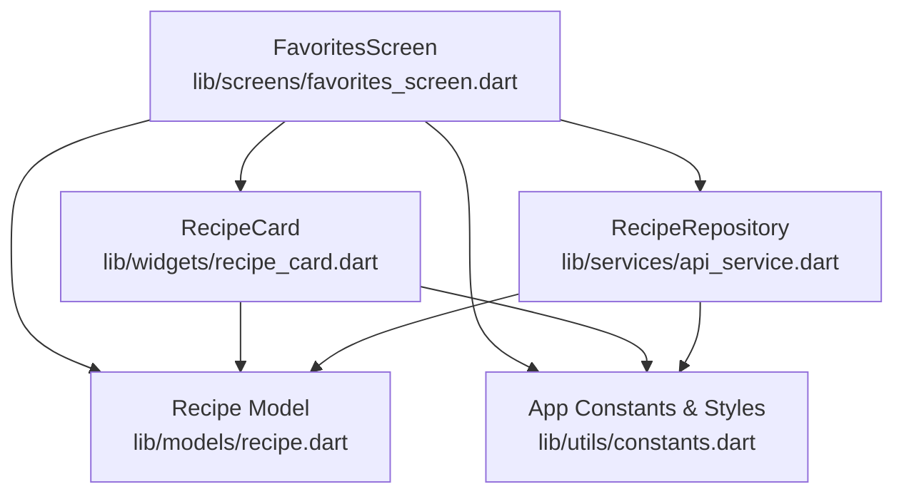
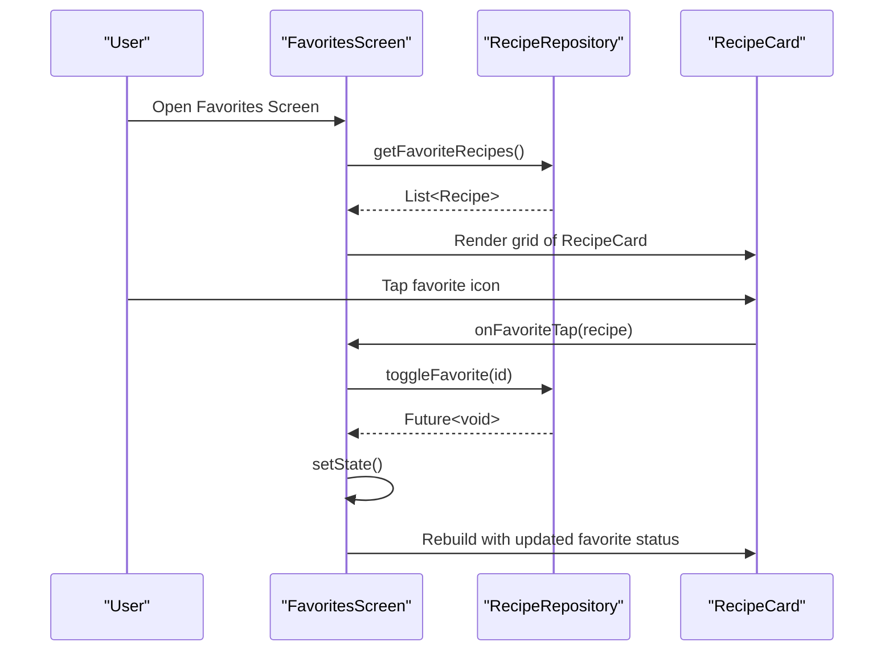
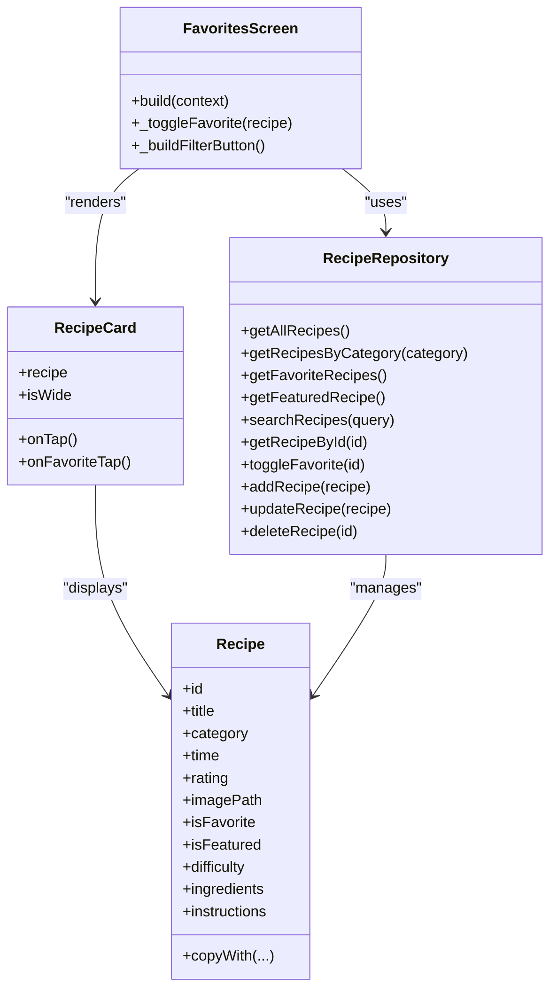

# Favorites Screen

<cite>
**Referenced Files in This Document**
- [favorites_screen.dart](file://lib/screens/favorites_screen.dart)
- [api_service.dart](file://lib/services/api_service.dart)
- [recipe_card.dart](file://lib/widgets/recipe_card.dart)
- [recipe.dart](file://lib/models/recipe.dart)
- [constants.dart](file://lib/utils/constants.dart)
</cite>

## Table of Contents
1. [Introduction](#introduction)
2. [Project Structure](#project-structure)
3. [Core Components](#core-components)
4. [Architecture Overview](#architecture-overview)
5. [Detailed Component Analysis](#detailed-component-analysis)
6. [Dependency Analysis](#dependency-analysis)
7. [Performance Considerations](#performance-considerations)
8. [Troubleshooting Guide](#troubleshooting-guide)
9. [Conclusion](#conclusion)

## Introduction
This document provides comprehensive documentation for the FavoritesScreen implementation, focusing on the screen architecture for managing a user's favorite recipes collection. It explains how favorite recipes are retrieved, how empty states are handled with placeholder content, and how recipe removal is integrated through the RecipeRepository. The UI layout for displaying favorites in a grid format is documented, including favorite status indicators and action buttons. The integration with the RecipeRepository for favorite management, state updates when favorites change, and navigation to recipe details are addressed. Performance considerations for large favorite collections and user experience patterns for managing saved recipes are also included.

## Project Structure
The FavoritesScreen resides in the screens directory and orchestrates the presentation of favorite recipes. It relies on the RecipeRepository for data access, the Recipe model for data representation, and the RecipeCard widget for rendering individual recipe items. Theming and typography are centralized in the constants utility.

**Diagram sources**
- [favorites_screen.dart](file://lib/screens/favorites_screen.dart)
- [api_service.dart](file://lib/services/api_service.dart)
- [recipe_card.dart](file://lib/widgets/recipe_card.dart)
- [recipe.dart](file://lib/models/recipe.dart)
- [constants.dart](file://lib/utils/constants.dart)

**Section sources**
- [favorites_screen.dart](file://lib/screens/favorites_screen.dart)
- [api_service.dart](file://lib/services/api_service.dart)
- [recipe_card.dart](file://lib/widgets/recipe_card.dart)
- [recipe.dart](file://lib/models/recipe.dart)
- [constants.dart](file://lib/utils/constants.dart)

## Core Components
- FavoritesScreen: A stateful screen that renders favorite recipes in a grid layout, handles empty state display, and manages favorite toggling via the RecipeRepository.
- RecipeRepository: Provides methods to retrieve favorite recipes, toggle favorite status, and manage the recipe collection.
- RecipeCard: A reusable widget that displays recipe details, including image, title, category chip, rating, cook time, and favorite toggle button.
- Recipe model: Defines the recipe data structure and supports immutable updates through copyWith.
- App constants and styles: Centralizes color and typography definitions for consistent theming.

Key responsibilities:
- FavoritesScreen fetches favorite recipes from RecipeRepository and builds a grid UI.
- RecipeCard displays favorite status and triggers onFavoriteTap callbacks.
- RecipeRepository encapsulates data access and mutation for favorites.

**Section sources**
- [favorites_screen.dart](file://lib/screens/favorites_screen.dart)
- [api_service.dart](file://lib/services/api_service.dart)
- [recipe_card.dart](file://lib/widgets/recipe_card.dart)
- [recipe.dart](file://lib/models/recipe.dart)
- [constants.dart](file://lib/utils/constants.dart)

## Architecture Overview
The FavoritesScreen follows a unidirectional data flow:
- Data retrieval: FavoritesScreen queries RecipeRepository for favorite recipes.
- UI rendering: The screen conditionally renders either an empty state or a grid of RecipeCard widgets.
- Interaction: Tapping the favorite icon in RecipeCard invokes toggleFavorite, which updates the repository and refreshes the UI.

**Diagram sources**
- [favorites_screen.dart](file://lib/screens/favorites_screen.dart)
- [api_service.dart](file://lib/services/api_service.dart)
- [recipe_card.dart](file://lib/widgets/recipe_card.dart)

## Detailed Component Analysis

### FavoritesScreen
Responsibilities:
- Fetches favorite recipes from RecipeRepository.
- Renders a header with a filter button and a grid of RecipeCard widgets.
- Handles empty state by displaying a centered message when no favorites exist.
- Implements favorite toggling by calling RecipeRepository.toggleFavorite and refreshing the UI.

UI Layout:
- Uses a CustomScrollView with Slivers for responsive scrolling.
- Header row contains the screen title and a filter container.
- Empty state: Centered message indicating no favorites.
- Grid layout: Two-column grid with spacing and aspect ratio configured for recipe cards.

Favorite Management:
- Favorite toggling is performed via a callback passed to RecipeCard.
- After toggling, setState triggers a rebuild to reflect the updated favorite status.

Navigation:
- The current implementation passes an onTap callback to RecipeCard but does not show navigation logic in the provided code. The typical pattern would involve navigating to a recipe details screen upon tapping a recipe item.

Empty State Handling:
- When the favorite list is empty, a SliverToBoxAdapter displays a centered message with appropriate styling.

Filter Button:
- A decorative filter container with an arrow icon and label is included in the header.

**Section sources**
- [favorites_screen.dart](file://lib/screens/favorites_screen.dart)

### RecipeRepository
Responsibilities:
- Maintains an internal list of recipes.
- Provides methods to retrieve all recipes, filter by category, search by title, and fetch featured recipes.
- Exposes getFavoriteRecipes to return only recipes marked as favorites.
- Implements toggleFavorite to flip the favorite flag for a given recipe ID.

Favorite Retrieval Logic:
- getFavoriteRecipes filters the internal recipe list using the isFavorite property.

Toggle Mechanism:
- toggleFavorite locates the recipe by ID and creates a new Recipe instance with the inverted favorite flag using copyWith.

Data Mutations:
- Methods for adding, updating, and deleting recipes are present for completeness, though the FavoritesScreen primarily uses getFavoriteRecipes and toggleFavorite.

**Section sources**
- [api_service.dart](file://lib/services/api_service.dart)

### RecipeCard
Responsibilities:
- Displays recipe metadata including title, category chip, rating, and cook time.
- Shows an overlay favorite button with dynamic icon and color based on favorite status.
- Supports optional onTap and onFavoriteTap callbacks for integration with parent screens.

Favorite Indicator:
- The favorite button uses Icons.favorite or Icons.favorite_border depending on isFavorite.
- Colors are selected from AppColors for consistent theming.

Layout:
- Uses a column layout with an image area and a content area below.
- Category chip, timing, and rating are aligned horizontally for readability.

Compact vs Standard:
- The widget includes a CompactRecipeCard variant optimized for grid layouts with smaller typography and tighter spacing.

**Section sources**
- [recipe_card.dart](file://lib/widgets/recipe_card.dart)
- [constants.dart](file://lib/utils/constants.dart)

### Recipe Model
Responsibilities:
- Encapsulates recipe attributes such as id, title, category, time, rating, imagePath, and favorite status.
- Provides a copyWith method to create updated instances with immutable semantics.

Data Integrity:
- Immutable construction ensures predictable UI updates when combined with setState.

**Section sources**
- [recipe.dart](file://lib/models/recipe.dart)

### Theming and Typography
Responsibilities:
- AppColors defines background, accent, text, and status colors used across the app.
- AppTextStyles centralizes font sizes and weights for consistent typography.

Integration:
- FavoritesScreen and RecipeCard consume these constants for background colors, text styles, and favorite icon colors.

**Section sources**
- [constants.dart](file://lib/utils/constants.dart)

## Dependency Analysis
The FavoritesScreen depends on the RecipeRepository for data and on the RecipeCard widget for rendering. The RecipeCard depends on the Recipe model and constants for styling. The RecipeRepository depends on the Recipe model for data operations.

**Diagram sources**
- [favorites_screen.dart](file://lib/screens/favorites_screen.dart)
- [api_service.dart](file://lib/services/api_service.dart)
- [recipe_card.dart](file://lib/widgets/recipe_card.dart)
- [recipe.dart](file://lib/models/recipe.dart)

**Section sources**
- [favorites_screen.dart](file://lib/screens/favorites_screen.dart)
- [api_service.dart](file://lib/services/api_service.dart)
- [recipe_card.dart](file://lib/widgets/recipe_card.dart)
- [recipe.dart](file://lib/models/recipe.dart)

## Performance Considerations
- Data Filtering: getFavoriteRecipes performs a linear filter operation over the recipe list. For large collections, consider indexing favorites or maintaining a separate set of favorite IDs to reduce filtering overhead.
- UI Rendering: The grid uses SliverGrid with a fixed cross-axis count. For very large lists, consider virtualization and lazy loading to minimize memory usage.
- State Updates: setState triggers a full rebuild of the FavoritesScreen subtree. If performance becomes an issue, isolate the grid rendering and use keys to optimize rebuilds.
- Image Loading: RecipeCard uses Image.asset. For large images or many concurrent loads, consider caching and placeholder strategies to improve perceived performance.
- Favorite Toggling: toggleFavorite creates a new Recipe instance via copyWith. While immutable updates are beneficial for UI predictability, repeated mutations can cause churn. Batch updates or debouncing favorite toggles may help for rapid user interactions.

## Troubleshooting Guide
Common issues and resolutions:
- Favorites not updating after toggle: Ensure setState is called after toggleFavorite completes. Verify that the callback chain reaches FavoritesScreen and triggers state refresh.
- Empty state not appearing: Confirm that getFavoriteRecipes returns an empty list when no recipes are marked as favorites. Check that the conditional rendering logic is executed.
- Favorite icon color or icon not changing: Validate that RecipeCard receives the updated recipe instance and that the favorite status is correctly reflected in the UI.
- Navigation to recipe details: If navigation is expected on tap, ensure the onTap callback is implemented in FavoritesScreen and properly wired to navigate to the recipe details screen.

**Section sources**
- [favorites_screen.dart](file://lib/screens/favorites_screen.dart)
- [recipe_card.dart](file://lib/widgets/recipe_card.dart)
- [api_service.dart](file://lib/services/api_service.dart)

## Conclusion
The FavoritesScreen provides a clean and efficient way to manage and display a user's favorite recipes. By leveraging the RecipeRepository for data access and the RecipeCard widget for rendering, the implementation remains modular and maintainable. The grid layout offers an intuitive browsing experience, while the empty state improves user guidance. With the outlined performance considerations and troubleshooting tips, the screen can scale effectively and deliver a smooth user experience even with larger recipe collections.