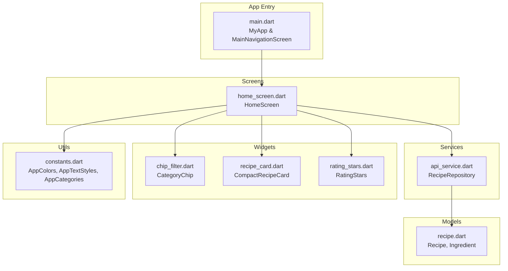
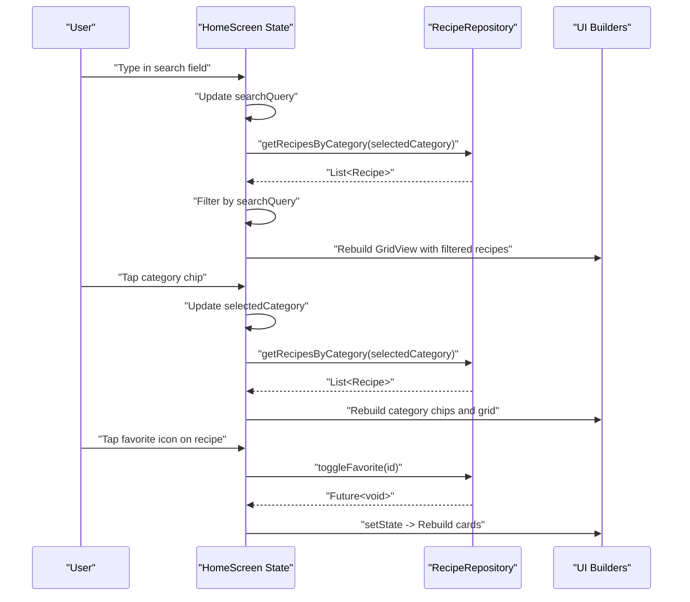
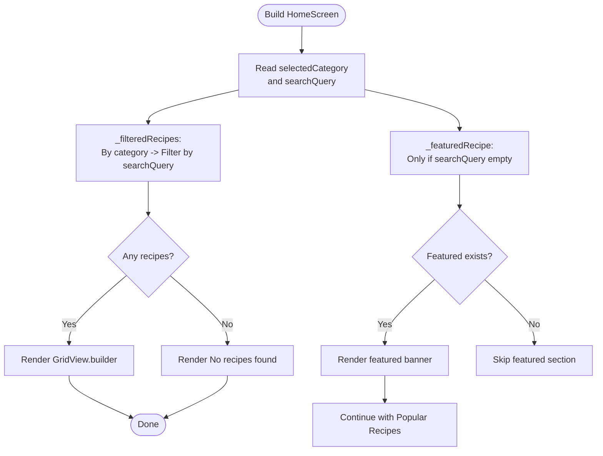
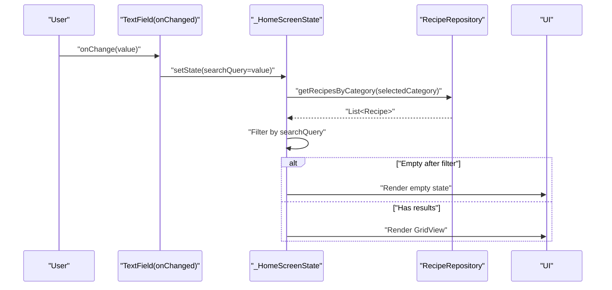
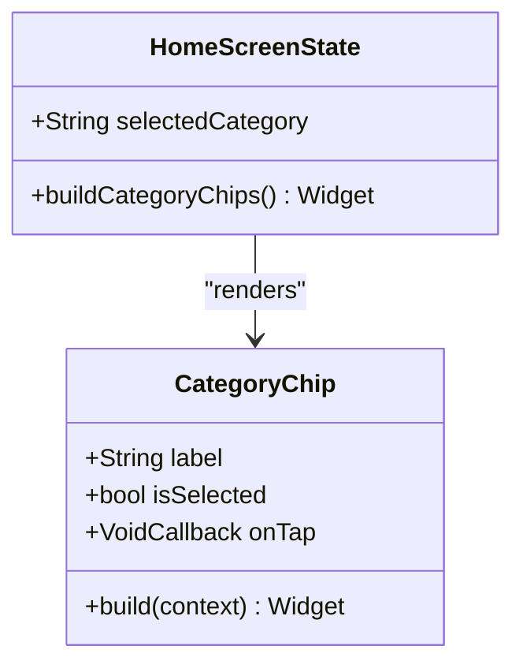
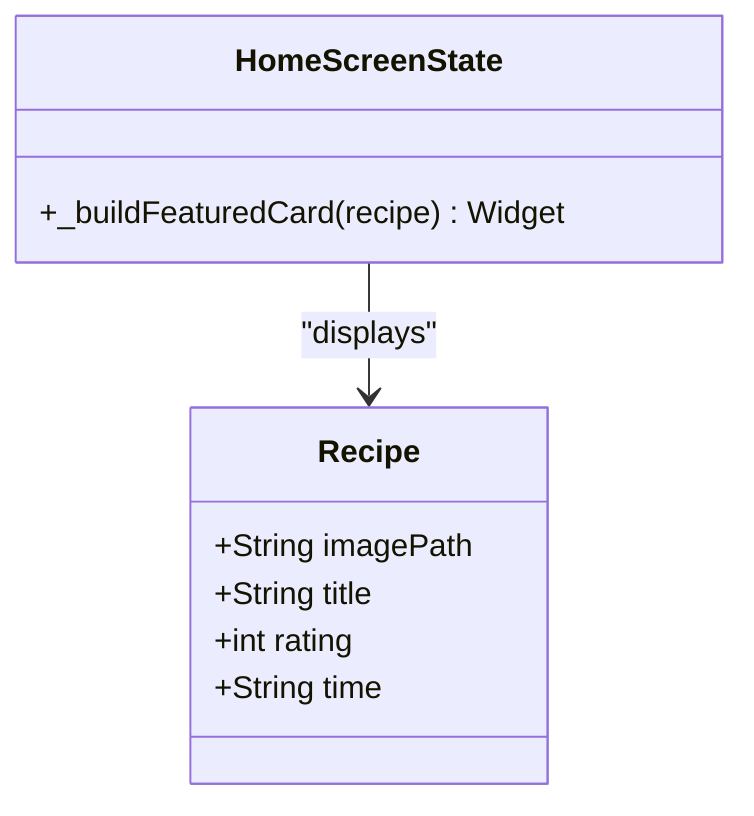
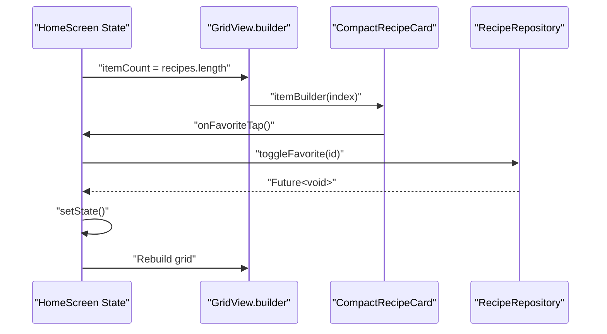
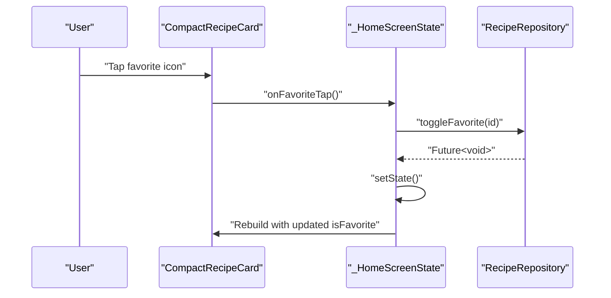
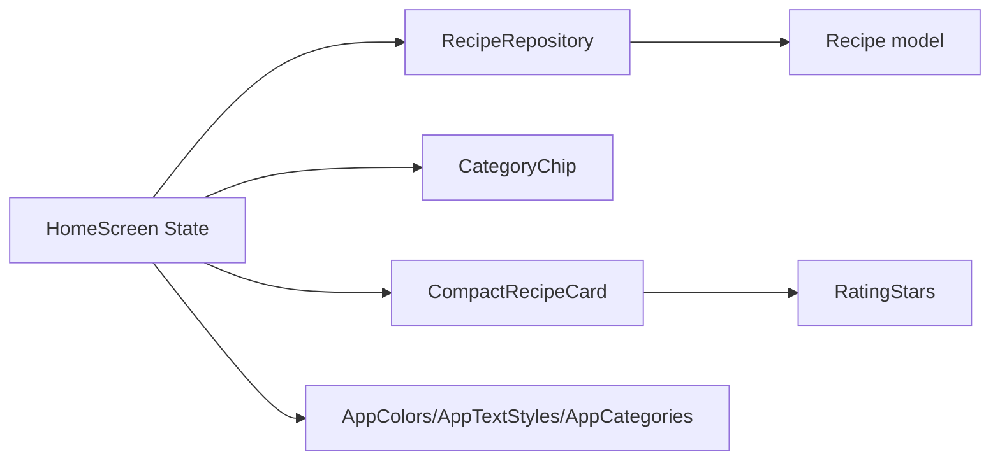

# Home Screen

<cite>
**Referenced Files in This Document**
- [home_screen.dart](file://lib/screens/home_screen.dart)
- [recipe.dart](file://lib/models/recipe.dart)
- [api_service.dart](file://lib/services/api_service.dart)
- [chip_filter.dart](file://lib/widgets/chip_filter.dart)
- [recipe_card.dart](file://lib/widgets/recipe_card.dart)
- [rating_stars.dart](file://lib/widgets/rating_stars.dart)
- [main.dart](file://lib/main.dart)
- [constants.dart](file://lib/utils/constants.dart)
</cite>

## Table of Contents
1. [Introduction](#introduction)
2. [Project Structure](#project-structure)
3. [Core Components](#core-components)
4. [Architecture Overview](#architecture-overview)
5. [Detailed Component Analysis](#detailed-component-analysis)
6. [Dependency Analysis](#dependency-analysis)
7. [Performance Considerations](#performance-considerations)
8. [Troubleshooting Guide](#troubleshooting-guide)
9. [Conclusion](#conclusion)

## Introduction
This document provides comprehensive documentation for the HomeScreen implementation. It explains the screen architecture, including featured recipe display, recipe grid/list views, search functionality, and category filtering. It also documents state management patterns for search queries and category selection, the GridView.builder implementation, the featured recipe banner with gradient overlay, the category chip system, the search field with onChanged callback, recipe filtering logic, empty state handling, favorite toggle functionality, responsive design patterns, and performance optimizations for recipe rendering.

## Project Structure
The HomeScreen resides in the screens directory and integrates tightly with models, services, widgets, and utilities. The main application sets up navigation and theme, while the HomeScreen composes UI elements and orchestrates data retrieval and state updates.

**Diagram sources**
- [main.dart:10-100](file://lib/main.dart#L10-L100)
- [home_screen.dart:1-241](file://lib/screens/home_screen.dart#L1-L241)
- [api_service.dart:4-177](file://lib/services/api_service.dart#L4-L177)
- [recipe.dart:1-82](file://lib/models/recipe.dart#L1-L82)
- [chip_filter.dart:1-39](file://lib/widgets/chip_filter.dart#L1-L39)
- [recipe_card.dart:148-247](file://lib/widgets/recipe_card.dart#L148-L247)
- [rating_stars.dart:1-42](file://lib/widgets/rating_stars.dart#L1-L42)
- [constants.dart:1-124](file://lib/utils/constants.dart#L1-L124)

**Section sources**
- [main.dart:10-100](file://lib/main.dart#L10-L100)
- [home_screen.dart:1-241](file://lib/screens/home_screen.dart#L1-L241)

## Core Components
- HomeScreen: A StatefulWidget that manages search query and category selection, computes filtered recipes, and renders the UI.
- RecipeRepository: Provides recipe data, filtering by category, favorites, featured item, and toggling favorites.
- CategoryChip: A reusable chip widget for category selection with visual feedback.
- CompactRecipeCard: Grid-friendly recipe card with image, title, rating, time, and favorite toggle.
- RatingStars: Displays star ratings with configurable size and optional numeric value.
- AppColors and AppTextStyles: Centralized theming for consistent visuals.
- AppCategories: Defines available categories for filtering.

Key responsibilities:
- State management: selectedCategory and searchQuery drive filtering logic.
- Rendering: Featured recipe banner, category chips, and GridView.builder grid.
- Interaction: Favorite toggle via repository, empty state UX.

**Section sources**
- [home_screen.dart:17-149](file://lib/screens/home_screen.dart#L17-L149)
- [api_service.dart:4-177](file://lib/services/api_service.dart#L4-L177)
- [chip_filter.dart:5-38](file://lib/widgets/chip_filter.dart#L5-L38)
- [recipe_card.dart:148-247](file://lib/widgets/recipe_card.dart#L148-L247)
- [rating_stars.dart:5-41](file://lib/widgets/rating_stars.dart#L5-L41)
- [constants.dart:4-117](file://lib/utils/constants.dart#L4-L117)

## Architecture Overview
The HomeScreen follows a unidirectional data flow:
- UI triggers state changes (search input, category taps, favorite toggles).
- State changes recompute derived data (filtered recipes, featured recipe).
- UI rebuilds with new data and styling.

**Diagram sources**
- [home_screen.dart:22-35](file://lib/screens/home_screen.dart#L22-L35)
- [home_screen.dart:111-124](file://lib/screens/home_screen.dart#L111-L124)
- [home_screen.dart:146-149](file://lib/screens/home_screen.dart#L146-L149)
- [api_service.dart:112-157](file://lib/services/api_service.dart#L112-L157)

## Detailed Component Analysis

### HomeScreen State Management and Filtering
- State fields: selectedCategory defaults to 'All'; searchQuery starts empty.
- Derived computed properties:
  - _filteredRecipes: filters by category, then applies case-insensitive substring match on title.
  - _featuredRecipe: returns a featured recipe only when searchQuery is empty.
- UI composition:
  - Search field with onChanged updating searchQuery.
  - Horizontal row of CategoryChip widgets bound to AppCategories.
  - Conditional rendering of featured section.
  - GridView.builder for recipe grid with shrinkWrap and non-scrolling physics.
  - Empty state when no recipes remain after filtering.

**Diagram sources**
- [home_screen.dart:22-35](file://lib/screens/home_screen.dart#L22-L35)
- [home_screen.dart:84-86](file://lib/screens/home_screen.dart#L84-L86)
- [home_screen.dart:126-144](file://lib/screens/home_screen.dart#L126-L144)

**Section sources**
- [home_screen.dart:17-35](file://lib/screens/home_screen.dart#L17-L35)
- [home_screen.dart:84-91](file://lib/screens/home_screen.dart#L84-L91)
- [home_screen.dart:126-144](file://lib/screens/home_screen.dart#L126-L144)

### Search Field Implementation and Filtering Logic
- TextField with onChanged callback updates searchQuery, triggering setState.
- Filtering logic:
  - If searchQuery is not empty, filter recipes whose title contains the query (case-insensitive).
  - Featured recipe is hidden during active search to avoid conflicting content.
- Empty state:
  - When filtered list is empty, a centered message with icon and guidance is shown.

**Diagram sources**
- [home_screen.dart:93-109](file://lib/screens/home_screen.dart#L93-L109)
- [home_screen.dart:22-30](file://lib/screens/home_screen.dart#L22-L30)
- [api_service.dart:112-138](file://lib/services/api_service.dart#L112-L138)

**Section sources**
- [home_screen.dart:93-109](file://lib/screens/home_screen.dart#L93-L109)
- [home_screen.dart:22-30](file://lib/screens/home_screen.dart#L22-L30)
- [api_service.dart:112-138](file://lib/services/api_service.dart#L112-L138)

### Category Chip System
- Horizontal scrolling chips built from AppCategories.all.
- Each CategoryChip reflects isSelected state and invokes onTap to update selectedCategory.
- Chips use AppColors.accentPurple for selected state and cardBackgroundAlt for unselected.

**Diagram sources**
- [chip_filter.dart:5-38](file://lib/widgets/chip_filter.dart#L5-L38)
- [home_screen.dart:111-124](file://lib/screens/home_screen.dart#L111-L124)
- [constants.dart:102-117](file://lib/utils/constants.dart#L102-L117)

**Section sources**
- [home_screen.dart:111-124](file://lib/screens/home_screen.dart#L111-L124)
- [chip_filter.dart:5-38](file://lib/widgets/chip_filter.dart#L5-L38)
- [constants.dart:102-117](file://lib/utils/constants.dart#L102-L117)

### Featured Recipe Banner with Gradient Overlay
- Displays a single featured recipe when searchQuery is empty.
- Uses a container with rounded corners and anti-alias clipping.
- Stack layout overlays:
  - Full-width image with fallback color on error.
  - Vertical linear gradient from transparent to black.
  - Foreground content: recipe title and metadata (rating stars, cooking time badge).

**Diagram sources**
- [home_screen.dart:151-221](file://lib/screens/home_screen.dart#L151-L221)
- [recipe.dart:2-27](file://lib/models/recipe.dart#L2-L27)

**Section sources**
- [home_screen.dart:151-221](file://lib/screens/home_screen.dart#L151-L221)
- [recipe.dart:2-27](file://lib/models/recipe.dart#L2-L27)

### Recipe Grid/List Views with GridView.builder
- Uses GridView.builder with fixed cross-axis count and spacing.
- shrinkWrap and NeverScrollableScrollPhysics ensure the grid fits within ScrollView.
- itemBuilder creates CompactRecipeCard instances with onFavoriteTap wired to _toggleFavorite.
- Each card displays image, title, rating stars, and time; favorite toggle updates repository and triggers rebuild.

**Diagram sources**
- [home_screen.dart:126-144](file://lib/screens/home_screen.dart#L126-L144)
- [recipe_card.dart:148-247](file://lib/widgets/recipe_card.dart#L148-L247)
- [api_service.dart:149-157](file://lib/services/api_service.dart#L149-L157)

**Section sources**
- [home_screen.dart:126-144](file://lib/screens/home_screen.dart#L126-L144)
- [recipe_card.dart:148-247](file://lib/widgets/recipe_card.dart#L148-L247)
- [api_service.dart:149-157](file://lib/services/api_service.dart#L149-L157)

### Favorite Toggle Functionality
- _toggleFavorite(Recipe) calls RecipeRepository.toggleFavorite with recipe.id.
- Repository toggles isFavorite flag via copyWith and persists in-memory.
- setState triggers a rebuild, updating favorite icons across the grid and potentially the featured banner.

**Diagram sources**
- [home_screen.dart:146-149](file://lib/screens/home_screen.dart#L146-L149)
- [api_service.dart:149-157](file://lib/services/api_service.dart#L149-L157)

**Section sources**
- [home_screen.dart:146-149](file://lib/screens/home_screen.dart#L146-L149)
- [api_service.dart:149-157](file://lib/services/api_service.dart#L149-L157)

### Responsive Design Patterns
- Horizontal scrolling category chips adapt to available width.
- GridView.builder with fixed cross-axis count and childAspectRatio ensures consistent tile sizing across breakpoints.
- SingleChildScrollView wrapping the column allows dynamic content to fill viewport.
- Theme-aware colors and typography from AppColors and AppTextStyles scale appropriately.

**Section sources**
- [home_screen.dart:111-124](file://lib/screens/home_screen.dart#L111-L124)
- [home_screen.dart:126-144](file://lib/screens/home_screen.dart#L126-L144)
- [constants.dart:4-117](file://lib/utils/constants.dart#L4-L117)

## Dependency Analysis
- HomeScreen depends on:
  - RecipeRepository for data and mutations.
  - CategoryChip for interactive category selection.
  - CompactRecipeCard for grid item rendering.
  - RatingStars for rating visualization.
  - AppColors/AppTextStyles/AppCategories for styling and configuration.
- Data flow:
  - UI events update state.
  - State recomputes filtered data.
  - UI rebuilds with new props.

**Diagram sources**
- [home_screen.dart:17-149](file://lib/screens/home_screen.dart#L17-L149)
- [api_service.dart:4-177](file://lib/services/api_service.dart#L4-L177)
- [chip_filter.dart:5-38](file://lib/widgets/chip_filter.dart#L5-L38)
- [recipe_card.dart:148-247](file://lib/widgets/recipe_card.dart#L148-L247)
- [rating_stars.dart:5-41](file://lib/widgets/rating_stars.dart#L5-L41)
- [constants.dart:4-117](file://lib/utils/constants.dart#L4-L117)
- [recipe.dart:2-27](file://lib/models/recipe.dart#L2-L27)

**Section sources**
- [home_screen.dart:17-149](file://lib/screens/home_screen.dart#L17-L149)
- [api_service.dart:4-177](file://lib/services/api_service.dart#L4-L177)
- [recipe.dart:2-27](file://lib/models/recipe.dart#L2-L27)

## Performance Considerations
- Efficient filtering:
  - _filteredRecipes applies category filter first, then substring match, minimizing unnecessary comparisons.
  - searchQuery is checked for emptiness before filtering to avoid redundant work.
- Grid rendering:
  - GridView.builder with shrinkWrap and NeverScrollableScrollPhysics prevents nested scrolling conflicts and reduces layout overhead.
  - Fixed cross-axis count and aspect ratio enable fast layout calculations.
- State updates:
  - setState is scoped to minimal changes (searchQuery, selectedCategory, favorite toggles).
- Image loading:
  - Error builders provide fallback visuals to prevent layout thrashing.
- Theming:
  - Centralized AppColors and AppTextStyles reduce style recomputation and ensure consistent rendering.

[No sources needed since this section provides general guidance]

## Troubleshooting Guide
- Featured recipe not visible:
  - Ensure searchQuery is empty; featured content is intentionally hidden during active search.
- No recipes found:
  - Verify category filters and search terms; empty state UI appears when filtered list is empty.
- Favorite toggle not reflected:
  - Confirm toggleFavorite is invoked and setState is triggered; repository mutation occurs via copyWith.
- Category chips not updating:
  - Ensure onTap updates selectedCategory and rebuilds the UI.
- Image placeholders:
  - Confirm asset paths exist; error builders render fallback backgrounds.

**Section sources**
- [home_screen.dart:32-35](file://lib/screens/home_screen.dart#L32-L35)
- [home_screen.dart:84-86](file://lib/screens/home_screen.dart#L84-L86)
- [home_screen.dart:146-149](file://lib/screens/home_screen.dart#L146-L149)
- [home_screen.dart:118-119](file://lib/screens/home_screen.dart#L118-L119)
- [recipe_card.dart:180-187](file://lib/widgets/recipe_card.dart#L180-L187)

## Conclusion
The HomeScreen implements a clean, reactive UI with efficient filtering and responsive rendering. State is centralized in the HomeScreen state, with RecipeRepository encapsulating data operations. The design leverages reusable widgets and consistent theming for a cohesive user experience. Performance is optimized through targeted filtering, grid-specific layout settings, and minimal rebuild scopes.