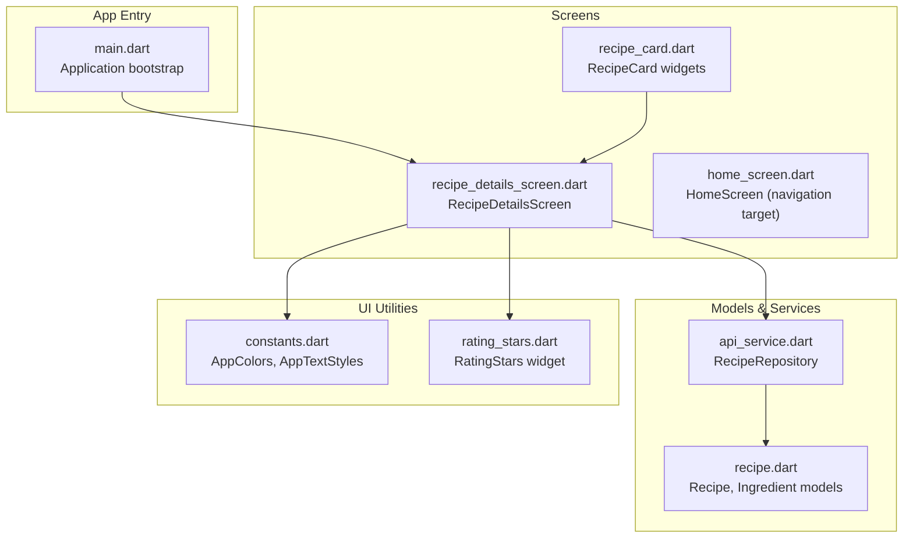
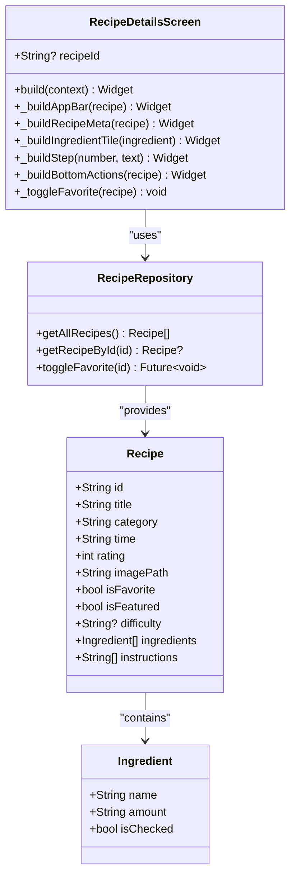
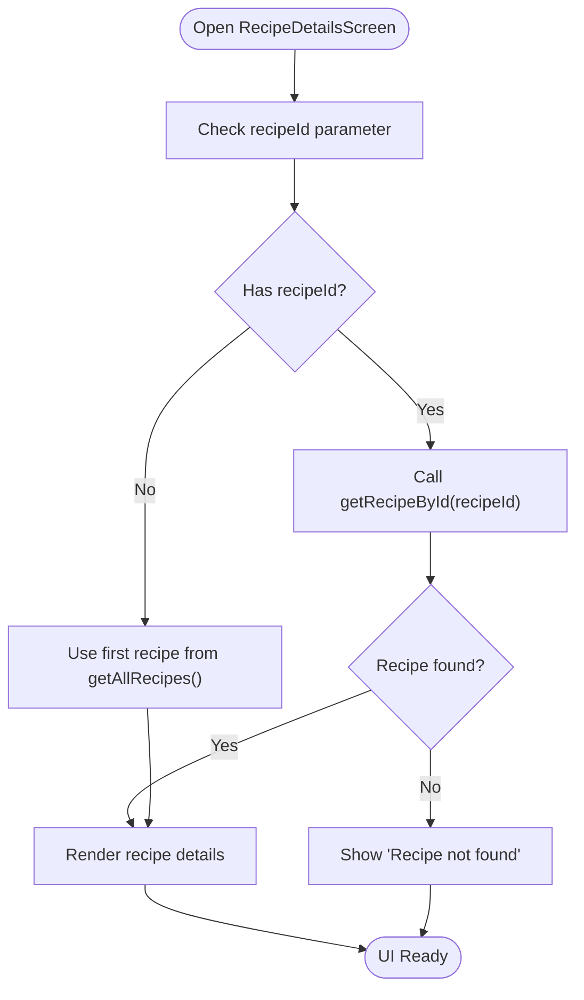
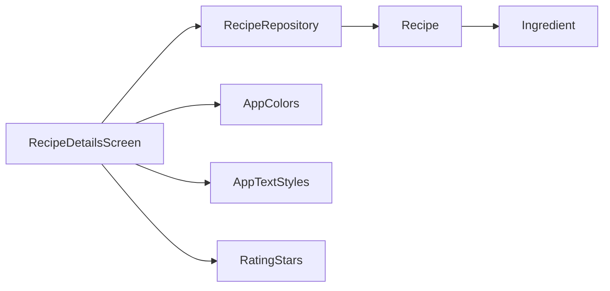

# Recipe Details Screen

<cite>
**Referenced Files in This Document**
- [recipe_details_screen.dart](file://lib/screens/recipe_details_screen.dart)
- [main.dart](file://lib/main.dart)
- [recipe.dart](file://lib/models/recipe.dart)
- [api_service.dart](file://lib/services/api_service.dart)
- [constants.dart](file://lib/utils/constants.dart)
- [rating_stars.dart](file://lib/widgets/rating_stars.dart)
- [recipe_card.dart](file://lib/widgets/recipe_card.dart)
</cite>

## Table of Contents
1. [Introduction](#introduction)
2. [Project Structure](#project-structure)
3. [Core Components](#core-components)
4. [Architecture Overview](#architecture-overview)
5. [Detailed Component Analysis](#detailed-component-analysis)
6. [Dependency Analysis](#dependency-analysis)
7. [Performance Considerations](#performance-considerations)
8. [Troubleshooting Guide](#troubleshooting-guide)
9. [Conclusion](#conclusion)

## Introduction
This document provides comprehensive documentation for the RecipeDetailsScreen implementation. It explains the screen structure for displaying comprehensive recipe information, including title, image, description, ingredients list, cooking instructions, and metadata. It also documents the recipe loading mechanism, data binding patterns, navigation from recipe cards, UI components used for presentation, favorite button functionality, share actions, responsive layout handling, scroll behavior, and accessibility features.

## Project Structure
The RecipeDetailsScreen resides in the screens directory and integrates with models, services, utilities, and widgets across the application. The main application entry point configures global theming and navigation.



**Diagram sources**
- [main.dart:10-33](file://lib/main.dart#L10-L33)
- [recipe_details_screen.dart:1-285](file://lib/screens/recipe_details_screen.dart#L1-L285)
- [recipe.dart:1-82](file://lib/models/recipe.dart#L1-L82)
- [api_service.dart:4-177](file://lib/services/api_service.dart#L4-L177)
- [constants.dart:4-124](file://lib/utils/constants.dart#L4-L124)
- [rating_stars.dart:1-42](file://lib/widgets/rating_stars.dart#L1-L42)
- [recipe_card.dart:1-247](file://lib/widgets/recipe_card.dart#L1-L247)

**Section sources**
- [main.dart:10-33](file://lib/main.dart#L10-L33)
- [recipe_details_screen.dart:1-285](file://lib/screens/recipe_details_screen.dart#L1-L285)

## Core Components
- RecipeDetailsScreen: A stateful screen that renders recipe details using a CustomScrollView with a pinned SliverAppBar, recipe metadata, ingredients list, and instructions. It supports favorite toggling and bottom action buttons.
- Recipe model and Ingredient: Immutable data structures representing recipe attributes and ingredients.
- RecipeRepository: In-memory service providing CRUD operations and favorites management.
- RatingStars: Reusable widget for rendering star ratings.
- AppColors and AppTextStyles: Centralized theming for consistent UI appearance.

Key responsibilities:
- Load recipe by ID or fallback to the first recipe.
- Render recipe image in an expanding app bar.
- Display metadata (rating, difficulty, prep time).
- Present ingredients with interactive checkboxes.
- Render step-by-step instructions with numbered markers.
- Provide favorite toggle and bottom action buttons.

**Section sources**
- [recipe_details_screen.dart:8-285](file://lib/screens/recipe_details_screen.dart#L8-L285)
- [recipe.dart:1-82](file://lib/models/recipe.dart#L1-L82)
- [api_service.dart:4-177](file://lib/services/api_service.dart#L4-L177)
- [rating_stars.dart:1-42](file://lib/widgets/rating_stars.dart#L1-L42)
- [constants.dart:4-124](file://lib/utils/constants.dart#L4-L124)

## Architecture Overview
The screen follows a layered architecture:
- Presentation layer: RecipeDetailsScreen builds UI from immutable models.
- Domain layer: RecipeRepository encapsulates recipe data and business logic.
- UI utilities: AppColors and AppTextStyles enforce consistent theming; RatingStars composes rating visuals.

```mermaid
sequenceDiagram
participant User as "User"
participant Card as "RecipeCard"
participant Details as "RecipeDetailsScreen"
participant Repo as "RecipeRepository"
participant Model as "Recipe"
User->>Card : Tap recipe card
Card->>Details : Navigate with recipeId
Details->>Repo : getRecipeById(recipeId)
Repo-->>Details : Recipe instance
Details->>Model : Access fields (title, image, rating, etc.)
Details-->>User : Render recipe details
```

**Diagram sources**
- [recipe_card.dart:23-25](file://lib/widgets/recipe_card.dart#L23-L25)
- [recipe_details_screen.dart:23-29](file://lib/screens/recipe_details_screen.dart#L23-L29)
- [api_service.dart:140-147](file://lib/services/api_service.dart#L140-L147)
- [recipe.dart:15-55](file://lib/models/recipe.dart#L15-L55)

## Detailed Component Analysis

### RecipeDetailsScreen Implementation
Responsibilities:
- Build a scaffold with a stack containing a CustomScrollView and bottom action bar.
- Render a pinned SliverAppBar with an image background and back/favorite actions.
- Display recipe metadata (rating, difficulty badge, prep time).
- Render ingredients as interactive tiles with checkbox indicators.
- Render instructions as numbered steps with descriptive text.
- Toggle favorite status via repository and refresh UI.

UI composition highlights:
- SliverAppBar with expanded height and flexible space image.
- CustomScrollView with slivers for app bar and content.
- SliverToBoxAdapter wrapping content padding and column layout.
- Bottom action bar positioned absolutely with two action elements.

Favorite toggle flow:
- Calls repository toggle method and triggers setState to rebuild UI.



**Diagram sources**
- [recipe_details_screen.dart:8-285](file://lib/screens/recipe_details_screen.dart#L8-L285)
- [api_service.dart:4-177](file://lib/services/api_service.dart#L4-L177)
- [recipe.dart:1-82](file://lib/models/recipe.dart#L1-L82)

**Section sources**
- [recipe_details_screen.dart:8-285](file://lib/screens/recipe_details_screen.dart#L8-L285)

### Data Loading and Binding Patterns
- Recipe retrieval: The screen accesses a recipe via RecipeRepository.getRecipeById or falls back to the first recipe if no ID is provided.
- Immutable models: Recipe and Ingredient are immutable with copyWith methods for updates.
- Reactive updates: Favorite toggling triggers setState to refresh UI bindings.



**Diagram sources**
- [recipe_details_screen.dart:23-29](file://lib/screens/recipe_details_screen.dart#L23-L29)
- [api_service.dart:109-110](file://lib/services/api_service.dart#L109-L110)
- [api_service.dart:140-147](file://lib/services/api_service.dart#L140-L147)

**Section sources**
- [recipe_details_screen.dart:23-29](file://lib/screens/recipe_details_screen.dart#L23-L29)
- [api_service.dart:109-110](file://lib/services/api_service.dart#L109-L110)
- [api_service.dart:140-147](file://lib/services/api_service.dart#L140-L147)

### Navigation from Recipe Cards
- RecipeCard exposes onTap callback for navigation to the details screen.
- The details screen expects a recipeId parameter to load the correct recipe.

```mermaid
sequenceDiagram
participant User as "User"
participant Card as "RecipeCard"
participant Router as "Navigator"
participant Details as "RecipeDetailsScreen"
User->>Card : Tap recipe card
Card->>Router : push(route with recipeId)
Router->>Details : Construct with recipeId
Details-->>User : Display recipe details
```

**Diagram sources**
- [recipe_card.dart:23-25](file://lib/widgets/recipe_card.dart#L23-L25)
- [recipe_details_screen.dart:9-14](file://lib/screens/recipe_details_screen.dart#L9-L14)

**Section sources**
- [recipe_card.dart:23-25](file://lib/widgets/recipe_card.dart#L23-L25)
- [recipe_details_screen.dart:9-14](file://lib/screens/recipe_details_screen.dart#L9-L14)

### UI Components for Recipe Presentation
- Image display: SliverAppBar with FlexibleSpaceBar background image covers the header area.
- Rating system: RatingStars widget renders filled/outline stars based on rating value.
- Ingredients formatting: Each ingredient is rendered as a tile with a checkbox icon and name/amount text.
- Instructions: Steps are numbered circles followed by descriptive text with consistent typography.

Accessibility and responsiveness:
- Responsive layout: Uses SliverAppBar with expanded height and CustomScrollView for smooth scrolling.
- Typography: AppTextStyles ensures consistent font sizes and weights across content.
- Colors: AppColors provides dark theme palette with consistent accents.

**Section sources**
- [recipe_details_screen.dart:88-232](file://lib/screens/recipe_details_screen.dart#L88-L232)
- [rating_stars.dart:20-40](file://lib/widgets/rating_stars.dart#L20-L40)
- [constants.dart:40-99](file://lib/utils/constants.dart#L40-L99)

### Favorite Button Functionality
- Action: Toggles favorite status via repository and refreshes UI.
- Visual feedback: Favorite icon changes based on current state.

```mermaid
sequenceDiagram
participant User as "User"
participant Details as "RecipeDetailsScreen"
participant Repo as "RecipeRepository"
User->>Details : Tap favorite icon
Details->>Repo : toggleFavorite(recipe.id)
Repo-->>Details : Update in-memory state
Details->>Details : setState()
Details-->>User : Re-render with updated favorite state
```

**Diagram sources**
- [recipe_details_screen.dart:105-114](file://lib/screens/recipe_details_screen.dart#L105-L114)
- [recipe_details_screen.dart:281-284](file://lib/screens/recipe_details_screen.dart#L281-L284)
- [api_service.dart:149-157](file://lib/services/api_service.dart#L149-L157)

**Section sources**
- [recipe_details_screen.dart:105-114](file://lib/screens/recipe_details_screen.dart#L105-L114)
- [recipe_details_screen.dart:281-284](file://lib/screens/recipe_details_screen.dart#L281-L284)
- [api_service.dart:149-157](file://lib/services/api_service.dart#L149-L157)

### Share Actions and Interactive Elements
- Start Cooking button: Elevated button in the bottom action bar.
- Edit action: IconButton in the bottom action bar.
- Favorite action: IconButton in the app bar.
- Ingredients: Checkbox icons indicate completion state.

Note: Share action is not implemented in the current code; only favorite, edit, and start cooking actions are present.

**Section sources**
- [recipe_details_screen.dart:234-279](file://lib/screens/recipe_details_screen.dart#L234-L279)
- [recipe_details_screen.dart:105-114](file://lib/screens/recipe_details_screen.dart#L105-L114)
- [recipe_details_screen.dart:173-178](file://lib/screens/recipe_details_screen.dart#L173-L178)

### Scroll Behavior and Layout
- SliverAppBar expands/collapses with CustomScrollView for immersive image header.
- Content is laid out in a column with appropriate spacing and padding.
- Bottom action bar is positioned absolutely to avoid scroll conflicts.

**Section sources**
- [recipe_details_screen.dart:48-86](file://lib/screens/recipe_details_screen.dart#L48-L86)
- [recipe_details_screen.dart:88-126](file://lib/screens/recipe_details_screen.dart#L88-L126)

## Dependency Analysis
The screen depends on:
- RecipeRepository for data access.
- Recipe and Ingredient models for data representation.
- AppColors and AppTextStyles for theming.
- RatingStars for rating visualization.



**Diagram sources**
- [recipe_details_screen.dart:21-285](file://lib/screens/recipe_details_screen.dart#L21-L285)
- [api_service.dart:4-177](file://lib/services/api_service.dart#L4-L177)
- [recipe.dart:1-82](file://lib/models/recipe.dart#L1-L82)
- [constants.dart:4-124](file://lib/utils/constants.dart#L4-L124)
- [rating_stars.dart:1-42](file://lib/widgets/rating_stars.dart#L1-L42)

**Section sources**
- [recipe_details_screen.dart:21-285](file://lib/screens/recipe_details_screen.dart#L21-L285)
- [api_service.dart:4-177](file://lib/services/api_service.dart#L4-L177)
- [recipe.dart:1-82](file://lib/models/recipe.dart#L1-L82)
- [constants.dart:4-124](file://lib/utils/constants.dart#L4-L124)
- [rating_stars.dart:1-42](file://lib/widgets/rating_stars.dart#L1-L42)

## Performance Considerations
- In-memory data: RecipeRepository stores all recipes in memory, suitable for small to medium datasets.
- Stateless widgets: RatingStars and other widgets are lightweight and efficient.
- Minimal rebuilds: setState is triggered only on favorite toggle to reduce unnecessary UI updates.
- Image loading: Image.asset is used for local assets; consider caching or lazy loading for remote images if extended.

## Troubleshooting Guide
Common issues and resolutions:
- Recipe not found: When recipeId is invalid or missing, the screen displays a centered message. Verify navigation passes a valid recipeId.
- Favorite toggle not reflected: Ensure setState is called after repository update and that the repository instance is consistent.
- Image not displayed: Confirm asset paths match the Recipe.imagePath and assets are included in the project.

**Section sources**
- [recipe_details_screen.dart:35-42](file://lib/screens/recipe_details_screen.dart#L35-L42)
- [recipe_details_screen.dart:281-284](file://lib/screens/recipe_details_screen.dart#L281-L284)
- [api_service.dart:140-147](file://lib/services/api_service.dart#L140-L147)

## Conclusion
The RecipeDetailsScreen provides a comprehensive, responsive, and accessible recipe viewing experience. It leverages immutable models, centralized theming, and reusable UI components to deliver a polished user interface. Favorite toggling, interactive ingredients, and step-by-step instructions enhance usability. The current implementation focuses on local data and basic interactions; future enhancements could include share actions, remote image loading, and improved accessibility labels.