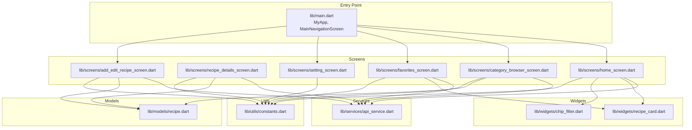
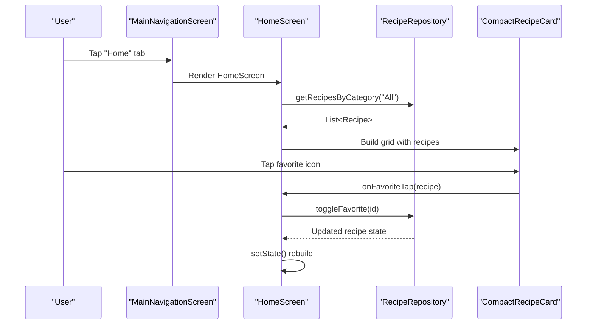
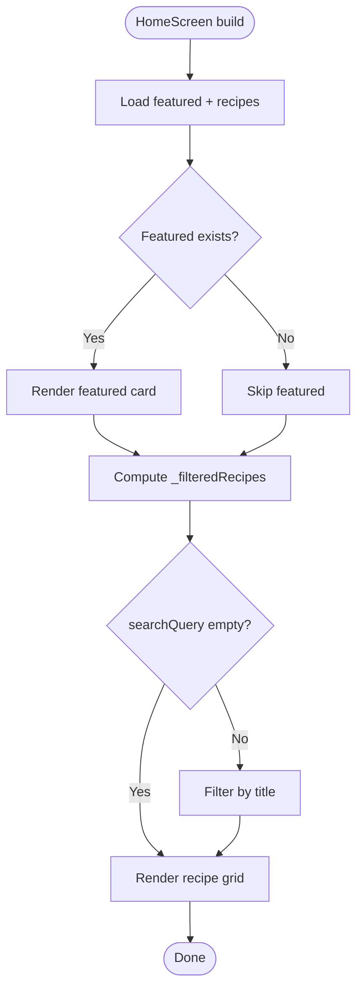
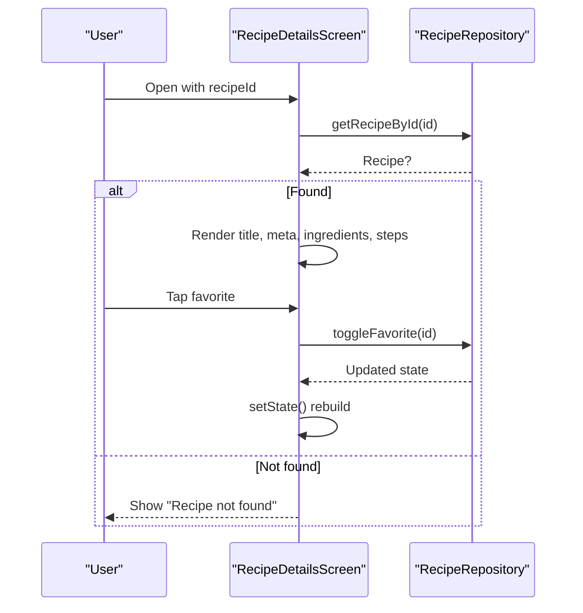
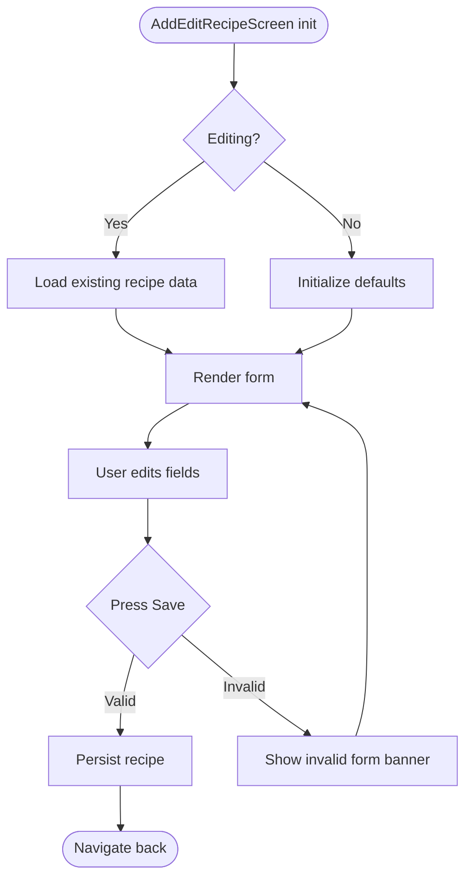
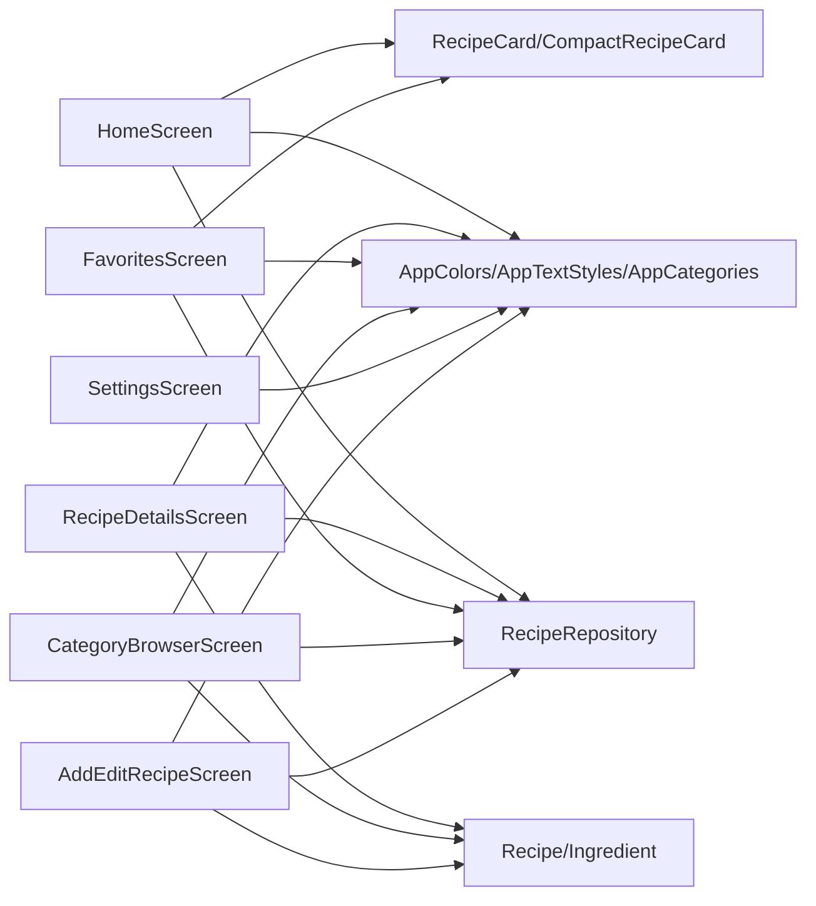

# Screen Implementations

<cite>
**Referenced Files in This Document**
- [main.dart](file://lib/main.dart)
- [home_screen.dart](file://lib/screens/home_screen.dart)
- [recipe_details_screen.dart](file://lib/screens/recipe_details_screen.dart)
- [favorites_screen.dart](file://lib/screens/favorites_screen.dart)
- [category_browser_screen.dart](file://lib/screens/category_browser_screen.dart)
- [setting_screen.dart](file://lib/screens/setting_screen.dart)
- [add_edit_recipe_screen.dart](file://lib/screens/add_edit_recipe_screen.dart)
- [recipe.dart](file://lib/models/recipe.dart)
- [api_service.dart](file://lib/services/api_service.dart)
- [constants.dart](file://lib/utils/constants.dart)
- [recipe_card.dart](file://lib/widgets/recipe_card.dart)
- [chip_filter.dart](file://lib/widgets/chip_filter.dart)
</cite>

## Table of Contents
1. [Introduction](#introduction)
2. [Project Structure](#project-structure)
3. [Core Components](#core-components)
4. [Architecture Overview](#architecture-overview)
5. [Detailed Component Analysis](#detailed-component-analysis)
6. [Dependency Analysis](#dependency-analysis)
7. [Performance Considerations](#performance-considerations)
8. [Troubleshooting Guide](#troubleshooting-guide)
9. [Conclusion](#conclusion)

## Introduction
This document explains the screen implementations of the Cooking Book App, focusing on the HomeScreen, RecipeDetailsScreen, FavoritesScreen, CategoryBrowserScreen, SettingsScreen, and AddEditRecipeScreen. It covers UI composition, navigation patterns, state management, route parameters, lifecycle handling, and how screens integrate with shared models, services, and utilities. Accessibility and performance considerations are included to guide responsive and efficient usage across devices.

## Project Structure
The app follows a layered organization:
- Screens: Feature-based UI screens under lib/screens
- Models: Data structures under lib/models
- Services: Business logic and data access under lib/services
- Widgets: Reusable UI components under lib/widgets
- Utils: Constants and styling under lib/utils
- Entry point: lib/main.dart initializes the app and main navigation

**Diagram sources**
- [main.dart:1-100](file://lib/main.dart#L1-L100)
- [home_screen.dart:1-241](file://lib/screens/home_screen.dart#L1-L241)
- [recipe_details_screen.dart:1-285](file://lib/screens/recipe_details_screen.dart#L1-L285)
- [favorites_screen.dart:1-114](file://lib/screens/favorites_screen.dart#L1-L114)
- [category_browser_screen.dart:1-262](file://lib/screens/category_browser_screen.dart#L1-L262)
- [setting_screen.dart:1-298](file://lib/screens/setting_screen.dart#L1-L298)
- [add_edit_recipe_screen.dart:1-363](file://lib/screens/add_edit_recipe_screen.dart#L1-L363)
- [recipe.dart:1-82](file://lib/models/recipe.dart#L1-L82)
- [api_service.dart:1-177](file://lib/services/api_service.dart#L1-L177)
- [constants.dart:1-124](file://lib/utils/constants.dart#L1-L124)
- [recipe_card.dart:1-247](file://lib/widgets/recipe_card.dart#L1-L247)
- [chip_filter.dart:1-39](file://lib/widgets/chip_filter.dart#L1-L39)

**Section sources**
- [main.dart:1-100](file://lib/main.dart#L1-L100)

## Core Components
- MyApp and MainNavigationScreen: Initialize the app and manage bottom navigation among Home, Browse, Favorites, and Settings. A floating action button navigates to AddEditRecipeScreen.
- RecipeRepository: Central service providing CRUD operations and filtering for recipes.
- Models: Recipe and Ingredient define the data contract for recipe content.
- Shared Utilities: AppColors, AppTextStyles, AppCategories, AppConstants unify theming and constants.
- Reusable Widgets: RecipeCard and CompactRecipeCard encapsulate recipe presentation; CategoryChip supports category selection.

**Section sources**
- [main.dart:10-100](file://lib/main.dart#L10-L100)
- [api_service.dart:4-177](file://lib/services/api_service.dart#L4-L177)
- [recipe.dart:1-82](file://lib/models/recipe.dart#L1-L82)
- [constants.dart:1-124](file://lib/utils/constants.dart#L1-L124)
- [recipe_card.dart:1-247](file://lib/widgets/recipe_card.dart#L1-L247)
- [chip_filter.dart:1-39](file://lib/widgets/chip_filter.dart#L1-L39)

## Architecture Overview
The screens rely on a central RecipeRepository for data access and state updates. Navigation is handled via Navigator.push/pop and a bottom navigation bar. Screens compose reusable widgets and apply shared styling.

**Diagram sources**
- [main.dart:36-100](file://lib/main.dart#L36-L100)
- [home_screen.dart:17-149](file://lib/screens/home_screen.dart#L17-L149)
- [api_service.dart:149-157](file://lib/services/api_service.dart#L149-L157)
- [recipe_card.dart:149-247](file://lib/widgets/recipe_card.dart#L149-L247)

## Detailed Component Analysis

### HomeScreen
- Purpose: Display featured recipe, category chips, search field, and a grid of popular recipes.
- State management: Maintains selectedCategory and searchQuery; recomputes filtered recipes via getters.
- Data flow: Uses RecipeRepository to fetch recipes by category and featured recipe; toggles favorites via toggleFavorite.
- UI composition: SingleChildScrollView with column layout; GridView.builder for recipe grid; CompactRecipeCard for items.
- Search and filters: TextField onChanged updates searchQuery; category chips update selectedCategory; both affect _filteredRecipes.

**Diagram sources**
- [home_screen.dart:17-91](file://lib/screens/home_screen.dart#L17-L91)
- [api_service.dart:112-138](file://lib/services/api_service.dart#L112-L138)

**Section sources**
- [home_screen.dart:1-241](file://lib/screens/home_screen.dart#L1-L241)
- [chip_filter.dart:1-39](file://lib/widgets/chip_filter.dart#L1-L39)
- [recipe_card.dart:149-247](file://lib/widgets/recipe_card.dart#L149-L247)
- [api_service.dart:112-157](file://lib/services/api_service.dart#L112-L157)

### RecipeDetailsScreen
- Purpose: Present detailed recipe information with image header, metadata, ingredients, and instructions.
- Route parameters: Accepts optional recipeId; defaults to first recipe if none provided.
- Actions: Favorite toggle updates repository and rebuilds; bottom action row includes “Start Cooking” and “Edit” placeholders.
- Layout: SliverAppBar with image background; CustomScrollView with slivers for content; Positioned bottom actions overlay.

**Diagram sources**
- [recipe_details_screen.dart:8-86](file://lib/screens/recipe_details_screen.dart#L8-L86)
- [api_service.dart:140-147](file://lib/services/api_service.dart#L140-L147)

**Section sources**
- [recipe_details_screen.dart:1-285](file://lib/screens/recipe_details_screen.dart#L1-L285)
- [recipe.dart:1-82](file://lib/models/recipe.dart#L1-L82)
- [api_service.dart:140-157](file://lib/services/api_service.dart#L140-L157)

### FavoritesScreen
- Purpose: Display saved recipes in a grid with filtering affordance.
- State management: Reads favorites via RecipeRepository; toggles favorites on tap.
- Layout: CustomScrollView with SliverGrid for responsive two-column grid; fallback message when empty.

**Section sources**
- [favorites_screen.dart:1-114](file://lib/screens/favorites_screen.dart#L1-L114)
- [api_service.dart:118-121](file://lib/services/api_service.dart#L118-L121)
- [recipe_card.dart:1-147](file://lib/widgets/recipe_card.dart#L1-L147)

### CategoryBrowserScreen
- Purpose: Browse recipes grouped by category with representative cards and favorite indicators.
- Behavior: Groups all recipes by category; renders category headers with icons/colors; shows up to four cards per category.
- Navigation: Back button navigates; “See All” placeholder for full list navigation.

**Section sources**
- [category_browser_screen.dart:1-262](file://lib/screens/category_browser_screen.dart#L1-L262)
- [api_service.dart:109-116](file://lib/services/api_service.dart#L109-L116)

### SettingsScreen
- Purpose: Manage appearance, preferences, and data-related actions.
- State management: Loads persisted settings on init; updates PreferencesService on toggle; displays a preview card.
- Sections: Appearance (theme, card compactness), Preferences (default category, notifications, auto-sync), Data (export, clear cache), About, Help & Support, Rate App, Privacy Policy.

**Section sources**
- [setting_screen.dart:1-298](file://lib/screens/setting_screen.dart#L1-L298)

### AddEditRecipeScreen
- Purpose: Create or edit a recipe with form validation, dynamic ingredients/steps, and image URL.
- State management: Tracks form validity; manages category, difficulty, rating, ingredients, and steps; loads existing data when editing.
- Validation: FormState with validators; save triggers validation and navigates back on success.
- Lifecycle: Disposes text controllers; loads initial data in initState when editing.

**Diagram sources**
- [add_edit_recipe_screen.dart:6-63](file://lib/screens/add_edit_recipe_screen.dart#L6-L63)

**Section sources**
- [add_edit_recipe_screen.dart:1-363](file://lib/screens/add_edit_recipe_screen.dart#L1-L363)
- [recipe.dart:1-82](file://lib/models/recipe.dart#L1-L82)

## Dependency Analysis
- Screens depend on RecipeRepository for data and on models for typed data.
- Shared utilities (AppColors, AppTextStyles, AppCategories) unify styling and constants.
- Reusable widgets encapsulate presentation logic and reduce coupling.
- Navigation is centralized in MainNavigationScreen; deep links are supported via route parameters (e.g., recipeId).

**Diagram sources**
- [home_screen.dart:1-241](file://lib/screens/home_screen.dart#L1-L241)
- [recipe_details_screen.dart:1-285](file://lib/screens/recipe_details_screen.dart#L1-L285)
- [favorites_screen.dart:1-114](file://lib/screens/favorites_screen.dart#L1-L114)
- [category_browser_screen.dart:1-262](file://lib/screens/category_browser_screen.dart#L1-L262)
- [setting_screen.dart:1-298](file://lib/screens/setting_screen.dart#L1-L298)
- [add_edit_recipe_screen.dart:1-363](file://lib/screens/add_edit_recipe_screen.dart#L1-L363)
- [api_service.dart:1-177](file://lib/services/api_service.dart#L1-L177)
- [recipe.dart:1-82](file://lib/models/recipe.dart#L1-L82)
- [constants.dart:1-124](file://lib/utils/constants.dart#L1-L124)
- [recipe_card.dart:1-247](file://lib/widgets/recipe_card.dart#L1-L247)

**Section sources**
- [api_service.dart:1-177](file://lib/services/api_service.dart#L1-L177)
- [constants.dart:1-124](file://lib/utils/constants.dart#L1-L124)

## Performance Considerations
- Efficient rendering:
  - HomeScreen uses GridView.builder with shrinkWrap and NeverScrollableScrollPhysics to avoid nested scrolling conflicts.
  - FavoritesScreen uses SliverGrid for virtualized rendering of favorites.
- Minimal rebuilds:
  - State updates are scoped (e.g., toggling favorite updates only affected lists).
- Image loading:
  - errorBuilder ensures graceful fallbacks for missing images.
- Avoid unnecessary work:
  - Filtering is computed on demand via getters; avoid rebuilding when unrelated state changes.

[No sources needed since this section provides general guidance]

## Troubleshooting Guide
- Recipe not found:
  - RecipeDetailsScreen handles missing recipe by displaying a centered message.
- Empty states:
  - HomeScreen shows a friendly message when no recipes match filters.
  - FavoritesScreen shows a message when no favorites exist.
- Form validation failures:
  - AddEditRecipeScreen displays a prominent banner when the form is invalid; ensure required fields are filled.

**Section sources**
- [recipe_details_screen.dart:35-42](file://lib/screens/recipe_details_screen.dart#L35-L42)
- [home_screen.dart:223-239](file://lib/screens/home_screen.dart#L223-L239)
- [favorites_screen.dart:43-54](file://lib/screens/favorites_screen.dart#L43-L54)
- [add_edit_recipe_screen.dart:92-111](file://lib/screens/add_edit_recipe_screen.dart#L92-L111)

## Conclusion
The Cooking Book App’s screens are structured around a clear separation of concerns: screens orchestrate UI and navigation, RecipeRepository centralizes data logic, and shared models and utilities ensure consistent styling and behavior. The HomeScreen provides a responsive grid with search and category filtering; RecipeDetailsScreen delivers a rich, media-focused recipe view; FavoritesScreen offers quick access to saved items; CategoryBrowserScreen enables category-based discovery; SettingsScreen configures user preferences; and AddEditRecipeScreen supports robust form-driven creation/editing. Following the outlined patterns ensures maintainability, responsiveness, and scalability.