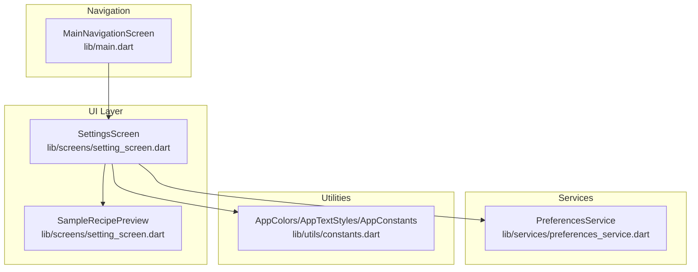
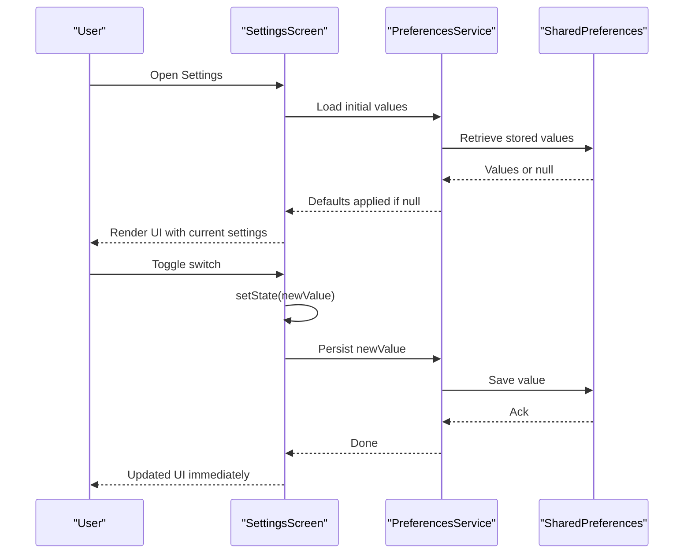
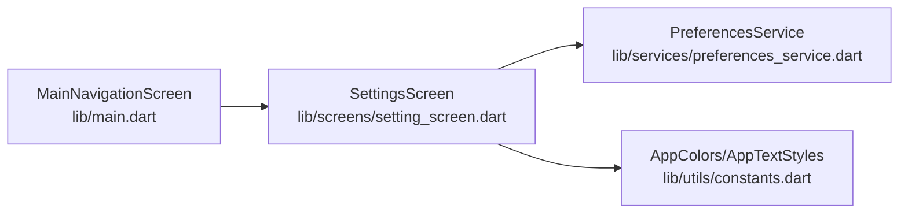

# Settings Screen

<cite>
**Referenced Files in This Document**
- [setting_screen.dart](file://lib/screens/setting_screen.dart)
- [preferences_service.dart](file://lib/services/preferences_service.dart)
- [constants.dart](file://lib/utils/constants.dart)
- [main.dart](file://lib/main.dart)
</cite>

## Table of Contents
1. [Introduction](#introduction)
2. [Project Structure](#project-structure)
3. [Core Components](#core-components)
4. [Architecture Overview](#architecture-overview)
5. [Detailed Component Analysis](#detailed-component-analysis)
6. [Dependency Analysis](#dependency-analysis)
7. [Performance Considerations](#performance-considerations)
8. [Troubleshooting Guide](#troubleshooting-guide)
9. [Conclusion](#conclusion)

## Introduction
This document describes the SettingsScreen implementation for managing user configuration and application preferences. It explains the screen architecture, settings categories, preference management, UI controls, data persistence via shared_preferences, validation and state synchronization, default value handling, user feedback mechanisms, and accessibility considerations. It also outlines how settings influence application behavior and highlights current capabilities and areas for future enhancement such as import/export functionality.

## Project Structure
The SettingsScreen resides in the screens layer and integrates with a preferences service for persistence and a constants module for theming and categories. The main navigation screen includes SettingsScreen as one of the bottom-nav destinations.

**Diagram sources**
- [setting_screen.dart:1-298](file://lib/screens/setting_screen.dart#L1-L298)
- [preferences_service.dart:1-73](file://lib/services/preferences_service.dart#L1-L73)
- [constants.dart:1-124](file://lib/utils/constants.dart#L1-L124)
- [main.dart:36-100](file://lib/main.dart#L36-L100)

**Section sources**
- [setting_screen.dart:1-298](file://lib/screens/setting_screen.dart#L1-L298)
- [preferences_service.dart:1-73](file://lib/services/preferences_service.dart#L1-L73)
- [constants.dart:1-124](file://lib/utils/constants.dart#L1-L124)
- [main.dart:36-100](file://lib/main.dart#L36-L100)

## Core Components
- SettingsScreen: A stateful screen that renders grouped settings, manages local UI state, and delegates persistence to PreferencesService.
- PreferencesService: A singleton wrapper around shared_preferences providing typed getters/setters for all supported settings.
- AppColors/AppTextStyles: Theming and typography used consistently across the settings UI.
- MainNavigationScreen: Hosts SettingsScreen as a tabbed destination.

Key responsibilities:
- Settings categories: Appearance, Preferences, Data, About, Help & Support.
- UI controls: Switch tiles for booleans, action tiles for text/value displays, and a preview card for immediate visual feedback.
- Persistence: Uses shared_preferences keys for each setting with sensible defaults.
- State synchronization: Local state mirrors persisted values; changes update both UI and storage.

**Section sources**
- [setting_screen.dart:5-258](file://lib/screens/setting_screen.dart#L5-L258)
- [preferences_service.dart:4-72](file://lib/services/preferences_service.dart#L4-L72)
- [constants.dart:4-124](file://lib/utils/constants.dart#L4-L124)
- [main.dart:46-51](file://lib/main.dart#L46-L51)

## Architecture Overview
The SettingsScreen orchestrates UI rendering and user interactions. On load, it initializes preferences and synchronizes local state. When users toggle switches or tap actions, the screen updates local state and persists changes through PreferencesService. The service writes to shared_preferences with typed setters.

**Diagram sources**
- [setting_screen.dart:23-35](file://lib/screens/setting_screen.dart#L23-L35)
- [preferences_service.dart:12-14](file://lib/services/preferences_service.dart#L12-L14)
- [preferences_service.dart:27-66](file://lib/services/preferences_service.dart#L27-L66)

## Detailed Component Analysis

### SettingsScreen
Responsibilities:
- Renders grouped settings sections with consistent theming.
- Manages local boolean state for switches and displays current values for non-switch settings.
- Delegates persistence to PreferencesService.
- Provides immediate visual feedback via a sample recipe preview under Appearance.

UI structure:
- Appearance section: Dark Theme, Compact Cards, Preview row.
- Preferences section: Default Category (display), Cooking Notifications, Auto Sync.
- Data section: Export Recipes, Clear Cache.
- About section: App identity and version.
- Help & Support section: Links to Help, Rate App, Privacy Policy.

Behavior:
- Initialization loads persisted values into local state.
- Switch callbacks update local state and persist changes.
- Action tiles render trailing text for current values (e.g., default category) and can be extended with onTap handlers.

Accessibility considerations present in the current implementation:
- Uses Material’s SwitchListTile and ListTile with appropriate text styles and icons.
- Maintains readable contrast via AppColors.
- Consider adding semantic labels and focus order improvements for enhanced accessibility.

**Section sources**
- [setting_screen.dart:13-151](file://lib/screens/setting_screen.dart#L13-L151)
- [setting_screen.dart:155-216](file://lib/screens/setting_screen.dart#L155-L216)
- [setting_screen.dart:218-257](file://lib/screens/setting_screen.dart#L218-L257)
- [constants.dart:4-99](file://lib/utils/constants.dart#L4-L99)

### PreferencesService
Responsibilities:
- Singleton facade over SharedPreferences.
- Typed getters/setters for all supported settings with defaults.
- Initialization method to obtain SharedPreferences instance.
- Optional clear-all utility.

Supported settings and defaults:
- Dark Theme: boolean; default true.
- Compact Cards: boolean; default false.
- Cooking Notifications: boolean; default true.
- Auto Sync: boolean; default false.
- Default Category: string; default "Lunch".

Persistence model:
- Uses strongly-typed methods (bool/string) with null-aware fallbacks returning defaults.
- Asynchronous setters ensure persistence completes before subsequent reads.

Validation and defaults:
- Null-aware getters return defaults when no value is stored.
- No explicit validation logic is present; callers should ensure valid inputs before saving.

**Section sources**
- [preferences_service.dart:4-72](file://lib/services/preferences_service.dart#L4-L72)
- [preferences_service.dart:17-26](file://lib/services/preferences_service.dart#L17-L26)
- [preferences_service.dart:27-66](file://lib/services/preferences_service.dart#L27-L66)

### UI Controls and Layout Patterns
- SwitchListTile: Used for binary toggles (Dark Theme, Compact Cards, Cooking Notifications, Auto Sync). Includes icon avatar, title, subtitle, and active color.
- ListTile: Used for non-toggle actions and for displaying current values (e.g., Default Category). Supports optional trailing text and chevron indicator.
- Cards: Grouped sections with rounded backgrounds and internal column layouts.
- Preview: A dedicated sample recipe preview under Appearance to visualize compact card effects.

Feedback mechanisms:
- Immediate UI updates via setState after user interaction.
- Persistent updates via asynchronous save calls.

**Section sources**
- [setting_screen.dart:172-216](file://lib/screens/setting_screen.dart#L172-L216)
- [setting_screen.dart:162-170](file://lib/screens/setting_screen.dart#L162-L170)
- [setting_screen.dart:260-298](file://lib/screens/setting_screen.dart#L260-L298)

### Default Value Handling
- Appearance: Dark Theme defaults to enabled; Compact Cards defaults to disabled.
- Preferences: Default Category defaults to "Lunch"; Cooking Notifications defaults to enabled; Auto Sync defaults to disabled.
- These defaults are enforced by PreferencesService getters when no value exists in storage.

**Section sources**
- [preferences_service.dart:28-66](file://lib/services/preferences_service.dart#L28-L66)

### State Synchronization
- On initialization, SettingsScreen calls a loader that reads from PreferencesService and sets local state.
- Each change triggers setState followed by a persistence call, ensuring UI and storage remain in sync.

**Section sources**
- [setting_screen.dart:23-35](file://lib/screens/setting_screen.dart#L23-L35)
- [setting_screen.dart:56-110](file://lib/screens/setting_screen.dart#L56-L110)

### Relationship Between Settings and Application Behavior
- Dark Theme and Compact Cards influence UI rendering and layout density; these are reflected in the app’s theme and card sizing.
- Default Category affects new recipe creation defaults.
- Cooking Notifications enable/disable reminder behavior.
- Auto Sync enables cross-device synchronization of recipes.

Note: The current implementation does not include explicit application-wide listeners for settings changes. Consumers of these settings should read from PreferencesService when needed or implement their own change propagation mechanism.

**Section sources**
- [preferences_service.dart:27-66](file://lib/services/preferences_service.dart#L27-L66)
- [setting_screen.dart:86-91](file://lib/screens/setting_screen.dart#L86-L91)

### Import/Export Functionality
- The Data section contains placeholders for Export Recipes and Clear Cache actions.
- No implementation is currently present in the codebase for export/import or cache clearing.
- These can be integrated by extending PreferencesService and adding handlers in SettingsScreen.

**Section sources**
- [setting_screen.dart:115-126](file://lib/screens/setting_screen.dart#L115-L126)

### Accessibility Considerations
- Current implementation uses standard Material controls with accessible defaults.
- Recommendations:
  - Add semantic labels for switches and actionable tiles.
  - Ensure sufficient color contrast for all text and icons.
  - Provide focus indicators and keyboard navigation support.
  - Consider dynamic text scaling and high-contrast mode compatibility.

[No sources needed since this section provides general guidance]

## Dependency Analysis
SettingsScreen depends on PreferencesService for persistence and on AppColors/AppTextStyles for theming. MainNavigationScreen hosts SettingsScreen as a tab.

**Diagram sources**
- [main.dart:46-51](file://lib/main.dart#L46-L51)
- [setting_screen.dart:1-11](file://lib/screens/setting_screen.dart#L1-L11)
- [preferences_service.dart:1-7](file://lib/services/preferences_service.dart#L1-L7)
- [constants.dart:4-99](file://lib/utils/constants.dart#L4-L99)

**Section sources**
- [main.dart:46-51](file://lib/main.dart#L46-L51)
- [setting_screen.dart:1-11](file://lib/screens/setting_screen.dart#L1-L11)
- [preferences_service.dart:1-7](file://lib/services/preferences_service.dart#L1-L7)
- [constants.dart:4-99](file://lib/utils/constants.dart#L4-L99)

## Performance Considerations
- Minimize unnecessary rebuilds: Keep the number of stateful widgets small and avoid rebuilding unrelated subtrees.
- Batch updates: When multiple settings change, consider deferring persistence until a single commit.
- Avoid blocking UI: All persistence operations are asynchronous; keep UI responsive.
- Storage efficiency: Use minimal keys and avoid storing large payloads in SharedPreferences.

[No sources needed since this section provides general guidance]

## Troubleshooting Guide
Common issues and resolutions:
- Settings not persisting:
  - Verify PreferencesService.init is called during app startup and that the service instance is reused.
  - Confirm asynchronous setters complete before re-initializing state.
- Defaults not applied:
  - Ensure getters return defaults when SharedPreferences returns null.
- UI not updating:
  - Confirm setState is called before invoking persistence.
- Navigation integration:
  - Ensure SettingsScreen is included in the navigation stack and bottom navigation items.

**Section sources**
- [preferences_service.dart:12-14](file://lib/services/preferences_service.dart#L12-L14)
- [preferences_service.dart:27-66](file://lib/services/preferences_service.dart#L27-L66)
- [setting_screen.dart:23-35](file://lib/screens/setting_screen.dart#L23-L35)
- [main.dart:46-51](file://lib/main.dart#L46-L51)

## Conclusion
The SettingsScreen provides a clean, modular approach to managing user preferences with clear separation between UI, state, and persistence. It leverages SharedPreferences for reliable, cross-platform storage and offers immediate visual feedback. Future enhancements could include explicit import/export functionality, centralized settings listeners, and expanded accessibility features to improve usability and maintainability.