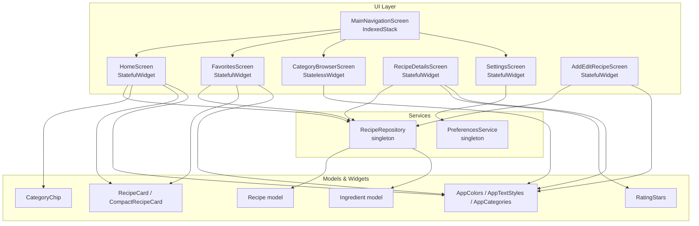
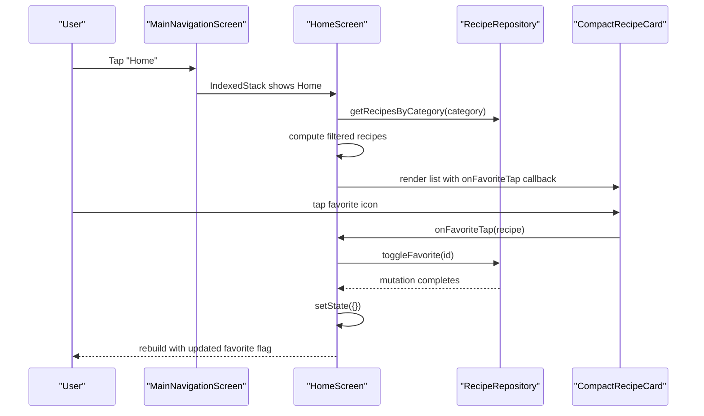
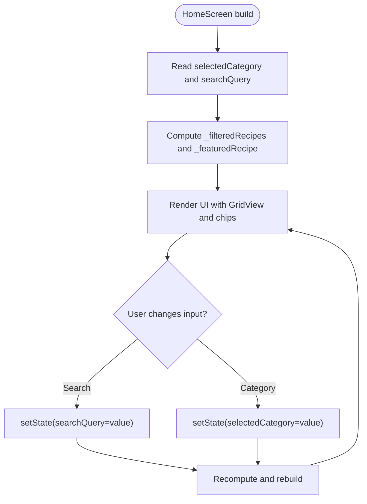
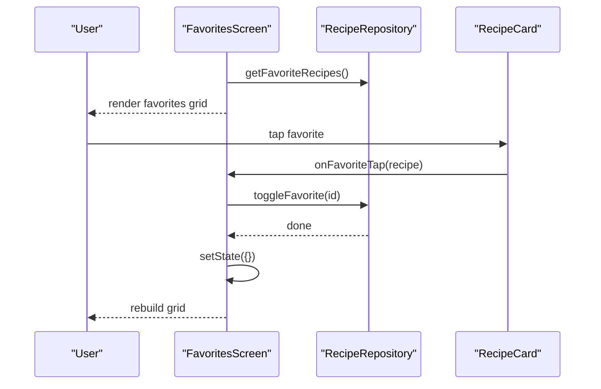
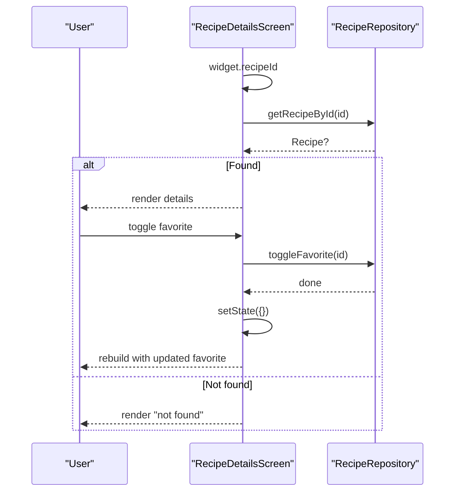
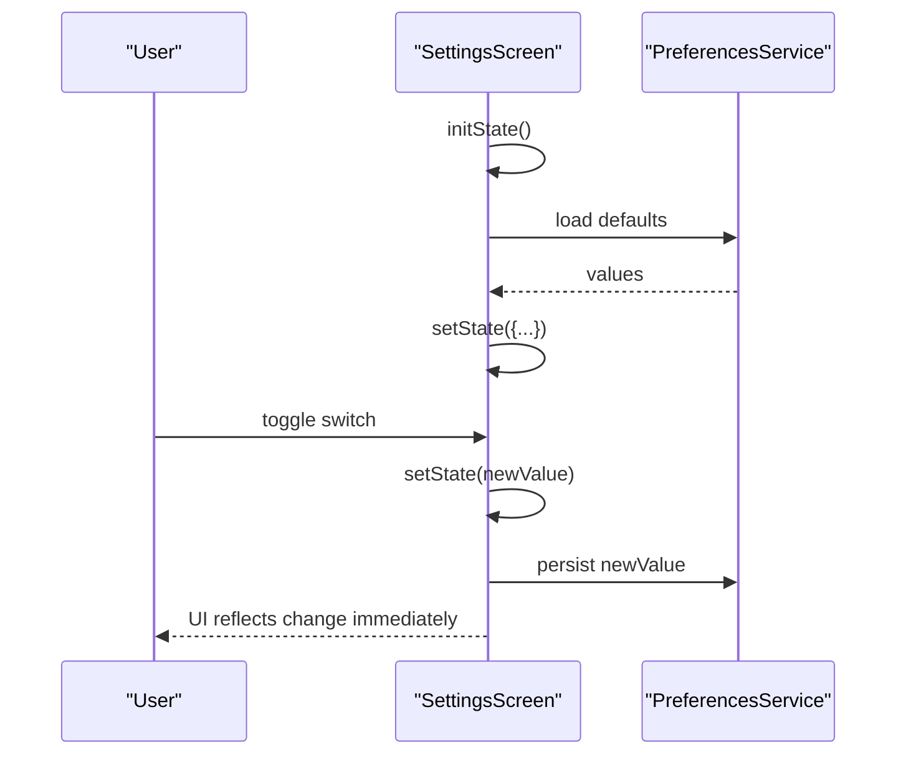
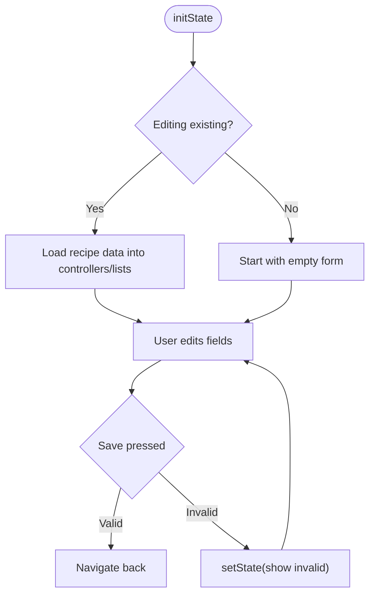
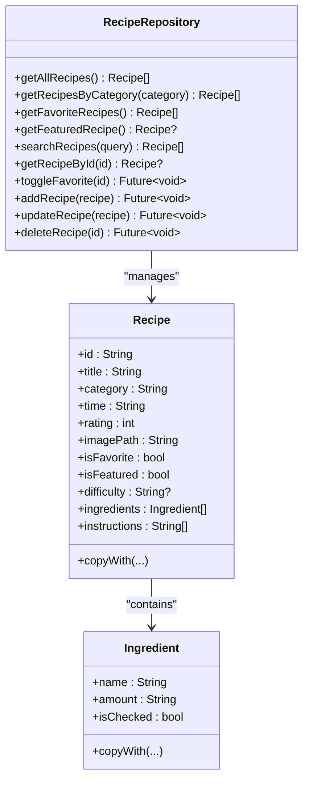
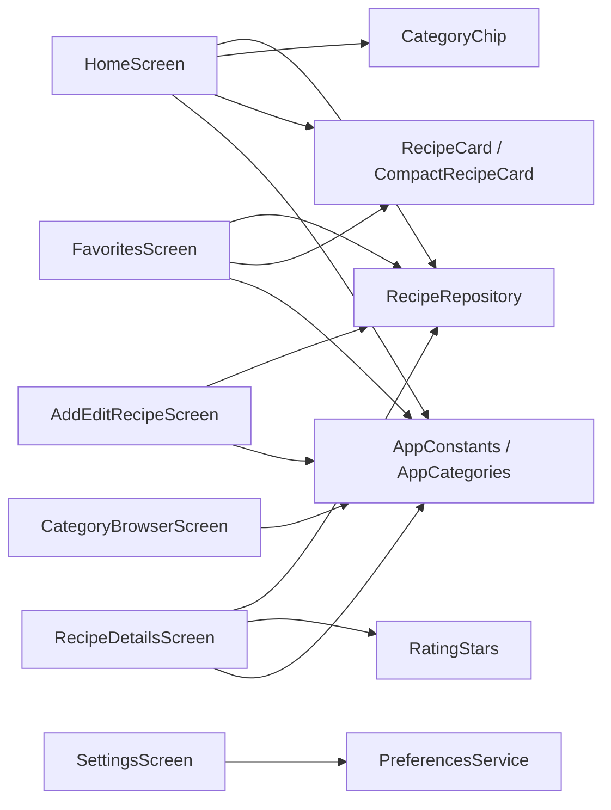

# State Management

<cite>
**Referenced Files in This Document**
- [main.dart](file://lib/main.dart)
- [home_screen.dart](file://lib/screens/home_screen.dart)
- [favorites_screen.dart](file://lib/screens/favorites_screen.dart)
- [category_browser_screen.dart](file://lib/screens/category_browser_screen.dart)
- [recipe_details_screen.dart](file://lib/screens/recipe_details_screen.dart)
- [setting_screen.dart](file://lib/screens/setting_screen.dart)
- [add_edit_recipe_screen.dart](file://lib/screens/add_edit_recipe_screen.dart)
- [api_service.dart](file://lib/services/api_service.dart)
- [preferences_service.dart](file://lib/services/preferences_service.dart)
- [recipe_card.dart](file://lib/widgets/recipe_card.dart)
- [chip_filter.dart](file://lib/widgets/chip_filter.dart)
- [rating_stars.dart](file://lib/widgets/rating_stars.dart)
- [constants.dart](file://lib/utils/constants.dart)
- [recipe.dart](file://lib/models/recipe.dart)
</cite>

## Table of Contents
1. [Introduction](#introduction)
2. [Project Structure](#project-structure)
3. [Core Components](#core-components)
4. [Architecture Overview](#architecture-overview)
5. [Detailed Component Analysis](#detailed-component-analysis)
6. [Dependency Analysis](#dependency-analysis)
7. [Performance Considerations](#performance-considerations)
8. [Troubleshooting Guide](#troubleshooting-guide)
9. [Conclusion](#conclusion)

## Introduction
This document explains the state management implementation in the Cooking Book App. It focuses on Flutter’s StatefulWidget patterns, how state updates trigger widget rebuilds, and how data binding is achieved across screens. It also covers navigation state, route parameter handling, screen state preservation, repository pattern integration, asynchronous data loading, error handling, favorites state, search and filter state persistence, and best practices for performance and reliability.

## Project Structure
The app follows a feature-based structure with clear separation of concerns:
- Screens: UI entry points for each major feature (navigation, home, favorites, browser, details, settings, add/edit).
- Services: Data repositories and preference management.
- Models: Immutable data structures for recipes and ingredients.
- Widgets: Reusable UI components.
- Utils: Constants and shared styles.

**Diagram sources**
- [main.dart:36-100](file://lib/main.dart#L36-L100)
- [home_screen.dart:10-241](file://lib/screens/home_screen.dart#L10-L241)
- [favorites_screen.dart:8-114](file://lib/screens/favorites_screen.dart#L8-L114)
- [category_browser_screen.dart:8-262](file://lib/screens/category_browser_screen.dart#L8-L262)
- [recipe_details_screen.dart:8-285](file://lib/screens/recipe_details_screen.dart#L8-L285)
- [setting_screen.dart:6-298](file://lib/screens/setting_screen.dart#L6-L298)
- [add_edit_recipe_screen.dart:6-363](file://lib/screens/add_edit_recipe_screen.dart#L6-L363)
- [api_service.dart:4-177](file://lib/services/api_service.dart#L4-L177)
- [preferences_service.dart:4-73](file://lib/services/preferences_service.dart#L4-L73)
- [recipe_card.dart:7-247](file://lib/widgets/recipe_card.dart#L7-L247)
- [chip_filter.dart:5-39](file://lib/widgets/chip_filter.dart#L5-L39)
- [rating_stars.dart:5-42](file://lib/widgets/rating_stars.dart#L5-L42)
- [constants.dart:4-124](file://lib/utils/constants.dart#L4-L124)
- [recipe.dart:2-82](file://lib/models/recipe.dart#L2-L82)

**Section sources**
- [main.dart:10-100](file://lib/main.dart#L10-L100)
- [constants.dart:4-124](file://lib/utils/constants.dart#L4-L124)

## Core Components
- MainNavigationScreen: Manages bottom navigation index and preserves screen state via IndexedStack.
- HomeScreen: Maintains search query and category filter state, computes filtered lists, and toggles favorites.
- FavoritesScreen: Displays favorite recipes and supports filtering affordances.
- CategoryBrowserScreen: Stateless browsing grouped by category.
- RecipeDetailsScreen: Displays detailed recipe info and supports favorite toggling.
- SettingsScreen: Manages UI preferences and persists them via PreferencesService.
- AddEditRecipeScreen: Full form state for adding/editing recipes.
- RecipeRepository: Singleton data layer with CRUD and search/filter helpers.
- PreferencesService: Singleton for persistent app preferences.
- Widgets: Stateless presentation components that receive callbacks to trigger state changes.

Key state management patterns:
- Local StatefulWidget state for UI-only flags and transient inputs.
- Repository-managed domain state for favorites and data mutations.
- IndexedStack to preserve per-screen state across navigation.
- Callbacks passed down to widgets to trigger setState in parent screens.

**Section sources**
- [main.dart:36-100](file://lib/main.dart#L36-L100)
- [home_screen.dart:10-241](file://lib/screens/home_screen.dart#L10-L241)
- [favorites_screen.dart:8-114](file://lib/screens/favorites_screen.dart#L8-L114)
- [category_browser_screen.dart:8-262](file://lib/screens/category_browser_screen.dart#L8-L262)
- [recipe_details_screen.dart:8-285](file://lib/screens/recipe_details_screen.dart#L8-L285)
- [setting_screen.dart:6-298](file://lib/screens/setting_screen.dart#L6-L298)
- [add_edit_recipe_screen.dart:6-363](file://lib/screens/add_edit_recipe_screen.dart#L6-L363)
- [api_service.dart:4-177](file://lib/services/api_service.dart#L4-L177)
- [preferences_service.dart:4-73](file://lib/services/preferences_service.dart#L4-L73)

## Architecture Overview
The app uses a layered architecture:
- UI layer: Screens and widgets.
- Domain/data layer: RecipeRepository encapsulates recipe data and mutations.
- Persistence layer: PreferencesService wraps SharedPreferences for settings.
- Navigation: MainNavigationScreen orchestrates bottom navigation and IndexedStack for state preservation.

**Diagram sources**
- [main.dart:36-100](file://lib/main.dart#L36-L100)
- [home_screen.dart:10-241](file://lib/screens/home_screen.dart#L10-L241)
- [api_service.dart:4-177](file://lib/services/api_service.dart#L4-L177)
- [recipe_card.dart:149-247](file://lib/widgets/recipe_card.dart#L149-L247)

## Detailed Component Analysis

### Main Navigation State Management
- Uses a single mutable index to track the current tab.
- IndexedStack preserves each child screen’s state across tab switches.
- BottomNavigationBar updates the index via setState, triggering a rebuild only for the visible child.

Best practices:
- Keep navigation index immutable in UI logic; mutate via setState.
- Prefer IndexedStack for stateful screens to avoid losing transient UI state.

**Section sources**
- [main.dart:36-100](file://lib/main.dart#L36-L100)

### Home Screen State Management
- Maintains two local state fields: selectedCategory and searchQuery.
- Computes derived state (_filteredRecipes and _featuredRecipe) from the repository.
- Favorite toggling triggers setState after asynchronous repository mutation.

**Diagram sources**
- [home_screen.dart:17-91](file://lib/screens/home_screen.dart#L17-L91)

**Section sources**
- [home_screen.dart:10-241](file://lib/screens/home_screen.dart#L10-L241)
- [chip_filter.dart:5-39](file://lib/widgets/chip_filter.dart#L5-L39)
- [recipe_card.dart:149-247](file://lib/widgets/recipe_card.dart#L149-L247)

### Favorites Screen State Management
- Reads favorite recipes from the repository.
- Provides a filter affordance placeholder.
- Favorite toggling updates repository and triggers setState.

**Diagram sources**
- [favorites_screen.dart:8-114](file://lib/screens/favorites_screen.dart#L8-L114)
- [api_service.dart:119-121](file://lib/services/api_service.dart#L119-L121)

**Section sources**
- [favorites_screen.dart:8-114](file://lib/screens/favorites_screen.dart#L8-L114)
- [recipe_card.dart:7-247](file://lib/widgets/recipe_card.dart#L7-L247)

### Category Browser Screen State Management
- Stateless widget that builds category groups from repository data.
- No local state; recomputes on each build.

**Section sources**
- [category_browser_screen.dart:8-262](file://lib/screens/category_browser_screen.dart#L8-L262)

### Recipe Details Screen State Management
- Accepts recipeId via constructor; reads recipe from repository.
- Displays recipe details and supports favorite toggling.
- Handles missing recipe gracefully.

**Diagram sources**
- [recipe_details_screen.dart:8-285](file://lib/screens/recipe_details_screen.dart#L8-L285)
- [api_service.dart:141-147](file://lib/services/api_service.dart#L141-L147)

**Section sources**
- [recipe_details_screen.dart:8-285](file://lib/screens/recipe_details_screen.dart#L8-L285)

### Settings Screen State Management
- Holds local UI state for toggles.
- Loads persisted preferences on init and writes changes back.
- Uses setState to reflect immediate UI changes while deferring persistence.

**Diagram sources**
- [setting_screen.dart:6-298](file://lib/screens/setting_screen.dart#L6-L298)
- [preferences_service.dart:4-73](file://lib/services/preferences_service.dart#L4-L73)

**Section sources**
- [setting_screen.dart:6-298](file://lib/screens/setting_screen.dart#L6-L298)
- [preferences_service.dart:4-73](file://lib/services/preferences_service.dart#L4-L73)

### Add/Edit Recipe Screen State Management
- Manages a complex form with multiple fields and dynamic lists (ingredients/steps).
- Uses a GlobalKey<FormState> for validation and controlled TextEditingControllers.
- Disposes controllers in dispose to prevent leaks.
- On save, validates and navigates back.

**Diagram sources**
- [add_edit_recipe_screen.dart:6-363](file://lib/screens/add_edit_recipe_screen.dart#L6-L363)

**Section sources**
- [add_edit_recipe_screen.dart:6-363](file://lib/screens/add_edit_recipe_screen.dart#L6-L363)

### Repository Pattern Integration
- RecipeRepository is a singleton that holds in-memory recipe data and exposes methods to query, search, and mutate favorites.
- Favorites toggling is asynchronous but updates the in-memory list immutably via copyWith.
- Other operations (add/update/delete) are present for completeness.

**Diagram sources**
- [api_service.dart:4-177](file://lib/services/api_service.dart#L4-L177)
- [recipe.dart:2-82](file://lib/models/recipe.dart#L2-L82)

**Section sources**
- [api_service.dart:4-177](file://lib/services/api_service.dart#L4-L177)
- [recipe.dart:2-82](file://lib/models/recipe.dart#L2-L82)

### Async Data Loading and Error Handling
- Repository methods wrap lookups in try/catch and return null-safe results.
- Screens handle null cases gracefully (e.g., RecipeDetailsScreen renders a “not found” message).
- Favorites toggling is awaited before rebuilding to ensure UI consistency.

Recommendations:
- For network-backed data, wrap repository methods with Future calls and expose loading/error states to screens.
- Use FutureBuilder or StreamBuilder in screens that depend on async data.

**Section sources**
- [api_service.dart:124-130](file://lib/services/api_service.dart#L124-L130)
- [api_service.dart:142-147](file://lib/services/api_service.dart#L142-L147)
- [recipe_details_screen.dart:35-42](file://lib/screens/recipe_details_screen.dart#L35-L42)

### Favorites State Management
- Favorites are stored in the Recipe model and toggled via RecipeRepository.
- Toggling is performed asynchronously; the UI rebuilds after completion.
- Both HomeScreen and FavoritesScreen rely on repository queries to reflect changes.

**Section sources**
- [api_service.dart:149-157](file://lib/services/api_service.dart#L149-L157)
- [home_screen.dart:146-149](file://lib/screens/home_screen.dart#L146-L149)
- [favorites_screen.dart:82-85](file://lib/screens/favorites_screen.dart#L82-L85)
- [recipe_details_screen.dart:281-284](file://lib/screens/recipe_details_screen.dart#L281-L284)

### Search and Filter State Handling
- HomeScreen maintains searchQuery and selectedCategory as local state.
- Derived computed properties (_filteredRecipes, _featuredRecipe) encapsulate filtering logic.
- CategoryChip is a stateless widget receiving callbacks to update parent state.

**Section sources**
- [home_screen.dart:17-35](file://lib/screens/home_screen.dart#L17-L35)
- [chip_filter.dart:5-39](file://lib/widgets/chip_filter.dart#L5-L39)

### Route Parameter Handling and Screen State Preservation
- RecipeDetailsScreen accepts recipeId via constructor and resolves the recipe from the repository.
- MainNavigationScreen uses IndexedStack to keep screen instances alive, preserving state across tab switches.

**Section sources**
- [recipe_details_screen.dart:9-14](file://lib/screens/recipe_details_screen.dart#L9-L14)
- [main.dart:56-59](file://lib/main.dart#L56-L59)

### Data Binding Strategies
- Parent widgets pass callbacks to child widgets (e.g., onFavoriteTap) so that child widgets trigger state changes in parents.
- Stateless widgets receive immutable data models and icons, keeping rendering predictable and efficient.

**Section sources**
- [home_screen.dart:140-141](file://lib/screens/home_screen.dart#L140-L141)
- [favorites_screen.dart:68-69](file://lib/screens/favorites_screen.dart#L68-L69)
- [recipe_card.dart:7-247](file://lib/widgets/recipe_card.dart#L7-L247)

## Dependency Analysis
- Screens depend on RecipeRepository for data and on PreferencesService for settings.
- Widgets are decoupled from state and only receive callbacks and immutable data.
- Constants and styles are centralized for consistency.

**Diagram sources**
- [home_screen.dart:10-241](file://lib/screens/home_screen.dart#L10-L241)
- [favorites_screen.dart:8-114](file://lib/screens/favorites_screen.dart#L8-L114)
- [category_browser_screen.dart:8-262](file://lib/screens/category_browser_screen.dart#L8-L262)
- [recipe_details_screen.dart:8-285](file://lib/screens/recipe_details_screen.dart#L8-L285)
- [setting_screen.dart:6-298](file://lib/screens/setting_screen.dart#L6-L298)
- [add_edit_recipe_screen.dart:6-363](file://lib/screens/add_edit_recipe_screen.dart#L6-L363)
- [api_service.dart:4-177](file://lib/services/api_service.dart#L4-L177)
- [preferences_service.dart:4-73](file://lib/services/preferences_service.dart#L4-L73)
- [recipe_card.dart:7-247](file://lib/widgets/recipe_card.dart#L7-L247)
- [chip_filter.dart:5-39](file://lib/widgets/chip_filter.dart#L5-L39)
- [rating_stars.dart:5-42](file://lib/widgets/rating_stars.dart#L5-L42)
- [constants.dart:102-124](file://lib/utils/constants.dart#L102-L124)

**Section sources**
- [api_service.dart:4-177](file://lib/services/api_service.dart#L4-L177)
- [preferences_service.dart:4-73](file://lib/services/preferences_service.dart#L4-L73)
- [constants.dart:102-124](file://lib/utils/constants.dart#L102-L124)

## Performance Considerations
- Prefer IndexedStack for stateful tabs to avoid repeated initialization and data reloads.
- Keep derived computations inside setState-bound getters or local variables to minimize work during rebuilds.
- Use StatelessWidgets for pure presentation to reduce rebuild scope.
- Avoid rebuilding unrelated subtrees by passing only necessary data and callbacks.
- For large lists, consider lazy loading or pagination to limit memory usage.
- Dispose of controllers and subscriptions in dispose to prevent leaks.

## Troubleshooting Guide
Common issues and remedies:
- Favorites not updating across screens:
  - Ensure toggleFavorite is awaited and setState is called afterward.
  - Verify repository mutation updates the in-memory list and that screens re-query the repository.
- Null recipe errors:
  - Handle null returns from getRecipeById and display a fallback UI.
- Excessive rebuilds:
  - Move small pieces of state into local variables within build to avoid recomputation.
  - Extract pure UI widgets as StatelessWidgets.
- Preference changes not persisting:
  - Confirm that setState updates are followed by a persistence call and that PreferencesService is initialized before use.

**Section sources**
- [api_service.dart:149-157](file://lib/services/api_service.dart#L149-L157)
- [recipe_details_screen.dart:35-42](file://lib/screens/recipe_details_screen.dart#L35-L42)
- [setting_screen.dart:28-35](file://lib/screens/setting_screen.dart#L28-L35)
- [preferences_service.dart:12-14](file://lib/services/preferences_service.dart#L12-L14)

## Conclusion
The Cooking Book App employs a clean separation of concerns with StatefulWidget-driven UI state, a repository-managed domain layer, and a preferences service for persistence. IndexedStack ensures screen state preservation, while callbacks enable efficient data binding. Derived state computation and immutable model updates support predictable UI behavior. Following the best practices outlined here will help maintain performance, readability, and reliability as the app evolves.