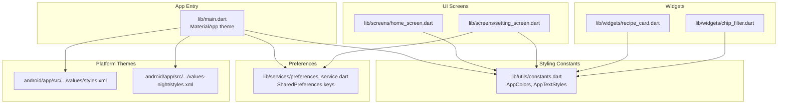
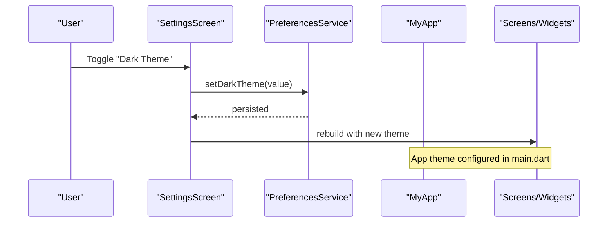
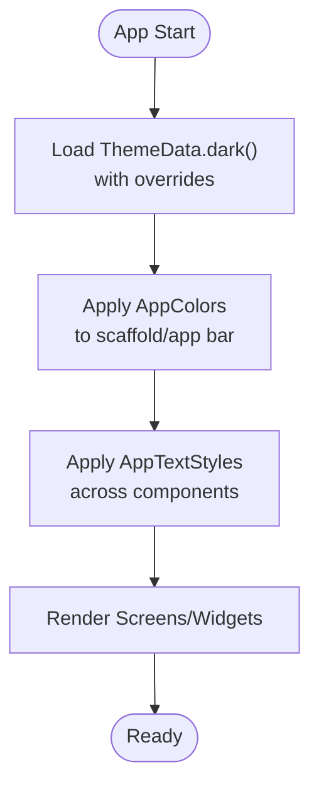
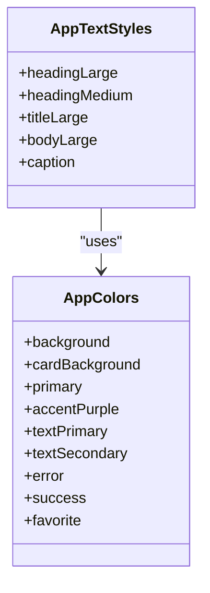
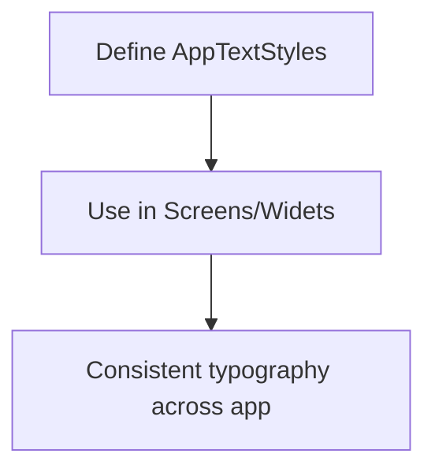
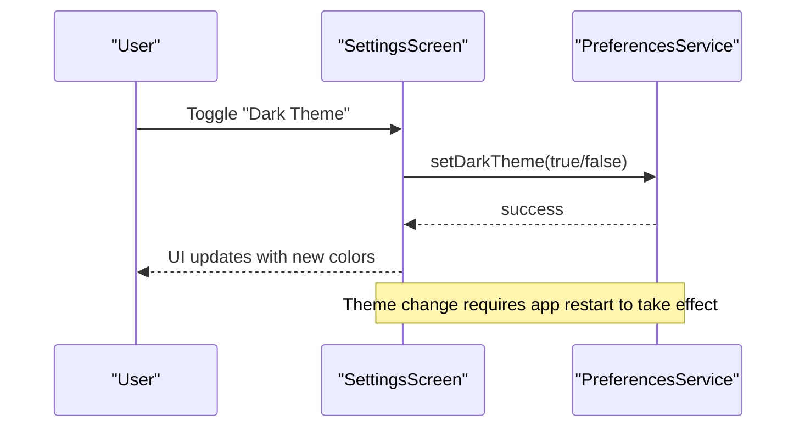
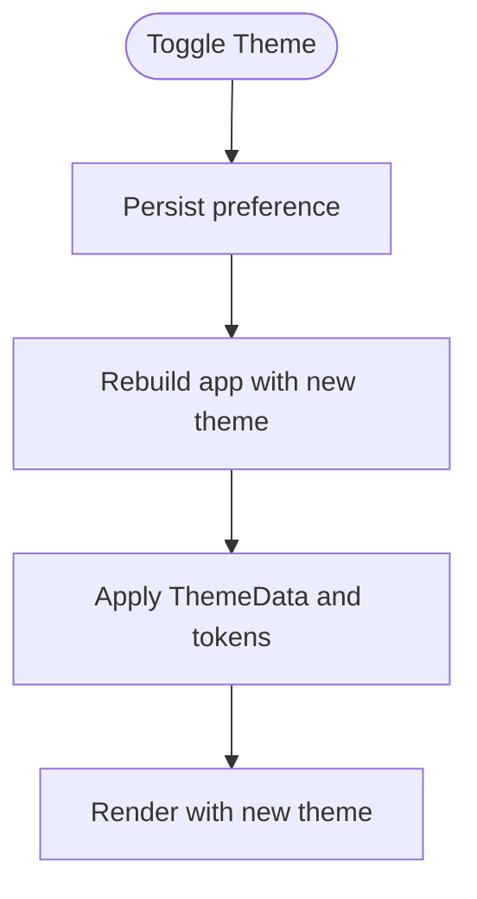
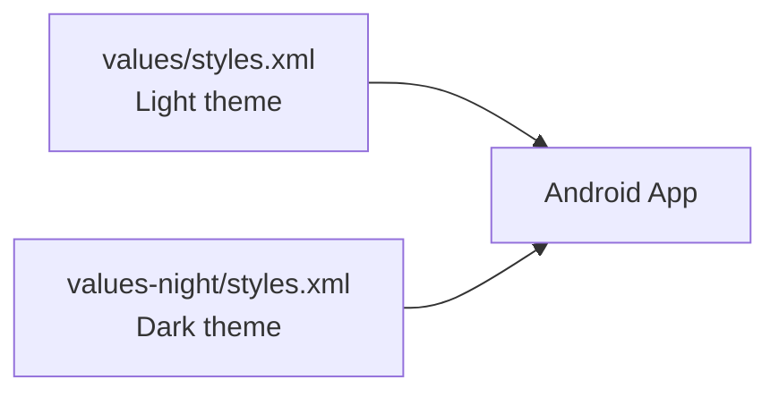
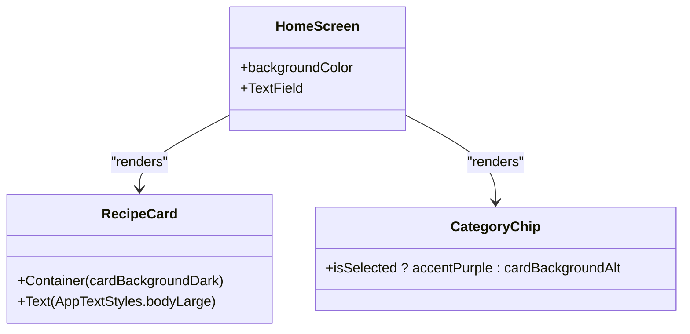
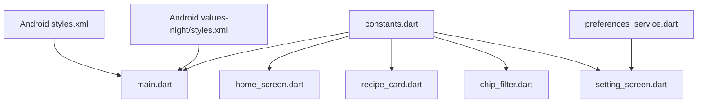

# Styling and Theming

<cite>
**Referenced Files in This Document**
- [main.dart](file://lib/main.dart)
- [constants.dart](file://lib/utils/constants.dart)
- [preferences_service.dart](file://lib/services/preferences_service.dart)
- [setting_screen.dart](file://lib/screens/setting_screen.dart)
- [home_screen.dart](file://lib/screens/home_screen.dart)
- [recipe_card.dart](file://lib/widgets/recipe_card.dart)
- [chip_filter.dart](file://lib/widgets/chip_filter.dart)
- [styles.xml](file://android/app/src/main/res/values/styles.xml)
- [styles.xml (night)](file://android/app/src/main/res/values-night/styles.xml)
- [pubspec.yaml](file://pubspec.yaml)
</cite>

## Table of Contents
1. [Introduction](#introduction)
2. [Project Structure](#project-structure)
3. [Core Components](#core-components)
4. [Architecture Overview](#architecture-overview)
5. [Detailed Component Analysis](#detailed-component-analysis)
6. [Dependency Analysis](#dependency-analysis)
7. [Performance Considerations](#performance-considerations)
8. [Troubleshooting Guide](#troubleshooting-guide)
9. [Conclusion](#conclusion)

## Introduction
This document explains the styling and theming system of the Cooking Book App. It covers the dark theme implementation, color scheme organization, typography system, design tokens, contrast and accessibility considerations, theme customization and persistence, dynamic theme switching, platform-specific adaptations, and consistent styling patterns across components. It also highlights Flutter-specific styling approaches and how to maintain visual consistency.

## Project Structure
The theming system is implemented using:
- A centralized color palette and typography tokens in a constants module
- A dark theme definition in the app entrypoint
- Preference-backed theme toggling via a settings screen
- Platform-specific Android themes for initial window appearance

**Diagram sources**
- [main.dart:10-33](file://lib/main.dart#L10-L33)
- [constants.dart:4-99](file://lib/utils/constants.dart#L4-L99)
- [preferences_service.dart:16-33](file://lib/services/preferences_service.dart#L16-L33)
- [setting_screen.dart:38-151](file://lib/screens/setting_screen.dart#L38-L151)
- [home_screen.dart:38-91](file://lib/screens/home_screen.dart#L38-L91)
- [recipe_card.dart:22-146](file://lib/widgets/recipe_card.dart#L22-L146)
- [chip_filter.dart:18-38](file://lib/widgets/chip_filter.dart#L18-L38)
- [styles.xml:1-19](file://android/app/src/main/res/values/styles.xml#L1-L19)
- [styles.xml (night):1-19](file://android/app/src/main/res/values-night/styles.xml#L1-L19)

**Section sources**
- [main.dart:10-33](file://lib/main.dart#L10-L33)
- [constants.dart:4-99](file://lib/utils/constants.dart#L4-L99)
- [preferences_service.dart:16-33](file://lib/services/preferences_service.dart#L16-L33)
- [setting_screen.dart:38-151](file://lib/screens/setting_screen.dart#L38-L151)
- [home_screen.dart:38-91](file://lib/screens/home_screen.dart#L38-L91)
- [recipe_card.dart:22-146](file://lib/widgets/recipe_card.dart#L22-L146)
- [chip_filter.dart:18-38](file://lib/widgets/chip_filter.dart#L18-L38)
- [styles.xml:1-19](file://android/app/src/main/res/values/styles.xml#L1-L19)
- [styles.xml (night):1-19](file://android/app/src/main/res/values-night/styles.xml#L1-L19)

## Core Components
- Centralized color palette and typography tokens:
  - Colors: backgrounds, cards, primary/accent, text, status, and utility colors
  - Typography: heading/title/body/caption scales with consistent weights and sizes
- Dark theme definition:
  - App theme configured via a dark base with custom overrides for scaffold/app bar
- Preference-backed theme persistence:
  - SharedPreferences keys for theme and layout preferences
- Dynamic theme switching:
  - Settings screen toggles theme preference and persists it
- Platform-specific adaptations:
  - Android themes define light/dark launch and normal window themes

**Section sources**
- [constants.dart:4-99](file://lib/utils/constants.dart#L4-L99)
- [main.dart:20-31](file://lib/main.dart#L20-L31)
- [preferences_service.dart:16-33](file://lib/services/preferences_service.dart#L16-L33)
- [setting_screen.dart:51-70](file://lib/screens/setting_screen.dart#L51-L70)
- [styles.xml:1-19](file://android/app/src/main/res/values/styles.xml#L1-L19)
- [styles.xml (night):1-19](file://android/app/src/main/res/values-night/styles.xml#L1-L19)

## Architecture Overview
The theming pipeline integrates constants, preferences, and UI components:

**Diagram sources**
- [setting_screen.dart:51-70](file://lib/screens/setting_screen.dart#L51-L70)
- [preferences_service.dart:31-33](file://lib/services/preferences_service.dart#L31-L33)
- [main.dart:20-31](file://lib/main.dart#L20-L31)

## Detailed Component Analysis

### Dark Theme Implementation
- Theme base and overrides:
  - The app uses a dark theme base and customizes scaffold/app bar background and elevation
- Color scheme:
  - Backgrounds and card backgrounds are defined centrally for consistent surfaces
  - Primary/accent colors are used for interactive elements and highlights
- Typography tokens:
  - Consistent heading/title/body/caption scales are applied across components

**Diagram sources**
- [main.dart:20-31](file://lib/main.dart#L20-L31)
- [constants.dart:4-99](file://lib/utils/constants.dart#L4-L99)

**Section sources**
- [main.dart:20-31](file://lib/main.dart#L20-L31)
- [constants.dart:4-99](file://lib/utils/constants.dart#L4-L99)

### Color Palette Organization and Tokens
- Background palette: multiple shades for layered depth
- Card backgrounds: multiple variants for different contexts
- Primary/accent palette: for emphasis and interactive states
- Text palette: primary, secondary, muted, and hint colors
- Status palette: error, success, favorites
- Utility palette: star rating and dividers

**Diagram sources**
- [constants.dart:4-99](file://lib/utils/constants.dart#L4-L99)

**Section sources**
- [constants.dart:4-99](file://lib/utils/constants.dart#L4-L99)

### Typography System
- Scale and weights:
  - Distinct headings, titles, bodies, and captions with consistent weights
- Usage pattern:
  - Components reference AppTextStyles for uniformity
- Responsive text sizing:
  - Current implementation uses fixed sizes; consider media queries or adaptive text scales for responsive behavior

**Diagram sources**
- [constants.dart:40-99](file://lib/utils/constants.dart#L40-L99)
- [home_screen.dart:47-50](file://lib/screens/home_screen.dart#L47-L50)
- [recipe_card.dart:80-85](file://lib/widgets/recipe_card.dart#L80-L85)

**Section sources**
- [constants.dart:40-99](file://lib/utils/constants.dart#L40-L99)
- [home_screen.dart:47-50](file://lib/screens/home_screen.dart#L47-L50)
- [recipe_card.dart:80-85](file://lib/widgets/recipe_card.dart#L80-L85)

### Theme Customization and Persistence
- Preferences:
  - SharedPreferences keys store theme and layout preferences
- Settings screen:
  - Provides toggles for theme and layout options
  - Persists selections immediately upon change
- Current limitation:
  - The app does not dynamically rebuild the app theme at runtime; it applies the stored preference on next initialization

**Diagram sources**
- [setting_screen.dart:51-70](file://lib/screens/setting_screen.dart#L51-L70)
- [preferences_service.dart:31-33](file://lib/services/preferences_service.dart#L31-L33)

**Section sources**
- [preferences_service.dart:16-33](file://lib/services/preferences_service.dart#L16-L33)
- [setting_screen.dart:51-70](file://lib/screens/setting_screen.dart#L51-L70)

### Dynamic Theme Switching
- Current state:
  - The app sets a theme in the app entrypoint and does not rebuild the theme dynamically
- Recommended approach:
  - Wrap the app with a theme-aware provider or use a stateful root widget to rebuild with a new theme when preferences change
  - Update the theme in the nearest Material theme scope when toggling

[No sources needed since this diagram shows conceptual workflow, not actual code structure]

### Platform-Specific Adaptations
- Android:
  - Separate light and dark window themes for launch and normal UI
  - Ensures correct initial appearance when the app starts

**Diagram sources**
- [styles.xml:1-19](file://android/app/src/main/res/values/styles.xml#L1-L19)
- [styles.xml (night):1-19](file://android/app/src/main/res/values-night/styles.xml#L1-L19)

**Section sources**
- [styles.xml:1-19](file://android/app/src/main/res/values/styles.xml#L1-L19)
- [styles.xml (night):1-19](file://android/app/src/main/res/values-night/styles.xml#L1-L19)

### Widget Theming Patterns
- Consistent theming across components:
  - Backgrounds use card/background tokens
  - Interactive elements use primary/accent tokens
  - Typography uses AppTextStyles
- Example patterns:
  - Recipe cards apply card backgrounds and text styles
  - Chips and category chips adapt selection state with color tokens
  - Search fields and inputs use consistent fill and hint colors

**Diagram sources**
- [home_screen.dart:42-91](file://lib/screens/home_screen.dart#L42-L91)
- [recipe_card.dart:22-146](file://lib/widgets/recipe_card.dart#L22-L146)
- [chip_filter.dart:18-38](file://lib/widgets/chip_filter.dart#L18-L38)

**Section sources**
- [home_screen.dart:42-91](file://lib/screens/home_screen.dart#L42-L91)
- [recipe_card.dart:22-146](file://lib/widgets/recipe_card.dart#L22-L146)
- [chip_filter.dart:18-38](file://lib/widgets/chip_filter.dart#L18-L38)

### Examples of Theme Usage Across Components
- Home screen:
  - Uses AppTextStyles for titles and headings
  - Applies background and card colors consistently
- Recipe cards:
  - Apply card backgrounds and text styles
  - Use icons and colors from AppColors
- Category chips:
  - Selection state switches between accent and neutral backgrounds
- Settings screen:
  - Uses AppColors for cards, accents, and typography

**Section sources**
- [home_screen.dart:47-50](file://lib/screens/home_screen.dart#L47-L50)
- [recipe_card.dart:80-85](file://lib/widgets/recipe_card.dart#L80-L85)
- [chip_filter.dart:24-26](file://lib/widgets/chip_filter.dart#L24-L26)
- [setting_screen.dart:40-45](file://lib/screens/setting_screen.dart#L40-L45)

## Dependency Analysis
The theming system depends on:
- Constants module for color and typography tokens
- Preferences service for persistence
- Android resources for platform themes

**Diagram sources**
- [constants.dart:4-99](file://lib/utils/constants.dart#L4-L99)
- [main.dart:20-31](file://lib/main.dart#L20-L31)
- [home_screen.dart:42-91](file://lib/screens/home_screen.dart#L42-L91)
- [recipe_card.dart:22-146](file://lib/widgets/recipe_card.dart#L22-L146)
- [chip_filter.dart:18-38](file://lib/widgets/chip_filter.dart#L18-L38)
- [setting_screen.dart:38-151](file://lib/screens/setting_screen.dart#L38-L151)
- [preferences_service.dart:16-33](file://lib/services/preferences_service.dart#L16-L33)
- [styles.xml:1-19](file://android/app/src/main/res/values/styles.xml#L1-L19)
- [styles.xml (night):1-19](file://android/app/src/main/res/values-night/styles.xml#L1-L19)

**Section sources**
- [constants.dart:4-99](file://lib/utils/constants.dart#L4-L99)
- [main.dart:20-31](file://lib/main.dart#L20-L31)
- [preferences_service.dart:16-33](file://lib/services/preferences_service.dart#L16-L33)
- [setting_screen.dart:38-151](file://lib/screens/setting_screen.dart#L38-L151)
- [home_screen.dart:42-91](file://lib/screens/home_screen.dart#L42-L91)
- [recipe_card.dart:22-146](file://lib/widgets/recipe_card.dart#L22-L146)
- [chip_filter.dart:18-38](file://lib/widgets/chip_filter.dart#L18-L38)
- [styles.xml:1-19](file://android/app/src/main/res/values/styles.xml#L1-L19)
- [styles.xml (night):1-19](file://android/app/src/main/res/values-night/styles.xml#L1-L19)

## Performance Considerations
- Theme rebuild cost:
  - Rebuilding the app theme at runtime can trigger expensive widget rebuilds; consider scoped theme updates
- Rendering:
  - Excessive use of gradients and overlays can impact performance on lower-end devices
- Persistence:
  - SharedPreferences writes are lightweight but should be debounced if toggled rapidly
- Fonts:
  - Custom fonts increase APK size; ensure only necessary font weights are included

[No sources needed since this section provides general guidance]

## Troubleshooting Guide
- Theme toggle not taking effect:
  - The current implementation persists the preference but does not rebuild the theme at runtime; restart the app to apply
- Contrast and accessibility:
  - Verify text contrast ratios against backgrounds; adjust tokens if readability issues arise
- Platform-specific launch appearance:
  - Confirm Android light/dark themes match the intended initial appearance

**Section sources**
- [setting_screen.dart:51-70](file://lib/screens/setting_screen.dart#L51-L70)
- [preferences_service.dart:31-33](file://lib/services/preferences_service.dart#L31-L33)
- [styles.xml:1-19](file://android/app/src/main/res/values/styles.xml#L1-L19)
- [styles.xml (night):1-19](file://android/app/src/main/res/values-night/styles.xml#L1-L19)

## Conclusion
The Cooking Book App employs a centralized color and typography system with a dark theme foundation. While the current implementation persists theme preferences, dynamic runtime theme switching is not yet implemented. The Android platform contributes to consistent initial appearance through dedicated light/dark window themes. Extending the app to support dynamic theme switching and ensuring accessibility compliance will further strengthen the design system.