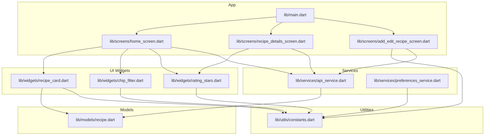
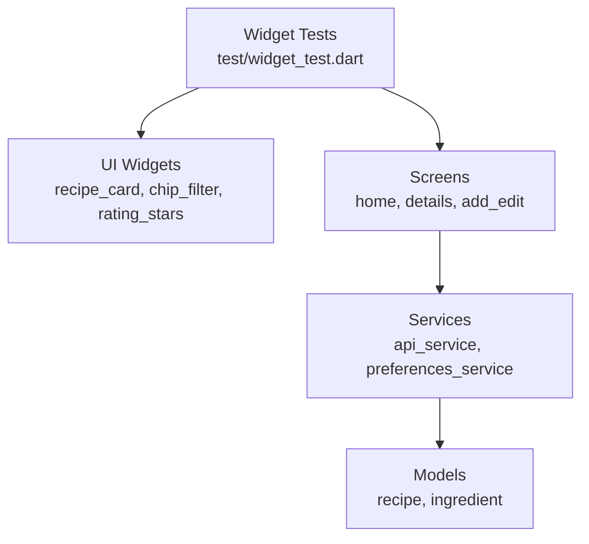
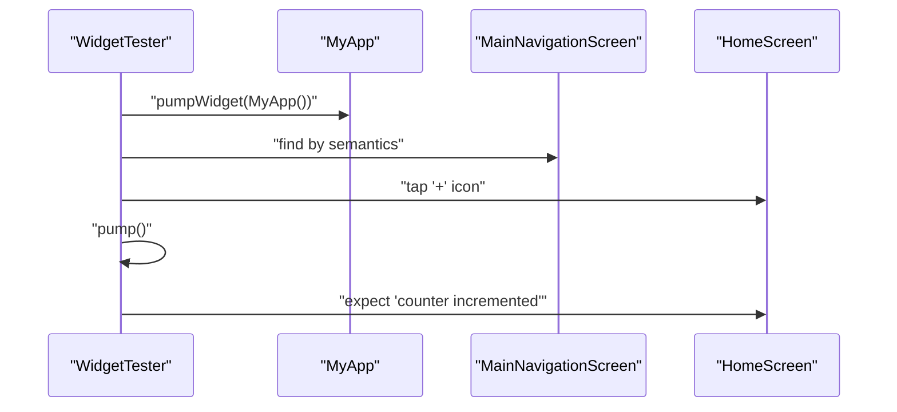
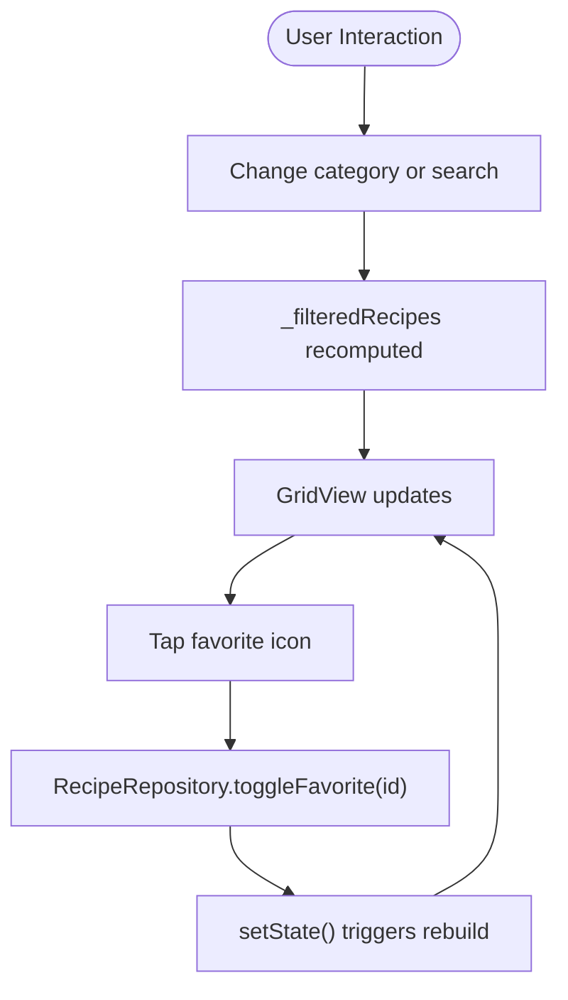
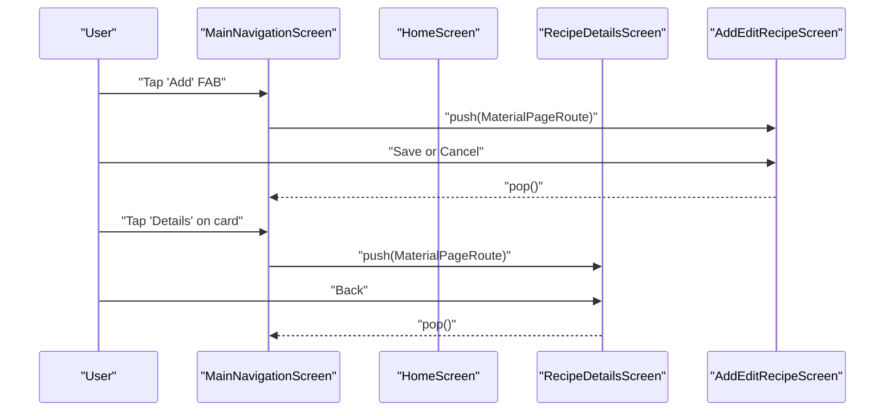
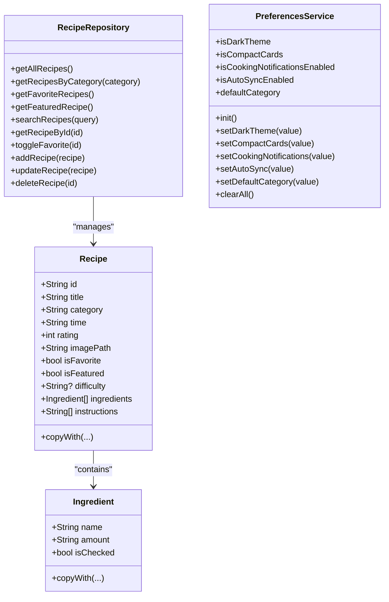
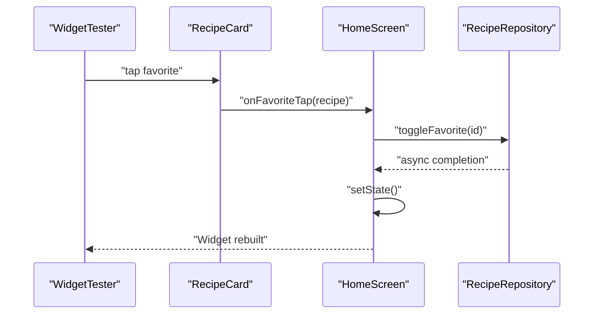
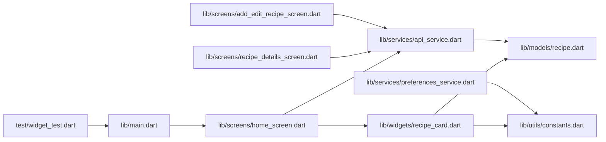

# Testing Strategy

<cite>
**Referenced Files in This Document**
- [pubspec.yaml](file://pubspec.yaml)
- [analysis_options.yaml](file://analysis_options.yaml)
- [test/widget_test.dart](file://test/widget_test.dart)
- [lib/main.dart](file://lib/main.dart)
- [lib/models/recipe.dart](file://lib/models/recipe.dart)
- [lib/services/api_service.dart](file://lib/services/api_service.dart)
- [lib/services/preferences_service.dart](file://lib/services/preferences_service.dart)
- [lib/widgets/recipe_card.dart](file://lib/widgets/recipe_card.dart)
- [lib/widgets/chip_filter.dart](file://lib/widgets/chip_filter.dart)
- [lib/widgets/rating_stars.dart](file://lib/widgets/rating_stars.dart)
- [lib/utils/constants.dart](file://lib/utils/constants.dart)
- [lib/screens/home_screen.dart](file://lib/screens/home_screen.dart)
- [lib/screens/recipe_details_screen.dart](file://lib/screens/recipe_details_screen.dart)
- [lib/screens/add_edit_recipe_screen.dart](file://lib/screens/add_edit_recipe_screen.dart)
</cite>

## Table of Contents
1. [Introduction](#introduction)
2. [Project Structure](#project-structure)
3. [Core Components](#core-components)
4. [Architecture Overview](#architecture-overview)
5. [Detailed Component Analysis](#detailed-component-analysis)
6. [Dependency Analysis](#dependency-analysis)
7. [Performance Considerations](#performance-considerations)
8. [Troubleshooting Guide](#troubleshooting-guide)
9. [Conclusion](#conclusion)
10. [Appendices](#appendices)

## Introduction
This document describes the testing strategy and implementation for the Cooking Book App. It covers widget testing with Flutter’s testing framework, unit testing patterns for services and models, test isolation techniques, setup and runner configuration, continuous integration considerations, and practical examples for UI components, state management, and navigation flows. It also includes guidance on performance testing, accessibility testing, and platform-specific testing approaches.

## Project Structure
The project follows a conventional Flutter layout with a clear separation of concerns:
- Application entry point and navigation are defined in the main module.
- Feature screens reside under screens/.
- Reusable UI components live under widgets/.
- Data models are under models/.
- Services encapsulate business logic and persistence.
- Utilities centralize constants and styles.
- Tests are placed under test/.

**Diagram sources**
- [lib/main.dart:1-100](file://lib/main.dart#L1-L100)
- [lib/screens/home_screen.dart:1-241](file://lib/screens/home_screen.dart#L1-L241)
- [lib/screens/recipe_details_screen.dart:1-285](file://lib/screens/recipe_details_screen.dart#L1-L285)
- [lib/screens/add_edit_recipe_screen.dart:1-363](file://lib/screens/add_edit_recipe_screen.dart#L1-L363)
- [lib/widgets/recipe_card.dart:1-247](file://lib/widgets/recipe_card.dart#L1-L247)
- [lib/widgets/chip_filter.dart:1-39](file://lib/widgets/chip_filter.dart#L1-L39)
- [lib/widgets/rating_stars.dart:1-42](file://lib/widgets/rating_stars.dart#L1-L42)
- [lib/services/api_service.dart:1-177](file://lib/services/api_service.dart#L1-L177)
- [lib/services/preferences_service.dart:1-73](file://lib/services/preferences_service.dart#L1-L73)
- [lib/models/recipe.dart:1-82](file://lib/models/recipe.dart#L1-L82)
- [lib/utils/constants.dart:1-124](file://lib/utils/constants.dart#L1-L124)

**Section sources**
- [pubspec.yaml:1-92](file://pubspec.yaml#L1-L92)
- [lib/main.dart:1-100](file://lib/main.dart#L1-L100)

## Core Components
This section outlines the testing-relevant components and their roles:
- Navigation and routing: The main app initializes the navigation scaffold and routes to feature screens.
- Screens: Home, Details, and Add/Edit screens orchestrate UI composition, state updates, and user interactions.
- Widgets: Reusable components like recipe cards, chips, and rating stars encapsulate presentation and small interactions.
- Services: RecipeRepository provides in-memory recipe data and CRUD operations; PreferencesService manages app settings via SharedPreferences.
- Models: Recipe and Ingredient define the data structures used across screens and services.

Key testing touchpoints:
- Widget tests exercise UI rendering, gesture simulation, and state verification.
- Unit tests validate service logic, model transformations, and preference handling.
- Isolation techniques ensure tests remain deterministic and fast.

**Section sources**
- [lib/main.dart:35-100](file://lib/main.dart#L35-L100)
- [lib/screens/home_screen.dart:1-241](file://lib/screens/home_screen.dart#L1-L241)
- [lib/screens/recipe_details_screen.dart:1-285](file://lib/screens/recipe_details_screen.dart#L1-L285)
- [lib/screens/add_edit_recipe_screen.dart:1-363](file://lib/screens/add_edit_recipe_screen.dart#L1-L363)
- [lib/widgets/recipe_card.dart:1-247](file://lib/widgets/recipe_card.dart#L1-L247)
- [lib/widgets/chip_filter.dart:1-39](file://lib/widgets/chip_filter.dart#L1-L39)
- [lib/widgets/rating_stars.dart:1-42](file://lib/widgets/rating_stars.dart#L1-L42)
- [lib/services/api_service.dart:1-177](file://lib/services/api_service.dart#L1-L177)
- [lib/services/preferences_service.dart:1-73](file://lib/services/preferences_service.dart#L1-L73)
- [lib/models/recipe.dart:1-82](file://lib/models/recipe.dart#L1-L82)
- [lib/utils/constants.dart:1-124](file://lib/utils/constants.dart#L1-L124)

## Architecture Overview
The testing architecture leverages Flutter’s testing stack:
- Widget tests: Render app widgets, simulate user interactions, and assert UI state.
- Integration tests: Optional for navigation and platform-specific flows.
- Unit tests: Test services and models in isolation using mocks and controlled data.

**Diagram sources**
- [test/widget_test.dart:1-31](file://test/widget_test.dart#L1-L31)
- [lib/widgets/recipe_card.dart:1-247](file://lib/widgets/recipe_card.dart#L1-L247)
- [lib/widgets/chip_filter.dart:1-39](file://lib/widgets/chip_filter.dart#L1-L39)
- [lib/widgets/rating_stars.dart:1-42](file://lib/widgets/rating_stars.dart#L1-L42)
- [lib/screens/home_screen.dart:1-241](file://lib/screens/home_screen.dart#L1-L241)
- [lib/screens/recipe_details_screen.dart:1-285](file://lib/screens/recipe_details_screen.dart#L1-L285)
- [lib/screens/add_edit_recipe_screen.dart:1-363](file://lib/screens/add_edit_recipe_screen.dart#L1-L363)
- [lib/services/api_service.dart:1-177](file://lib/services/api_service.dart#L1-L177)
- [lib/services/preferences_service.dart:1-73](file://lib/services/preferences_service.dart#L1-L73)
- [lib/models/recipe.dart:1-82](file://lib/models/recipe.dart#L1-L82)

## Detailed Component Analysis

### Widget Testing Approach
- Purpose: Validate UI rendering, interaction simulation, and state transitions.
- Tools: Flutter’s flutter_test and WidgetTester.
- Examples:
  - Smoke test verifying initial state and a simple tap interaction.
  - Find widgets by semantics, icons, or text.
  - Trigger pump after interactions to rebuild the widget tree.
  - Assert visibility and content of rendered widgets.

**Diagram sources**
- [test/widget_test.dart:13-30](file://test/widget_test.dart#L13-L30)
- [lib/main.dart:14-100](file://lib/main.dart#L14-L100)
- [lib/screens/home_screen.dart:146-149](file://lib/screens/home_screen.dart#L146-L149)

**Section sources**
- [test/widget_test.dart:1-31](file://test/widget_test.dart#L1-L31)
- [lib/main.dart:14-100](file://lib/main.dart#L14-L100)

### State Management Scenarios
- Home screen state:
  - Selected category and search query drive filtering.
  - Favorite toggling triggers repository mutation and state refresh.
- Recipe details screen:
  - Favorite toggle updates repository and rebuilds UI.
- Add/edit screen:
  - Form validation and dynamic lists for ingredients and steps.
  - Navigation back on save or cancel.

**Diagram sources**
- [lib/screens/home_screen.dart:17-30](file://lib/screens/home_screen.dart#L17-L30)
- [lib/screens/home_screen.dart:146-149](file://lib/screens/home_screen.dart#L146-L149)
- [lib/services/api_service.dart:149-157](file://lib/services/api_service.dart#L149-L157)

**Section sources**
- [lib/screens/home_screen.dart:17-30](file://lib/screens/home_screen.dart#L17-L30)
- [lib/screens/home_screen.dart:146-149](file://lib/screens/home_screen.dart#L146-L149)
- [lib/services/api_service.dart:149-157](file://lib/services/api_service.dart#L149-L157)

### Navigation Flows
- Bottom navigation switches between Home, Browse, Favorites, and Settings.
- Floating action button navigates to Add/Edit screen.
- Details screen supports back navigation and action buttons.

**Diagram sources**
- [lib/main.dart:86-98](file://lib/main.dart#L86-L98)
- [lib/screens/home_screen.dart:138-141](file://lib/screens/home_screen.dart#L138-L141)
- [lib/screens/recipe_details_screen.dart:234-278](file://lib/screens/recipe_details_screen.dart#L234-L278)

**Section sources**
- [lib/main.dart:86-98](file://lib/main.dart#L86-L98)
- [lib/screens/home_screen.dart:138-141](file://lib/screens/home_screen.dart#L138-L141)
- [lib/screens/recipe_details_screen.dart:234-278](file://lib/screens/recipe_details_screen.dart#L234-L278)

### Unit Testing Patterns for Services and Models
- Models:
  - Test immutable fields and copyWith behavior.
  - Validate default values and optionality.
- Services:
  - RecipeRepository:
    - CRUD operations on in-memory recipes.
    - Filtering by category, favorites, featured, and search.
    - Toggle favorite updates in place.
  - PreferencesService:
    - Encapsulate SharedPreferences keys and defaults.
    - Async initialization and getters/setters for settings.

**Diagram sources**
- [lib/models/recipe.dart:1-82](file://lib/models/recipe.dart#L1-L82)
- [lib/services/api_service.dart:4-177](file://lib/services/api_service.dart#L4-L177)
- [lib/services/preferences_service.dart:1-73](file://lib/services/preferences_service.dart#L1-L73)

**Section sources**
- [lib/models/recipe.dart:1-82](file://lib/models/recipe.dart#L1-L82)
- [lib/services/api_service.dart:1-177](file://lib/services/api_service.dart#L1-L177)
- [lib/services/preferences_service.dart:1-73](file://lib/services/preferences_service.dart#L1-L73)

### Mock Data Usage and Test Isolation
- Use in-memory RecipeRepository instances per test to avoid cross-test contamination.
- Stub images and assets with placeholders during tests.
- Initialize PreferencesService with a fresh SharedPreferences instance per test if needed.
- Avoid real network or persistent storage in unit tests.

Best practices:
- Keep tests hermetic: seed deterministic data, isolate state, and reset globals.
- Prefer pure functions and inject dependencies via constructors.

**Section sources**
- [lib/services/api_service.dart:4-177](file://lib/services/api_service.dart#L4-L177)
- [lib/widgets/recipe_card.dart:38-50](file://lib/widgets/recipe_card.dart#L38-L50)
- [lib/widgets/recipe_card.dart:180-187](file://lib/widgets/recipe_card.dart#L180-L187)

### Testing Setup and Runner Configuration
- Dependencies:
  - flutter_test SDK is declared for testing.
  - flutter_lints configured for analysis.
- Runner:
  - Flutter test runner executes tests in the test/ directory.
  - Widget tests use testWidgets and WidgetTester.
- Continuous Integration:
  - Configure CI to run flutter test and flutter analyze.
  - Optionally collect coverage with coverage flags.

Recommendations:
- Add a dedicated test configuration file if needed (e.g., custom matcher packages).
- Use dev_dependencies sparingly and keep them aligned with testing needs.

**Section sources**
- [pubspec.yaml:39-48](file://pubspec.yaml#L39-L48)
- [analysis_options.yaml:1-29](file://analysis_options.yaml#L1-L29)
- [test/widget_test.dart:1-31](file://test/widget_test.dart#L1-L31)

### Examples: UI Components, State, and Navigation
- RecipeCard:
  - Tap handlers for item and favorite actions.
  - Favorite icon reflects current isFavorite state.
- CategoryChip:
  - Visual selection state and callback invocation.
- RatingStars:
  - Renders filled/empty stars based on rating.
- HomeScreen:
  - Grid of CompactRecipeCard with favorite toggling.
  - Featured recipe display and empty-state handling.
- RecipeDetailsScreen:
  - Favorite toggle and back navigation.
- AddEditRecipeScreen:
  - Dynamic form with validation and save/cancel.

**Diagram sources**
- [lib/widgets/recipe_card.dart:55-70](file://lib/widgets/recipe_card.dart#L55-L70)
- [lib/screens/home_screen.dart:146-149](file://lib/screens/home_screen.dart#L146-L149)
- [lib/services/api_service.dart:149-157](file://lib/services/api_service.dart#L149-L157)

**Section sources**
- [lib/widgets/recipe_card.dart:55-70](file://lib/widgets/recipe_card.dart#L55-L70)
- [lib/widgets/chip_filter.dart:17-37](file://lib/widgets/chip_filter.dart#L17-L37)
- [lib/widgets/rating_stars.dart:19-40](file://lib/widgets/rating_stars.dart#L19-L40)
- [lib/screens/home_screen.dart:126-149](file://lib/screens/home_screen.dart#L126-L149)
- [lib/screens/recipe_details_screen.dart:281-284](file://lib/screens/recipe_details_screen.dart#L281-L284)
- [lib/screens/add_edit_recipe_screen.dart:179-186](file://lib/screens/add_edit_recipe_screen.dart#L179-L186)

## Dependency Analysis
Testing dependencies and coupling:
- Screens depend on services for data and on widgets for UI.
- Widgets depend on models and constants for rendering.
- Services depend on models and external libraries (SharedPreferences).

**Diagram sources**
- [test/widget_test.dart:1-31](file://test/widget_test.dart#L1-L31)
- [lib/main.dart:1-100](file://lib/main.dart#L1-L100)
- [lib/screens/home_screen.dart:1-241](file://lib/screens/home_screen.dart#L1-L241)
- [lib/screens/recipe_details_screen.dart:1-285](file://lib/screens/recipe_details_screen.dart#L1-L285)
- [lib/screens/add_edit_recipe_screen.dart:1-363](file://lib/screens/add_edit_recipe_screen.dart#L1-L363)
- [lib/widgets/recipe_card.dart:1-247](file://lib/widgets/recipe_card.dart#L1-L247)
- [lib/services/api_service.dart:1-177](file://lib/services/api_service.dart#L1-L177)
- [lib/services/preferences_service.dart:1-73](file://lib/services/preferences_service.dart#L1-L73)
- [lib/models/recipe.dart:1-82](file://lib/models/recipe.dart#L1-L82)
- [lib/utils/constants.dart:1-124](file://lib/utils/constants.dart#L1-L124)

**Section sources**
- [lib/main.dart:1-100](file://lib/main.dart#L1-L100)
- [lib/screens/home_screen.dart:1-241](file://lib/screens/home_screen.dart#L1-L241)
- [lib/widgets/recipe_card.dart:1-247](file://lib/widgets/recipe_card.dart#L1-L247)
- [lib/services/api_service.dart:1-177](file://lib/services/api_service.dart#L1-L177)
- [lib/services/preferences_service.dart:1-73](file://lib/services/preferences_service.dart#L1-L73)
- [lib/models/recipe.dart:1-82](file://lib/models/recipe.dart#L1-L82)
- [lib/utils/constants.dart:1-124](file://lib/utils/constants.dart#L1-L124)

## Performance Considerations
- Widget tests:
  - Minimize unnecessary rebuilds; batch state changes and pump once per assertion.
  - Use find.byType or find.byKey for precise targeting to reduce traversal cost.
- Service tests:
  - Favor small, focused datasets; avoid large loops in tests.
  - Mock expensive operations (e.g., network) with in-memory stubs.
- CI:
  - Parallelize test suites by platform or feature.
  - Cache dependencies and build artifacts to speed up runs.

[No sources needed since this section provides general guidance]

## Troubleshooting Guide
Common issues and resolutions:
- WidgetTester assertions fail:
  - Ensure proper pump after interactions.
  - Use find.byType/find.byKey for reliable selectors.
- State not updating:
  - Verify setState is called after asynchronous operations.
  - Confirm repository mutations occur before rebuild.
- Navigation not working:
  - Ensure routes are pushed/popped correctly in tests.
  - Mock Navigator.push/pop if necessary for isolated tests.
- Preferences not persisting:
  - Initialize PreferencesService before use.
  - Clear or reset SharedPreferences between tests.

**Section sources**
- [test/widget_test.dart:13-30](file://test/widget_test.dart#L13-L30)
- [lib/screens/home_screen.dart:146-149](file://lib/screens/home_screen.dart#L146-L149)
- [lib/services/preferences_service.dart:11-14](file://lib/services/preferences_service.dart#L11-L14)

## Conclusion
The Cooking Book App employs a layered testing strategy:
- Widget tests validate UI behavior and interactions.
- Unit tests ensure service logic correctness and model integrity.
- Strong separation of concerns enables test isolation and maintainability.
Adhering to the outlined patterns and best practices will improve reliability, test coverage, and developer productivity.

[No sources needed since this section summarizes without analyzing specific files]

## Appendices

### Testing Best Practices
- Keep tests readable: describe intent with meaningful names and comments.
- Test failure locality: narrow down failing assertions quickly.
- Coverage expectations:
  - Target high coverage for critical paths (favorites, filters, forms).
  - Balance coverage with maintainability; avoid over-testing trivial UI.
- Accessibility:
  - Verify semantic labels and contrast ratios.
  - Test focus order and keyboard navigation where applicable.
- Platform-specific:
  - Use platform channels sparingly; isolate platform code behind interfaces.
  - Run device/emulator tests for platform-dependent features.

[No sources needed since this section provides general guidance]