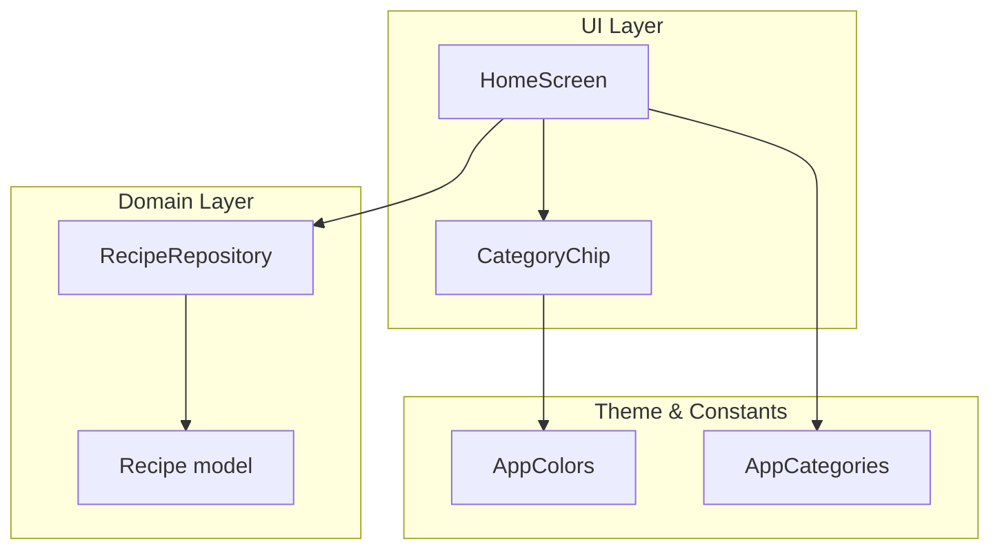
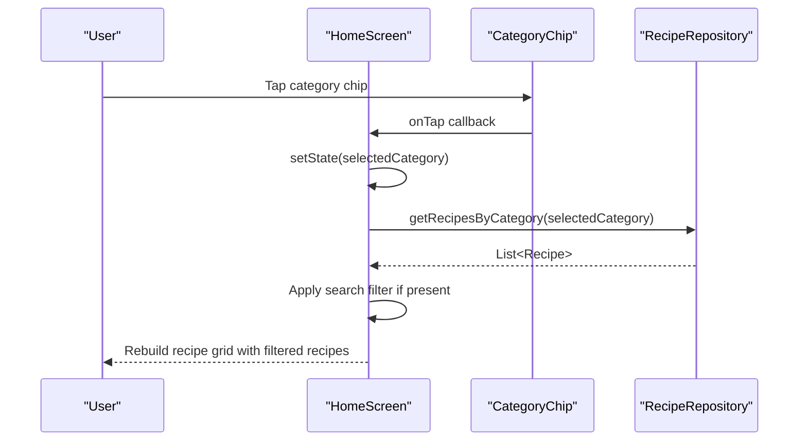
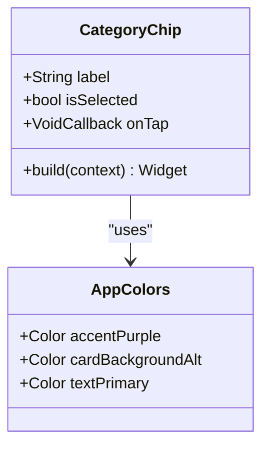
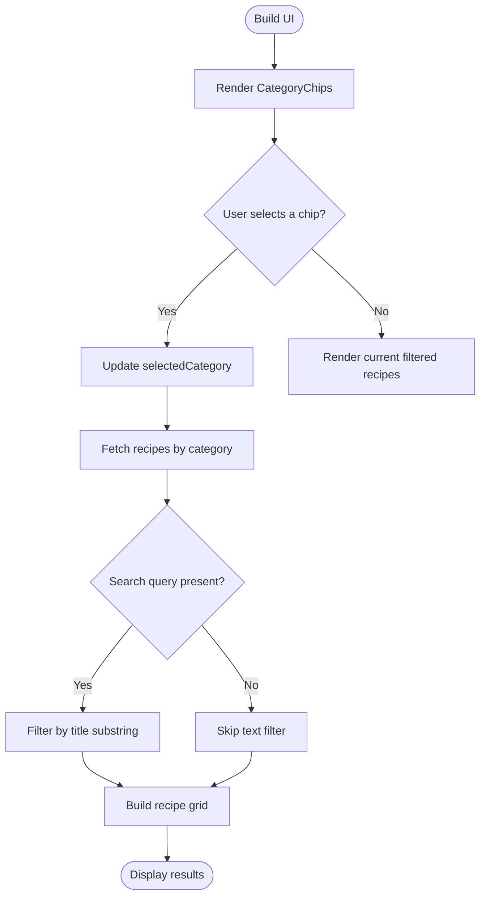
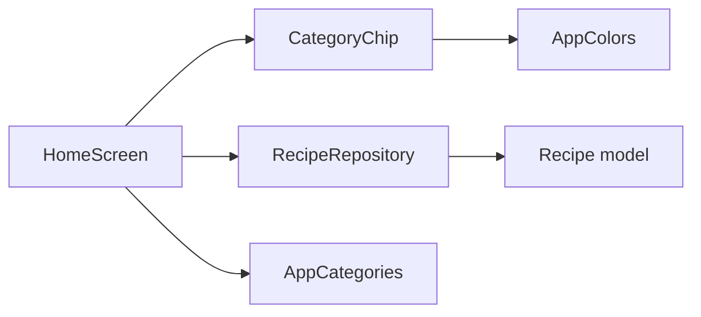

# Filter and Interaction Components

<cite>
**Referenced Files in This Document**
- [chip_filter.dart](file://lib/widgets/chip_filter.dart)
- [constants.dart](file://lib/utils/constants.dart)
- [recipe.dart](file://lib/models/recipe.dart)
- [api_service.dart](file://lib/services/api_service.dart)
- [home_screen.dart](file://lib/screens/home_screen.dart)
- [main.dart](file://lib/main.dart)
</cite>

## Table of Contents
1. [Introduction](#introduction)
2. [Project Structure](#project-structure)
3. [Core Components](#core-components)
4. [Architecture Overview](#architecture-overview)
5. [Detailed Component Analysis](#detailed-component-analysis)
6. [Dependency Analysis](#dependency-analysis)
7. [Performance Considerations](#performance-considerations)
8. [Troubleshooting Guide](#troubleshooting-guide)
9. [Conclusion](#conclusion)

## Introduction
This document focuses on the filter and interaction components of the Cooking Book App, with a deep dive into the ChipFilter component (implemented as CategoryChip) and its integration with the recipe filtering system. It explains selection state management, category filtering, user interaction patterns, styling and theme consistency with the app’s dark design, accessibility considerations, and practical usage examples for setting up filters, dynamically loading categories, and retrieving filtered recipes via RecipeRepository.

## Project Structure
The filter and interaction functionality centers around:
- A reusable CategoryChip widget that renders individual chips for category selection.
- A centralized RecipeRepository service that supplies recipe data and applies category-based filtering.
- A HomeScreen that orchestrates search, category selection, and recipe rendering.
- A shared constants module that defines theme colors and category lists for consistent styling and behavior.

**Diagram sources**
- [home_screen.dart:10-241](file://lib/screens/home_screen.dart#L10-L241)
- [chip_filter.dart:4-39](file://lib/widgets/chip_filter.dart#L4-L39)
- [api_service.dart:4-177](file://lib/services/api_service.dart#L4-L177)
- [constants.dart:4-124](file://lib/utils/constants.dart#L4-L124)
- [recipe.dart:1-82](file://lib/models/recipe.dart#L1-L82)

**Section sources**
- [main.dart:10-100](file://lib/main.dart#L10-L100)
- [constants.dart:101-117](file://lib/utils/constants.dart#L101-L117)

## Core Components
- CategoryChip: A lightweight, stateless chip widget that renders category labels, handles taps, and visually indicates selection using theme-aware colors.
- HomeScreen: Manages the current category selection, search query, and builds the category chip row and recipe grid. It integrates CategoryChip and RecipeRepository to produce filtered results.
- RecipeRepository: Provides recipe data and implements category filtering, favorites toggling, and search functionality.
- AppColors and AppCategories: Centralized theme and category definitions ensuring consistent styling and behavior across the app.

Key responsibilities:
- Selection state management: Controlled by HomeScreen state variables and passed down to CategoryChip.
- Filtering pipeline: Category filtering via RecipeRepository combined with optional text search in HomeScreen.
- Event handling: CategoryChip invokes callbacks to update selection state in HomeScreen.

**Section sources**
- [chip_filter.dart:4-39](file://lib/widgets/chip_filter.dart#L4-L39)
- [home_screen.dart:17-35](file://lib/screens/home_screen.dart#L17-L35)
- [api_service.dart:109-118](file://lib/services/api_service.dart#L109-L118)
- [constants.dart:101-117](file://lib/utils/constants.dart#L101-L117)

## Architecture Overview
The filtering architecture follows a unidirectional data flow:
- UI triggers selection via CategoryChip.
- HomeScreen updates its internal selection state.
- HomeScreen computes filtered recipes using RecipeRepository and search query.
- UI re-renders the recipe grid with the new filtered dataset.

**Diagram sources**
- [home_screen.dart:111-124](file://lib/screens/home_screen.dart#L111-L124)
- [chip_filter.dart:18-37](file://lib/widgets/chip_filter.dart#L18-L37)
- [api_service.dart:112-116](file://lib/services/api_service.dart#L112-L116)

## Detailed Component Analysis

### CategoryChip Component
CategoryChip is a stateless widget responsible for:
- Rendering a single category label inside a rounded container.
- Applying selection visuals (background and text color) based on the isSelected flag.
- Exposing an onTap callback for parent widgets to handle selection changes.

Selection state management:
- isSelected is a boolean prop supplied by the parent (e.g., HomeScreen).
- The widget itself does not manage state; it delegates selection logic to the parent.

Visual design and theming:
- Uses AppColors.accentPurple for selected background and AppColors.cardBackgroundAlt for unselected background.
- Text color is set to AppColors.textPrimary with a medium-weight font.
- Rounded rectangular shape with symmetric horizontal padding and fixed vertical padding.

Interaction patterns:
- Wraps the chip content in a GestureDetector to capture taps.
- No keyboard navigation or focus management is implemented here; parents should handle accessibility.

Accessibility considerations:
- CategoryChip does not include explicit semantic labels or focus indicators.
- Parents should add semantic labels and ensure focus traversal for keyboard/screen reader support.

Integration with filtering:
- CategoryChip is rendered in HomeScreen’s category chip row.
- On tap, HomeScreen updates selectedCategory and triggers a rebuild with filtered recipes.

**Section sources**
- [chip_filter.dart:4-39](file://lib/widgets/chip_filter.dart#L4-L39)
- [constants.dart:4-38](file://lib/utils/constants.dart#L4-L38)

#### Class Diagram

**Diagram sources**
- [chip_filter.dart:4-39](file://lib/widgets/chip_filter.dart#L4-L39)
- [constants.dart:4-38](file://lib/utils/constants.dart#L4-L38)

### HomeScreen Integration and Filtering Pipeline
HomeScreen manages:
- selectedCategory: Tracks the currently selected category.
- searchQuery: Stores the current text search input.
- _filteredRecipes: Computes the filtered recipe list combining category and text search.
- _featuredRecipe: Retrieves a featured recipe when no search is active.

Category chip rendering:
- Builds a horizontal scrolling row of CategoryChip instances.
- Each chip passes its label, selection state, and an onTap handler that updates selectedCategory.

Filtering logic:
- Filters recipes by category using RecipeRepository.getRecipesByCategory.
- Applies an additional text search filter on the resulting list if the search query is not empty.
- Returns the final filtered list for rendering.

Recipe grid rendering:
- Uses GridView.builder to render recipe cards with compact layout.
- Integrates favorite toggling via RecipeRepository.toggleFavorite.

**Diagram sources**
- [home_screen.dart:17-35](file://lib/screens/home_screen.dart#L17-L35)
- [home_screen.dart:111-124](file://lib/screens/home_screen.dart#L111-L124)
- [api_service.dart:112-116](file://lib/services/api_service.dart#L112-L116)

**Section sources**
- [home_screen.dart:17-35](file://lib/screens/home_screen.dart#L17-L35)
- [home_screen.dart:111-124](file://lib/screens/home_screen.dart#L111-L124)
- [api_service.dart:109-118](file://lib/services/api_service.dart#L109-L118)

### RecipeRepository and Data Access
RecipeRepository encapsulates:
- An in-memory recipe collection with sample data.
- Category filtering via getRecipesByCategory.
- Favorite toggling via toggleFavorite.
- Search by title via searchRecipes.
- Additional CRUD operations for recipes.

Category filtering behavior:
- If the selected category is “All”, returns all recipes.
- Otherwise, filters recipes by exact category match.

**Section sources**
- [api_service.dart:4-177](file://lib/services/api_service.dart#L4-L177)

### Theme Consistency and Styling
Theme and colors:
- AppColors centralizes background, accent, and text colors for consistent theming across the app.
- CategoryChip uses AppColors.accentPurple for selected state and AppColors.cardBackgroundAlt for unselected state.
- HomeScreen sets background colors and text styles aligned with the dark theme.

Category list:
- AppCategories.all defines the canonical list of categories used by CategoryChip and HomeScreen.

**Section sources**
- [constants.dart:4-38](file://lib/utils/constants.dart#L4-L38)
- [constants.dart:101-117](file://lib/utils/constants.dart#L101-L117)
- [home_screen.dart:42-43](file://lib/screens/home_screen.dart#L42-L43)

### Accessibility Considerations
Current state:
- CategoryChip does not include explicit semantics or focus management.
- HomeScreen does not apply semantic labels to chips.

Recommendations:
- Add semantic labels to chips for screen readers.
- Ensure keyboard focus traversal and provide visible focus indicators.
- Consider adding an accessible name and hint to communicate selection state.

[No sources needed since this section provides general guidance]

## Dependency Analysis
The filtering system exhibits low coupling and clear separation of concerns:
- CategoryChip depends only on props and a callback, promoting reusability.
- HomeScreen orchestrates UI state and delegates data access to RecipeRepository.
- RecipeRepository encapsulates data logic and exposes simple filtering APIs.
- AppColors and AppCategories provide shared constants for styling and categories.

**Diagram sources**
- [chip_filter.dart:4-39](file://lib/widgets/chip_filter.dart#L4-L39)
- [home_screen.dart:10-241](file://lib/screens/home_screen.dart#L10-L241)
- [api_service.dart:4-177](file://lib/services/api_service.dart#L4-L177)
- [constants.dart:101-117](file://lib/utils/constants.dart#L101-L117)
- [recipe.dart:1-82](file://lib/models/recipe.dart#L1-L82)

**Section sources**
- [chip_filter.dart:4-39](file://lib/widgets/chip_filter.dart#L4-L39)
- [home_screen.dart:10-241](file://lib/screens/home_screen.dart#L10-L241)
- [api_service.dart:4-177](file://lib/services/api_service.dart#L4-L177)
- [constants.dart:101-117](file://lib/utils/constants.dart#L101-L117)
- [recipe.dart:1-82](file://lib/models/recipe.dart#L1-L82)

## Performance Considerations
- Category filtering is O(n) per category change; acceptable for small to medium datasets.
- Text search is O(n) per keystroke; consider debouncing search input to reduce recomputation frequency.
- GridView.builder ensures efficient rendering of recipe cards.
- Favor immutable copies and minimal rebuilds by updating only necessary state.

[No sources needed since this section provides general guidance]

## Troubleshooting Guide
Common issues and resolutions:
- Chips not reflecting selection:
  - Verify selectedCategory is updated in HomeScreen and passed to CategoryChip as isSelected.
  - Confirm the chip’s onTap callback triggers setState to refresh the UI.
- No recipes displayed after selecting a category:
  - Ensure AppCategories.all matches Recipe.category values.
  - Confirm RecipeRepository.getRecipesByCategory returns non-empty results for the chosen category.
- Search not filtering results:
  - Check that searchQuery is populated and that the search filter is applied after category filtering.
- Theme inconsistencies:
  - Ensure CategoryChip uses AppColors.accentPurple and AppColors.cardBackgroundAlt.
  - Verify HomeScreen background colors align with AppColors.cardBackgroundAlt.

**Section sources**
- [home_screen.dart:17-35](file://lib/screens/home_screen.dart#L17-L35)
- [home_screen.dart:111-124](file://lib/screens/home_screen.dart#L111-L124)
- [api_service.dart:112-116](file://lib/services/api_service.dart#L112-L116)
- [constants.dart:4-38](file://lib/utils/constants.dart#L4-L38)

## Conclusion
The ChipFilter component (CategoryChip) provides a clean, reusable foundation for category-based filtering in the Cooking Book App. Its integration with HomeScreen and RecipeRepository enables a responsive, theme-consistent filtering experience. By adhering to the established patterns—centralized constants, stateless chips, and a focused repository—the system remains maintainable and extensible. Enhancing accessibility and optimizing search performance will further improve the user experience.