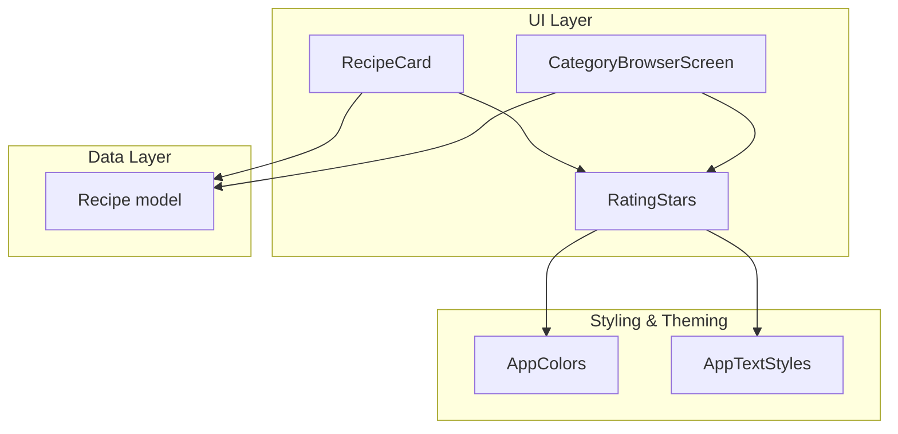
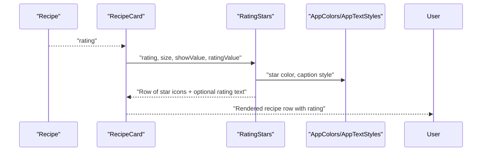
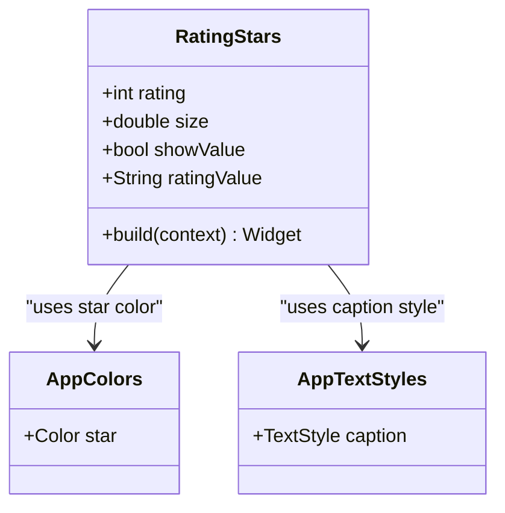
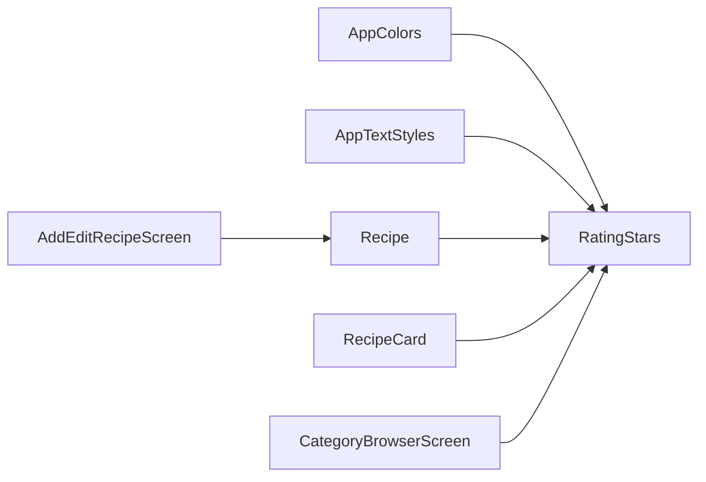

# Rating Display Components

<cite>
**Referenced Files in This Document**
- [rating_stars.dart](file://lib/widgets/rating_stars.dart)
- [constants.dart](file://lib/utils/constants.dart)
- [recipe.dart](file://lib/models/recipe.dart)
- [recipe_card.dart](file://lib/widgets/recipe_card.dart)
- [category_browser_screen.dart](file://lib/screens/category_browser_screen.dart)
- [add_edit_recipe_screen.dart](file://lib/screens/add_edit_recipe_screen.dart)
</cite>

## Table of Contents
1. [Introduction](#introduction)
2. [Project Structure](#project-structure)
3. [Core Components](#core-components)
4. [Architecture Overview](#architecture-overview)
5. [Detailed Component Analysis](#detailed-component-analysis)
6. [Dependency Analysis](#dependency-analysis)
7. [Performance Considerations](#performance-considerations)
8. [Troubleshooting Guide](#troubleshooting-guide)
9. [Conclusion](#conclusion)

## Introduction
This document provides comprehensive documentation for the rating display components in the Cooking Book App. It focuses on the RatingStars component, detailing how it renders star icons, handles different rating scales, integrates with recipe data models, and supports styling and responsiveness. It also covers usage patterns within RecipeCard components, accessibility considerations, and performance implications for star rendering and state management.

## Project Structure
The rating display functionality is implemented as a reusable widget and integrated across several UI components:
- RatingStars: A standalone widget responsible for visualizing star ratings.
- Constants: Centralized color and typography definitions used by RatingStars and surrounding UI.
- Recipe model: Provides rating data consumed by RatingStars.
- RecipeCard and CategoryBrowserScreen: Demonstrate integration of RatingStars within recipe listings and cards.
- Add/Edit Recipe Screen: Shows how ratings are captured and displayed during recipe creation/editing.

**Diagram sources**
- [recipe_card.dart:1-246](file://lib/widgets/recipe_card.dart#L1-246)
- [category_browser_screen.dart:200-262](file://lib/screens/category_browser_screen.dart#L200-262)
- [rating_stars.dart:1-42](file://lib/widgets/rating_stars.dart#L1-42)
- [constants.dart:1-124](file://lib/utils/constants.dart#L1-124)
- [recipe.dart:1-82](file://lib/models/recipe.dart#L1-82)

**Section sources**
- [rating_stars.dart:1-42](file://lib/widgets/rating_stars.dart#L1-42)
- [constants.dart:1-124](file://lib/utils/constants.dart#L1-124)
- [recipe.dart:1-82](file://lib/models/recipe.dart#L1-82)
- [recipe_card.dart:1-246](file://lib/widgets/recipe_card.dart#L1-246)
- [category_browser_screen.dart:200-262](file://lib/screens/category_browser_screen.dart#L200-262)
- [add_edit_recipe_screen.dart:118-147](file://lib/screens/add_edit_recipe_screen.dart#L118-147)

## Core Components
- RatingStars: A stateless widget that renders up to five stars based on an integer rating value. It supports:
  - Size customization via a size parameter.
  - Optional numeric rating display via showValue and ratingValue.
  - Consistent star color from AppColors.
  - Typography alignment with AppTextStyles.caption for the optional rating text.

- Integration points:
  - Recipe model provides the rating value used by RatingStars.
  - RecipeCard and CategoryBrowserScreen instantiate RatingStars to display ratings alongside recipe metadata.
  - Add/Edit Recipe Screen demonstrates rating input and how the displayed rating reflects user input.

**Section sources**
- [rating_stars.dart:4-41](file://lib/widgets/rating_stars.dart#L4-41)
- [recipe.dart](file://lib/models/recipe.dart#L7)
- [recipe_card.dart](file://lib/widgets/recipe_card.dart#L225)
- [category_browser_screen.dart:213-218](file://lib/screens/category_browser_screen.dart#L213-218)
- [add_edit_recipe_screen.dart:141-147](file://lib/screens/add_edit_recipe_screen.dart#L141-147)

## Architecture Overview
The rating display architecture follows a unidirectional data flow:
- Data: Recipe model holds the rating value.
- Presentation: RatingStars consumes the rating and renders star icons.
- Styling: AppColors and AppTextStyles provide consistent colors and typography.
- Integration: RecipeCard and CategoryBrowserScreen embed RatingStars within recipe rows and cards.

**Diagram sources**
- [recipe.dart](file://lib/models/recipe.dart#L7)
- [recipe_card.dart](file://lib/widgets/recipe_card.dart#L225)
- [rating_stars.dart:20-40](file://lib/widgets/rating_stars.dart#L20-40)
- [constants.dart:36-98](file://lib/utils/constants.dart#L36-98)

## Detailed Component Analysis

### RatingStars Component
RatingStars is a stateless widget that:
- Accepts an integer rating and optional parameters for size, visibility of the numeric rating, and the rating text itself.
- Renders five stars, switching between filled and outlined icons based on the rating threshold.
- Applies a consistent star color from AppColors and uses AppTextStyles.caption for the optional rating text.
- Uses a minimal layout with a Row and sized spacing for readability.

Key implementation characteristics:
- Star selection logic uses a simple comparison against the current index.
- Optional rating text is rendered conditionally when showValue is true and ratingValue is provided.
- The widget is designed for reuse across different contexts with varying sizes and optional numeric labels.

Usage examples:
- In CategoryBrowserScreen, RatingStars is used with showValue enabled to display a formatted rating alongside recipe titles.
- In RecipeCard, RatingStars is used with a larger size to emphasize ratings within recipe rows.

Accessibility considerations:
- Star icons are standard Material icons; ensure sufficient color contrast with backgrounds.
- Consider adding semantic labels for screen readers if integrating interactive rating controls in future enhancements.

Performance considerations:
- Stateless widget with minimal rebuild scope.
- Star rendering uses a small fixed loop (five iterations) and icon generation; negligible overhead.
- Avoid unnecessary recompositions by passing immutable values and keeping parent widgets stable.

**Section sources**
- [rating_stars.dart:4-41](file://lib/widgets/rating_stars.dart#L4-41)
- [category_browser_screen.dart:213-218](file://lib/screens/category_browser_screen.dart#L213-218)
- [recipe_card.dart](file://lib/widgets/recipe_card.dart#L225)

#### Class Diagram

**Diagram sources**
- [rating_stars.dart:5-41](file://lib/widgets/rating_stars.dart#L5-41)
- [constants.dart:36-98](file://lib/utils/constants.dart#L36-98)

### Integration with Recipe Data Models
The Recipe model provides the rating value used by RatingStars:
- rating is an integer field representing the star rating.
- Other fields such as title, time, difficulty, and image path support the broader recipe display context.

Integration patterns:
- CategoryBrowserScreen passes recipe.rating to RatingStars and optionally formats a display string for ratingValue.
- RecipeCard uses RatingStars within a row alongside time and category information.

**Section sources**
- [recipe.dart](file://lib/models/recipe.dart#L7)
- [category_browser_screen.dart:213-218](file://lib/screens/category_browser_screen.dart#L213-218)
- [recipe_card.dart](file://lib/widgets/recipe_card.dart#L225)

### Styling Options and Color Schemes
- Star color: Defined centrally as AppColors.star, ensuring consistent theming across the app.
- Typography: Optional rating text uses AppTextStyles.caption for consistent font sizing and color.
- Background contrast: Ensure adequate contrast between star color and card backgrounds for readability.

Responsive sizing:
- The size parameter allows adapting star size to different contexts (e.g., smaller stars in dense lists, larger stars in prominent cards).

**Section sources**
- [constants.dart](file://lib/utils/constants.dart#L36)
- [constants.dart:95-98](file://lib/utils/constants.dart#L95-98)
- [recipe_card.dart](file://lib/widgets/recipe_card.dart#L225)
- [category_browser_screen.dart](file://lib/screens/category_browser_screen.dart#L215)

### Usage Examples
- CategoryBrowserScreen: Demonstrates RatingStars with showValue enabled and a formatted rating string.
- RecipeCard: Shows RatingStars integrated within a recipe row, paired with time and category chips.
- Add/Edit Recipe Screen: Illustrates rating input via a Slider and how the displayed rating updates accordingly.

**Section sources**
- [category_browser_screen.dart:213-218](file://lib/screens/category_browser_screen.dart#L213-218)
- [recipe_card.dart](file://lib/widgets/recipe_card.dart#L225)
- [add_edit_recipe_screen.dart:141-147](file://lib/screens/add_edit_recipe_screen.dart#L141-147)

## Dependency Analysis
RatingStars depends on:
- AppColors for star color.
- AppTextStyles for optional rating text styling.
- Recipe model for rating data.

Integration dependencies:
- RecipeCard and CategoryBrowserScreen depend on RatingStars for consistent rating visualization.
- Add/Edit Recipe Screen influences rating values that are later displayed by RatingStars.

**Diagram sources**
- [rating_stars.dart](file://lib/widgets/rating_stars.dart#L2)
- [constants.dart:36-98](file://lib/utils/constants.dart#L36-98)
- [recipe.dart](file://lib/models/recipe.dart#L7)
- [recipe_card.dart](file://lib/widgets/recipe_card.dart#L225)
- [category_browser_screen.dart:213-218](file://lib/screens/category_browser_screen.dart#L213-218)
- [add_edit_recipe_screen.dart:141-147](file://lib/screens/add_edit_recipe_screen.dart#L141-147)

**Section sources**
- [rating_stars.dart:1-42](file://lib/widgets/rating_stars.dart#L1-42)
- [constants.dart:1-124](file://lib/utils/constants.dart#L1-124)
- [recipe.dart:1-82](file://lib/models/recipe.dart#L1-82)
- [recipe_card.dart:1-246](file://lib/widgets/recipe_card.dart#L1-246)
- [category_browser_screen.dart:200-262](file://lib/screens/category_browser_screen.dart#L200-262)
- [add_edit_recipe_screen.dart:118-147](file://lib/screens/add_edit_recipe_screen.dart#L118-147)

## Performance Considerations
- Rendering cost: RatingStars performs a constant-time operation (fixed five stars) with icon generation; minimal computational overhead.
- Rebuild scope: As a stateless widget, it avoids internal state churn and benefits from Flutter’s efficient rebuild mechanisms.
- Layout stability: Using a Row with fixed children ensures predictable layout passes.
- State management: Ratings are passed down as immutable values from parent widgets or models, reducing unnecessary rebuilds.

Recommendations:
- Keep rating values as primitive integers to avoid extra conversions.
- Avoid frequent re-instantiation of RatingStars by caching values at higher levels.
- Use appropriate size values to balance readability and performance in dense lists.

[No sources needed since this section provides general guidance]

## Troubleshooting Guide
Common issues and resolutions:
- Rating not visible: Verify that showValue is set appropriately and ratingValue is provided when needed.
- Incorrect star color: Confirm that AppColors.star is applied consistently and contrasts well with the background.
- Misaligned rating text: Ensure AppTextStyles.caption is used for optional rating text to maintain consistent sizing.
- Out-of-range ratings: The component assumes integer ratings within the star count range; clamp values externally if necessary.

**Section sources**
- [rating_stars.dart:31-37](file://lib/widgets/rating_stars.dart#L31-37)
- [constants.dart](file://lib/utils/constants.dart#L36)
- [constants.dart:95-98](file://lib/utils/constants.dart#L95-98)

## Conclusion
The RatingStars component provides a clean, reusable solution for displaying star ratings in the Cooking Book App. Its integration with Recipe models, centralized styling via AppColors and AppTextStyles, and flexible configuration options enable consistent and accessible rating visualization across different UI contexts. By following the usage patterns demonstrated in RecipeCard and CategoryBrowserScreen, developers can efficiently incorporate rating displays while maintaining performance and visual coherence.