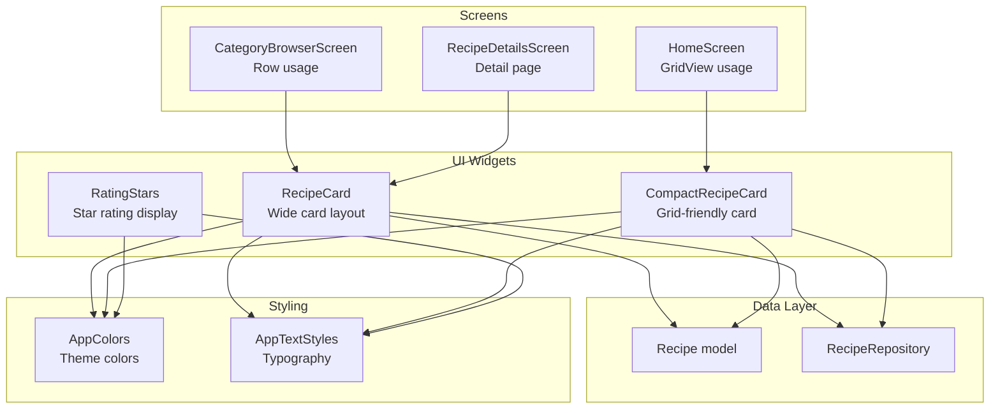
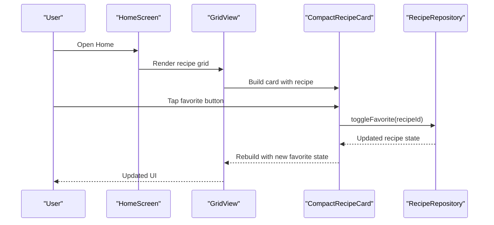
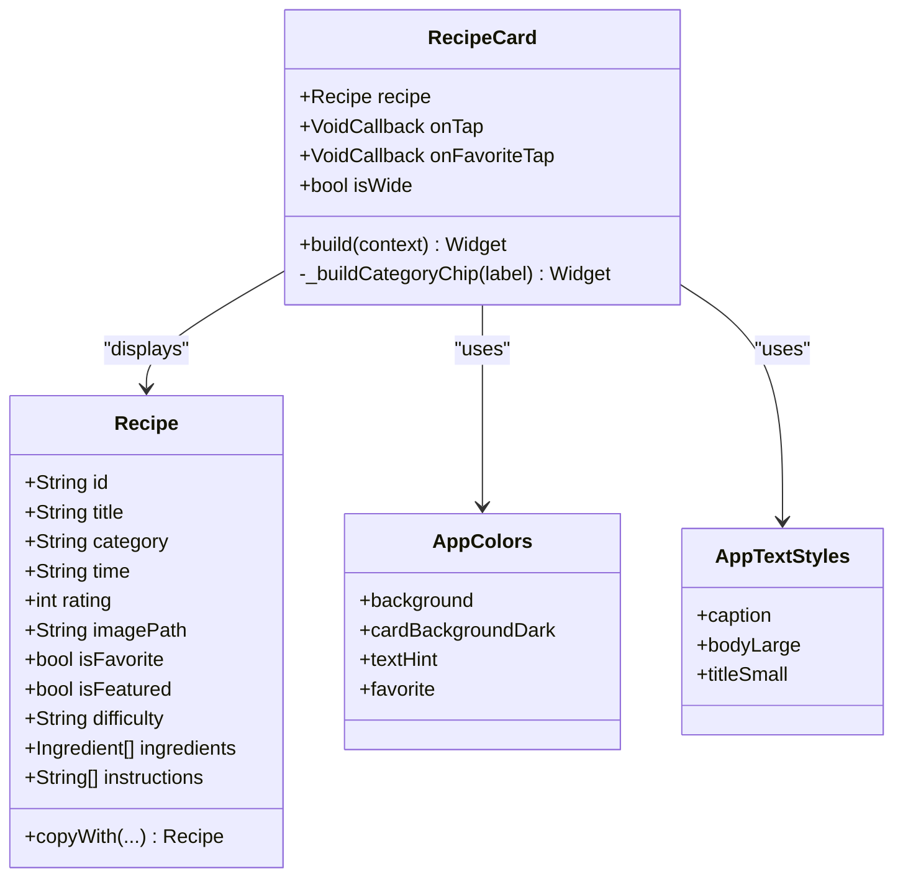
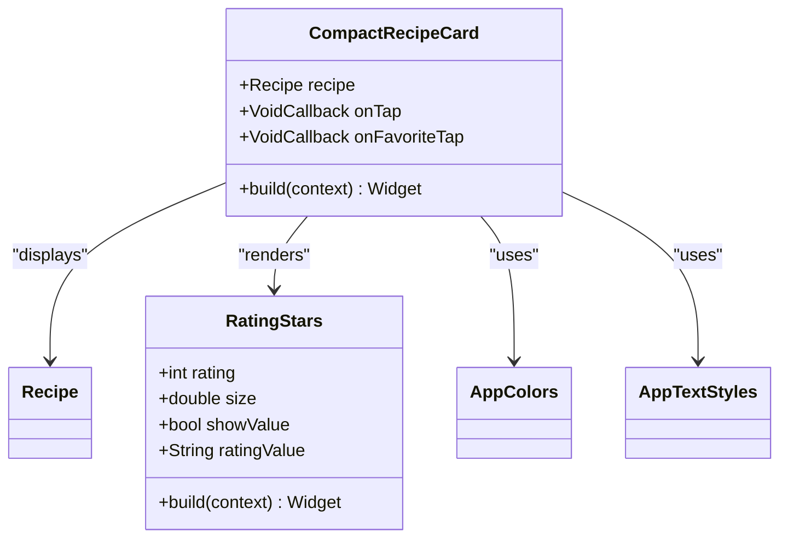
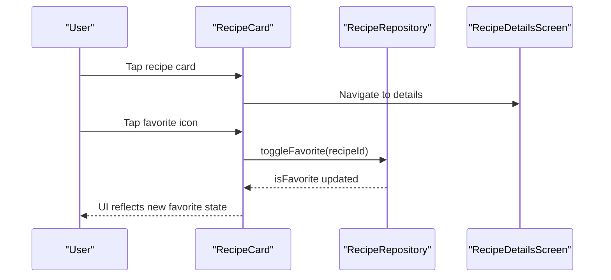
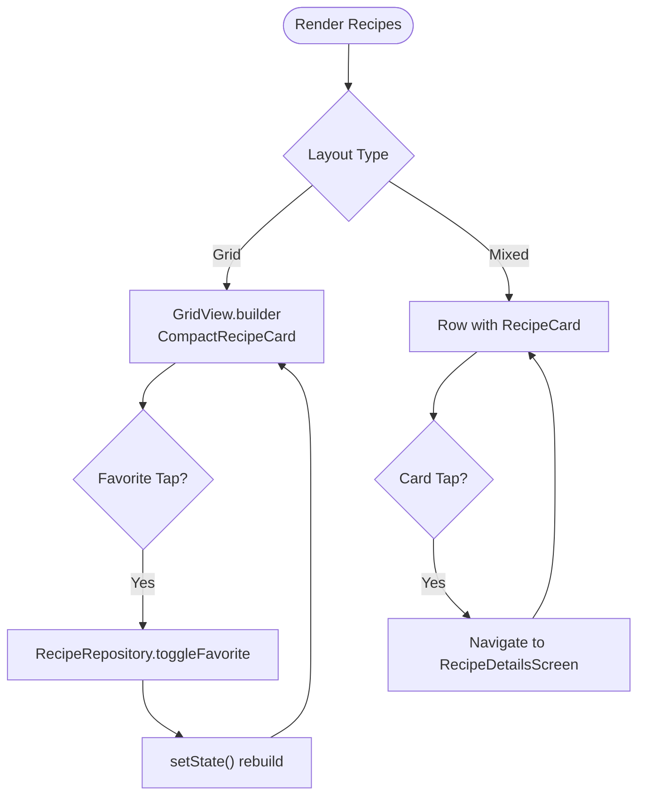
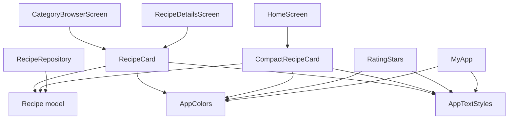

# Recipe Display Components

<cite>
**Referenced Files in This Document**
- [recipe_card.dart](file://lib/widgets/recipe_card.dart)
- [constants.dart](file://lib/utils/constants.dart)
- [recipe.dart](file://lib/models/recipe.dart)
- [api_service.dart](file://lib/services/api_service.dart)
- [rating_stars.dart](file://lib/widgets/rating_stars.dart)
- [category_browser_screen.dart](file://lib/screens/category_browser_screen.dart)
- [home_screen.dart](file://lib/screens/home_screen.dart)
- [recipe_details_screen.dart](file://lib/screens/recipe_details_screen.dart)
- [main.dart](file://lib/main.dart)
</cite>

## Table of Contents
1. [Introduction](#introduction)
2. [Project Structure](#project-structure)
3. [Core Components](#core-components)
4. [Architecture Overview](#architecture-overview)
5. [Detailed Component Analysis](#detailed-component-analysis)
6. [Dependency Analysis](#dependency-analysis)
7. [Performance Considerations](#performance-considerations)
8. [Troubleshooting Guide](#troubleshooting-guide)
9. [Conclusion](#conclusion)

## Introduction
This document provides comprehensive documentation for the recipe display components in the Cooking Book App. It focuses on the RecipeCard and CompactRecipeCard widgets, detailing their properties, visual layout, interaction patterns, state management for favorites, styling via AppColors and AppTextStyles, and responsive design considerations. It also covers integration patterns with RecipeRepository, usage examples, and performance optimization techniques for image loading and error handling.

## Project Structure
The recipe display components reside under lib/widgets and are integrated across several screens:
- lib/widgets/recipe_card.dart: Contains RecipeCard and CompactRecipeCard widgets
- lib/utils/constants.dart: Provides AppColors and AppTextStyles used for theming
- lib/models/recipe.dart: Defines the Recipe model used by the widgets
- lib/services/api_service.dart: Implements RecipeRepository for data operations
- lib/widgets/rating_stars.dart: Reusable rating display component
- lib/screens/category_browser_screen.dart: Demonstrates grid layout usage
- lib/screens/home_screen.dart: Uses CompactRecipeCard in a GridView
- lib/screens/recipe_details_screen.dart: Details favorite toggle integration
- lib/main.dart: Application theme setup

**Diagram sources**
- [recipe_card.dart](file://lib/widgets/recipe_card.dart)
- [constants.dart](file://lib/utils/constants.dart)
- [recipe.dart](file://lib/models/recipe.dart)
- [api_service.dart](file://lib/services/api_service.dart)
- [rating_stars.dart](file://lib/widgets/rating_stars.dart)
- [category_browser_screen.dart](file://lib/screens/category_browser_screen.dart)
- [home_screen.dart](file://lib/screens/home_screen.dart)
- [recipe_details_screen.dart](file://lib/screens/recipe_details_screen.dart)
- [main.dart](file://lib/main.dart)

**Section sources**
- [recipe_card.dart](file://lib/widgets/recipe_card.dart)
- [constants.dart](file://lib/utils/constants.dart)
- [recipe.dart](file://lib/models/recipe.dart)
- [api_service.dart](file://lib/services/api_service.dart)
- [rating_stars.dart](file://lib/widgets/rating_stars.dart)
- [category_browser_screen.dart](file://lib/screens/category_browser_screen.dart)
- [home_screen.dart](file://lib/screens/home_screen.dart)
- [recipe_details_screen.dart](file://lib/screens/recipe_details_screen.dart)
- [main.dart](file://lib/main.dart)

## Core Components
This section documents the two primary recipe display components and their shared data model.

- RecipeCard
  - Purpose: Displays a recipe in a wide, prominent layout suitable for lists or featured presentations.
  - Key properties:
    - recipe: Recipe object containing metadata and image path
    - onTap: Callback invoked when the entire card is tapped
    - onFavoriteTap: Callback invoked when the favorite action is triggered
    - isWide: Boolean flag controlling layout emphasis (default false)
  - Visual layout:
    - Rounded container with anti-aliased clipping
    - Full-width image area with aspect-fit cover
    - Overlay chips for category and difficulty
    - Metadata row with rating stars, difficulty badge, and prep time
  - Interaction:
    - Gesture detection wraps the entire card
    - Favorite toggle updates the recipe’s favorite state
  - Styling:
    - Uses AppColors for backgrounds and accents
    - Uses AppTextStyles for typography
  - Responsive design:
    - Expands to available width; image fills container
    - Category chip and difficulty indicators adapt to content

- CompactRecipeCard
  - Purpose: Optimized for grid layouts with smaller dimensions and tighter spacing.
  - Key properties:
    - recipe: Recipe object
    - onTap: Card tap callback
    - onFavoriteTap: Favorite toggle callback
  - Visual layout:
    - Smaller rounded corners and compact padding
    - Top-cropped image area with full-width fit
    - Positioned favorite button in top-right corner
    - Title, rating, difficulty, and time displayed below image
  - Interaction:
    - Separate gesture handlers for card and favorite button
    - Favorite state reflects recipe’s isFavorite property
  - Styling:
    - Uses AppColors.cardBackgroundAlt and AppColors.favorite
    - Uses AppTextStyles for readable small text

- Recipe model
  - Fields include id, title, category, time, rating, imagePath, isFavorite, isFeatured, difficulty, ingredients, instructions
  - Provides copyWith for immutable updates

**Section sources**
- [recipe_card.dart](file://lib/widgets/recipe_card.dart)
- [recipe.dart](file://lib/models/recipe.dart)

## Architecture Overview
The recipe display components integrate with the data layer and screens as follows:
- Widgets receive Recipe instances and optional callbacks
- RecipeRepository manages recipe data and supports toggling favorites
- Screens render collections of recipes using either RecipeCard or CompactRecipeCard
- Theming is centralized via AppColors and AppTextStyles

**Diagram sources**
- [home_screen.dart](file://lib/screens/home_screen.dart)
- [recipe_card.dart](file://lib/widgets/recipe_card.dart)
- [api_service.dart](file://lib/services/api_service.dart)

## Detailed Component Analysis

### RecipeCard Component
RecipeCard renders a prominent recipe card with:
- A full-width image area with cover fit and error fallback
- Category chip overlay and difficulty indicator
- Rating stars and prep time metadata
- Optional wide layout emphasis controlled by isWide

**Diagram sources**
- [recipe_card.dart](file://lib/widgets/recipe_card.dart)
- [recipe.dart](file://lib/models/recipe.dart)
- [constants.dart](file://lib/utils/constants.dart)

**Section sources**
- [recipe_card.dart](file://lib/widgets/recipe_card.dart)
- [recipe.dart](file://lib/models/recipe.dart)
- [constants.dart](file://lib/utils/constants.dart)

### CompactRecipeCard Component
CompactRecipeCard is optimized for grid layouts:
- Smaller rounded corners and tighter spacing
- Positioned favorite button overlay
- Title, rating, difficulty, and time displayed beneath image
- Separate gesture handling for card and favorite button

**Diagram sources**
- [recipe_card.dart](file://lib/widgets/recipe_card.dart)
- [rating_stars.dart](file://lib/widgets/rating_stars.dart)
- [constants.dart](file://lib/utils/constants.dart)

**Section sources**
- [recipe_card.dart](file://lib/widgets/recipe_card.dart)
- [rating_stars.dart](file://lib/widgets/rating_stars.dart)
- [constants.dart](file://lib/utils/constants.dart)

### Interaction Patterns and State Management
- Touch handling:
  - RecipeCard: GestureDetector wraps the entire card for onTap
  - CompactRecipeCard: Separate GestureDetector for favorite button allows independent interaction
- Favorite state management:
  - Both components rely on RecipeRepository.toggleFavorite to update isFavorite
  - HomeScreen demonstrates favorite toggling and rebuild via setState
- Navigation:
  - RecipeCard integrates with screens that navigate to recipe details

**Diagram sources**
- [recipe_card.dart](file://lib/widgets/recipe_card.dart)
- [api_service.dart](file://lib/services/api_service.dart)
- [recipe_details_screen.dart](file://lib/screens/recipe_details_screen.dart)

**Section sources**
- [recipe_card.dart](file://lib/widgets/recipe_card.dart)
- [api_service.dart](file://lib/services/api_service.dart)
- [recipe_details_screen.dart](file://lib/screens/recipe_details_screen.dart)

### Styling Options and Theme Integration
- AppColors:
  - Backgrounds: cardBackground, cardBackgroundAlt, cardBackgroundDark
  - Accents: primary, accentPurple, accentOrange, favorite
  - Text: textPrimary, textSecondary, textHint
- AppTextStyles:
  - Typography scales: headingLarge, titleSmall, bodyLarge, caption
- Integration:
  - Widgets apply AppColors for backgrounds, icons, and text
  - AppTextStyles applied to labels and metadata

**Section sources**
- [constants.dart](file://lib/utils/constants.dart)
- [recipe_card.dart](file://lib/widgets/recipe_card.dart)
- [rating_stars.dart](file://lib/widgets/rating_stars.dart)

### Responsive Design Considerations
- RecipeCard:
  - Full-width layout with expanded image area
  - Metadata arranged horizontally with flexible spacing
- CompactRecipeCard:
  - Tight padding and smaller typography for dense grids
  - Fixed aspect ratio in GridView for consistent tile sizing
- Screens:
  - HomeScreen uses GridView.builder with fixed cross-axis count and spacing
  - CategoryBrowserScreen uses rows with expanded children for mixed layouts

**Section sources**
- [home_screen.dart](file://lib/screens/home_screen.dart)
- [category_browser_screen.dart](file://lib/screens/category_browser_screen.dart)
- [recipe_card.dart](file://lib/widgets/recipe_card.dart)

### Usage Examples and Integration Patterns
- Grid layout with CompactRecipeCard:
  - HomeScreen builds a 2-column grid with item count and spacing
  - Favorite taps trigger toggleFavorite and refresh state
- Mixed layout with RecipeCard:
  - CategoryBrowserScreen arranges cards in rows with variable counts
  - Each card displays image, favorite button, title, rating, difficulty, and time
- Detail page integration:
  - RecipeDetailsScreen uses similar metadata presentation and favorite toggle pattern

**Diagram sources**
- [home_screen.dart](file://lib/screens/home_screen.dart)
- [category_browser_screen.dart](file://lib/screens/category_browser_screen.dart)
- [recipe_details_screen.dart](file://lib/screens/recipe_details_screen.dart)

**Section sources**
- [home_screen.dart](file://lib/screens/home_screen.dart)
- [category_browser_screen.dart](file://lib/screens/category_browser_screen.dart)
- [recipe_details_screen.dart](file://lib/screens/recipe_details_screen.dart)

## Dependency Analysis
The components depend on shared models, utilities, and services:
- RecipeCard and CompactRecipeCard depend on Recipe model and AppColors/AppTextStyles
- RatingStars depends on AppColors and AppTextStyles for rendering
- Screens depend on RecipeRepository for data and on widgets for UI composition
- Theme is configured in main.dart using AppColors

**Diagram sources**
- [recipe_card.dart](file://lib/widgets/recipe_card.dart)
- [recipe.dart](file://lib/models/recipe.dart)
- [constants.dart](file://lib/utils/constants.dart)
- [rating_stars.dart](file://lib/widgets/rating_stars.dart)
- [home_screen.dart](file://lib/screens/home_screen.dart)
- [category_browser_screen.dart](file://lib/screens/category_browser_screen.dart)
- [recipe_details_screen.dart](file://lib/screens/recipe_details_screen.dart)
- [api_service.dart](file://lib/services/api_service.dart)
- [main.dart](file://lib/main.dart)

**Section sources**
- [recipe_card.dart](file://lib/widgets/recipe_card.dart)
- [recipe.dart](file://lib/models/recipe.dart)
- [constants.dart](file://lib/utils/constants.dart)
- [rating_stars.dart](file://lib/widgets/rating_stars.dart)
- [home_screen.dart](file://lib/screens/home_screen.dart)
- [category_browser_screen.dart](file://lib/screens/category_browser_screen.dart)
- [recipe_details_screen.dart](file://lib/screens/recipe_details_screen.dart)
- [api_service.dart](file://lib/services/api_service.dart)
- [main.dart](file://lib/main.dart)

## Performance Considerations
- Image loading and caching:
  - Use Image.asset for local assets; ensure asset paths match recipe.imagePath
  - Implement placeholder and error handling via errorBuilder to avoid layout thrashing
- Favorite toggling:
  - Use setState after asynchronous toggleFavorite to trigger rebuilds efficiently
- Grid rendering:
  - Prefer GridView.builder with fixed grid delegates to minimize rebuild scope
  - Keep item heights predictable to reduce layout passes
- Theming:
  - Centralize color and typography definitions in AppColors and AppTextStyles to enable quick theme updates

[No sources needed since this section provides general guidance]

## Troubleshooting Guide
- Missing images:
  - Verify recipe.imagePath exists in assets and is correctly referenced
  - Confirm errorBuilder fallback displays appropriate placeholders
- Favorite state not updating:
  - Ensure onFavoriteTap invokes RecipeRepository.toggleFavorite and triggers setState
  - Check that recipe.isFavorite is part of the data model and updated immutably
- Layout issues:
  - For RecipeCard, confirm parent constraints allow full-width expansion
  - For CompactRecipeCard, ensure GridView item aspect ratio matches design expectations

**Section sources**
- [recipe_card.dart](file://lib/widgets/recipe_card.dart)
- [api_service.dart](file://lib/services/api_service.dart)
- [home_screen.dart](file://lib/screens/home_screen.dart)

## Conclusion
The recipe display components provide a cohesive, theme-integrated solution for showcasing recipes across various layouts. RecipeCard emphasizes visual prominence, while CompactRecipeCard optimizes for dense grids. Together with RecipeRepository and centralized theming via AppColors and AppTextStyles, they support scalable, maintainable UI patterns with robust interaction and performance characteristics.