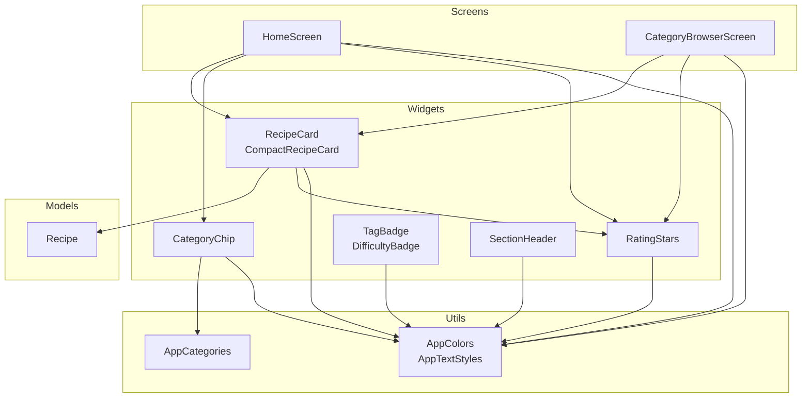
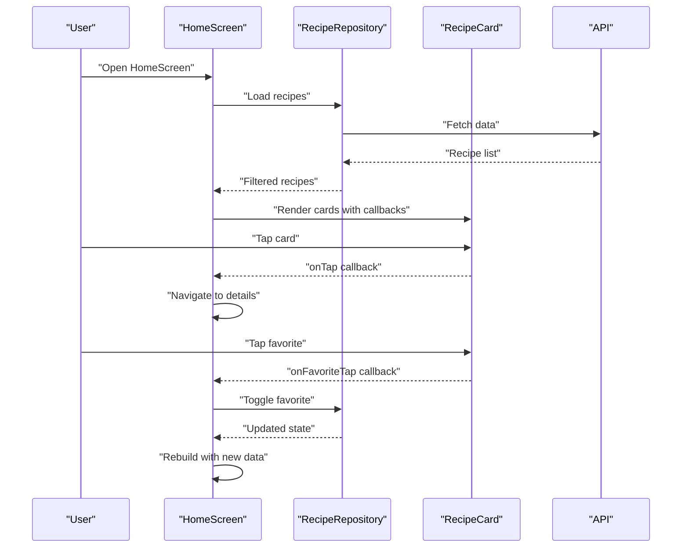
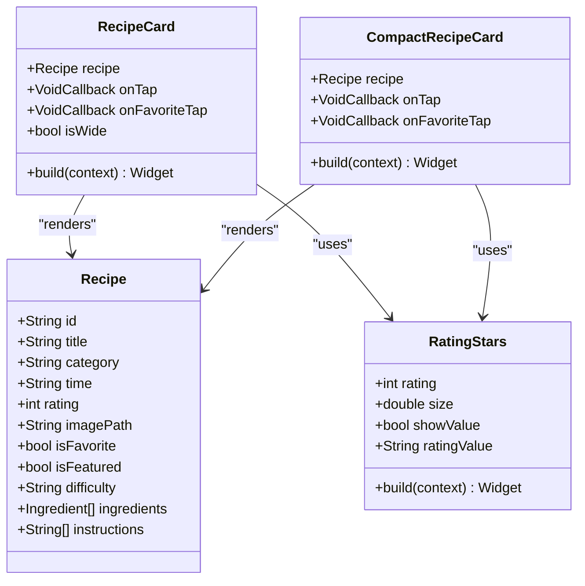
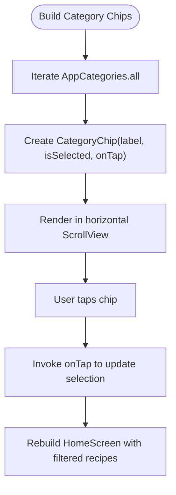
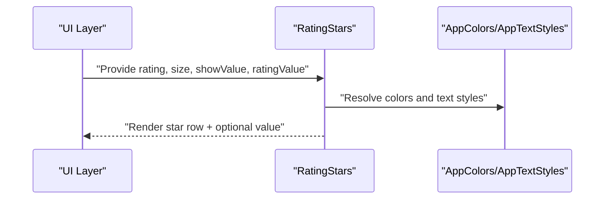
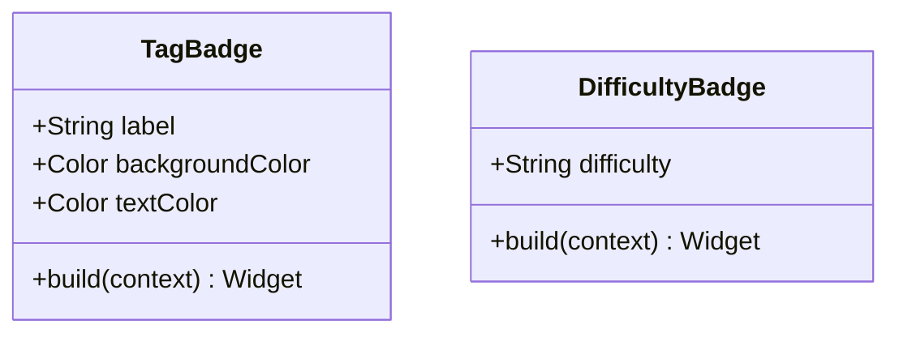
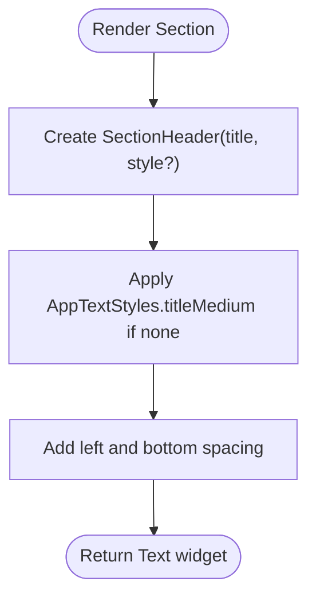
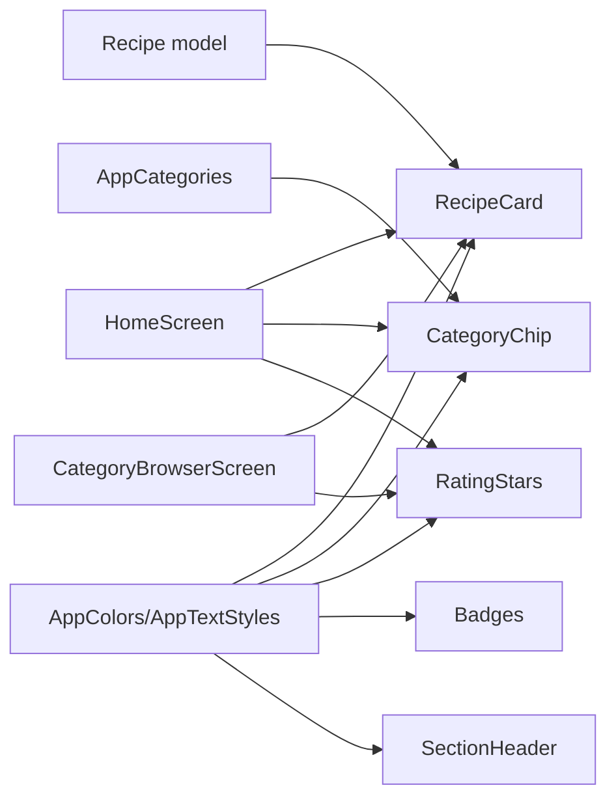

# UI Components

<cite>
**Referenced Files in This Document**
- [recipe_card.dart](file://lib/widgets/recipe_card.dart)
- [chip_filter.dart](file://lib/widgets/chip_filter.dart)
- [rating_stars.dart](file://lib/widgets/rating_stars.dart)
- [badge.dart](file://lib/widgets/badge.dart)
- [section_header.dart](file://lib/widgets/section_header.dart)
- [constants.dart](file://lib/utils/constants.dart)
- [recipe.dart](file://lib/models/recipe.dart)
- [home_screen.dart](file://lib/screens/home_screen.dart)
- [category_browser_screen.dart](file://lib/screens/category_browser_screen.dart)
</cite>

## Table of Contents
1. [Introduction](#introduction)
2. [Project Structure](#project-structure)
3. [Core Components](#core-components)
4. [Architecture Overview](#architecture-overview)
5. [Detailed Component Analysis](#detailed-component-analysis)
6. [Dependency Analysis](#dependency-analysis)
7. [Performance Considerations](#performance-considerations)
8. [Troubleshooting Guide](#troubleshooting-guide)
9. [Conclusion](#conclusion)
10. [Appendices](#appendices)

## Introduction
This document provides comprehensive documentation for the Cooking Book App’s reusable UI components. It focuses on five key components: RecipeCard, ChipFilter, RatingStars, Badge, and SectionHeader. For each component, we describe display properties, interaction patterns, customization options, props/events, styling, accessibility, responsive design, composition patterns, state management, and performance optimization techniques. Integration examples are included via source references to real usage sites within the app.

## Project Structure
The UI components are implemented as lightweight, stateless widgets under the widgets directory and are consumed by screen widgets. Shared theming and constants live in utils, while domain data models live in models. The screens demonstrate how components are composed and integrated.

**Diagram sources**
- [recipe_card.dart:1-247](file://lib/widgets/recipe_card.dart#L1-L247)
- [chip_filter.dart:1-39](file://lib/widgets/chip_filter.dart#L1-L39)
- [rating_stars.dart:1-42](file://lib/widgets/rating_stars.dart#L1-L42)
- [badge.dart:1-70](file://lib/widgets/badge.dart#L1-L70)
- [section_header.dart:1-26](file://lib/widgets/section_header.dart#L1-L26)
- [constants.dart:1-124](file://lib/utils/constants.dart#L1-L124)
- [recipe.dart:1-82](file://lib/models/recipe.dart#L1-L82)
- [home_screen.dart:1-241](file://lib/screens/home_screen.dart#L1-L241)
- [category_browser_screen.dart:1-262](file://lib/screens/category_browser_screen.dart#L1-L262)

**Section sources**
- [constants.dart:1-124](file://lib/utils/constants.dart#L1-L124)
- [recipe.dart:1-82](file://lib/models/recipe.dart#L1-L82)
- [home_screen.dart:1-241](file://lib/screens/home_screen.dart#L1-L241)
- [category_browser_screen.dart:1-262](file://lib/screens/category_browser_screen.dart#L1-L262)

## Core Components
This section summarizes each component’s purpose, props, events, styling hooks, and typical usage patterns.

- RecipeCard
  - Purpose: Displays recipe metadata with image, title, category indicator, time, rating, and favorite toggle.
  - Variants: Standard and Compact variants for different layouts.
  - Props: recipe (required), onTap (optional), onFavoriteTap (optional), isWide (optional for standard variant).
  - Events: Callbacks invoked on card tap and favorite toggle.
  - Styling: Uses AppColors and AppTextStyles; anti-aliased images with fallbacks; category chip rendering; favorite icon toggles based on recipe.isFavorite.
  - Accessibility: Uses semantic gestures via GestureDetector; ensure sufficient touch targets.
  - Responsive: Standard variant adapts to wide layout; Compact variant optimized for grid density.

- ChipFilter (CategoryChip)
  - Purpose: Renders a selectable category chip with selection state styling.
  - Props: label (required), isSelected (required), onTap (required).
  - Events: Single tap triggers selection change.
  - Styling: Selected vs unselected background and text color via AppColors; rounded pill shape.
  - Accessibility: Tap target via GestureDetector; consider focus visuals if used in keyboard navigation.

- RatingStars
  - Purpose: Visual star rating display with optional numeric value label.
  - Props: rating (required), size (optional), showValue (optional), ratingValue (optional).
  - Events: None (static display).
  - Styling: Star icons sized and colored via AppColors; optional trailing text label.
  - Accessibility: Static visual; pair with screen-reader-friendly labels if needed.

- Badge
  - Purpose: Lightweight visual indicators for tags and difficulty.
  - Variants:
    - TagBadge: label (required), backgroundColor (optional), textColor (optional).
    - DifficultyBadge: difficulty (required).
  - Styling: Rounded backgrounds with AppColors; small typography.
  - Accessibility: Static indicator; ensure contrast meets guidelines.

- SectionHeader
  - Purpose: Content section title with consistent spacing and typography.
  - Props: title (required), style (optional).
  - Styling: Defaults to AppTextStyles.titleMedium; left padding and bottom spacing.
  - Accessibility: Semantic text; ensure readable contrast.

**Section sources**
- [recipe_card.dart:1-247](file://lib/widgets/recipe_card.dart#L1-L247)
- [chip_filter.dart:1-39](file://lib/widgets/chip_filter.dart#L1-L39)
- [rating_stars.dart:1-42](file://lib/widgets/rating_stars.dart#L1-L42)
- [badge.dart:1-70](file://lib/widgets/badge.dart#L1-L70)
- [section_header.dart:1-26](file://lib/widgets/section_header.dart#L1-L26)

## Architecture Overview
The components are designed as pure, stateless widgets that receive data and callbacks. Screens orchestrate state and pass data down to components. Theming constants unify appearance across the app.

**Diagram sources**
- [home_screen.dart:1-241](file://lib/screens/home_screen.dart#L1-L241)
- [recipe_card.dart:1-247](file://lib/widgets/recipe_card.dart#L1-L247)

**Section sources**
- [home_screen.dart:1-241](file://lib/screens/home_screen.dart#L1-L241)
- [recipe_card.dart:1-247](file://lib/widgets/recipe_card.dart#L1-L247)

## Detailed Component Analysis

### RecipeCard
- Purpose and Composition
  - Displays recipe image, title, category indicator, cooking time, rating, and favorite toggle.
  - Two variants:
    - Standard RecipeCard: Full-height card with overlay favorite button and category chip row.
    - CompactRecipeCard: Tighter layout optimized for grid views.
- Props and Interactions
  - recipe: Required Recipe object; drives all display fields.
  - onTap: Optional callback for card press.
  - onFavoriteTap: Optional callback for favorite toggle.
  - isWide: Optional flag for standard variant to adjust layout.
- Rendering Details
  - Image asset with error fallback.
  - Favorite button toggles based on recipe.isFavorite.
  - Category chip built inline with restaurant menu icon and label.
  - Rating shown via RatingStars in standard variant; Compact variant uses inline stars.
- Styling and Theming
  - Uses AppColors for backgrounds, accents, and icons.
  - Uses AppTextStyles for typography.
- Accessibility and Responsiveness
  - GestureDetector ensures tappable areas; consider minimum touch target sizes.
  - Standard variant supports wider layouts; Compact variant optimized for two-column grids.
- Integration Patterns
  - Used in HomeScreen grid and CategoryBrowserScreen rows.
  - Favorite toggling updates repository state and triggers rebuild.
- Performance Tips
  - Use Clip and anti-aliasing judiciously; avoid unnecessary recompositions by passing immutable Recipe objects.
  - Prefer Compact variant in dense grids to reduce overdraw.

**Diagram sources**
- [recipe_card.dart:1-247](file://lib/widgets/recipe_card.dart#L1-L247)
- [rating_stars.dart:1-42](file://lib/widgets/rating_stars.dart#L1-L42)
- [recipe.dart:1-82](file://lib/models/recipe.dart#L1-L82)

**Section sources**
- [recipe_card.dart:1-247](file://lib/widgets/recipe_card.dart#L1-L247)
- [recipe.dart:1-82](file://lib/models/recipe.dart#L1-L82)
- [home_screen.dart:126-144](file://lib/screens/home_screen.dart#L126-L144)
- [category_browser_screen.dart:159-260](file://lib/screens/category_browser_screen.dart#L159-L260)

### ChipFilter (CategoryChip)
- Purpose and Interaction
  - Renders a single category filter chip with selection feedback.
  - Tapping invokes the provided callback to update selection state.
- Props and Styling
  - label: Chip text.
  - isSelected: Controls background and text color.
  - onTap: Selection handler.
  - Styling uses AppColors for selected/unselected states and rounded corners.
- Accessibility and Responsiveness
  - Ensure adequate spacing between chips; consider keyboard navigation if used outside horizontal scrolling.
- Integration Pattern
  - Built dynamically from AppCategories.all in HomeScreen.
- Performance Tips
  - Stateless widget; minimal overhead. Keep list short or virtualize if needed.

**Diagram sources**
- [chip_filter.dart:1-39](file://lib/widgets/chip_filter.dart#L1-L39)
- [home_screen.dart:111-124](file://lib/screens/home_screen.dart#L111-L124)
- [constants.dart:101-117](file://lib/utils/constants.dart#L101-L117)

**Section sources**
- [chip_filter.dart:1-39](file://lib/widgets/chip_filter.dart#L1-L39)
- [home_screen.dart:111-124](file://lib/screens/home_screen.dart#L111-L124)
- [constants.dart:101-117](file://lib/utils/constants.dart#L101-L117)

### RatingStars
- Purpose and Behavior
  - Displays a row of star icons up to a maximum count.
  - Optionally shows a numeric rating value label.
- Props and Styling
  - rating: Number of filled stars.
  - size: Icon size.
  - showValue: Whether to render the numeric label.
  - ratingValue: Text to display after stars.
  - Styling uses AppColors.star and AppTextStyles.caption.
- Accessibility and Responsiveness
  - Static component; pair with descriptive labels for screen readers if used in isolation.
- Integration Pattern
  - Used inside RecipeCard and CategoryBrowserScreen; also standalone in featured recipe header.
- Performance Tips
  - Stateless widget; efficient. Avoid rebuilding unnecessarily by passing stable values.

**Diagram sources**
- [rating_stars.dart:1-42](file://lib/widgets/rating_stars.dart#L1-L42)
- [constants.dart:1-124](file://lib/utils/constants.dart#L1-L124)

**Section sources**
- [rating_stars.dart:1-42](file://lib/widgets/rating_stars.dart#L1-L42)
- [recipe_card.dart](file://lib/widgets/recipe_card.dart#L225)
- [category_browser_screen.dart:213-218](file://lib/screens/category_browser_screen.dart#L213-L218)

### Badge
- Purpose and Variants
  - TagBadge: Generic tag with label and optional colors.
  - DifficultyBadge: Difficulty indicator with success palette.
- Props and Styling
  - TagBadge: label (required), backgroundColor (optional), textColor (optional).
  - DifficultyBadge: difficulty (required).
  - Styling uses AppColors.success and AppColors.successLight with rounded backgrounds.
- Accessibility and Responsiveness
  - Small text; ensure sufficient contrast and readable font size.
- Integration Pattern
  - Used in CategoryBrowserScreen recipe rows alongside time and rating.
- Performance Tips
  - Stateless widgets; negligible cost. Combine with minimal padding for tight layouts.

**Diagram sources**
- [badge.dart:1-70](file://lib/widgets/badge.dart#L1-L70)

**Section sources**
- [badge.dart:1-70](file://lib/widgets/badge.dart#L1-L70)
- [category_browser_screen.dart:219-253](file://lib/screens/category_browser_screen.dart#L219-L253)

### SectionHeader
- Purpose and Styling
  - Provides a consistent section title with left padding and bottom spacing.
  - Defaults to AppTextStyles.titleMedium if no style provided.
- Props and Accessibility
  - title: Header text.
  - style: Optional override for typography.
  - Accessible as semantic text; ensure contrast and readability.
- Integration Pattern
  - Used in HomeScreen to separate Featured and Popular sections.
- Performance Tips
  - Stateless widget; very lightweight.

**Diagram sources**
- [section_header.dart:1-26](file://lib/widgets/section_header.dart#L1-L26)

**Section sources**
- [section_header.dart:1-26](file://lib/widgets/section_header.dart#L1-L26)
- [home_screen.dart:76-86](file://lib/screens/home_screen.dart#L76-L86)

## Dependency Analysis
- Internal Dependencies
  - Widgets depend on AppColors and AppTextStyles for consistent theming.
  - RecipeCard depends on Recipe model for display data.
  - CategoryChip depends on AppCategories for dynamic chip generation.
- External Dependencies
  - Flutter Material components (Icons, Colors, Text, Container, etc.).
- Coupling and Cohesion
  - High cohesion within each widget; low coupling to external state via callbacks.
  - Screens manage state and pass data down, keeping widgets stateless.

**Diagram sources**
- [constants.dart:1-124](file://lib/utils/constants.dart#L1-L124)
- [recipe.dart:1-82](file://lib/models/recipe.dart#L1-L82)
- [recipe_card.dart:1-247](file://lib/widgets/recipe_card.dart#L1-L247)
- [chip_filter.dart:1-39](file://lib/widgets/chip_filter.dart#L1-L39)
- [rating_stars.dart:1-42](file://lib/widgets/rating_stars.dart#L1-L42)
- [badge.dart:1-70](file://lib/widgets/badge.dart#L1-L70)
- [section_header.dart:1-26](file://lib/widgets/section_header.dart#L1-L26)
- [home_screen.dart:1-241](file://lib/screens/home_screen.dart#L1-L241)
- [category_browser_screen.dart:1-262](file://lib/screens/category_browser_screen.dart#L1-L262)

**Section sources**
- [constants.dart:1-124](file://lib/utils/constants.dart#L1-L124)
- [recipe.dart:1-82](file://lib/models/recipe.dart#L1-L82)
- [home_screen.dart:1-241](file://lib/screens/home_screen.dart#L1-L241)
- [category_browser_screen.dart:1-262](file://lib/screens/category_browser_screen.dart#L1-L262)

## Performance Considerations
- Stateless Widgets
  - All documented widgets are StatelessWidget, minimizing lifecycle overhead.
- Efficient Rendering
  - Use appropriate Grid/List delegates; avoid deep nested layouts in tight grids.
  - Favor CompactRecipeCard in dense grids to reduce overdraw.
- Image Handling
  - Provide errorBuilder fallbacks to prevent layout thrashing on missing assets.
- Theming Consistency
  - Centralized AppColors and AppTextStyles reduce style recomputation and improve maintainability.
- State Management
  - Screens manage selection and favorites; pass callbacks to widgets to keep them reactive and efficient.
- Accessibility
  - Ensure sufficient touch targets and contrast; add semantic labels where needed.

[No sources needed since this section provides general guidance]

## Troubleshooting Guide
- Missing Images
  - Symptom: Empty or broken image placeholders.
  - Resolution: Verify imagePath correctness; confirm assets exist; ensure errorBuilder renders visible fallbacks.
- Incorrect Favorite State
  - Symptom: Favorite icon does not reflect current state.
  - Resolution: Ensure onFavoriteTap updates repository and triggers setState in the parent screen.
- Chip Selection Not Updating
  - Symptom: Selected chip remains unstyled.
  - Resolution: Pass isSelected based on current selection and update selection on tap.
- Rating Value Not Visible
  - Symptom: Numeric rating label not shown.
  - Resolution: Set showValue to true and provide ratingValue.
- Typography or Contrast Issues
  - Symptom: Text hard to read.
  - Resolution: Use provided AppTextStyles or override with accessible colors and sizes.

**Section sources**
- [recipe_card.dart:38-50](file://lib/widgets/recipe_card.dart#L38-L50)
- [home_screen.dart:146-149](file://lib/screens/home_screen.dart#L146-L149)
- [chip_filter.dart:24-25](file://lib/widgets/chip_filter.dart#L24-L25)
- [rating_stars.dart:31-37](file://lib/widgets/rating_stars.dart#L31-L37)

## Conclusion
The Cooking Book App’s UI components are intentionally simple, reusable, and theme-consistent. They rely on clear props, callbacks, and shared constants to enable flexible composition across screens. By following the recommended patterns—favoring stateless widgets, managing state in screens, and leveraging centralized theming—you can extend and customize these components effectively while maintaining performance and accessibility.

[No sources needed since this section summarizes without analyzing specific files]

## Appendices

### Component Reference Tables

- RecipeCard
  - Props: recipe (required), onTap (optional), onFavoriteTap (optional), isWide (optional).
  - Events: onTap, onFavoriteTap.
  - Styling: AppColors, AppTextStyles, category chip, favorite toggle.
  - Usage: HomeScreen grid, CategoryBrowserScreen rows.

- CategoryChip
  - Props: label (required), isSelected (required), onTap (required).
  - Events: onTap.
  - Styling: AppColors.selected/unselected, rounded pill.
  - Usage: Horizontal category selector in HomeScreen.

- RatingStars
  - Props: rating (required), size (optional), showValue (optional), ratingValue (optional).
  - Events: None.
  - Styling: AppColors.star, AppTextStyles.caption.
  - Usage: RecipeCard, CategoryBrowserScreen, featured header.

- TagBadge
  - Props: label (required), backgroundColor (optional), textColor (optional).
  - Events: None.
  - Styling: Rounded background, small text.
  - Usage: CategoryBrowserScreen rows.

- DifficultyBadge
  - Props: difficulty (required).
  - Events: None.
  - Styling: AppColors.success palette.
  - Usage: CategoryBrowserScreen rows.

- SectionHeader
  - Props: title (required), style (optional).
  - Events: None.
  - Styling: AppTextStyles.titleMedium by default.
  - Usage: HomeScreen section separators.

**Section sources**
- [recipe_card.dart:1-247](file://lib/widgets/recipe_card.dart#L1-L247)
- [chip_filter.dart:1-39](file://lib/widgets/chip_filter.dart#L1-L39)
- [rating_stars.dart:1-42](file://lib/widgets/rating_stars.dart#L1-L42)
- [badge.dart:1-70](file://lib/widgets/badge.dart#L1-L70)
- [section_header.dart:1-26](file://lib/widgets/section_header.dart#L1-L26)
- [home_screen.dart:1-241](file://lib/screens/home_screen.dart#L1-L241)
- [category_browser_screen.dart:1-262](file://lib/screens/category_browser_screen.dart#L1-L262)