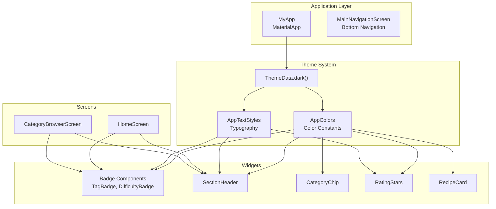
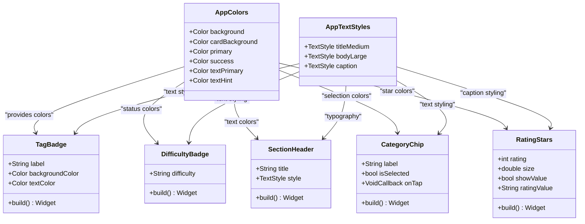
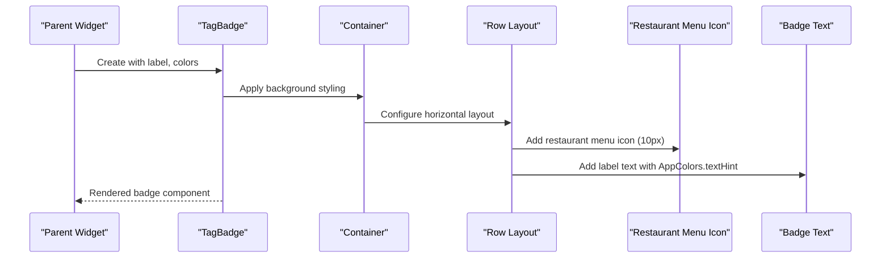
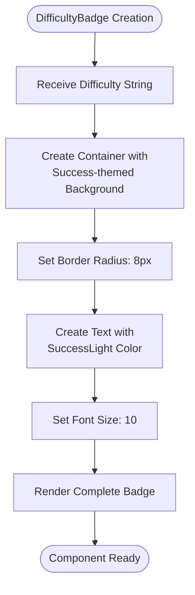
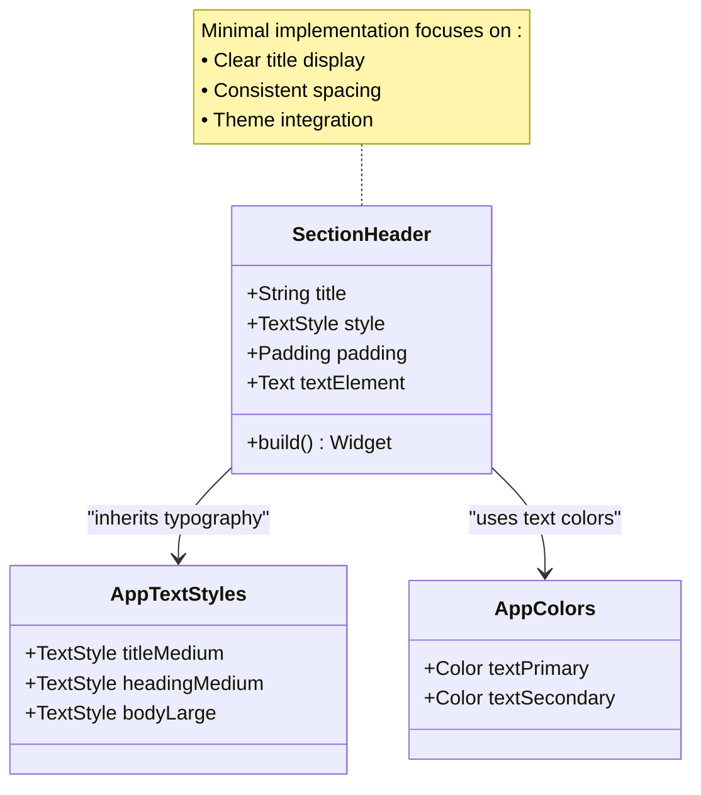
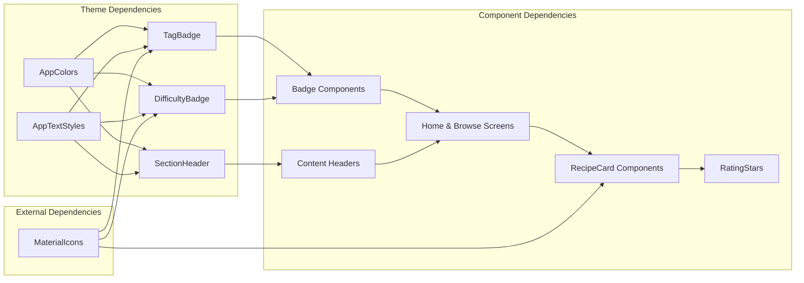

# Utility Components

<cite>
**Referenced Files in This Document**
- [main.dart](file://lib/main.dart)
- [constants.dart](file://lib/utils/constants.dart)
- [badge.dart](file://lib/widgets/badge.dart)
- [section_header.dart](file://lib/widgets/section_header.dart)
- [chip_filter.dart](file://lib/widgets/chip_filter.dart)
- [rating_stars.dart](file://lib/widgets/rating_stars.dart)
- [recipe_card.dart](file://lib/widgets/recipe_card.dart)
- [home_screen.dart](file://lib/screens/home_screen.dart)
- [category_browser_screen.dart](file://lib/screens/category_browser_screen.dart)
- [recipe.dart](file://lib/models/recipe.dart)
</cite>

## Table of Contents
1. [Introduction](#introduction)
2. [Project Structure](#project-structure)
3. [Core Components](#core-components)
4. [Architecture Overview](#architecture-overview)
5. [Detailed Component Analysis](#detailed-component-analysis)
6. [Dependency Analysis](#dependency-analysis)
7. [Performance Considerations](#performance-considerations)
8. [Accessibility Considerations](#accessibility-considerations)
9. [Responsive Design Patterns](#responsive-design-patterns)
10. [Troubleshooting Guide](#troubleshooting-guide)
11. [Conclusion](#conclusion)

## Introduction
This document provides comprehensive documentation for the utility components in the Cooking Book App, focusing on the Badge and SectionHeader components. These components serve as foundational UI elements for displaying counts, status indicators, and organizing content sections. The documentation covers their visual indicator functionality, styling integration with the app's theme system, usage patterns, accessibility considerations, and responsive design approaches.

## Project Structure
The utility components are organized within the widgets directory and integrate with the centralized theme system located in the utils directory. The main application theme defines the dark color scheme and typography that all utility components inherit from.

**Diagram sources**
- [main.dart:20-32](file://lib/main.dart#L20-L32)
- [constants.dart:4-38](file://lib/utils/constants.dart#L4-L38)
- [badge.dart:4-70](file://lib/widgets/badge.dart#L4-L70)
- [section_header.dart:4-26](file://lib/widgets/section_header.dart#L4-L26)

**Section sources**
- [main.dart:15-33](file://lib/main.dart#L15-L33)
- [constants.dart:4-99](file://lib/utils/constants.dart#L4-L99)

## Core Components
This section documents the two primary utility components: Badge components for visual indicators and SectionHeader for content organization.

### Badge Components
The Badge system consists of two specialized components designed for different use cases within the application.

#### TagBadge Component
A versatile badge component designed for displaying tags and labels with customizable styling. It features a compact design suitable for inline content display.

Key characteristics:
- Circular pill-shaped container with rounded corners
- Compact padding (horizontal: 6, vertical: 3)
- Small icon (10px) combined with text content
- Default styling uses subtle background opacity (white.withOpacity(0.05))
- Text color defaults to AppColors.textHint (white70)
- Font size set to 10 for optimal readability

#### DifficultyBadge Component
A specialized badge component tailored for displaying recipe difficulty levels with status-based coloring.

Key characteristics:
- Rounded rectangular design with 8px border radius
- Consistent padding (horizontal: 8, vertical: 2)
- Uses AppColors.success family for positive status indication
- Light success color (successLight) for enhanced contrast
- Optimized for recipe difficulty display (Easy, Medium, Hard)

### SectionHeader Component
A content organization component that provides clear section separation and hierarchical content structure.

Key characteristics:
- Minimal padding configuration (left: 4, bottom: 8)
- Inherits typography from AppTextStyles.titleMedium
- Lightweight implementation focused on content presentation
- Flexible styling through optional TextStyle parameter

**Section sources**
- [badge.dart:4-70](file://lib/widgets/badge.dart#L4-L70)
- [section_header.dart:4-26](file://lib/widgets/section_header.dart#L4-L26)

## Architecture Overview
The utility components follow a cohesive design pattern that integrates seamlessly with the application's theme system and existing UI components.

**Diagram sources**
- [constants.dart:4-99](file://lib/utils/constants.dart#L4-L99)
- [badge.dart:4-70](file://lib/widgets/badge.dart#L4-L70)
- [section_header.dart:4-26](file://lib/widgets/section_header.dart#L4-L26)
- [chip_filter.dart:4-39](file://lib/widgets/chip_filter.dart#L4-L39)
- [rating_stars.dart:4-42](file://lib/widgets/rating_stars.dart#L4-L42)

## Detailed Component Analysis

### Badge Component Implementation

#### TagBadge Analysis
The TagBadge component demonstrates a clean, minimalist approach to visual indicators with the following implementation patterns:

**Diagram sources**
- [badge.dart:18-40](file://lib/widgets/badge.dart#L18-L40)

Key implementation details:
- **Layout Composition**: Uses Row with MainAxisSize.min for compact sizing
- **Visual Hierarchy**: Icon precedes text for clear visual scanning
- **Color Management**: Supports custom backgroundColor and textColor parameters
- **Typography**: Fixed font size (10) ensures consistent scaling across contexts

#### DifficultyBadge Analysis
The DifficultyBadge component showcases status-based theming with strategic color selection:

**Diagram sources**
- [badge.dart:52-68](file://lib/widgets/badge.dart#L52-L68)

Design rationale:
- **Status Communication**: Uses AppColors.success family to convey positive completion status
- **Contrast Optimization**: successLight provides sufficient contrast against the semi-transparent background
- **Consistency**: Matches the difficulty scale used in the Recipe model

### SectionHeader Component Analysis

#### Content Organization Pattern
The SectionHeader component follows a content-first approach optimized for readability and visual hierarchy:

**Diagram sources**
- [section_header.dart:15-24](file://lib/widgets/section_header.dart#L15-L24)
- [constants.dart:41-99](file://lib/utils/constants.dart#L41-L99)

Implementation characteristics:
- **Minimal Padding**: Left: 4, Bottom: 8 creates subtle visual separation
- **Flexible Styling**: Optional style parameter allows customization while maintaining defaults
- **Typography Integration**: Defaults to AppTextStyles.titleMedium for consistent hierarchy

**Section sources**
- [badge.dart:4-70](file://lib/widgets/badge.dart#L4-L70)
- [section_header.dart:4-26](file://lib/widgets/section_header.dart#L4-L26)

## Dependency Analysis
The utility components demonstrate strong cohesion with the theme system and moderate coupling with other UI components.

**Diagram sources**
- [constants.dart:4-99](file://lib/utils/constants.dart#L4-L99)
- [badge.dart:1-2](file://lib/widgets/badge.dart#L1-L2)
- [section_header.dart:1-2](file://lib/widgets/section_header.dart#L1-L2)

Key dependency patterns:
- **Theme Integration**: All components depend on AppColors and AppTextStyles
- **Icon Dependencies**: MaterialIcons library provides visual indicators
- **Component Coupling**: Moderate coupling with screens and other widgets
- **External Libraries**: Standard Flutter Material components

**Section sources**
- [constants.dart:4-99](file://lib/utils/constants.dart#L4-L99)
- [badge.dart:1-2](file://lib/widgets/badge.dart#L1-L2)
- [section_header.dart:1-2](file://lib/widgets/section_header.dart#L1-L2)

## Performance Considerations
The utility components are designed with performance optimization in mind through several key strategies:

### Rendering Efficiency
- **Lightweight Widgets**: Both components use minimal widget trees
- **Static Styling**: Predefined color schemes reduce runtime calculations
- **Compact Layouts**: Fixed dimensions minimize layout computation overhead

### Memory Management
- **Immutable Parameters**: All components accept final parameters
- **No State Management**: Stateless widgets prevent unnecessary rebuilds
- **Efficient Padding**: Minimal padding configurations reduce rendering costs

### Reusability Benefits
- **Single Responsibility**: Each component serves a specific purpose
- **Parameterized Design**: Customizable through constructor parameters
- **Theme Integration**: Automatic adaptation to theme changes

## Accessibility Considerations
The utility components incorporate several accessibility best practices:

### Color Contrast
- **High Contrast Ratios**: AppColors.successLight provides sufficient contrast against backgrounds
- **Text Color Consistency**: AppColors.textHint ensures readable text in tag badges
- **Status Color Selection**: Strategic use of success colors for positive status indication

### Text Scaling
- **Flexible Typography**: Components inherit from AppTextStyles allowing dynamic text scaling
- **Font Size Control**: Consistent 10pt sizing for badges maintains readability
- **Responsive Text**: AppTextStyles support Flutter's text scaling preferences

### Interactive Elements
- **Touch Targets**: While badges are typically non-interactive, they maintain proper spacing
- **Focus Indicators**: Not applicable for static badges but important for interactive chips
- **Screen Reader Support**: Text content is properly announced by assistive technologies

## Responsive Design Patterns
The utility components adapt effectively across different screen sizes and orientations:

### Adaptive Sizing
- **Relative Spacing**: Padding values (4, 8) scale appropriately with text size
- **Flexible Containers**: MainAxisSize.min ensures compact display on small screens
- **Icon Scaling**: 10px icons remain legible across device densities

### Layout Flexibility
- **Horizontal Layouts**: Row-based designs accommodate varying content lengths
- **Wrapping Behavior**: Text wrapping prevents overflow in compact spaces
- **Stack Integration**: Compatible with Stack positioning for complex layouts

### Cross-Platform Consistency
- **Platform-Neutral**: No platform-specific dependencies
- **Theme Adaptation**: Automatic adaptation to light/dark themes
- **Typography Scaling**: Responsive text sizing across devices

## Troubleshooting Guide

### Common Issues and Solutions

#### Badge Color Problems
**Issue**: Badges appear too bright or too faint
**Solution**: Adjust backgroundColor parameter or rely on default AppColors
- Verify AppColors.theme integration
- Check for conflicting style overrides

#### Text Overflow in Badges
**Issue**: Long labels truncate unexpectedly
**Solution**: Use appropriate label length or implement truncation
- Consider using ellipsis for very long text
- Adjust font size if necessary

#### Section Header Styling Conflicts
**Issue**: Section headers don't match surrounding typography
**Solution**: Ensure proper AppTextStyles integration
- Verify TextStyle parameter precedence
- Check for inherited style conflicts

#### Performance Issues
**Issue**: Excessive rebuilds or memory usage
**Solution**: Implement proper caching and state management
- Use const constructors where possible
- Avoid unnecessary widget tree nesting

**Section sources**
- [constants.dart:4-38](file://lib/utils/constants.dart#L4-L38)
- [badge.dart:18-40](file://lib/widgets/badge.dart#L18-L40)
- [section_header.dart:17-23](file://lib/widgets/section_header.dart#L17-L23)

## Conclusion
The utility components in the Cooking Book App demonstrate a well-architected approach to visual indicators and content organization. The Badge components provide flexible, theme-integrated solutions for displaying tags and status information, while the SectionHeader component offers clean content separation with consistent typography. Their integration with the centralized theme system ensures visual coherence across the application, and their lightweight implementation supports optimal performance. The components serve as foundational building blocks that can be easily extended and customized for future feature additions while maintaining design consistency and accessibility standards.